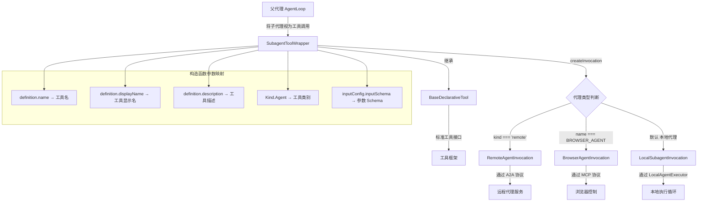

# subagent-tool-wrapper.ts

## 概述

`subagent-tool-wrapper.ts` 定义了 `SubagentToolWrapper` 类，它是子代理系统中的**适配器层**，负责将一个子代理定义（`AgentDefinition`）动态包装为标准的、强类型的声明式工具（`DeclarativeTool`）。

该类是工具框架与代理系统之间的桥梁。当父代理需要调用子代理时，工具框架看到的是一个标准工具，而 `SubagentToolWrapper` 在内部根据代理的类型（本地、远程、浏览器）创建对应的调用实例。这实现了子代理对父代理的透明集成——父代理无需知道它调用的是一个本地执行循环、远程 A2A 代理还是浏览器代理。

## 架构图（Mermaid）



## 核心组件

### 类：`SubagentToolWrapper`

继承自 `BaseDeclarativeTool<AgentInputs, ToolResult>`，将子代理包装为声明式工具。

#### 构造函数

```typescript
constructor(
  private readonly definition: AgentDefinition,  // 子代理定义
  private readonly context: AgentLoopContext,     // 执行上下文
  messageBus: MessageBus,                        // 消息总线
)
```

构造函数将代理定义的属性映射到工具框架的参数：

| 代理定义属性 | 工具框架参数 | 说明 |
|-------------|------------|------|
| `definition.name` | `name` | 工具名称 |
| `definition.displayName ?? definition.name` | `displayName` | 工具显示名（回退到 name） |
| `definition.description` | `description` | 工具描述（供 LLM 选择工具时参考） |
| `Kind.Agent` | `kind` | 固定为 Agent 类别 |
| `definition.inputConfig.inputSchema` | `parameterSchema` | 动态生成的 JSON Schema |
| `true` | `isOutputMarkdown` | 输出为 Markdown 格式 |
| `true` | `canUpdateOutput` | 支持流式更新输出 |

#### 方法：`createInvocation(params, messageBus, toolName?, toolDisplayName?)`

工厂方法，根据代理类型创建对应的调用实例。当工具框架接收到父代理的工具调用请求时，会调用此方法。

**分发逻辑：**

```
if definition.kind === 'remote'
    → RemoteAgentInvocation（远程 A2A 代理）
else if definition.name === BROWSER_AGENT_NAME
    → BrowserAgentInvocation（浏览器代理，需要异步 MCP 设置）
else
    → LocalSubagentInvocation（默认，本地代理）
```

**参数传递：**

所有三种调用类型都接收相同的核心参数：
- `definition`（或从上下文获取）：代理定义
- `context`：执行上下文
- `params`：经验证的输入参数
- `messageBus`：消息总线
- `_toolName`：可选的工具名覆盖
- `_toolDisplayName`：可选的显示名覆盖

**特殊处理：**

浏览器代理（`BrowserAgentInvocation`）是一个特例：
- 不传入 `definition`（浏览器代理有自己的定义获取方式）
- 注释说明需要"异步 MCP 设置"，这意味着浏览器代理的工具配置在调用时动态确定

## 依赖关系

### 内部依赖

| 模块路径 | 导入内容 | 用途 |
|---------|---------|------|
| `../tools/tools.js` | `BaseDeclarativeTool`, `Kind`, `ToolInvocation`, `ToolResult` | 工具框架基类、工具类别枚举和类型 |
| `../config/agent-loop-context.js` | `AgentLoopContext` | 代理循环上下文 |
| `./types.js` | `AgentDefinition`, `AgentInputs` | 代理定义和输入类型 |
| `./local-invocation.js` | `LocalSubagentInvocation` | 本地子代理调用实现 |
| `./remote-invocation.js` | `RemoteAgentInvocation` | 远程子代理调用实现 |
| `./browser/browserAgentInvocation.js` | `BrowserAgentInvocation` | 浏览器代理调用实现 |
| `./browser/browserAgentDefinition.js` | `BROWSER_AGENT_NAME` | 浏览器代理名称常量 |
| `../confirmation-bus/message-bus.js` | `MessageBus` | 消息总线（策略执行） |

### 外部依赖

无外部依赖。

## 关键实现细节

1. **适配器模式**：`SubagentToolWrapper` 是经典的适配器模式实现。它将 `AgentDefinition` 接口适配为 `DeclarativeTool` 接口，使得子代理可以作为标准工具被父代理调用。父代理完全不需要感知子代理的内部实现细节。

2. **工厂方法模式**：`createInvocation` 是一个工厂方法，根据代理类型动态决定创建哪种调用实例。这实现了调用逻辑的解耦——新增代理类型只需在此方法中添加分支即可。

3. **三种调用路径**：
   - **远程代理**（`RemoteAgentInvocation`）：通过 A2A 协议与远程服务通信，支持流式响应和多轮对话
   - **浏览器代理**（`BrowserAgentInvocation`）：特殊处理，需要异步 MCP 工具设置
   - **本地代理**（`LocalSubagentInvocation`）：默认路径，在本地运行代理执行循环

4. **动态 JSON Schema**：构造函数从 `definition.inputConfig.inputSchema` 获取代理的输入 JSON Schema，并将其传递给工具框架。这使得每个子代理工具的参数结构可以动态定义，无需硬编码。

5. **Markdown 输出和流式更新**：构造函数固定设置 `isOutputMarkdown = true` 和 `canUpdateOutput = true`，表明所有子代理工具都支持 Markdown 格式输出和流式进度更新。这与 `LocalSubagentInvocation` 和 `RemoteAgentInvocation` 中的 `updateOutput` 回调相配合。

6. **Kind.Agent 工具类别**：所有子代理工具都标记为 `Kind.Agent` 类别，使得工具框架可以区分普通工具和子代理工具，可能在 UI 展示和策略执行上有不同处理。

7. **浏览器代理的特殊性**：浏览器代理通过名称（`BROWSER_AGENT_NAME`）而非 `kind` 进行识别，这意味着它在类型系统中仍然是 `local` 类型，但需要不同的调用实现。`BrowserAgentInvocation` 不接收 `definition` 参数，暗示它内部会自行获取或构建代理定义。

8. **轻量封装**：整个文件只有约 100 行，体现了单一职责原则。它不包含任何执行逻辑，仅负责将代理定义映射到工具框架，并根据类型分发到正确的调用实现。
