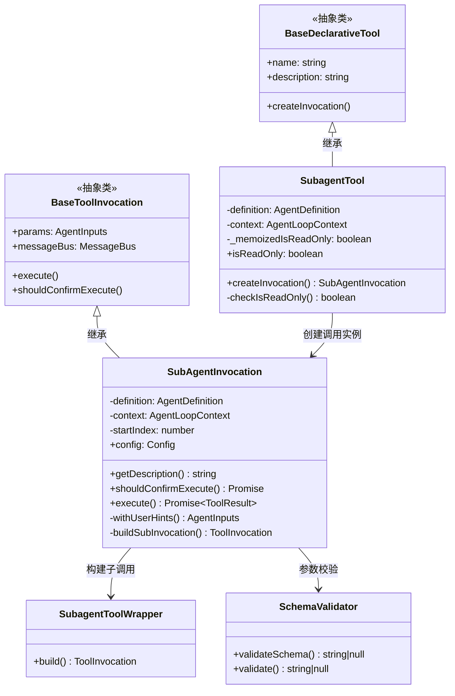
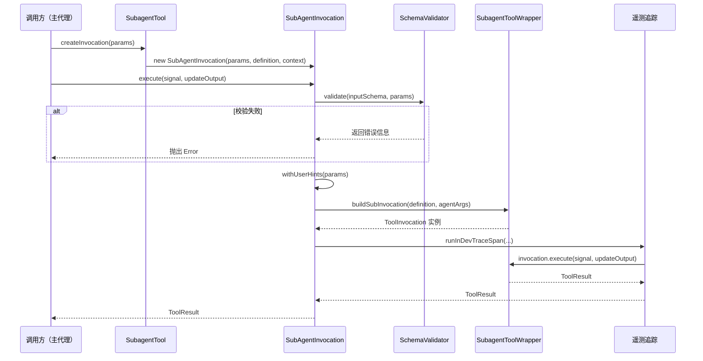

# subagent-tool.ts

## 概述

`subagent-tool.ts` 是 Gemini CLI 子代理（Subagent）工具的核心实现文件。它将一个 `AgentDefinition`（代理定义）封装为一个可被工具系统调用的声明式工具（`BaseDeclarativeTool`），使得主代理（或其他代理）能够通过工具调用的方式将任务委派给子代理执行。

文件中包含两个核心类：
- **`SubagentTool`**：继承自 `BaseDeclarativeTool`，负责工具的注册、只读状态检测和调用实例的创建。
- **`SubAgentInvocation`**：继承自 `BaseToolInvocation`，负责子代理的实际执行逻辑，包括参数校验、用户提示注入和遥测追踪。

## 架构图（Mermaid）





## 核心组件

### 1. `SubagentTool` 类

继承自 `BaseDeclarativeTool<AgentInputs, ToolResult>`，是子代理在工具系统中的注册形式。

#### 构造函数

```typescript
constructor(
  private readonly definition: AgentDefinition,
  private readonly context: AgentLoopContext,
  messageBus: MessageBus,
)
```

- 接收代理定义 `definition`、代理循环上下文 `context` 和消息总线 `messageBus`。
- 在构造时立即通过 `SchemaValidator.validateSchema()` 验证输入 Schema 的合法性，若 Schema 无效则直接抛出异常。
- 调用父类构造函数时设置 `isOutputMarkdown = true`（输出为 Markdown 格式）和 `canUpdateOutput = true`（支持实时输出更新）。

#### `isReadOnly` 属性（getter）

- 使用 `_memoizedIsReadOnly` 字段进行记忆化缓存，避免重复计算。
- 委托给静态方法 `checkIsReadOnly()` 进行判断。

#### `checkIsReadOnly()` 静态方法

判断子代理是否为只读的核心逻辑：

1. 若代理类型为 `'remote'`，直接返回 `false`（远程代理默认非只读）。
2. 遍历代理定义中的所有工具：
   - 若工具为字符串（工具名），从注册表中解析后检查 `isReadOnly`。
   - 若工具为 `Tool` 实例，直接检查 `isReadOnly`。
   - 若工具为 `FunctionDeclaration`（未知类型），保守地返回 `false`。
3. 仅当所有工具都是只读时，才返回 `true`。

#### `createInvocation()` 方法

工厂方法，创建 `SubAgentInvocation` 实例。

### 2. `SubAgentInvocation` 类

继承自 `BaseToolInvocation<AgentInputs, ToolResult>`，是子代理单次调用的执行逻辑封装。

#### 构造函数

```typescript
constructor(
  params: AgentInputs,
  private readonly definition: AgentDefinition,
  private readonly context: AgentLoopContext,
  messageBus: MessageBus,
  _toolName?: string,
  _toolDisplayName?: string,
)
```

- 记录 `startIndex`：通过 `context.config.injectionService.getLatestInjectionIndex()` 获取当前注入服务的最新索引，用于后续获取用户提示。

#### `getDescription()` 方法

返回描述性字符串：`Delegating to agent '${name}'`。

#### `shouldConfirmExecute()` 方法

- 先构建子调用实例，然后委托给子调用的 `shouldConfirmExecute()` 方法。
- 在构建子调用前会先调用 `withUserHints()` 注入用户提示。

#### `execute()` 方法

子代理执行的主流程：

1. **参数校验**：使用 `SchemaValidator.validate()` 验证输入参数是否符合 Schema 定义，不符合则抛出详细错误信息。
2. **构建子调用**：通过 `buildSubInvocation()` 创建实际的工具调用实例。
3. **遥测追踪**：使用 `runInDevTraceSpan()` 包装执行过程，记录代理名称、描述、输入参数和输出结果。
4. **执行并返回**：调用子调用实例的 `execute()` 方法并返回 `ToolResult`。

#### `withUserHints()` 方法

用户提示注入逻辑：

- 仅对 `'remote'` 类型的代理生效。
- 从注入服务中获取自 `startIndex` 以来的 `'user_steering'` 类型注入。
- 使用 `formatUserHintsForModel()` 格式化用户提示。
- 将格式化后的提示前置到 `query` 参数中。

#### `buildSubInvocation()` 方法

- 创建 `SubagentToolWrapper` 实例。
- 调用 `wrapper.build(agentArgs)` 构建最终的 `ToolInvocation` 实例。

## 依赖关系

### 内部依赖

| 模块路径 | 导入内容 | 用途 |
|---------|---------|------|
| `../tools/tools.js` | `BaseDeclarativeTool`, `Kind`, `ToolInvocation`, `ToolResult`, `BaseToolInvocation`, `ToolCallConfirmationDetails`, `isTool`, `ToolLiveOutput` | 工具系统基础类和类型 |
| `../config/config.js` | `Config` | 配置类型 |
| `../config/agent-loop-context.js` | `AgentLoopContext` | 代理循环上下文 |
| `../confirmation-bus/message-bus.js` | `MessageBus` | 消息总线，用于工具确认交互 |
| `./types.js` | `AgentDefinition`, `AgentInputs` | 代理定义和输入类型 |
| `./subagent-tool-wrapper.js` | `SubagentToolWrapper` | 子代理工具包装器，负责实际的子代理调用构建 |
| `../utils/schemaValidator.js` | `SchemaValidator` | JSON Schema 验证器 |
| `../utils/fastAckHelper.js` | `formatUserHintsForModel` | 用户提示格式化工具函数 |
| `../telemetry/trace.js` | `runInDevTraceSpan` | 开发环境遥测追踪 |
| `../telemetry/constants.js` | `GeminiCliOperation`, `GEN_AI_AGENT_DESCRIPTION`, `GEN_AI_AGENT_NAME` | 遥测常量定义 |

### 外部依赖

无直接的第三方外部依赖。所有依赖均为项目内部模块。

## 关键实现细节

1. **Schema 校验的双重保障**：
   - 构造时通过 `SchemaValidator.validateSchema()` 验证 Schema 定义本身的合法性。
   - 执行时通过 `SchemaValidator.validate()` 验证实际输入参数是否符合 Schema。
   - 这种双重校验确保了代理定义和运行时参数的一致性。

2. **只读性判断的记忆化**：
   - `isReadOnly` 属性通过 `_memoizedIsReadOnly` 字段缓存结果，避免每次访问都遍历工具列表。
   - 判断逻辑采用保守策略：只有当所有工具都明确为只读时才返回 `true`，对于无法确定的工具类型（如 `FunctionDeclaration`）默认返回 `false`。

3. **用户提示注入机制**：
   - `withUserHints()` 方法实现了"Fast Ack"模式下用户提示的动态注入。
   - 通过 `startIndex` 记录子代理创建时的注入点，仅获取此后新增的用户引导（`user_steering`）注入。
   - 仅对远程代理生效，本地代理不进行提示注入。
   - 将用户提示前置到 `query` 参数中，以引导远程代理的行为。

4. **遥测集成**：
   - `execute()` 方法通过 `runInDevTraceSpan()` 将子代理调用包装在遥测追踪 span 中。
   - 记录代理名称（`GEN_AI_AGENT_NAME`）、描述（`GEN_AI_AGENT_DESCRIPTION`）、输入参数和输出结果。
   - 操作类型为 `GeminiCliOperation.AgentCall`。

5. **委派模式的设计**：
   - `SubagentTool` 本身不执行任何代理逻辑，它通过 `SubagentToolWrapper` 将实际执行委派给被包装的子代理。
   - `shouldConfirmExecute()` 同样委派给子调用实例，确保确认流程与实际执行一致。

6. **输出模式**：
   - 构造 `SubagentTool` 时设置 `isOutputMarkdown = true` 和 `canUpdateOutput = true`。
   - 这意味着子代理的输出会被当作 Markdown 渲染，并支持实时流式更新输出。
