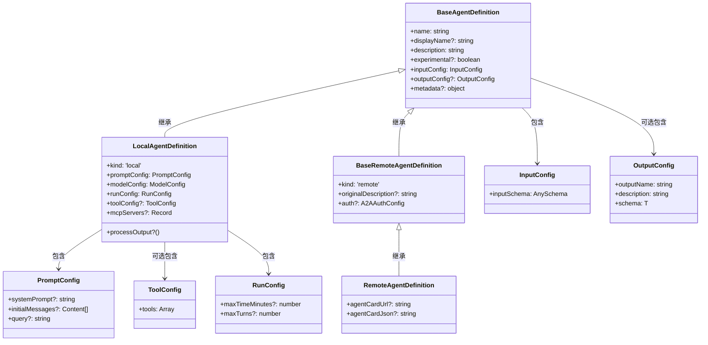
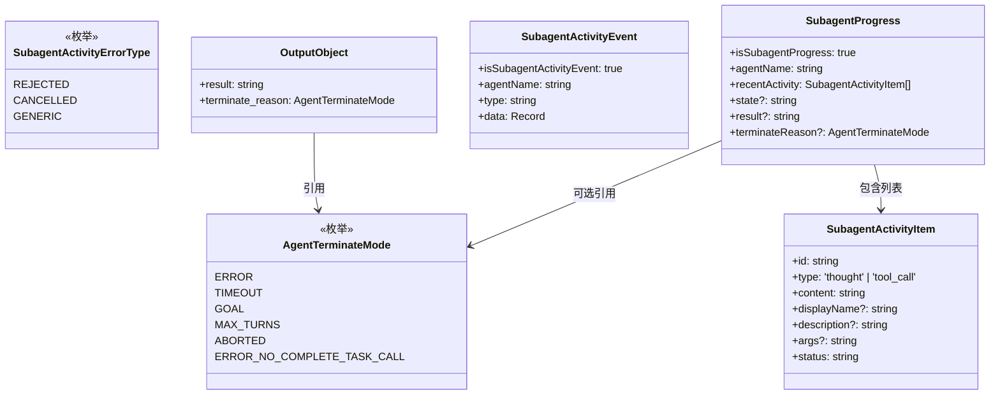
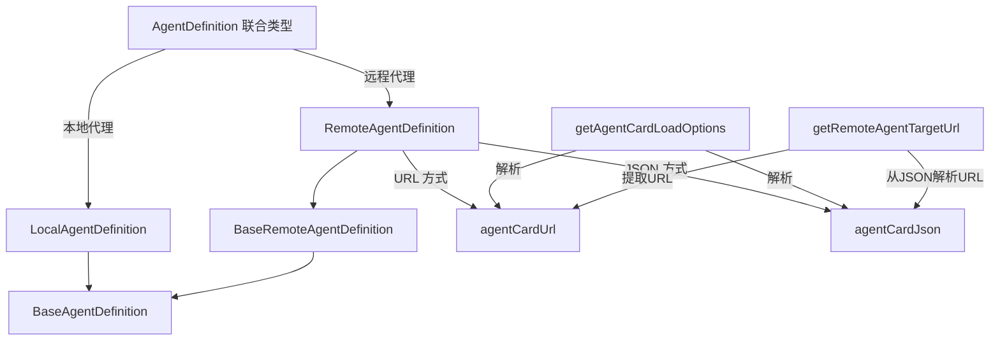

# types.ts

## 概述

`types.ts` 是 Gemini CLI 代理架构的核心类型定义文件，定义了代理系统中所有关键的接口、类型、枚举和常量。它是整个代理子系统的类型基础，被代理相关的几乎所有模块引用。

文件主要包含以下几类定义：
- **代理定义类型**：`AgentDefinition`、`LocalAgentDefinition`、`RemoteAgentDefinition` 等，描述代理的配置结构。
- **输入/输出配置**：`InputConfig`、`OutputConfig`、`PromptConfig` 等。
- **子代理活动事件**：`SubagentActivityEvent`、`SubagentProgress` 等，用于子代理执行过程中的可观测性。
- **枚举与常量**：`AgentTerminateMode`、默认配置值等。
- **辅助函数**：类型守卫和远程代理 URL 解析工具函数。

## 架构图（Mermaid）







## 核心组件

### 1. 枚举类型

#### `AgentTerminateMode`

代理终止模式枚举，描述代理结束执行的原因：

| 值 | 含义 |
|---|------|
| `ERROR` | 执行过程中发生错误 |
| `TIMEOUT` | 超过最大执行时间 |
| `GOAL` | 成功完成目标 |
| `MAX_TURNS` | 达到最大对话轮次 |
| `ABORTED` | 被外部中止 |
| `ERROR_NO_COMPLETE_TASK_CALL` | 代理未调用完成任务工具即终止（异常状态） |

#### `SubagentActivityErrorType`

子代理活动错误类型枚举：

| 值 | 含义 |
|---|------|
| `REJECTED` | 用户拒绝操作 |
| `CANCELLED` | 请求被取消 |
| `GENERIC` | 通用错误 |

### 2. 常量

| 常量名 | 值 | 含义 |
|--------|---|------|
| `DEFAULT_QUERY_STRING` | `'Get Started!'` | 代理默认输入查询字符串 |
| `DEFAULT_MAX_TURNS` | `30` | 代理默认最大对话轮次 |
| `DEFAULT_MAX_TIME_MINUTES` | `10` | 代理默认最大执行时间（分钟） |
| `SUBAGENT_REJECTED_ERROR_PREFIX` | `'User rejected this operation.'` | 子代理被拒绝时的错误前缀 |
| `SUBAGENT_CANCELLED_ERROR_MESSAGE` | `'Request cancelled.'` | 子代理被取消时的错误消息 |

### 3. 类型定义

#### `AgentInputs`

```typescript
export type AgentInputs = Record<string, unknown>;
```
代理的输入参数类型，是一个通用的键值对映射。

#### `RemoteAgentInputs`

```typescript
export type RemoteAgentInputs = { query: string };
```
远程代理的简化输入结构，仅包含一个 `query` 字符串字段。

#### `AgentCardLoadOptions`

```typescript
export type AgentCardLoadOptions =
  | { type: 'url'; url: string }
  | { type: 'json'; json: string };
```
代理卡片加载选项的联合类型，支持通过 URL 或内联 JSON 两种方式加载。

#### `AgentDefinition`

```typescript
export type AgentDefinition<TOutput extends z.ZodTypeAny = z.ZodUnknown> =
  | LocalAgentDefinition<TOutput>
  | RemoteAgentDefinition<TOutput>;
```
代理定义的联合类型，是本地代理和远程代理定义的统一入口。

### 4. 接口定义

#### `BaseAgentDefinition<TOutput>`

所有代理定义的基础接口：

- `name: string` - 代理唯一标识符
- `displayName?: string` - 显示名称（可选）
- `description: string` - 代理描述
- `experimental?: boolean` - 是否为实验性代理
- `inputConfig: InputConfig` - 输入配置
- `outputConfig?: OutputConfig<TOutput>` - 输出配置（可选）
- `metadata?: { hash?: string; filePath?: string }` - 元数据（可选，用于追踪定义来源）

#### `LocalAgentDefinition<TOutput>`

本地代理定义，继承自 `BaseAgentDefinition`：

- `kind: 'local'` - 代理类型标识
- `promptConfig: PromptConfig` - 提示词配置（必填）
- `modelConfig: ModelConfig` - 模型配置（必填）
- `runConfig: RunConfig` - 运行配置（必填）
- `toolConfig?: ToolConfig` - 工具配置（可选）
- `mcpServers?: Record<string, MCPServerConfig>` - 内联 MCP 服务器配置（可选）
- `processOutput?: (output) => string` - 输出后处理函数（可选）

#### `BaseRemoteAgentDefinition<TOutput>`

远程代理定义基类，继承自 `BaseAgentDefinition`：

- `kind: 'remote'` - 代理类型标识
- `originalDescription?: string` - 用户提供的原始描述（合并远程卡片信息前）
- `auth?: A2AAuthConfig` - 远程代理的认证配置（可选）

#### `RemoteAgentDefinition<TOutput>`

远程代理定义，继承自 `BaseRemoteAgentDefinition`：

- `agentCardUrl?: string` - 代理卡片 URL
- `agentCardJson?: string` - 代理卡片内联 JSON

#### `PromptConfig`

提示词配置接口：

- `systemPrompt?: string` - 系统提示词，支持 `${input_name}` 模板语法
- `initialMessages?: Content[]` - 初始消息序列，用于 few-shot 提示
- `query?: string` - 触发代理执行的具体任务/问题，支持模板语法

#### `ToolConfig`

工具配置接口：

- `tools: Array<string | FunctionDeclaration | AnyDeclarativeTool>` - 工具列表，支持工具名字符串、函数声明或声明式工具实例三种形式

#### `InputConfig`

输入配置接口：

- `inputSchema: AnySchema` - 基于 AJV 的 JSON Schema，定义代理的输入参数结构

#### `OutputConfig<T>`

输出配置接口（泛型）：

- `outputName: string` - 最终结果参数名
- `description: string` - 输出描述
- `schema: T` - 输出的 Zod Schema

#### `RunConfig`

运行配置接口：

- `maxTimeMinutes?: number` - 最大执行时间（分钟），默认 10
- `maxTurns?: number` - 最大对话轮次，默认 30

#### `SubagentActivityEvent`

子代理活动事件接口，用于实时报告子代理的执行状态：

- `isSubagentActivityEvent: true` - 类型判别标识
- `agentName: string` - 代理名称
- `type: 'TOOL_CALL_START' | 'TOOL_CALL_END' | 'THOUGHT_CHUNK' | 'ERROR'` - 事件类型
- `data: Record<string, unknown>` - 事件数据

#### `SubagentActivityItem`

子代理活动条目，代表一个可观测的活动项：

- `id: string` - 唯一标识
- `type: 'thought' | 'tool_call'` - 活动类型（思考或工具调用）
- `content: string` - 活动内容
- `status: 'running' | 'completed' | 'error' | 'cancelled'` - 状态

#### `SubagentProgress`

子代理整体进度，聚合多个活动条目：

- `isSubagentProgress: true` - 类型判别标识
- `agentName: string` - 代理名称
- `recentActivity: SubagentActivityItem[]` - 最近活动列表
- `state?: 'running' | 'completed' | 'error' | 'cancelled'` - 整体状态
- `result?: string` - 执行结果
- `terminateReason?: AgentTerminateMode` - 终止原因

### 5. 辅助函数

#### `isSubagentProgress(obj): obj is SubagentProgress`

类型守卫函数，判断对象是否为 `SubagentProgress` 类型。通过检查对象是否包含 `isSubagentProgress: true` 属性来判断。

#### `isToolActivityError(data): boolean`

检查工具调用数据是否表示错误。通过检查对象是否包含 `isError: true` 属性来判断。

#### `getAgentCardLoadOptions(def): AgentCardLoadOptions`

从远程代理定义中推导代理卡片加载选项：
1. 优先使用 `agentCardJson`（JSON 方式）。
2. 其次使用 `agentCardUrl`（URL 方式）。
3. 两者都不存在时抛出错误。

#### `getRemoteAgentTargetUrl(def): string | undefined`

从远程代理定义中提取目标 URL：
1. 优先返回 `agentCardUrl`。
2. 若无 URL 但有 JSON，尝试解析 JSON 并提取 `url` 字段。
3. 解析失败或无 URL 时返回 `undefined`。

## 依赖关系

### 内部依赖

| 模块路径 | 导入内容 | 用途 |
|---------|---------|------|
| `../tools/tools.js` | `AnyDeclarativeTool` | 工具配置中的声明式工具类型 |
| `../services/modelConfigService.js` | `ModelConfig` | 本地代理的模型配置类型 |
| `./auth-provider/types.js` | `A2AAuthConfig` | 远程代理的认证配置类型 |
| `../config/config.js` | `MCPServerConfig` | MCP 服务器配置类型 |

### 外部依赖

| 包名 | 导入内容 | 用途 |
|------|---------|------|
| `@google/genai` | `Content`, `FunctionDeclaration` | Google GenAI SDK 的内容和函数声明类型 |
| `zod` | `z` | Zod Schema 验证库，用于输出类型约束 |
| `ajv` | `AnySchema` | AJV JSON Schema 类型，用于输入 Schema 定义 |
| `@a2a-js/sdk` | `AgentCard` | A2A 协议的代理卡片类型 |

## 关键实现细节

1. **代理定义的双轨架构**：
   - 代理定义分为 `LocalAgentDefinition`（本地代理）和 `RemoteAgentDefinition`（远程代理）两大类。
   - 本地代理拥有完整的提示词配置（`PromptConfig`）、模型配置（`ModelConfig`）、运行配置（`RunConfig`）和工具配置（`ToolConfig`），在本地运行 AI 对话循环。
   - 远程代理通过代理卡片（AgentCard）描述，支持 URL 或内联 JSON 两种加载方式，并支持可选的认证配置。

2. **泛型输出类型系统**：
   - 使用 `TOutput extends z.ZodTypeAny = z.ZodUnknown` 泛型参数贯穿所有代理定义接口。
   - 这使得代理的输出可以在编译时进行类型检查，`processOutput` 函数接收的参数类型与 `OutputConfig` 中的 Schema 一致。

3. **输入 Schema 的选择**：
   - 输入使用 `AnySchema`（AJV JSON Schema），而输出使用 Zod Schema。
   - 这种混合 Schema 策略可能是因为输入 Schema 需要支持更广泛的 JSON Schema 标准（来自外部配置文件），而输出 Schema 需要 Zod 的类型推导能力。

4. **子代理可观测性体系**：
   - 文件定义了一套完整的子代理活动追踪类型：`SubagentActivityEvent`（事件）-> `SubagentActivityItem`（活动条目）-> `SubagentProgress`（整体进度）。
   - 支持四种事件类型：工具调用开始/结束、思考块和错误。
   - 每个活动条目有四种状态：运行中、已完成、错误和已取消。
   - 使用 `isSubagentActivityEvent: true` 和 `isSubagentProgress: true` 作为类型判别字段，方便运行时类型检查。

5. **远程代理 URL 提取的容错设计**：
   - `getRemoteAgentTargetUrl()` 函数在解析 JSON 时使用 try-catch，解析失败不会抛出异常而是返回 `undefined`。
   - 注释明确说明："JSON parse will fail properly later in loadAgent"，即 JSON 解析错误会在后续加载阶段被正式处理。

6. **模板语法支持**：
   - `PromptConfig` 中的 `systemPrompt` 和 `query` 字段支持 `${input_name}` 模板语法。
   - 这允许代理的提示词根据输入参数动态生成。
