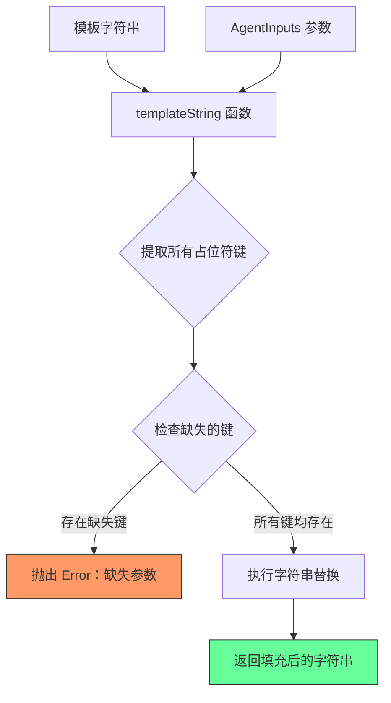
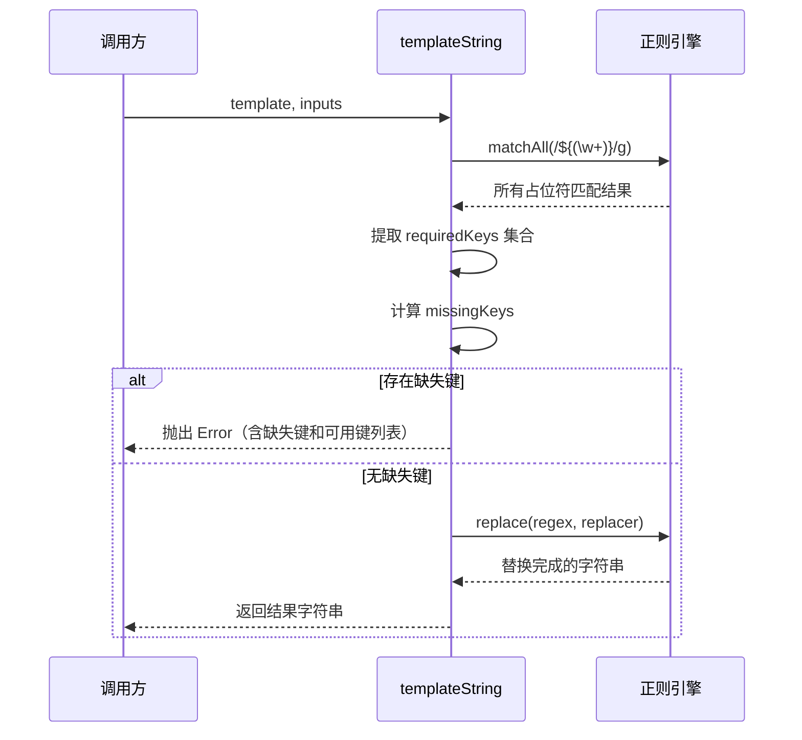

# utils.ts

## 概述

`utils.ts` 是代理模块的工具函数文件，目前仅包含一个核心函数 `templateString`。该函数负责将模板字符串中的 `${...}` 占位符替换为代理输入参数（`AgentInputs`）中的实际值。

这是代理系统中模板机制的基础实现，被 `PromptConfig` 中的 `systemPrompt` 和 `query` 等支持模板语法的字段所依赖，实现了代理提示词的动态参数化。

## 架构图（Mermaid）





## 核心组件

### `templateString(template, inputs)` 函数

#### 函数签名

```typescript
export function templateString(template: string, inputs: AgentInputs): string
```

#### 参数

| 参数 | 类型 | 描述 |
|------|------|------|
| `template` | `string` | 包含 `${...}` 占位符的模板字符串 |
| `inputs` | `AgentInputs` (`Record<string, unknown>`) | 提供占位符替换值的键值对对象 |

#### 返回值

返回所有占位符都被替换后的字符串。

#### 异常

当模板中的占位符键在 `inputs` 中不存在时，抛出 `Error`，错误消息包含：
- 缺失的参数列表
- 当前可用的输入参数列表

#### 执行流程

1. **占位符提取**：使用正则表达式 `/\$\{(\w+)\}/g` 匹配模板中所有 `${...}` 形式的占位符，提取占位符内的键名（仅支持 `\w+` 即字母、数字、下划线）。

2. **键名去重**：使用 `Set` 收集所有唯一的占位符键名，避免重复检查。

3. **缺失检查**：将模板所需的键名集合与 `inputs` 实际提供的键名集合进行比对，计算缺失的键名列表。

4. **错误报告**：若存在缺失键，抛出包含详细信息的错误：
   ```
   Template validation failed: Missing required input parameters: key1, key2. Available inputs: a, b, c
   ```

5. **字符串替换**：使用 `String.prototype.replace()` 配合替换函数，将每个占位符替换为 `String(inputs[key])` 的结果。

#### 使用示例

```typescript
const template = "You are ${role}. Your task is: ${task}";
const inputs = { role: "a helpful assistant", task: "answer questions" };
const result = templateString(template, inputs);
// result: "You are a helpful assistant. Your task is: answer questions"
```

## 依赖关系

### 内部依赖

| 模块路径 | 导入内容 | 用途 |
|---------|---------|------|
| `./types.js` | `AgentInputs` | 代理输入参数类型定义 |

### 外部依赖

无外部依赖。

## 关键实现细节

1. **两阶段处理策略**：
   - 函数采用"先校验、后替换"的两阶段策略，而非在替换过程中逐个检查。
   - 先通过 `matchAll` 提取所有占位符键名进行统一校验，确保在执行任何替换之前就发现所有缺失参数。
   - 这种设计使得错误信息能够一次性报告所有缺失的参数，而非在第一个缺失时就中断。

2. **占位符语法限制**：
   - 正则表达式 `/\$\{(\w+)\}/g` 中 `\w+` 仅匹配字母、数字和下划线。
   - 这意味着不支持带连字符（如 `${my-param}`）、点号（如 `${obj.prop}`）或空格的键名。
   - 这是一种有意的简化，与常见的模板变量命名约定一致。

3. **值的字符串化**：
   - 替换时使用 `String(inputs[key])` 将值转换为字符串。
   - 这意味着 `null` 会变成 `"null"`，`undefined` 会变成 `"undefined"`，对象会变成 `"[object Object]"`。
   - 调用方需自行确保输入值在字符串化后是有意义的。

4. **增强的错误信息**：
   - 错误消息同时包含缺失的键和可用的键，便于调试配置问题。
   - 格式：`Template validation failed: Missing required input parameters: ... Available inputs: ...`

5. **幂等性**：
   - 如果模板中没有占位符，函数会安全地返回原始字符串（正则不匹配，`replace` 不做任何修改）。
   - 如果同一个占位符出现多次（如 `${name} is ${name}`），所有出现位置都会被替换为相同的值。
