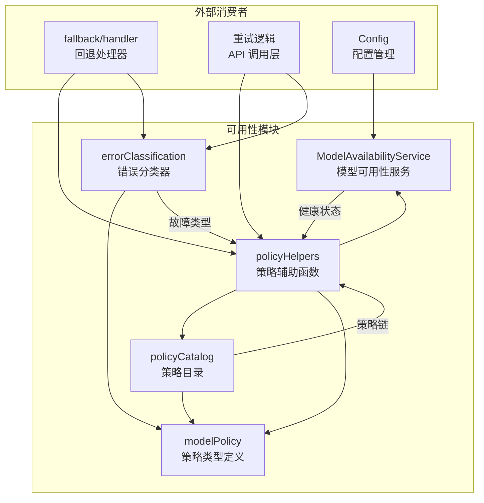
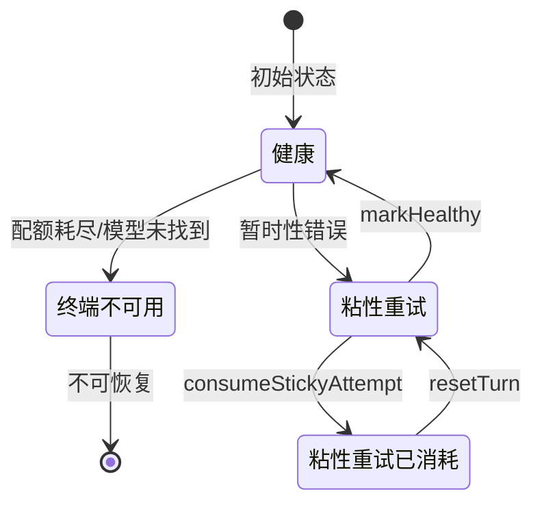

# availability

## 概述

`availability` 目录实现了 Gemini CLI 的模型可用性管理和回退策略系统。它负责跟踪各模型的健康状态、定义模型间的回退优先级链、对 API 错误进行分类，并根据策略自动选择可用模型。该模块是多模型容灾架构的核心，确保在主模型不可用时能平滑地切换到备选模型。

## 目录结构

```
availability/
├── errorClassification.ts              # 错误分类器（将异常映射到故障类型）
├── modelAvailabilityService.ts         # 模型可用性服务（健康状态跟踪和模型选择）
├── modelAvailabilityService.test.ts    # modelAvailabilityService 的单元测试
├── modelPolicy.ts                      # 模型策略类型定义（策略链、回退动作等）
├── policyCatalog.ts                    # 策略目录（预定义的模型策略链）
├── policyCatalog.test.ts               # policyCatalog 的单元测试
├── policyHelpers.ts                    # 策略辅助函数（链解析、模型选择、状态转换）
├── policyHelpers.test.ts               # policyHelpers 的单元测试
├── fallbackIntegration.test.ts         # 回退集成测试
└── testUtils.ts                        # 测试辅助工具（Mock 工厂）
```

## 架构图





## 核心组件

### `ModelAvailabilityService` (modelAvailabilityService.ts)
- **职责**: 跟踪每个模型的健康状态，提供模型选择能力
- **健康状态**:
  - `terminal` - 终端不可用 (配额/容量耗尽)，不再尝试
  - `sticky_retry` - 粘性重试 (每轮允许重试一次)
- **关键方法**:
  - `markTerminal(model, reason)` - 标记模型为终端不可用
  - `markRetryOncePerTurn(model)` - 标记为每轮可重试一次
  - `consumeStickyAttempt(model)` - 消耗粘性重试机会
  - `selectFirstAvailable(models)` - 从模型列表中选择第一个可用的
  - `resetTurn()` - 重置所有粘性重试状态 (新一轮对话开始时)
  - `snapshot(model)` - 获取模型当前可用性快照

### `classifyFailureKind` (errorClassification.ts)
- **职责**: 将 API 异常分类为故障类型
- **映射**:
  - `TerminalQuotaError` -> `'terminal'`
  - `RetryableQuotaError` -> `'transient'`
  - `ModelNotFoundError` -> `'not_found'`
  - 其他 -> `'unknown'`

### 策略类型 (modelPolicy.ts)
- **`ModelPolicy`**: 定义单个模型的回退行为（动作映射 + 状态转换规则 + 是否为最后手段）
- **`ModelPolicyChain`**: 按优先级排列的模型策略数组
- **`FallbackAction`**: `'silent'` (静默回退) 或 `'prompt'` (提示用户)
- **`FailureKind`**: `'terminal'` | `'transient'` | `'not_found'` | `'unknown'`

### `policyCatalog` (policyCatalog.ts)
- **职责**: 提供预定义的模型策略链
- **策略链**:
  - `DEFAULT_CHAIN` - 默认链: Gemini Pro -> Gemini Flash (最后手段)
  - `FLASH_LITE_CHAIN` - Flash Lite 链: Flash Lite -> Flash -> Pro (全部静默)
  - Preview 链: Preview Gemini -> Preview Flash (最后手段)
- **辅助函数**: `createSingleModelChain`, `createDefaultPolicy`, `validateModelPolicyChain`

### `policyHelpers` (policyHelpers.ts)
- **职责**: 策略链的解析、模型选择和可用性状态管理
- **关键函数**:
  - `resolvePolicyChain(config)` - 根据配置解析当前适用的策略链
  - `buildFallbackPolicyContext(chain, failedModel)` - 构建回退上下文
  - `selectModelForAvailability(config, model)` - 选择可用模型
  - `applyModelSelection(config, key)` - 应用模型选择（含副作用）
  - `applyAvailabilityTransition(context, failureKind)` - 应用状态转换
  - `createAvailabilityContextProvider(config, modelGetter)` - 创建上下文提供者

## 依赖关系

### 内部依赖
- `../config/config.js` - 配置管理
- `../config/models.js` - 模型常量和解析函数
- `../code_assist/types.js` - `UserTierId` 类型
- `../utils/googleQuotaErrors.js` - 配额错误类型
- `../utils/httpErrors.js` - HTTP 错误类型
- `../services/modelConfigService.js` - 模型配置服务

### 外部依赖
- `@google/genai` - `GenerateContentConfig` 类型

## 数据流

### 模型选择流程
1. 请求发起时，`resolvePolicyChain()` 根据用户配置和实验标志解析策略链
2. `selectModelForAvailability()` 查询 `ModelAvailabilityService` 选择第一个可用模型
3. 如果所有模型不可用，回退到策略链中标记为 `isLastResort` 的模型
4. `applyModelSelection()` 设置活动模型并消耗粘性重试机会

### 错误处理与状态转换流程
1. API 调用失败时，`classifyFailureKind()` 对错误进行分类
2. `applyAvailabilityTransition()` 根据策略中的 `stateTransitions` 映射更新模型健康状态
3. 下次模型选择时，`selectFirstAvailable()` 会跳过不可用的模型
4. 新一轮对话开始时，`resetTurn()` 重置粘性重试状态
