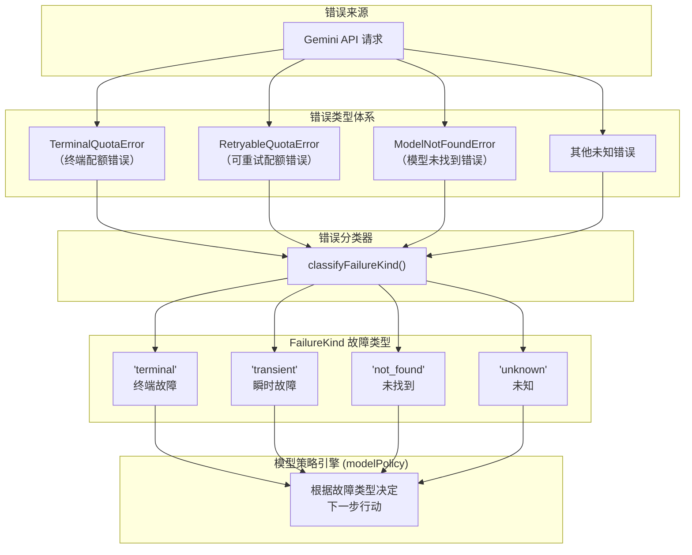
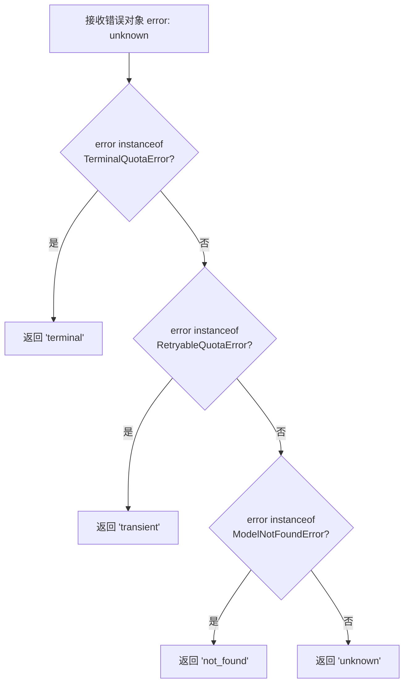
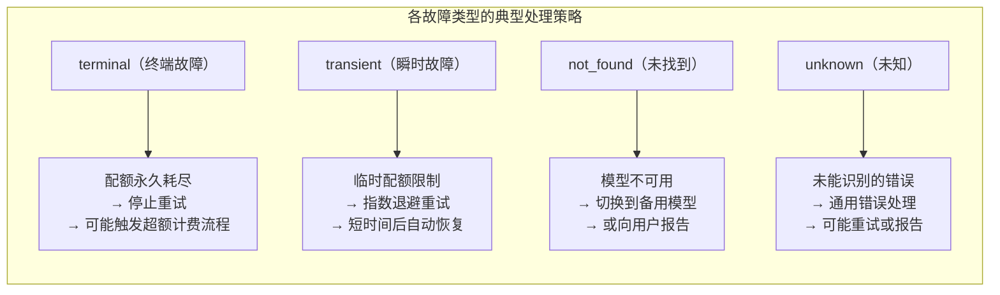

# errorClassification.ts

## 概述

`errorClassification.ts` 是 Gemini CLI 可用性（availability）模块中的错误分类器，位于 `packages/core/src/availability/errorClassification.ts`。该文件导出一个核心函数 `classifyFailureKind()`，负责将运行时捕获的错误对象分类为预定义的故障类型（`FailureKind`），以便模型可用性策略（Model Policy）根据不同的故障类型采取相应的处理措施——如自动重试、切换模型、终止请求等。

该模块是 Gemini CLI **模型故障恢复**和**可用性管理**流水线中的关键一环，位于错误捕获与策略决策之间的桥梁位置。

## 架构图（Mermaid）







## 核心组件

### `classifyFailureKind(error: unknown): FailureKind`

模块唯一导出的函数，负责将任意错误对象映射到 `FailureKind` 故障类型枚举。

**参数：**

| 参数 | 类型 | 说明 |
|---|---|---|
| `error` | `unknown` | 任意错误对象，通常来自 API 请求的 `catch` 块 |

**返回值：**

| 返回值 | 触发条件 | 含义 |
|---|---|---|
| `'terminal'` | `error instanceof TerminalQuotaError` | 终端性配额错误——用户的免费配额已永久耗尽（如每日/每月配额达到上限），不应重试 |
| `'transient'` | `error instanceof RetryableQuotaError` | 瞬时配额错误——临时的速率限制（rate limit）或短期配额限制，可以通过等待后重试恢复 |
| `'not_found'` | `error instanceof ModelNotFoundError` | 模型未找到——请求的模型名称不存在或不可用，可能需要切换到其他模型 |
| `'unknown'` | 以上均不匹配 | 未知错误——无法归类的错误类型，交由上层通用错误处理逻辑处理 |

**分类优先级：**

函数使用 `instanceof` 链式检查，按以下优先级从高到低进行匹配：
1. `TerminalQuotaError`（最高优先级）
2. `RetryableQuotaError`
3. `ModelNotFoundError`
4. 默认 `'unknown'`（兜底）

这个优先级意味着，如果某个错误类型同时继承了多个基类（虽然当前设计中不太可能），终端性错误会优先被识别，确保严重问题不会被误判为可重试。

## 依赖关系

### 内部依赖

| 依赖模块 | 导入内容 | 用途 |
|---|---|---|
| `../utils/googleQuotaErrors.js` | `TerminalQuotaError`, `RetryableQuotaError` | Google API 配额错误类型——终端性和可重试性两种。这两个类是自定义的 Error 子类，用于对 Google API 返回的配额相关 HTTP 错误进行语义化封装 |
| `../utils/httpErrors.js` | `ModelNotFoundError` | HTTP 错误类型——模型未找到。当请求的模型 ID 无效或不可访问时抛出 |
| `./modelPolicy.js` | `FailureKind`（类型） | 故障类型的类型定义。`FailureKind` 是一个联合类型（union type），可能的值包括 `'terminal'`、`'transient'`、`'not_found'`、`'unknown'` |

### 外部依赖

该模块没有外部依赖，是一个纯逻辑分类模块。

## 关键实现细节

### 1. 基于 `instanceof` 的类型判别

函数使用 JavaScript 的 `instanceof` 运算符进行错误分类，这要求：
- `TerminalQuotaError`、`RetryableQuotaError`、`ModelNotFoundError` 必须是**类**（class），而非普通对象或接口。
- 错误对象的原型链必须正确设置，即这些自定义错误类必须正确继承自 `Error`。
- 在 TypeScript 编译/打包过程中，类的名称可能被混淆（minify），但 `instanceof` 依赖原型链而非类名，因此不受影响。

### 2. `unknown` 类型参数的防御性设计

函数参数类型为 `unknown` 而非 `Error`，这是一种防御性编程实践：
- JavaScript 的 `throw` 语句可以抛出任意值（字符串、数字、对象等），不限于 `Error` 实例。
- `catch` 块捕获的值在 TypeScript 中默认类型为 `unknown`。
- 使用 `unknown` 作为参数类型确保函数可以安全地处理所有可能的输入，而不会因类型不匹配导致运行时错误。

`instanceof` 运算符在左操作数不是对象时安全地返回 `false`，因此即使传入原始值（如字符串），函数也能正确地返回 `'unknown'`。

### 3. 配额错误的二分法

该模块将配额错误分为两大类：

- **终端性（Terminal）**：配额已永久耗尽，在当前计费周期内不会恢复。典型场景：用户的免费层级每日调用次数已达上限。此类错误需要用户采取行动（如升级计划、等待新的计费周期、使用 AI 额度）。
- **可重试性（Retryable）**：临时性的速率限制。典型场景：短时间内请求过于频繁，触发了每分钟请求数限制。此类错误通过指数退避重试通常可以自动恢复。

这种二分法直接影响了上层模型策略引擎的行为：终端性错误可能触发模型切换或超额计费流程（参见 `billing.ts`），而瞬时错误仅触发重试机制。

### 4. 模块在整体架构中的位置

该模块处于错误处理流水线的**中间层**：

```
API 请求 → HTTP 错误 → 错误封装（httpErrors/googleQuotaErrors） → 错误分类（本模块） → 策略决策（modelPolicy） → 用户交互/自动恢复
```

它不负责错误的产生（由 HTTP 层处理），也不负责错误的处理（由策略层决策），而是专注于将底层错误**翻译**为上层策略可以理解的语义化类型。这种关注点分离使得每一层都可以独立演化：
- 新增 API 错误类型时，只需在本模块添加新的 `instanceof` 分支。
- 调整策略行为时，无需修改错误分类逻辑。

### 5. 可扩展性

当前的分类逻辑非常简洁（仅 4 个分支），但设计上便于扩展。例如，未来可能需要添加的错误类型：
- 网络超时错误 → `'transient'`
- 身份认证过期错误 → 新增 `'auth_expired'` 类型
- 服务端内部错误（500）→ `'transient'`
- 权限不足错误（403）→ 新增 `'forbidden'` 类型

只需添加新的 `instanceof` 检查和对应的 `FailureKind` 值即可。
