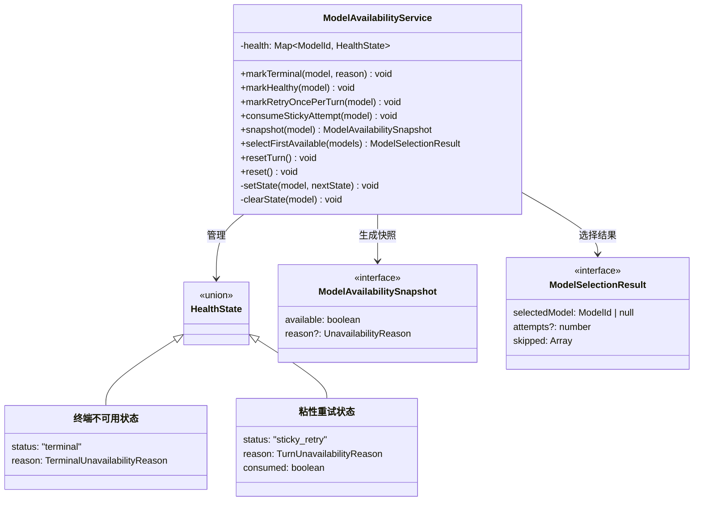
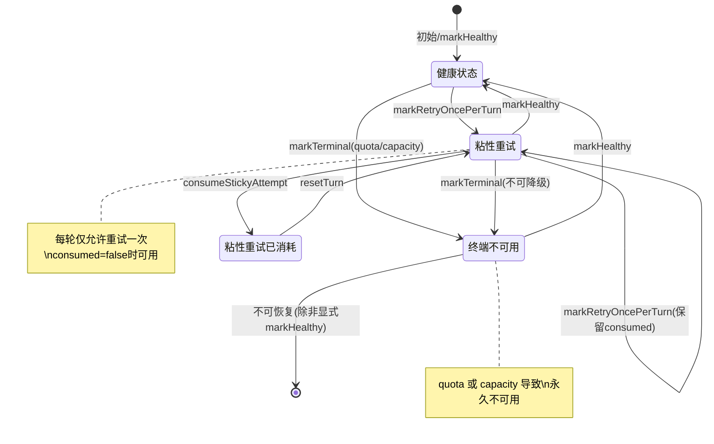

# modelAvailabilityService.ts

## 概述

`modelAvailabilityService.ts` 是模型可用性管理的核心服务文件。它定义了一套完整的模型健康状态追踪机制，用于在多模型环境下判断哪些模型当前可用、哪些因配额耗尽或容量不足等原因不可用，并提供从候选模型列表中选择第一个可用模型的能力。该服务是整个 `availability` 模块的基石。

## 架构图（Mermaid）

## 核心组件

### 类型定义

| 类型名 | 说明 |
|--------|------|
| `ModelId` | 模型标识符，类型为 `string` |
| `TerminalUnavailabilityReason` | 终端不可用原因，取值为 `'quota'`（配额耗尽）或 `'capacity'`（容量不足） |
| `TurnUnavailabilityReason` | 轮次级不可用原因，取值为 `'retry_once_per_turn'`（每轮仅重试一次） |
| `UnavailabilityReason` | 综合不可用原因，为上述两种原因的联合类型加 `'unknown'` |
| `ModelHealthStatus` | 模型健康状态枚举：`'terminal'`（终端不可用）或 `'sticky_retry'`（粘性重试） |
| `HealthState` | 内部健康状态联合类型，区分终端不可用和粘性重试两种状态 |

### 接口定义

#### `ModelAvailabilitySnapshot`

模型可用性快照，用于外部查询模型当前状态：
- `available: boolean` — 模型是否可用
- `reason?: UnavailabilityReason` — 不可用时的原因

#### `ModelSelectionResult`

模型选择结果，从候选列表中选择模型后的返回值：
- `selectedModel: ModelId | null` — 被选中的模型 ID，全部不可用时为 `null`
- `attempts?: number` — 当选中模型处于粘性重试状态时为 `1`，否则为 `undefined`
- `skipped: Array<{ model: ModelId; reason: UnavailabilityReason }>` — 被跳过的模型及其不可用原因

### `ModelAvailabilityService` 类

核心服务类，内部维护一个 `Map<ModelId, HealthState>` 映射来追踪每个模型的健康状态。

#### 公开方法

| 方法 | 参数 | 说明 |
|------|------|------|
| `markTerminal(model, reason)` | 模型ID, 终端原因 | 将模型标记为终端不可用（不可恢复），原因为 `quota` 或 `capacity` |
| `markHealthy(model)` | 模型ID | 将模型标记为健康，清除所有不良状态 |
| `markRetryOncePerTurn(model)` | 模型ID | 将模型标记为粘性重试状态。**不会覆盖已有的终端状态**（保护性设计）。如果已经处于粘性重试状态，保留当前的 `consumed` 值以防止无限循环 |
| `consumeStickyAttempt(model)` | 模型ID | 消耗粘性重试机会，将 `consumed` 设为 `true`，此后该模型在本轮不再可用 |
| `snapshot(model)` | 模型ID | 获取模型当前可用性快照。无状态或粘性重试未消耗时返回 `available: true`，终端或粘性重试已消耗时返回 `available: false` |
| `selectFirstAvailable(models)` | 模型ID数组 | 从候选列表中按顺序选择第一个可用模型，记录所有被跳过的模型及原因 |
| `resetTurn()` | 无 | 重置所有粘性重试模型的 `consumed` 状态为 `false`，通常在新一轮对话开始时调用 |
| `reset()` | 无 | 完全清空所有模型的健康状态，恢复到初始状态 |

#### 私有方法

| 方法 | 说明 |
|------|------|
| `setState(model, nextState)` | 设置指定模型的健康状态 |
| `clearState(model)` | 删除指定模型的健康状态记录 |

## 依赖关系

### 内部依赖

无。该文件是独立的基础模块，不依赖项目内的其他模块。

### 外部依赖

无。该文件不引入任何外部 npm 包，仅使用 TypeScript 原生类型和 JavaScript 内置的 `Map` 数据结构。

## 关键实现细节

1. **状态优先级保护**：`markRetryOncePerTurn()` 中检查当前状态是否为 `terminal`，如果是则直接返回不做任何修改。这保证了"终端不可用"状态不会被更轻微的"粘性重试"状态覆盖，体现了严格的状态降级保护策略。

2. **防止无限循环机制**：当模型已经处于 `sticky_retry` 状态时，`markRetryOncePerTurn()` 会保留当前的 `consumed` 值，而不是重置为 `false`。这防止了模型在同一轮中反复失败又反复重试的无限循环问题。

3. **粘性重试的"一次机会"语义**：`sticky_retry` 状态下，`consumed` 为 `false` 时 `snapshot()` 仍返回 `available: true`，允许该模型被再次尝试一次。一旦通过 `consumeStickyAttempt()` 将 `consumed` 设为 `true`，该模型在当前轮次内不再可用，直到 `resetTurn()` 被调用。

4. **轮次管理**：`resetTurn()` 只重置 `sticky_retry` 状态模型的 `consumed` 标记，不影响 `terminal` 状态的模型。这意味着配额耗尽或容量不足的模型在新轮次中仍然不可用，而临时失败的模型可以在新轮次获得新的重试机会。

5. **选择算法**：`selectFirstAvailable()` 采用简单的线性扫描策略，按候选列表顺序选择第一个可用模型。这意味着列表中的排列顺序隐含了模型的优先级。当选中的模型处于 `sticky_retry` 状态时，返回结果中 `attempts` 为 `1`，提示调用方这是一次重试尝试。

6. **不可变快照**：`snapshot()` 方法返回一个新的对象，不暴露内部状态引用，确保外部代码无法直接修改服务内部的健康状态映射。
