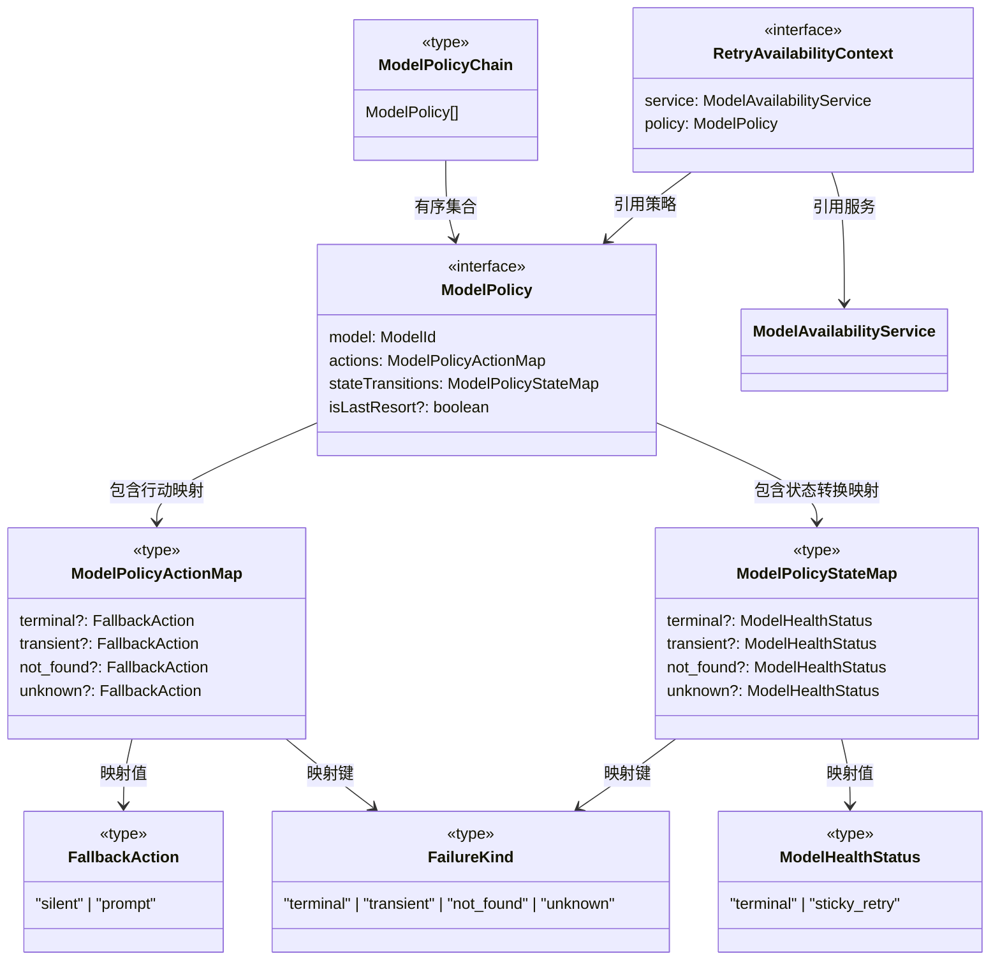
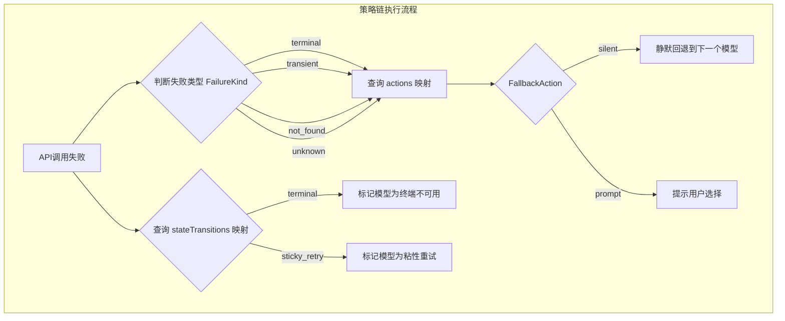

# modelPolicy.ts

## 概述

`modelPolicy.ts` 定义了模型策略（Model Policy）的类型体系，用于描述在多模型可用性链中，每个模型在 API 调用失败时应该采取怎样的行为——是静默回退到下一个模型，还是提示用户进行选择，以及如何进行健康状态转换。该文件是连接"模型可用性服务"与"策略目录"之间的桥梁，提供了统一的策略接口定义。

## 架构图（Mermaid）

## 核心组件

### 类型定义

#### `FallbackAction`

定义模型 API 失败时的回退行为：
- `'silent'` — 静默回退，自动切换到策略链中的下一个模型，用户无感知
- `'prompt'` — 提示用户，让用户决定是否切换模型或采取其他操作

#### `FailureKind`

API 调用失败的类型分类：
- `'terminal'` — 终端性失败，例如配额耗尽、容量不足，通常不可恢复
- `'transient'` — 暂时性失败，例如网络抖动、服务暂时不可用，可能在后续尝试中恢复
- `'not_found'` — 模型未找到，请求的模型不存在或不可访问
- `'unknown'` — 未知类型的失败

#### `ModelPolicyActionMap`

失败类型到回退行为的映射表。使用 `Partial<Record<FailureKind, FallbackAction>>`，意味着不是所有失败类型都必须配置回退行为，未配置的失败类型将使用默认处理逻辑。

#### `ModelPolicyStateMap`

失败类型到模型健康状态转换的映射表。使用 `Partial<Record<FailureKind, ModelHealthStatus>>`，定义了不同类型的失败应该将模型的健康状态转换为 `'terminal'` 还是 `'sticky_retry'`。

#### `ModelPolicyChain`

模型策略链，是 `ModelPolicy[]` 的类型别名。链中模型的排列顺序即优先级顺序，第一个模型为主模型（primary model）。

### 接口定义

#### `ModelPolicy`

单个模型的完整策略定义：

| 字段 | 类型 | 说明 |
|------|------|------|
| `model` | `ModelId` | 该策略适用的模型标识符 |
| `actions` | `ModelPolicyActionMap` | 不同失败类型对应的回退行为映射 |
| `stateTransitions` | `ModelPolicyStateMap` | 不同失败类型对应的健康状态转换映射 |
| `isLastResort` | `boolean?` | 可选。标记该模型是否为"最后手段"模型，当所有其他模型都不可用时仍然尝试使用 |

#### `RetryAvailabilityContext`

重试逻辑在应用可用性策略时所需的上下文：

| 字段 | 类型 | 说明 |
|------|------|------|
| `service` | `ModelAvailabilityService` | 模型可用性服务实例，用于查询和更新模型状态 |
| `policy` | `ModelPolicy` | 当前模型的策略定义，用于决定失败后的行为 |

## 依赖关系

### 内部依赖

| 依赖模块 | 导入内容 | 用途 |
|----------|----------|------|
| `./modelAvailabilityService.js` | `ModelAvailabilityService`（类型）, `ModelHealthStatus`（类型）, `ModelId`（类型） | 引用模型可用性服务的类型定义，用于构建策略和重试上下文 |

注意：所有导入均为 `import type`，即纯类型导入，运行时无实际依赖关系。

### 外部依赖

无。该文件不引入任何外部 npm 包。

## 关键实现细节

1. **纯类型文件**：`modelPolicy.ts` 不包含任何运行时代码或类实现，完全由类型定义和接口声明组成。它是一个典型的"类型契约"文件，为策略系统的各个参与者定义统一的接口标准。

2. **Partial 映射设计**：`ModelPolicyActionMap` 和 `ModelPolicyStateMap` 都使用了 `Partial<Record<...>>` 类型，允许策略定义中只配置需要关注的失败类型，未配置的类型留给消费方（如 `policyHelpers.ts`）使用默认行为处理。这种设计提供了灵活性，避免了为每种失败类型都必须显式配置的繁琐。

3. **行为与状态分离**：策略设计将"行为"（`actions`：用户交互层面怎么做）和"状态转换"（`stateTransitions`：系统内部状态怎么变）明确分离。同一种失败类型可以同时触发特定的用户交互行为和特定的状态转换，两者独立配置、互不干扰。

4. **"最后手段"模型概念**：`isLastResort` 标志引入了一种特殊语义——即使该模型的健康状态显示不可用，在所有其他模型都不可用时仍然可以作为兜底选择。这为系统提供了一层额外的容灾保障。

5. **策略链的有序性**：`ModelPolicyChain` 定义为数组类型，其中模型的排列顺序隐含了优先级语义。链中第一个模型为首选模型，后续模型为按优先级排列的回退选项。这与 `ModelAvailabilityService.selectFirstAvailable()` 的线性扫描逻辑一致。

6. **类型导入的运行时零开销**：所有从 `modelAvailabilityService.js` 的导入都通过 `import type` 完成，这意味着编译后的 JavaScript 代码中不会包含这些导入语句，实现运行时零开销。
