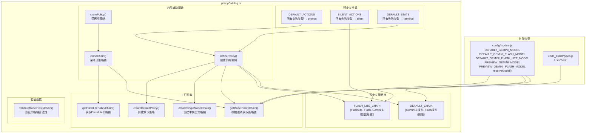
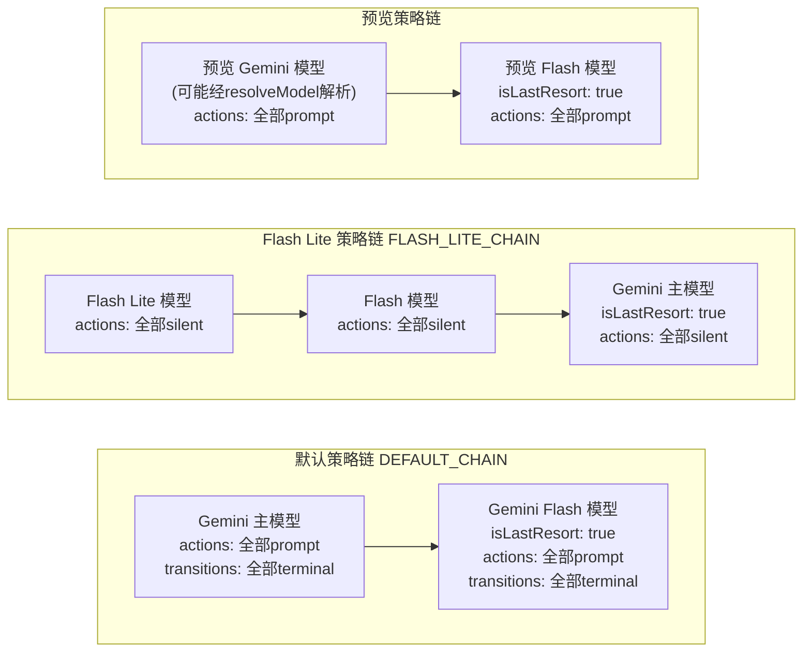

# policyCatalog.ts

## 概述

`policyCatalog.ts` 是模型策略目录文件，负责定义和构建具体的模型策略链（Model Policy Chain）。它预定义了默认的行为映射、状态转换映射，以及多种策略链模板（默认链、Flash Lite 链、预览链等），并提供工厂函数来创建和验证策略链。该文件是将抽象的策略类型定义（`modelPolicy.ts`）与具体的模型配置（`config/models.ts`）连接起来的枢纽。

## 架构图（Mermaid）





## 核心组件

### 类型定义

#### `PolicyConfig`

内部使用的策略配置类型，基于 `ModelPolicy` 但将 `actions` 和 `stateTransitions` 变为可选字段。这允许在定义策略时省略这两个字段，由 `definePolicy()` 函数自动填充默认值。

```typescript
type PolicyConfig = Omit<ModelPolicy, 'actions' | 'stateTransitions'> & {
  actions?: ModelPolicyActionMap;
  stateTransitions?: ModelPolicyStateMap;
};
```

#### `ModelPolicyOptions`

获取策略链时的选项接口：

| 字段 | 类型 | 说明 |
|------|------|------|
| `previewEnabled` | `boolean` | 是否启用预览模型 |
| `userTier` | `UserTierId?` | 用户层级标识（可选） |
| `useGemini31` | `boolean?` | 是否使用 Gemini 3.1 模型 |
| `useGemini31FlashLite` | `boolean?` | 是否使用 Gemini 3.1 Flash Lite 模型 |
| `useCustomToolModel` | `boolean?` | 是否使用自定义工具模型 |

### 预定义常量

#### `DEFAULT_ACTIONS`

默认行为映射，所有失败类型都映射为 `'prompt'`（提示用户）：
```typescript
{ terminal: 'prompt', transient: 'prompt', not_found: 'prompt', unknown: 'prompt' }
```

#### `SILENT_ACTIONS`

静默行为映射，所有失败类型都映射为 `'silent'`（静默回退）：
```typescript
{ terminal: 'silent', transient: 'silent', not_found: 'silent', unknown: 'silent' }
```

#### `DEFAULT_STATE`

默认状态转换映射，所有失败类型都导致模型进入 `'terminal'` 状态：
```typescript
{ terminal: 'terminal', transient: 'terminal', not_found: 'terminal', unknown: 'terminal' }
```

#### `DEFAULT_CHAIN`

默认策略链，包含两个模型：
1. `DEFAULT_GEMINI_MODEL` — 主模型，使用默认行为和状态转换
2. `DEFAULT_GEMINI_FLASH_MODEL` — 回退模型，标记为 `isLastResort: true`

#### `FLASH_LITE_CHAIN`

Flash Lite 策略链，包含三个模型，全部使用静默行为：
1. `DEFAULT_GEMINI_FLASH_LITE_MODEL` — Flash Lite 模型（静默回退）
2. `DEFAULT_GEMINI_FLASH_MODEL` — Flash 模型（静默回退）
3. `DEFAULT_GEMINI_MODEL` — 主模型，标记为 `isLastResort: true`（静默回退）

### 导出函数

#### `getModelPolicyChain(options)`

根据选项返回适当的模型策略链：
- **预览模式**（`previewEnabled === true`）：使用 `resolveModel()` 解析预览模型（可能根据 `useGemini31`、`useGemini31FlashLite`、`useCustomToolModel` 参数变化），返回预览模型策略链
- **非预览模式**：返回 `DEFAULT_CHAIN` 的深拷贝

#### `createSingleModelChain(model)`

创建仅包含一个模型的策略链，该模型自动标记为 `isLastResort: true`。适用于只需要使用特定单一模型的场景。

#### `getFlashLitePolicyChain()`

返回 `FLASH_LITE_CHAIN` 的深拷贝。用于需要 Flash Lite 优先的轻量级任务场景。

#### `createDefaultPolicy(model, options?)`

为不在目录中的模型创建默认策略脚手架，可选设置 `isLastResort` 标志。

#### `validateModelPolicyChain(chain)`

验证策略链的合法性，确保：
1. 链不能为空（至少包含一个模型）
2. 链中必须恰好有一个 `isLastResort` 模型（不能没有，也不能有多个）

违反任一规则将抛出 `Error`。

### 内部辅助函数

#### `definePolicy(config)`

策略工厂函数，用默认值填充未提供的 `actions` 和 `stateTransitions`：
- `actions` 默认使用 `DEFAULT_ACTIONS`，然后用配置中的值覆盖
- `stateTransitions` 默认使用 `DEFAULT_STATE`，然后用配置中的值覆盖
- 每次调用都创建新对象，避免共享状态问题

#### `clonePolicy(policy)`

深拷贝单个策略对象，包括其 `actions` 和 `stateTransitions` 映射。

#### `cloneChain(chain)`

通过 `map(clonePolicy)` 深拷贝整个策略链。

## 依赖关系

### 内部依赖

| 依赖模块 | 导入内容 | 用途 |
|----------|----------|------|
| `./modelPolicy.js` | `ModelPolicy`（类型）, `ModelPolicyActionMap`（类型）, `ModelPolicyChain`（类型）, `ModelPolicyStateMap`（类型） | 策略类型定义 |
| `../config/models.js` | `DEFAULT_GEMINI_FLASH_LITE_MODEL`, `DEFAULT_GEMINI_FLASH_MODEL`, `DEFAULT_GEMINI_MODEL`, `PREVIEW_GEMINI_FLASH_MODEL`, `PREVIEW_GEMINI_MODEL`, `resolveModel` | 模型标识符常量和模型解析函数 |
| `../code_assist/types.js` | `UserTierId`（类型） | 用户层级类型定义 |

### 外部依赖

无。该文件不引入任何外部 npm 包。

## 关键实现细节

1. **深拷贝防止共享状态**：`DEFAULT_CHAIN` 和 `FLASH_LITE_CHAIN` 作为模块级常量定义，但所有公开函数（`getModelPolicyChain`、`getFlashLitePolicyChain`）都返回深拷贝副本，通过 `cloneChain()` 确保每个调用者获得独立的策略链实例。这防止了一个调用者对策略链的修改影响到其他调用者。

2. **默认值覆盖模式**：`definePolicy()` 使用展开运算符（spread operator）实现"默认值 + 自定义覆盖"模式：`{ ...DEFAULT_ACTIONS, ...(config.actions ?? {}) }`。这使得调用方只需指定与默认值不同的部分。

3. **Flash Lite 链的静默回退设计**：`FLASH_LITE_CHAIN` 中所有模型都使用 `SILENT_ACTIONS`，意味着整个回退过程对用户完全透明。这符合 Flash Lite 作为轻量级模型的定位——通常用于后台或辅助任务，不应频繁打扰用户。

4. **策略链的逆向优先级**：`FLASH_LITE_CHAIN` 中模型从最轻量到最重量排列（FlashLite → Flash → Gemini），而 `isLastResort` 标记在最重量的 Gemini 模型上。这意味着系统优先使用轻量模型，只有在轻量模型全部不可用时才回退到重量模型。

5. **预览模式的模型解析**：在预览模式下，主模型通过 `resolveModel()` 动态解析，支持根据多个特性标志（`useGemini31`、`useGemini31FlashLite`、`useCustomToolModel`）选择不同的实际模型。而回退模型 `PREVIEW_GEMINI_FLASH_MODEL` 则是固定的。

6. **验证约束**：`validateModelPolicyChain()` 强制要求恰好一个 `isLastResort` 模型，这确保了策略链的语义完整性——总是有且只有一个兜底模型。这个约束在所有预定义链中都得到了遵守。

7. **`userTier` 参数当前未使用**：`ModelPolicyOptions` 中定义了 `userTier` 字段，但在 `getModelPolicyChain()` 的当前实现中并未使用。这可能是为未来根据用户层级返回不同策略链而预留的扩展点。
