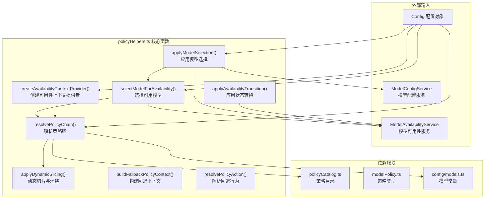
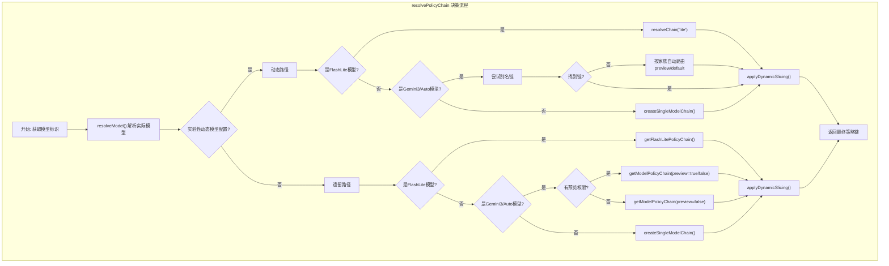
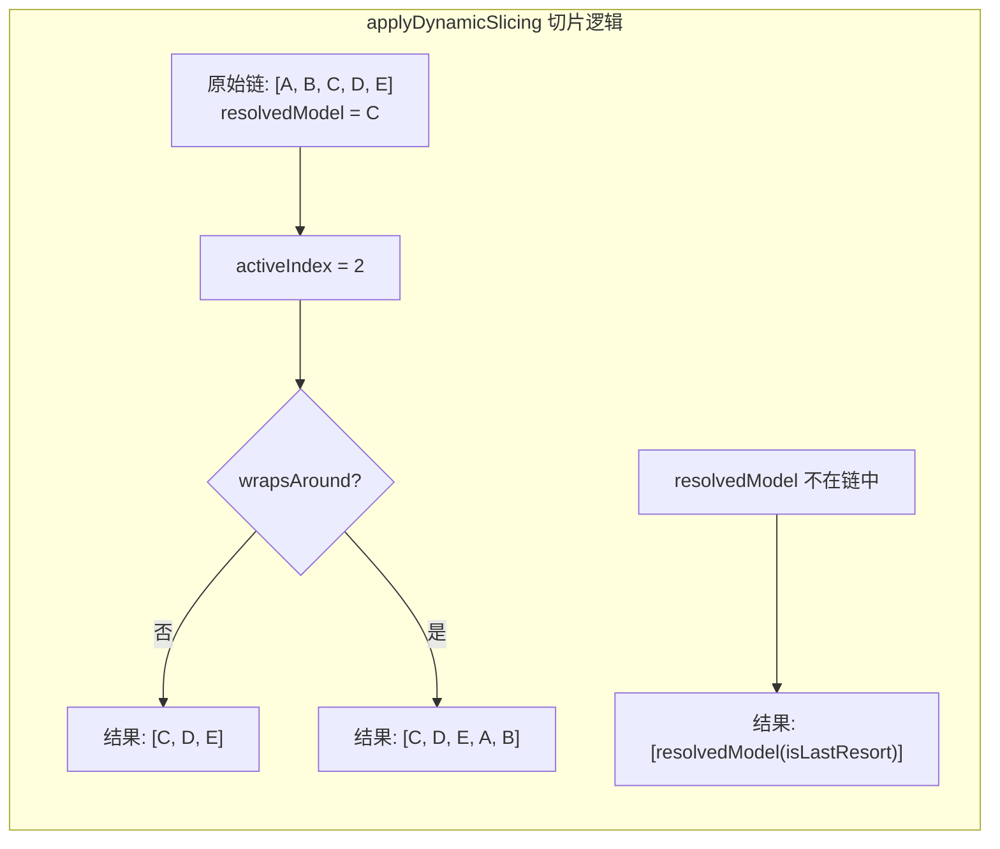

# policyHelpers.ts

## 概述

`policyHelpers.ts` 是模型可用性策略系统中最核心的"胶水"模块，提供了一系列辅助函数，将策略链的解析、模型选择、回退逻辑、状态转换等各个环节串联起来。它负责将抽象的策略定义转化为具体的运行时行为：从配置中解析出策略链、根据可用性选择模型、处理失败后的回退、应用健康状态转换，以及将选择结果应用到实际的模型配置中。

## 架构图（Mermaid）

## 核心组件

### 导出函数

#### `resolvePolicyChain(config, preferredModel?, wrapsAround?)`

**最核心的策略链解析函数**。根据配置和用户偏好，解析出最终的模型策略链。

**参数：**
| 参数 | 类型 | 默认值 | 说明 |
|------|------|--------|------|
| `config` | `Config` | - | 应用配置对象 |
| `preferredModel` | `string?` | `undefined` | 用户偏好的模型标识符 |
| `wrapsAround` | `boolean` | `false` | 是否启用策略链环绕（将链视为环形缓冲区） |

**执行逻辑（两条路径）：**

1. **动态路径**（`config.getExperimentalDynamicModelConfiguration() === true`）：
   - Flash Lite 模型 → 使用 `modelConfigService.resolveChain('lite')`
   - Gemini 3 / Auto 模型 → 先尝试按配置别名查找链，失败后按家族自动路由（`preview` 或 `default`）
   - 均无匹配 → 创建单模型链 `createSingleModelChain()`

2. **遗留路径**：
   - Flash Lite 模型 → `getFlashLitePolicyChain()`
   - Gemini 3 / Auto 模型 → `getModelPolicyChain()`，根据是否有预览权限决定 `previewEnabled`
   - 其他模型 → `createSingleModelChain()`

两条路径最终都经过 `applyDynamicSlicing()` 处理后返回。

**模型解析优先级**：`preferredModel` → `config.getActiveModel()` → `config.getModel()`

#### `buildFallbackPolicyContext(chain, failedModel, wrapsAround?)`

构建失败回退上下文。在某个模型 API 调用失败后，找出失败模型在链中的位置，并返回其后续的候选回退模型列表。

**参数：**
| 参数 | 类型 | 默认值 | 说明 |
|------|------|--------|------|
| `chain` | `ModelPolicyChain` | - | 当前策略链 |
| `failedModel` | `string` | - | 失败的模型标识符 |
| `wrapsAround` | `boolean` | `false` | 是否环绕 |

**返回值：**
- `failedPolicy` — 失败模型对应的策略（如果在链中找到）
- `candidates` — 回退候选模型策略列表

**环绕行为**：当 `wrapsAround` 为 `true` 时，候选列表为失败模型之后的所有模型加上之前的所有模型（形成环形），优先回退到"降级"方向的模型。

#### `resolvePolicyAction(failureKind, policy)`

根据失败类型和模型策略，解析应该采取的回退行为。如果策略中未配置对应失败类型的行为，默认返回 `'prompt'`。

#### `createAvailabilityContextProvider(config, modelGetter)`

创建一个可用性上下文提供者函数（闭包）。该函数在每次调用时：
1. 获取当前的模型可用性服务实例
2. 通过 `modelGetter()` 获取当前正在尝试的模型 ID（支持动态变化）
3. 解析策略链并找到当前模型的策略
4. 返回 `RetryAvailabilityContext` 对象

如果当前模型不在策略链中，返回 `undefined`。

#### `selectModelForAvailability(config, requestedModel)`

为给定的请求模型选择实际可用的模型：
1. 解析策略链
2. 通过 `ModelAvailabilityService.selectFirstAvailable()` 选择第一个可用模型
3. 如果所有模型都不可用，使用链中的 `isLastResort` 模型作为兜底，最终兜底为 `DEFAULT_GEMINI_MODEL`

#### `applyModelSelection(config, modelConfigKey, options?)`

**最高层级的模型选择应用函数**，包含完整的副作用处理：

1. 从 `modelConfigService` 获取已解析的模型配置
2. 调用 `selectModelForAvailability()` 选择可用模型
3. 如果选择的模型与原始模型不同，获取回退模型的配置
4. 如果是聊天模型（`isChatModel`），更新活跃模型
5. 如果模型处于粘性重试状态（`selection.attempts`），消耗粘性重试机会
6. 返回最终模型、生成内容配置和最大尝试次数

**参数：**
| 参数 | 类型 | 说明 |
|------|------|------|
| `config` | `Config` | 应用配置 |
| `modelConfigKey` | `ModelConfigKey` | 模型配置键 |
| `options.consumeAttempt` | `boolean?` | 是否消耗粘性重试机会，默认 `true` |

#### `applyAvailabilityTransition(getContext, failureKind)`

将模型 API 失败转换为健康状态变更：
1. 调用上下文提供者获取当前上下文
2. 查询策略中该失败类型对应的状态转换
3. 如果转换为 `'terminal'`，根据失败类型决定原因（`terminal` → `quota`，其他 → `capacity`）
4. 如果转换为 `'sticky_retry'`，调用 `markRetryOncePerTurn()`

### 内部函数

#### `applyDynamicSlicing(chain, resolvedModel, wrapsAround)`

对策略链进行动态切片：
1. 找到 `resolvedModel` 在链中的位置
2. **不环绕**：返回从该位置开始到链尾的子链
3. **环绕**：返回从该位置开始到链尾，再接上链头到该位置之前的完整环形链
4. **未找到**：为该模型创建单独的默认策略（`isLastResort: true`）

## 依赖关系

### 内部依赖

| 依赖模块 | 导入内容 | 用途 |
|----------|----------|------|
| `./modelPolicy.js` | `FailureKind`（类型）, `FallbackAction`（类型）, `ModelPolicy`（类型）, `ModelPolicyChain`（类型）, `RetryAvailabilityContext`（类型） | 策略类型定义 |
| `./policyCatalog.js` | `createDefaultPolicy`, `createSingleModelChain`, `getModelPolicyChain`, `getFlashLitePolicyChain` | 策略链工厂函数 |
| `../config/models.js` | `DEFAULT_GEMINI_FLASH_LITE_MODEL`, `DEFAULT_GEMINI_MODEL`, `PREVIEW_GEMINI_MODEL_AUTO`, `isAutoModel`, `isGemini3Model`, `resolveModel` | 模型常量和判断工具函数 |
| `../config/config.js` | `Config`（类型） | 应用配置类型 |
| `./modelAvailabilityService.js` | `ModelSelectionResult`（类型） | 模型选择结果类型 |
| `../services/modelConfigService.js` | `ModelConfigKey`（类型） | 模型配置键类型 |

### 外部依赖

| 依赖包 | 导入内容 | 用途 |
|--------|----------|------|
| `@google/genai` | `GenerateContentConfig`（类型） | Google GenAI SDK 的生成内容配置类型 |

## 关键实现细节

1. **双路径架构（动态 vs 遗留）**：`resolvePolicyChain()` 内部存在两条完整的策略解析路径。动态路径通过 `modelConfigService.resolveChain()` 实现更灵活的链解析，支持基于别名和家族的自动路由；遗留路径则直接使用 `policyCatalog` 中的预定义链。通过 `config.getExperimentalDynamicModelConfiguration()` 特性标志切换。

2. **环绕（Wrap-around）机制**：`applyDynamicSlicing()` 和 `buildFallbackPolicyContext()` 都支持 `wrapsAround` 参数。启用时，策略链被视为环形缓冲区——当从链中间某个模型开始时，先尝试后面的模型（降级），再尝试前面的模型（升级）。这在某些回退场景中提供了更多选择。

3. **失败类型到不可用原因的映射**：`applyAvailabilityTransition()` 中有一个关键的映射逻辑——当状态转换为 `terminal` 时，`failureKind === 'terminal'` 映射到 `quota`（配额原因），其他所有失败类型映射到 `capacity`（容量原因）。这简化了外部失败类型到内部不可用原因的转换。

4. **兜底机制的多层保障**：`selectModelForAvailability()` 实现了多层兜底：先从可用性服务选择 → 找不到则使用链中 `isLastResort` 模型 → 还找不到则回退到 `DEFAULT_GEMINI_MODEL`。确保系统始终能返回一个模型。

5. **副作用管理**：`applyModelSelection()` 是唯一包含副作用的函数，它会：设置活跃模型（`setActiveModel`）、消耗粘性重试机会（`consumeStickyAttempt`）。其他函数都是纯函数或仅读取状态。

6. **闭包与延迟求值**：`createAvailabilityContextProvider()` 返回一个闭包函数，使得策略链的解析和模型查找延迟到实际调用时执行。这支持了动态模型变化（通过 `modelGetter()`），使得重试逻辑可以在每次重试时获取最新的模型和策略。

7. **降级保护**：当用户请求 Gemini 3 模型但没有预览权限时（`hasAccessToPreview === false`），系统主动降级到稳定的 Gemini 2.5 策略链，而不是报错。这提供了平滑的用户体验。

8. **动态路径的别名优先策略**：在动态路径中，对 Auto 模型先尝试按配置的别名（`configuredModel`）查找专用链，失败后才回退到按模型家族（`preview`/`default`）查找。这允许运维人员为特定的模型别名配置专用的策略链。
