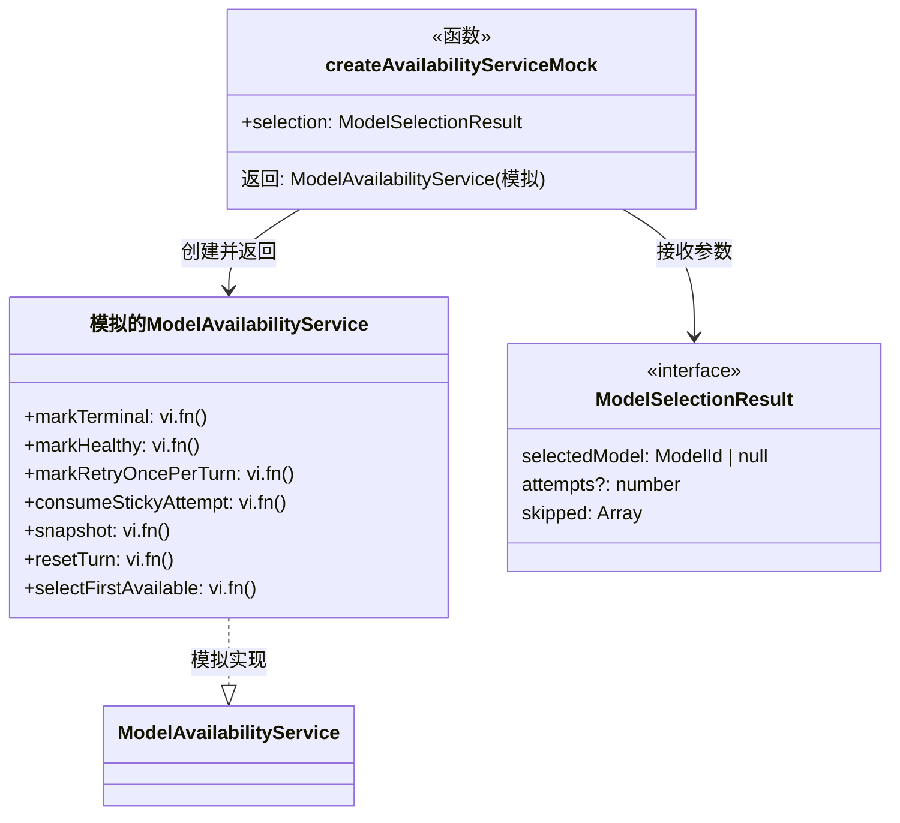
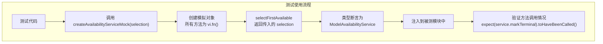

# testUtils.ts

## 概述

`testUtils.ts` 是 `availability` 模块的测试辅助工具文件，提供了用于单元测试的 `ModelAvailabilityService` 模拟（Mock）工厂函数。它利用 Vitest 的 `vi.fn()` 创建一个完全模拟的服务实例，使得依赖 `ModelAvailabilityService` 的其他模块在测试时可以方便地注入可控的模拟行为，而无需实例化真实的服务对象。

## 架构图（Mermaid）

## 核心组件

### 导出函数

#### `createAvailabilityServiceMock(selection?)`

创建一个完全模拟的 `ModelAvailabilityService` 实例。

**参数：**
| 参数 | 类型 | 默认值 | 说明 |
|------|------|--------|------|
| `selection` | `ModelSelectionResult` | `{ selectedModel: null, skipped: [] }` | `selectFirstAvailable()` 方法的预设返回值 |

**返回值：** `ModelAvailabilityService` — 一个所有方法都被 `vi.fn()` 模拟的服务实例

**模拟的方法清单：**

| 方法 | Mock 类型 | 预设行为 |
|------|-----------|----------|
| `markTerminal` | `vi.fn()` | 无返回值（默认 `undefined`） |
| `markHealthy` | `vi.fn()` | 无返回值（默认 `undefined`） |
| `markRetryOncePerTurn` | `vi.fn()` | 无返回值（默认 `undefined`） |
| `consumeStickyAttempt` | `vi.fn()` | 无返回值（默认 `undefined`） |
| `snapshot` | `vi.fn()` | 无返回值（默认 `undefined`） |
| `resetTurn` | `vi.fn()` | 无返回值（默认 `undefined`） |
| `selectFirstAvailable` | `vi.fn().mockReturnValue(selection)` | 返回传入的 `selection` 参数 |

**注意事项：**
- `reset()` 方法（存在于真实的 `ModelAvailabilityService` 中）**未被模拟**。如果被测代码调用了 `reset()`，将抛出运行时错误。
- 返回对象通过 `as unknown as ModelAvailabilityService` 进行不安全的类型断言，因此 TypeScript 不会在编译时检查模拟对象是否完整实现了所有方法。

## 依赖关系

### 内部依赖

| 依赖模块 | 导入内容 | 用途 |
|----------|----------|------|
| `./modelAvailabilityService.js` | `ModelAvailabilityService`（类型）, `ModelSelectionResult`（类型） | 模拟目标的类型定义 |

### 外部依赖

| 依赖包 | 导入内容 | 用途 |
|--------|----------|------|
| `vitest` | `vi` | Vitest 测试框架的模拟工具，提供 `vi.fn()` 用于创建 spy/mock 函数 |

## 关键实现细节

1. **不安全类型断言**：代码使用 `as unknown as ModelAvailabilityService` 进行双重类型断言（先转为 `unknown` 再转为目标类型）。这是因为模拟对象的结构与真实类并不完全一致（例如缺少 `reset()` 方法和私有成员）。代码中的 `eslint-disable-next-line @typescript-eslint/no-unsafe-type-assertion` 注释明确承认了这一设计取舍。

2. **`selectFirstAvailable` 的预设返回值**：只有 `selectFirstAvailable` 方法通过 `mockReturnValue()` 预设了返回值，其他方法使用 `vi.fn()` 的默认行为（返回 `undefined`）。这是因为 `selectFirstAvailable` 是最常被依赖其返回值的方法，而其他方法通常只需验证是否被调用（assertion on calls）。

3. **默认参数设计**：默认的 `selection` 参数为 `{ selectedModel: null, skipped: [] }`，代表"无可用模型"的场景。这使得测试在不传参时默认模拟所有模型都不可用的情况，调用方可以根据测试需要传入自定义的 `ModelSelectionResult`。

4. **模拟粒度**：该模拟覆盖了 `ModelAvailabilityService` 的所有公开方法（除 `reset()` 外），但不模拟私有方法（`setState`、`clearState`）和私有属性（`health` Map）。这符合"按接口模拟"的测试最佳实践——测试不应依赖内部实现细节。

5. **与 Vitest 生态的集成**：模拟对象中所有方法都是 `vi.fn()` 实例，意味着测试代码可以使用 Vitest 提供的全套断言 API：
   - `expect(service.markTerminal).toHaveBeenCalledWith(model, reason)` — 验证调用参数
   - `expect(service.markHealthy).toHaveBeenCalledTimes(1)` — 验证调用次数
   - `service.snapshot.mockReturnValue({ available: true })` — 在测试中动态修改返回值
