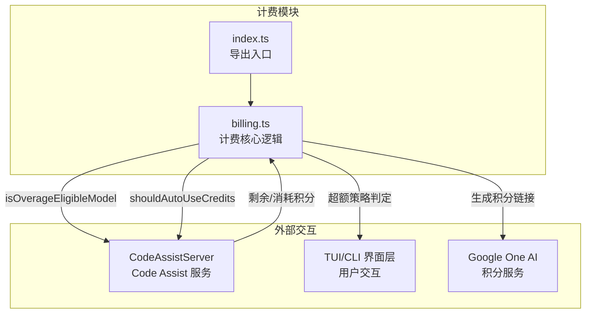

# billing

## 概述

`billing` 目录负责 Gemini CLI 的 AI 积分 (Credits) 计费逻辑。它管理 Google One AI 积分的余额查询、超额使用策略判定、积分链接生成以及模型资格检查。该模块与 Code Assist 服务协作，在用户配额耗尽时提供基于积分的继续使用方案。

## 目录结构

```
billing/
├── billing.ts        # 核心计费逻辑（积分余额、超额策略、URL 生成等）
├── billing.test.ts   # billing 的单元测试
└── index.ts          # 导出入口（re-export billing.ts 的所有导出）
```

## 架构图



## 核心组件

### 超额策略 (`OverageStrategy`)
定义配额耗尽时的积分使用策略：
- `'ask'` - 每次提示用户确认
- `'always'` - 自动使用积分
- `'never'` - 从不使用积分，显示标准回退

### 积分管理函数

| 函数 | 职责 |
|------|------|
| `getG1CreditBalance(tier)` | 从用户层级中提取 Google One AI 积分余额 |
| `isOverageEligibleModel(model)` | 检查模型是否支持积分超额计费 |
| `shouldAutoUseCredits(strategy, balance)` | 判断是否应自动使用积分 (策略为 `always` 且余额 >= 50) |
| `shouldShowOverageMenu(strategy, balance)` | 判断是否显示超额提示菜单 (策略为 `ask`) |
| `shouldShowEmptyWalletMenu(strategy, balance)` | 判断是否显示空钱包菜单 (余额 < 50 且策略非 `never`) |

### URL 生成函数

| 函数 | 职责 |
|------|------|
| `buildG1Url(path, email, campaign)` | 生成带 UTM 跟踪参数的 Google One AI 页面链接 |
| `wrapInAccountChooser(email, continueUrl)` | 将 URL 包装在 Google AccountChooser 重定向中 |

### 关键常量
- `G1_CREDIT_TYPE`: Google One AI 积分类型标识 (`'GOOGLE_ONE_AI'`)
- `MIN_CREDIT_BALANCE`: 最低有效积分余额阈值 (`50`)
- `OVERAGE_ELIGIBLE_MODELS`: 支持积分超额的模型集合 (Preview Gemini 系列)
- `G1_UTM_CAMPAIGNS`: UTM 活动标识符字典

## 依赖关系

### 内部依赖
- `../code_assist/types.js` - 积分相关类型定义 (`AvailableCredits`, `CreditType`, `GeminiUserTier`)
- `../config/models.js` - 模型常量 (`PREVIEW_GEMINI_MODEL`, `PREVIEW_GEMINI_3_1_MODEL`, `PREVIEW_GEMINI_FLASH_MODEL`)

### 外部依赖
无外部 npm 包依赖。

## 数据流

### 积分消耗流程
1. `CodeAssistServer.generateContentStream()` 检查 `shouldAutoUseCredits()` 判断是否启用积分
2. 如果启用，请求中附加 `enabled_credit_types: ['GOOGLE_ONE_AI']`
3. 服务器响应中携带 `consumedCredits` 和 `remainingCredits`
4. `updateCredits()` 更新本地积分余额缓存
5. 流结束后，触发计费遥测事件 `CreditsUsedEvent`

### 超额决策流程
1. 用户请求触发配额错误
2. 系统检查 `isOverageEligibleModel()` 确认模型资格
3. 根据 `OverageStrategy` 决定行为：
   - `always` + 余额充足 -> 自动使用积分重试
   - `ask` + 余额充足 -> 显示超额选择菜单
   - 余额不足 -> 显示空钱包菜单或标准回退
