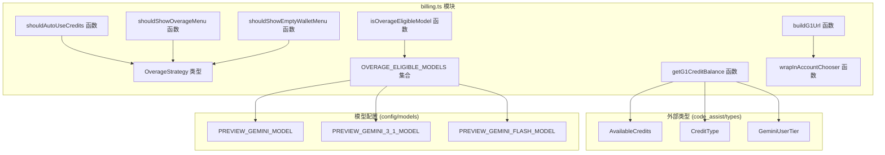
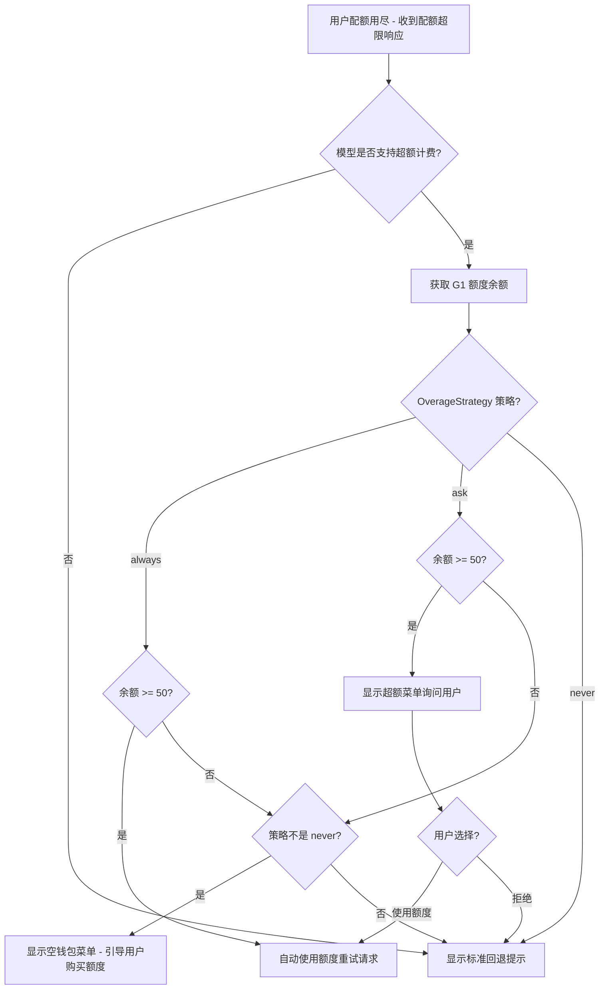
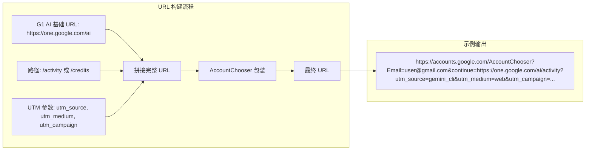

# billing.ts

## 概述

`billing.ts` 是 Gemini CLI 的计费与 AI 额度管理模块，位于 `packages/core/src/billing/billing.ts`。该文件实现了 Google One AI 额度（credits）相关的核心逻辑，包括：

1. **超额策略管理**（Overage Strategy）：定义了当用户的免费配额用尽时如何处理——自动使用额度、询问用户、或完全不使用额度。
2. **模型资格检查**：判断哪些 AI 模型支持基于额度的超额计费。
3. **额度余额查询**：从用户层级信息中提取 Google One AI 额度余额。
4. **URL 构建**：为 Google One AI 管理页面生成带有 UTM 跟踪参数和 AccountChooser 重定向的链接。
5. **UI 决策函数**：根据策略和余额决定是否自动使用额度、是否显示超额菜单、是否显示空钱包菜单。

该模块是 Gemini CLI 商业化和计费体系的基础组件，连接了用户层级系统与 Google One AI 服务。

## 架构图（Mermaid）







## 核心组件

### 1. `OverageStrategy` 类型

```typescript
export type OverageStrategy = 'ask' | 'always' | 'never';
```

定义了超额使用 AI 额度的三种策略：

| 策略值 | 行为 |
|---|---|
| `'ask'` | 每次配额用尽时弹出菜单询问用户是否使用额度 |
| `'always'` | 配额用尽时自动使用额度，无需用户确认 |
| `'never'` | 永不使用额度，显示标准的配额用尽回退提示 |

### 2. 常量

| 常量 | 值 | 说明 |
|---|---|---|
| `G1_CREDIT_TYPE` | `'GOOGLE_ONE_AI'` | Google One AI 额度类型标识符 |
| `OVERAGE_ELIGIBLE_MODELS` | `Set` | 支持超额计费的模型集合，包含 `PREVIEW_GEMINI_MODEL`、`PREVIEW_GEMINI_3_1_MODEL`、`PREVIEW_GEMINI_FLASH_MODEL` |
| `MIN_CREDIT_BALANCE` | `50` | 最低可用额度阈值，低于此值将视为余额不足 |
| `G1_AI_BASE_URL` | `'https://one.google.com/ai'` | Google One AI 页面基础 URL |
| `ACCOUNT_CHOOSER_URL` | `'https://accounts.google.com/AccountChooser'` | Google 账号选择器 URL |
| `UTM_SOURCE` | `'gemini_cli'` | UTM 来源标识 |
| `UTM_MEDIUM` | `'web'` | UTM 媒介标识（注释中提到未来会改为 `'desktop'`） |
| `G1_UTM_CAMPAIGNS` | 对象 | UTM 活动标识符集合，包含三种场景 |

#### `G1_UTM_CAMPAIGNS` 详细

| 键名 | 值 | 场景 |
|---|---|---|
| `MANAGE_ACTIVITY` | `'hydrogen_cli_settings_ai_credits_activity_page'` | 拦截流程中的"管理"链接（用户有额度） |
| `MANAGE_ADD_CREDITS` | `'hydrogen_cli_settings_add_credits'` | "管理"页面中的添加额度入口 |
| `EMPTY_WALLET_ADD_CREDITS` | `'hydrogen_cli_insufficient_credits_add_credits'` | 空钱包流程中的"获取 AI 额度"链接 |

### 3. 核心函数

#### `isOverageEligibleModel(model: string): boolean`

检查给定模型名称是否在超额计费资格模型集合中。

```typescript
export function isOverageEligibleModel(model: string): boolean {
  return OVERAGE_ELIGIBLE_MODELS.has(model);
}
```

#### `wrapInAccountChooser(email: string, continueUrl: string): string`

将目标 URL 包装在 Google AccountChooser 重定向链接中，确保用户在浏览器中跳转时能自动选择正确的 Google 账号。

**参数：**
- `email`：用户邮箱地址，用于 AccountChooser 的账号预选。
- `continueUrl`：账号选择后要跳转的目标 URL。

**返回**：`https://accounts.google.com/AccountChooser?Email=xxx&continue=xxx`

#### `buildG1Url(path: 'activity' | 'credits', email: string, campaign: string): string`

构建带有完整 UTM 跟踪参数的 Google One AI 页面链接，并包装在 AccountChooser 重定向中。

**参数：**
- `path`：页面路径，`'activity'` 对应额度活动页，`'credits'` 对应额度管理页。
- `email`：用户邮箱。
- `campaign`：UTM 活动标识符。

**返回**：完整的 AccountChooser 包装 URL。

#### `getG1CreditBalance(tier: GeminiUserTier | null | undefined): number | null`

从用户层级信息中提取 Google One AI 额度余额。

**逻辑：**
1. 如果 `tier` 为空或没有 `availableCredits`，返回 `null`（不具备额度资格）。
2. 过滤出 `creditType === 'GOOGLE_ONE_AI'` 的额度条目。
3. 如果没有匹配条目，返回 `null`。
4. 将所有匹配条目的 `creditAmount`（字符串格式的 int64）解析为数字并求和。
5. 对无法解析的值默认为 0。

**返回**：
- `number`：额度余额总和。
- `null`：用户不具备 G1 额度资格。

#### `shouldAutoUseCredits(strategy: OverageStrategy, creditBalance: number | null): boolean`

判断是否应自动使用额度（无需用户确认）。

**条件**：策略为 `'always'` 且余额不为 null 且余额 >= 50。

#### `shouldShowOverageMenu(strategy: OverageStrategy, creditBalance: number | null): boolean`

判断是否应显示超额菜单（询问用户）。

**条件**：策略为 `'ask'` 且余额不为 null 且余额 >= 50。

#### `shouldShowEmptyWalletMenu(strategy: OverageStrategy, creditBalance: number | null): boolean`

判断是否应显示空钱包菜单（引导用户购买额度）。

**条件**：策略不为 `'never'` 且余额不为 null 且余额 < 50。

## 依赖关系

### 内部依赖

| 依赖模块 | 导入内容 | 用途 |
|---|---|---|
| `../code_assist/types.js` | `AvailableCredits`（类型）, `CreditType`（类型）, `GeminiUserTier`（类型） | 用户层级和额度信息的类型定义 |
| `../config/models.js` | `PREVIEW_GEMINI_MODEL`, `PREVIEW_GEMINI_3_1_MODEL`, `PREVIEW_GEMINI_FLASH_MODEL` | 预览版 Gemini 模型常量，用于构建支持超额计费的模型集合 |

### 外部依赖

该模块没有外部（第三方或 Node.js 内置）依赖，是一个纯逻辑模块，仅使用 JavaScript 内置的 `URLSearchParams`、`Set`、`parseInt`、`isNaN` 等。

## 关键实现细节

### 1. 三层决策矩阵

该模块通过三个 `should*` 函数实现了一个清晰的三层决策矩阵：

| 策略 \ 余额 | 余额 >= 50 | 0 <= 余额 < 50 | 余额为 null |
|---|---|---|---|
| `'always'` | 自动使用额度 | 显示空钱包菜单 | 无操作 |
| `'ask'` | 显示超额菜单 | 显示空钱包菜单 | 无操作 |
| `'never'` | 无操作 | 无操作 | 无操作 |

### 2. `creditAmount` 的类型处理

后端返回的 `creditAmount` 是 **int64 字符串格式**（因为 JSON 不支持 64 位整数的精确表示）。代码使用 `parseInt(credit.creditAmount ?? '0', 10)` 进行安全解析：
- 使用空值合并运算符 `??` 处理 `undefined` 或 `null` 的情况。
- 使用 `isNaN()` 检查解析结果，对无法解析的值降级为 0。
- 使用 `reduce` 对多条额度记录求和，支持用户拥有多笔 G1 额度的场景。

### 3. AccountChooser 重定向机制

当用户从 CLI 跳转到浏览器管理额度时，需要确保浏览器中自动选择正确的 Google 账号。这通过 Google 的 AccountChooser 服务实现：将目标 URL 作为 `continue` 参数传递给 `https://accounts.google.com/AccountChooser`，同时通过 `Email` 参数预选账号。

### 4. UTM 跟踪体系

所有指向 Google One AI 页面的链接都包含 UTM 参数用于流量追踪：
- `utm_source`：固定为 `gemini_cli`，标识流量来自 Gemini CLI。
- `utm_medium`：当前为 `web`（注释中提到等 G1 服务修复后会改为 `desktop`）。
- `utm_campaign`：根据具体场景选择不同的活动标识符，用于分析用户从哪个入口进入。

### 5. 最低额度阈值

`MIN_CREDIT_BALANCE = 50` 定义了最低可用额度阈值。当用户余额低于此值时：
- `shouldAutoUseCredits` 和 `shouldShowOverageMenu` 返回 `false`（余额太低，不推荐使用）。
- `shouldShowEmptyWalletMenu` 返回 `true`（引导用户充值）。

这个阈值防止了用户在余额接近零时意外触发额度消耗却无法完成请求的情况。

### 6. 模型资格限制

并非所有模型都支持超额计费。`OVERAGE_ELIGIBLE_MODELS` 集合明确限定了只有三个预览版模型支持此功能，这可能是因为：
- 计费后端仅对特定模型配置了额度扣减逻辑。
- 不同模型的定价不同，需要逐步接入。
- 预览版模型是主要面向消费者的模型，与 Google One AI 的目标用户群体匹配。
