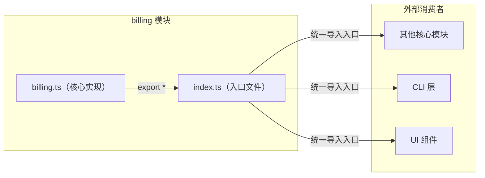

# index.ts

## 概述

`index.ts` 是 Gemini CLI 计费模块（`packages/core/src/billing/`）的入口文件（barrel file）。该文件的唯一职责是将 `billing.ts` 模块中的所有导出重新导出（re-export），为外部消费者提供统一的导入入口。

通过这个入口文件，其他模块可以直接从 `@gemini/core/billing`（或相对路径 `../billing`）导入所有计费相关的类型、常量和函数，而无需关心计费模块内部的文件结构。

## 架构图（Mermaid）

```mermaid
flowchart TD
    subgraph 重新导出的内容["通过 index.ts 重新导出的全部内容"]
        direction TB
        T1["OverageStrategy 类型"]
        C1["G1_CREDIT_TYPE 常量"]
        C2["OVERAGE_ELIGIBLE_MODELS 常量"]
        C3["MIN_CREDIT_BALANCE 常量"]
        C4["G1_UTM_CAMPAIGNS 常量"]
        F1["isOverageEligibleModel 函数"]
        F2["wrapInAccountChooser 函数"]
        F3["buildG1Url 函数"]
        F4["getG1CreditBalance 函数"]
        F5["shouldAutoUseCredits 函数"]
        F6["shouldShowOverageMenu 函数"]
        F7["shouldShowEmptyWalletMenu 函数"]
    end
```





## 核心组件

### Barrel 导出

```typescript
export * from './billing.js';
```

该语句使用 TypeScript/JavaScript 的通配符重新导出语法，将 `billing.ts` 中所有具名导出（named exports）传递出去。具体包括：

**类型导出：**
- `OverageStrategy` — 超额策略联合类型

**常量导出：**
- `G1_CREDIT_TYPE` — Google One AI 额度类型标识
- `OVERAGE_ELIGIBLE_MODELS` — 支持超额计费的模型集合
- `MIN_CREDIT_BALANCE` — 最低额度阈值
- `G1_UTM_CAMPAIGNS` — UTM 活动标识符对象

**函数导出：**
- `isOverageEligibleModel()` — 模型资格检查
- `wrapInAccountChooser()` — AccountChooser URL 包装
- `buildG1Url()` — G1 页面 URL 构建
- `getG1CreditBalance()` — G1 额度余额提取
- `shouldAutoUseCredits()` — 自动使用额度判断
- `shouldShowOverageMenu()` — 超额菜单显示判断
- `shouldShowEmptyWalletMenu()` — 空钱包菜单显示判断

## 依赖关系

### 内部依赖

| 依赖模块 | 导入方式 | 用途 |
|---|---|---|
| `./billing.js` | `export *` | 重新导出所有计费相关的类型、常量和函数 |

### 外部依赖

该文件没有外部依赖。

## 关键实现细节

### 1. Barrel 文件模式

这是 TypeScript 项目中常见的 **Barrel 模式**（桶模式），其核心目的是：

- **简化导入路径**：外部模块只需 `import { ... } from '../billing'` 或 `import { ... } from '../billing/index.js'`，无需知道具体实现在 `billing.ts` 中。
- **封装内部结构**：如果未来计费模块拆分为多个文件（如 `credits.ts`、`overage.ts`、`urls.ts`），只需在 `index.ts` 中添加相应的 `export *` 语句，外部消费者的导入路径无需变更。
- **控制公共 API 表面**：如果需要隐藏某些内部实现，可以将 `export *` 改为具名导出 `export { specificFunction } from './billing.js'`。

### 2. `.js` 扩展名

导入路径使用 `.js` 后缀（`'./billing.js'`），这是 TypeScript 项目在 ESM（ECMAScript Modules）模式下的标准做法。TypeScript 编译器在类型检查时会自动将 `.js` 映射到对应的 `.ts` 源文件，而编译输出的 JavaScript 文件中保留 `.js` 扩展名以符合 Node.js ESM 的模块解析规则。

### 3. 当前模块的简洁性

目前 `billing/` 目录仅包含 `billing.ts` 和 `index.ts` 两个文件，因此 `index.ts` 的存在看似多余。但这是一种**面向未来的架构设计**——随着计费功能的扩展（如新增支付方式、订阅管理、发票功能等），新的子模块可以无缝添加而不影响外部 API。
