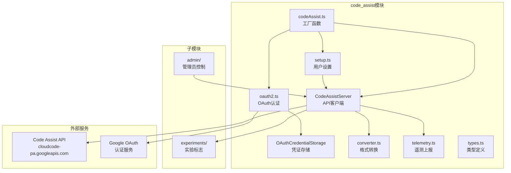
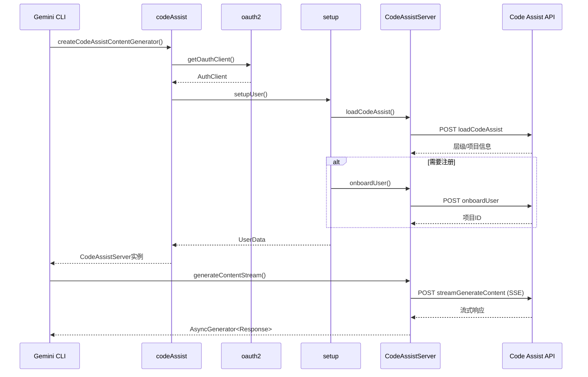

# code_assist

## 概述

`code_assist` 目录是 Gemini CLI 与 Google Cloud Code Assist 后端服务交互的核心模块。它封装了 OAuth2 认证流程、用户注册/设置、API 请求的转换与发送、遥测数据上报、管理员控制策略以及实验标志管理等功能。该模块是 Gemini CLI 使用 Google 账号登录并通过 Code Assist API 访问 Gemini 模型的关键路径。

## 目录结构

```
code_assist/
├── admin/                          # 管理员控制子模块
│   ├── admin_controls.ts           # 管理员控制策略获取与轮询
│   ├── admin_controls.test.ts      # admin_controls 的单元测试
│   ├── mcpUtils.ts                 # MCP 服务器白名单和强制服务器管理
│   └── mcpUtils.test.ts            # mcpUtils 的单元测试
├── experiments/                    # 实验标志子模块
│   ├── client_metadata.ts          # 客户端元数据收集
│   ├── client_metadata.test.ts     # client_metadata 的单元测试
│   ├── experiments.ts              # 实验标志获取与缓存
│   ├── experiments.test.ts         # experiments 的单元测试
│   ├── experiments_local.test.ts   # 本地实验标志测试
│   ├── flagNames.ts               # 实验标志名称常量
│   └── types.ts                   # 实验相关类型定义
├── codeAssist.ts                   # 入口工厂函数（创建内容生成器）
├── codeAssist.test.ts              # codeAssist 的单元测试
├── converter.ts                    # 请求/响应格式转换器
├── converter.test.ts               # converter 的单元测试
├── oauth2.ts                       # OAuth2 认证流程（Web/UserCode/ADC）
├── oauth2.test.ts                  # oauth2 的单元测试
├── oauth-credential-storage.ts     # OAuth 凭证的安全存储
├── oauth-credential-storage.test.ts# oauth-credential-storage 的单元测试
├── server.ts                       # CodeAssistServer 核心类（API 客户端）
├── server.test.ts                  # server 的单元测试
├── setup.ts                        # 用户设置与注册流程
├── setup.test.ts                   # setup 的单元测试
├── telemetry.ts                    # 遥测数据上报（对话指标）
├── telemetry.test.ts               # telemetry 的单元测试
└── types.ts                        # 共享类型定义（请求/响应/枚举等）
```

## 架构图





## 核心组件

### `createCodeAssistContentGenerator` (codeAssist.ts)
- **职责**: 工厂函数，创建通过 Code Assist API 与 Gemini 模型交互的内容生成器
- **流程**: OAuth 认证 -> 用户设置 -> 创建 `CodeAssistServer` 实例
- **辅助函数**: `getCodeAssistServer(config)` 从配置中提取 `CodeAssistServer` 实例

### `CodeAssistServer` (server.ts)
- **职责**: Code Assist API 的 HTTP 客户端，实现 `ContentGenerator` 接口
- **API 端点**: `https://cloudcode-pa.googleapis.com/v1internal`
- **核心方法**:
  - `generateContentStream(req)` - 流式内容生成 (SSE)
  - `generateContent(req)` - 非流式内容生成
  - `countTokens(req)` - Token 计数
  - `loadCodeAssist(req)` - 加载用户层级和项目信息
  - `onboardUser(req)` - 用户注册
  - `fetchAdminControls(req)` - 获取管理员控制设置
  - `listExperiments(metadata)` - 获取实验标志
  - `recordConversationOffered/Interaction()` - 遥测上报
  - `retrieveUserQuota(req)` - 获取用户配额
- **特性**: 自动重试 (3次)、SSE 流式解析、积分消耗跟踪

### `oauth2` (oauth2.ts)
- **职责**: 完整的 OAuth2 认证流程实现
- **认证方式**:
  - **Web 登录** - 启动本地 HTTP 服务器接收回调
  - **用户码登录** - 终端手动输入授权码 (NO_BROWSER 模式)
  - **ADC (应用默认凭证)** - GCE 元数据服务器认证
  - **BYOID** - 外部账户授权用户
- **功能**: 凭证缓存/加载、Token 刷新监听、用户信息获取与缓存

### `OAuthCredentialStorage` (oauth-credential-storage.ts)
- **职责**: OAuth 凭证的安全存储管理
- **存储方式**: 使用 `HybridTokenStorage`（系统钥匙链/加密文件）
- **迁移支持**: 自动从旧的文件存储迁移到新的安全存储

### `converter` (converter.ts)
- **职责**: 在 `@google/genai` SDK 格式和 Code Assist API 格式之间进行转换
- **关键函数**:
  - `toGenerateContentRequest()` - SDK 请求 -> CA 请求
  - `fromGenerateContentResponse()` - CA 响应 -> SDK 响应
  - `toCountTokenRequest()` / `fromCountTokenResponse()` - Token 计数转换
  - `toParts()` - Part 转换，含思考 (thought) 部分的特殊处理

### `setupUser` (setup.ts)
- **职责**: 用户设置和注册流程
- **层级**: `FREE` (免费) / `STANDARD` (标准) / `LEGACY` (旧版)
- **流程**: 加载用户状态 -> 检查资格 -> 必要时注册 -> 返回项目ID和层级
- **错误处理**: `ProjectIdRequiredError`, `IneligibleTierError`, `ValidationCancelledError`
- **缓存**: 使用双层缓存 (AuthClient -> projectId -> UserData)

### `telemetry` (telemetry.ts)
- **职责**: 向 Code Assist API 上报对话遥测指标
- **上报内容**:
  - `ConversationOffered` - 模型响应生成事件 (含引用数、状态、延迟等)
  - `ConversationInteraction` - 用户与工具调用的交互事件 (接受/拒绝行、语言等)
- **关键函数**: `recordConversationOffered()`, `recordToolCallInteractions()`

### `types` (types.ts)
- **职责**: 共享类型定义
- **主要类型**: `ClientMetadata`, `Credits`, `GeminiUserTier`, `LoadCodeAssistRequest/Response`, `UserTierId`, `AdminControlsSettings`, `FetchAdminControlsResponse` 等
- **Zod Schema**: `FetchAdminControlsResponseSchema`, `AdminControlsSettingsSchema`, `RequiredMcpServerConfigSchema` 等

## 依赖关系

### 内部依赖
- `../core/contentGenerator.js` - `ContentGenerator` 接口和 `AuthType`
- `../core/loggingContentGenerator.js` - `LoggingContentGenerator` 包装器
- `../config/config.js` - 配置管理
- `../config/storage.js` - 存储路径
- `../billing/billing.js` - 积分管理
- `../telemetry/` - 遥测日志
- `../utils/` - 工具函数 (错误处理、事件、调试日志等)
- `../mcp/token-storage/` - Token 安全存储
- `../tools/` - 工具名称和参数类型
- `../scheduler/types.js` - 工具调用类型

### 外部依赖
- `google-auth-library` - Google 认证库 (OAuth2Client, Compute, GoogleAuth)
- `@google/genai` - Gemini SDK 类型定义
- `open` - 跨平台打开浏览器
- `zod` - 运行时类型校验

## 数据流

### 完整的认证和请求流程
1. CLI 启动，调用 `createCodeAssistContentGenerator()`
2. `getOauthClient()` 尝试加载缓存凭证；若失效则启动 OAuth 流程
3. `setupUser()` 调用 `loadCodeAssist` API 获取用户层级和项目
4. 若用户未注册，调用 `onboardUser` API 完成注册 (可能是长时间操作)
5. 创建 `CodeAssistServer` 实例作为内容生成器
6. 用户发送提示时，`converter.ts` 将请求转换为 CA 格式
7. `CodeAssistServer` 通过 SSE 流式发送请求到 Code Assist API
8. 响应流逐块解析，转换回 SDK 格式并 yield 给上层
9. 每个响应块触发 `recordConversationOffered` 遥测上报
10. 工具调用完成后触发 `recordToolCallInteractions` 遥测上报
