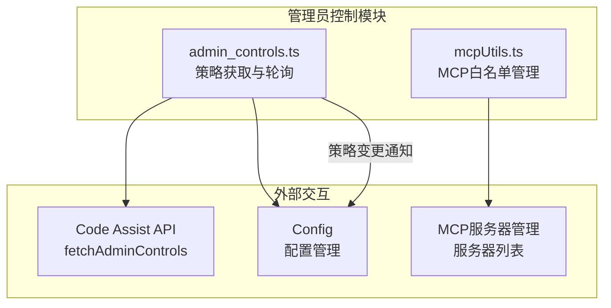
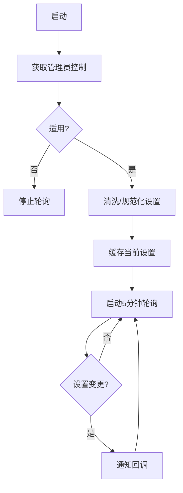

# code_assist/admin

## 概述

`admin` 子目录实现了 Gemini CLI 的管理员控制功能。它负责从 Code Assist API 获取组织级别的管理策略、定期轮询策略变更，以及管理 MCP 服务器的白名单和强制注入逻辑。管理员可以通过 Google Cloud 控制台配置这些策略，限制或控制 CLI 用户可以使用的 MCP 服务器和功能。

## 目录结构

```
admin/
├── admin_controls.ts       # 管理员控制策略获取、清洗和轮询
├── admin_controls.test.ts  # admin_controls 的单元测试
├── mcpUtils.ts             # MCP 服务器白名单过滤和强制服务器注入
└── mcpUtils.test.ts        # mcpUtils 的单元测试
```

## 架构图





## 核心组件

### `fetchAdminControls` (admin_controls.ts)
- **职责**: 从 Code Assist API 获取管理员控制设置并启动轮询
- **参数**: `server`, `cachedSettings`, `adminControlsEnabled`, `onSettingsChanged`
- **行为**:
  - 若有缓存设置，立即使用并在后台启动轮询
  - 否则发起 API 请求，仅在 `adminControlsApplicable=true` 时应用
  - 轮询间隔: 5 分钟
  - 使用 `isDeepStrictEqual` 检测变更，避免不必要的回调

### `fetchAdminControlsOnce` (admin_controls.ts)
- **职责**: 单次获取管理员控制设置（不启动轮询），用于特定场景

### `sanitizeAdminSettings` (admin_controls.ts)
- **职责**: 清洗和规范化服务器返回的原始设置
- **处理**:
  - 使用 Zod Schema 验证响应结构
  - 解析嵌套的 `mcpConfigJson` JSON 字符串
  - 排序 `includeTools`/`excludeTools` 以确保稳定比较
  - 处理 `secureModeEnabled` 到 `strictModeDisabled` 的向后兼容
  - 为缺失字段设置默认值

### `getAdminErrorMessage` / `getAdminBlockedMcpServersMessage` (admin_controls.ts)
- **职责**: 生成标准化的管理员策略限制错误消息

### `applyAdminAllowlist` (mcpUtils.ts)
- **职责**: 将管理员白名单应用到本地 MCP 服务器配置
- **行为**:
  - 若白名单为空，返回所有本地服务器
  - 否则仅保留白名单中的服务器，使用管理员的 `url`/`type`/`trust` 覆盖本地配置
  - 移除本地执行配置 (`command`, `args`, `env`, `cwd`)
  - 返回被阻止的服务器名称列表

### `applyRequiredServers` (mcpUtils.ts)
- **职责**: 注入管理员强制要求的 MCP 服务器
- **行为**:
  - 强制服务器完全覆盖同名本地配置
  - 默认信任 (`trust: true`)
  - 支持 OAuth、目标受众、服务账号等认证配置

## 依赖关系

### 内部依赖
- `../server.js` - `CodeAssistServer` 类型
- `../types.js` - `AdminControlsSettings`, `FetchAdminControlsResponse` 等类型和 Zod Schema
- `../codeAssist.js` - `getCodeAssistServer` 获取服务器实例
- `../../config/config.js` - `Config` 和 `MCPServerConfig`
- `../../utils/debugLogger.js` - 调试日志

### 外部依赖
- `node:util` - `isDeepStrictEqual` 深比较

## 数据流

### 管理员控制应用流程
1. CLI 启动时调用 `fetchAdminControls()` 获取组织策略
2. 原始响应通过 `sanitizeAdminSettings()` 清洗规范化
3. 管理员设置应用到配置：
   - `strictModeDisabled` -> 控制安全模式
   - `mcpSetting.mcpEnabled` -> 控制 MCP 总开关
   - `mcpSetting.mcpConfig.mcpServers` -> MCP 服务器白名单
   - `mcpSetting.mcpConfig.requiredMcpServers` -> 强制 MCP 服务器
   - `cliFeatureSetting.extensionsEnabled` -> 扩展功能开关
4. `applyAdminAllowlist()` 过滤本地 MCP 服务器
5. `applyRequiredServers()` 注入管理员强制服务器
6. 每5分钟轮询一次，检测策略变更并通知上层
