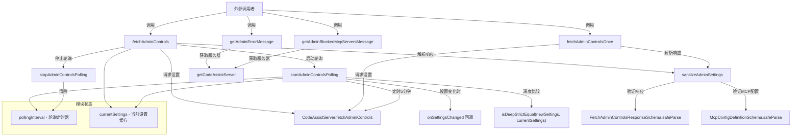

# admin_controls.ts

## 概述

`admin_controls.ts` 是 Gemini CLI 管理员控制模块的核心文件，负责从 CodeAssist 服务器获取、解析和轮询管理员控制设置（Admin Controls）。管理员可以通过后端配置来控制 CLI 的功能开关，包括严格模式（Strict Mode）、MCP 服务器配置、扩展功能开关等。该模块实现了定时轮询机制，当设置发生变化时会通过回调通知上层。

**文件路径**: `packages/core/src/code_assist/admin/admin_controls.ts`

## 架构图（Mermaid）



## 核心组件

### 1. 模块级状态变量

| 变量名 | 类型 | 说明 |
|--------|------|------|
| `pollingInterval` | `NodeJS.Timeout \| undefined` | 轮询定时器引用，用于控制轮询的启动和停止 |
| `currentSettings` | `AdminControlsSettings \| undefined` | 当前缓存的管理员设置，用于与新设置做深度比较 |

### 2. `sanitizeAdminSettings(settings)` -- 导出函数

**功能**: 清洗并标准化从服务器获取的原始管理员控制响应数据。

**处理流程**:
1. 使用 `FetchAdminControlsResponseSchema` 对原始响应做 Zod schema 验证（`safeParse`），验证失败则返回空对象 `{}`。
2. 如果存在 `mcpSetting.mcpConfigJson` 字符串字段，尝试 `JSON.parse` 解析为 JSON 对象，再使用 `McpConfigDefinitionSchema` 验证。
3. 对 MCP 服务器配置中的 `includeTools` 和 `excludeTools` 数组进行排序（`.sort()`），保证后续深度比较时的稳定性。
4. 处理 `strictModeDisabled` 的向后兼容逻辑：如果没有 `strictModeDisabled` 字段但有旧字段 `secureModeEnabled`，则通过取反进行映射。
5. 返回标准化后的 `AdminControlsSettings` 对象，包含默认值填充。

**返回值结构**:
```typescript
{
  strictModeDisabled: boolean,          // 是否禁用严格模式
  cliFeatureSetting: {
    extensionsSetting: {
      extensionsEnabled: boolean        // 是否启用扩展（默认 false）
    },
    unmanagedCapabilitiesEnabled: boolean // 是否启用非托管能力（默认 false）
  },
  mcpSetting: {
    mcpEnabled: boolean,                // 是否启用 MCP（默认 false）
    mcpConfig: object,                  // MCP 配置
    requiredMcpConfig: object | undefined // 必须的 MCP 服务器配置
  }
}
```

### 3. `fetchAdminControls(server, cachedSettings, adminControlsEnabled, onSettingsChanged)` -- 导出异步函数

**功能**: 获取管理员控制设置的主入口函数，支持缓存和轮询。

**参数**:
| 参数 | 类型 | 说明 |
|------|------|------|
| `server` | `CodeAssistServer \| undefined` | CodeAssist 服务器实例 |
| `cachedSettings` | `AdminControlsSettings \| undefined` | 缓存的设置（如来自 IPC 重启传递） |
| `adminControlsEnabled` | `boolean` | 管理员控制功能是否启用（实验标记） |
| `onSettingsChanged` | `(settings: AdminControlsSettings) => void` | 设置变化时的回调 |

**逻辑**:
1. 如果 `server`、`server.projectId` 或 `adminControlsEnabled` 任一不满足，停止轮询并返回空对象。
2. 如果存在非空的 `cachedSettings`，直接使用缓存（避免阻塞启动），同时启动后台轮询。
3. 否则调用 `server.fetchAdminControls()` 获取设置，如果 `adminControlsApplicable !== true` 则停止轮询返回空。
4. 成功获取后清洗设置，更新 `currentSettings`，启动轮询并返回。

### 4. `fetchAdminControlsOnce(server, adminControlsEnabled)` -- 导出异步函数

**功能**: 单次获取管理员控制设置，不启动轮询。适用于仅需一次性读取设置的场景。

**逻辑**: 与 `fetchAdminControls` 类似，但不涉及轮询和缓存管理。

### 5. `startAdminControlsPolling(server, project, onSettingsChanged)` -- 内部函数

**功能**: 启动管理员控制的定时轮询。

**轮询间隔**: 5 分钟（`5 * 60 * 1000` 毫秒）

**逻辑**:
1. 先调用 `stopAdminControlsPolling()` 清理已有的轮询。
2. 使用 `setInterval` 定时调用 `server.fetchAdminControls()`。
3. 获取新设置后使用 `isDeepStrictEqual` 与 `currentSettings` 深度比较。
4. 如果设置发生变化，更新 `currentSettings` 并调用 `onSettingsChanged` 回调。

### 6. `stopAdminControlsPolling()` -- 导出函数

**功能**: 停止轮询，清除定时器引用。

### 7. `getAdminErrorMessage(featureName, config)` -- 导出函数

**功能**: 生成管理员禁用某功能时的标准化错误消息，包含管理设置的 URL 链接（`https://goo.gle/manage-gemini-cli`），并附带可选的 `project` 查询参数。

### 8. `getAdminBlockedMcpServersMessage(blockedServers, config)` -- 导出函数

**功能**: 生成 MCP 服务器被管理员白名单阻止时的标准化错误消息。根据被阻止的服务器数量动态调整单复数语法（`server is` vs `servers are`）。

## 依赖关系

### 内部依赖

| 模块路径 | 导入内容 | 用途 |
|----------|----------|------|
| `../server.js` | `CodeAssistServer` (类型) | CodeAssist 服务器实例类型，用于调用 `fetchAdminControls` API |
| `../../utils/debugLogger.js` | `debugLogger` | 调试日志记录器，用于记录错误信息 |
| `../types.js` | `FetchAdminControlsResponse`, `FetchAdminControlsResponseSchema`, `McpConfigDefinitionSchema`, `AdminControlsSettings` | 类型定义和 Zod 验证 Schema |
| `../codeAssist.js` | `getCodeAssistServer` | 根据配置获取 CodeAssist 服务器实例 |
| `../../config/config.js` | `Config` (类型) | 应用配置类型 |

### 外部依赖

| 包名 | 导入内容 | 用途 |
|------|----------|------|
| `node:util` | `isDeepStrictEqual` | Node.js 内置工具，用于深度比较两个设置对象是否完全相等，避免不必要的回调触发 |

## 关键实现细节

1. **轮询机制**: 采用 `setInterval` 实现 5 分钟间隔的定时轮询。每次启动新轮询前必定先清理旧的，避免重复轮询。轮询通过模块级变量 `pollingInterval` 追踪。

2. **变更检测**: 使用 Node.js 原生的 `isDeepStrictEqual` 做深度比较，只有设置真正发生变化时才触发 `onSettingsChanged` 回调，避免不必要的重新配置。

3. **工具列表排序**: 在 `sanitizeAdminSettings` 中对 `includeTools` 和 `excludeTools` 数组执行排序，确保无论服务端返回的顺序如何，相同内容的配置在深度比较时不会被误判为不同。

4. **向后兼容**: `strictModeDisabled` 字段支持旧版本的 `secureModeEnabled` 字段（通过布尔取反映射），保证 API 演进的平滑过渡。

5. **缓存优化**: `fetchAdminControls` 支持传入 `cachedSettings`（例如通过 IPC 在进程重启时传递），有缓存时直接使用，避免阻塞启动流程，同时仍启动后台轮询以确保设置的最终一致性。

6. **Zod Schema 验证**: 使用 `safeParse` 而非 `parse`，在验证失败时不会抛出异常，而是优雅地回退到默认空设置，保证系统健壮性。

7. **错误处理**: 轮询过程中的错误仅记录日志不中断轮询；但 `fetchAdminControls` 和 `fetchAdminControlsOnce` 中的错误会向上抛出，由调用者处理。

8. **URL 生成**: 错误消息中的管理链接会自动附带 `project` 查询参数（如果可用），方便管理员直接定位到正确的项目设置页面。
