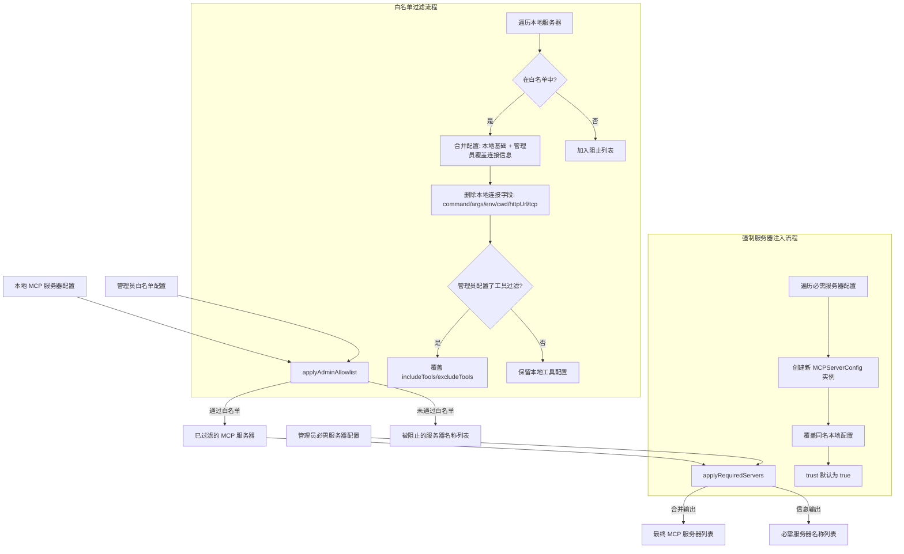

# mcpUtils.ts

## 概述

`mcpUtils.ts` 是管理员 MCP（Model Context Protocol）服务器配置的工具模块，提供两个核心函数用于在管理员控制层面管理 MCP 服务器配置。主要功能包括：

1. **白名单过滤**（`applyAdminAllowlist`）：根据管理员白名单过滤本地配置的 MCP 服务器，只保留被允许的服务器，并将连接信息替换为管理员指定的配置。
2. **强制服务器注入**（`applyRequiredServers`）：将管理员要求的必需 MCP 服务器注入到服务器列表中，这些服务器始终优先于本地同名配置，用户无法禁用。

**文件路径**: `packages/core/src/code_assist/admin/mcpUtils.ts`

## 架构图（Mermaid）



## 核心组件

### 1. `applyAdminAllowlist(localMcpServers, adminAllowlist)` -- 导出函数

**功能**: 应用管理员白名单过滤本地 MCP 服务器配置。

**参数**:
| 参数 | 类型 | 说明 |
|------|------|------|
| `localMcpServers` | `Record<string, MCPServerConfig>` | 本地配置的 MCP 服务器映射表 |
| `adminAllowlist` | `Record<string, MCPServerConfig> \| undefined` | 管理员白名单配置 |

**返回值**:
```typescript
{
  mcpServers: Record<string, MCPServerConfig>;  // 过滤并合并后的服务器
  blockedServerNames: string[];                  // 被白名单阻止的服务器名称
}
```

**详细逻辑**:

1. **空白名单处理**: 如果 `adminAllowlist` 为 `undefined` 或空对象，直接返回所有本地服务器，不做任何过滤。
2. **逐个遍历本地服务器**: 对 `localMcpServers` 中的每个服务器，检查其 ID 是否存在于白名单中。
3. **白名单匹配 -- 合并配置**:
   - 以本地配置为基础（spread operator），保留本地独有的字段。
   - 用管理员配置覆盖连接信息字段：`url`、`type`、`trust`。
   - **删除本地连接相关字段**：`command`、`args`、`env`、`cwd`、`httpUrl`、`tcp`。这意味着管理员白名单中的服务器不支持本地 stdio 模式，必须使用管理员指定的远程连接方式。
   - 如果管理员配置了 `includeTools` 或 `excludeTools`（且非空数组），则用管理员的工具过滤配置覆盖本地的。
4. **白名单未匹配**: 将服务器 ID 加入 `blockedServerNames` 列表。

### 2. `applyRequiredServers(mcpServers, requiredServers)` -- 导出函数

**功能**: 将管理员强制要求的 MCP 服务器注入到服务器列表中。

**参数**:
| 参数 | 类型 | 说明 |
|------|------|------|
| `mcpServers` | `Record<string, MCPServerConfig>` | 当前的 MCP 服务器（通常已经过白名单过滤） |
| `requiredServers` | `Record<string, RequiredMcpServerConfig> \| undefined` | 管理员要求的必需服务器配置 |

**返回值**:
```typescript
{
  mcpServers: Record<string, MCPServerConfig>;  // 注入必需服务器后的列表
  requiredServerNames: string[];                 // 必需服务器的名称列表
}
```

**详细逻辑**:

1. **空检查**: 如果 `requiredServers` 为 `undefined` 或空对象，直接返回原列表。
2. **浅拷贝**: 先对 `mcpServers` 做浅拷贝（`{ ...mcpServers }`），避免修改原始对象。
3. **逐个注入**: 遍历 `requiredServers`，为每个必需服务器创建新的 `MCPServerConfig` 实例。
4. **完全覆盖**: 如果本地存在同名服务器，必需服务器会完全替代它（不做合并）。
5. **MCPServerConfig 构造参数映射**:
   - `command`/`args`/`env`/`cwd` 设为 `undefined`（必需服务器不支持 stdio 模式）
   - `url` 来自管理员配置
   - `headers` 来自管理员配置（支持自定义 HTTP 头）
   - `trust` 默认为 `true`（管理员强制的服务器默认被信任）
   - 支持 `timeout`、`description`、`includeTools`、`excludeTools` 等字段
   - 支持认证相关字段：`oauth`、`authProviderType`、`targetAudience`、`targetServiceAccount`

## 依赖关系

### 内部依赖

| 模块路径 | 导入内容 | 用途 |
|----------|----------|------|
| `../../config/config.js` | `MCPServerConfig` | MCP 服务器配置类，用于创建和操作服务器配置实例 |
| `../types.js` | `RequiredMcpServerConfig` (类型) | 必需 MCP 服务器配置的类型定义 |

### 外部依赖

无外部第三方依赖。本模块仅使用 TypeScript 原生语法。

## 关键实现细节

1. **安全优先的连接控制**: `applyAdminAllowlist` 在合并配置时会删除所有本地连接字段（`command`、`args`、`env`、`cwd`、`httpUrl`、`tcp`），确保白名单中的服务器只能通过管理员指定的 `url`/`type` 方式连接。这防止了本地配置绕过管理员的安全策略（例如用户在本地配置了一个直接执行命令的 stdio 服务器）。

2. **工具过滤的条件覆盖**: 管理员的 `includeTools`/`excludeTools` 仅在管理员明确配置了非空数组时才覆盖本地配置。如果管理员没有配置工具过滤，则保留本地的工具过滤设置，给予本地配置更多灵活性。

3. **必需服务器的完全覆盖语义**: `applyRequiredServers` 对同名服务器采用完全替代而非合并策略，创建全新的 `MCPServerConfig` 实例。这保证了管理员强制服务器的配置完整性不受本地配置污染。

4. **信任默认值**: 必需服务器的 `trust` 默认为 `true`（通过 `requiredConfig.trust ?? true`），因为管理员强制推送的服务器应当被视为可信来源。白名单服务器的 `trust` 则直接使用管理员配置值。

5. **处理流水线设计**: 两个函数设计为可串联使用：先用 `applyAdminAllowlist` 过滤白名单，再用 `applyRequiredServers` 注入必需服务器。这种流水线设计使逻辑清晰且可独立测试。

6. **不可变性**: `applyRequiredServers` 通过浅拷贝 `{ ...mcpServers }` 创建新对象，不修改传入的原始对象。`applyAdminAllowlist` 则创建全新的 `filteredMcpServers` 对象，同样不修改原始输入。
