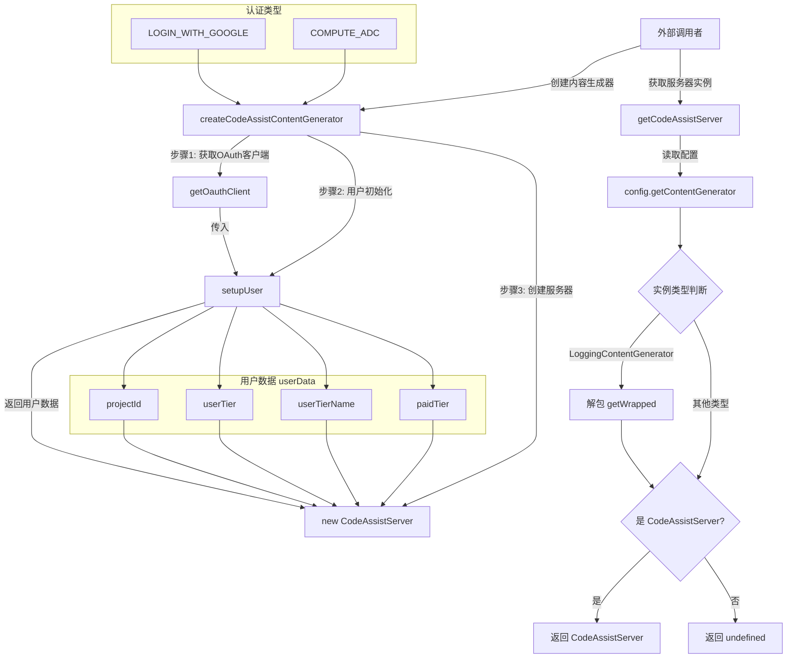

# codeAssist.ts

## 概述

`codeAssist.ts` 是 CodeAssist 模块的入口工厂文件，提供两个核心函数：

1. **`createCodeAssistContentGenerator`**: 工厂函数，根据认证类型创建 `ContentGenerator` 实例（实际为 `CodeAssistServer`），负责完成 OAuth 认证和用户初始化流程。
2. **`getCodeAssistServer`**: 工具函数，从应用配置中提取当前的 `CodeAssistServer` 实例，支持解包 `LoggingContentGenerator` 装饰器。

这个文件是整个 CodeAssist 功能的组装入口，将认证（OAuth）、用户设置（Setup）和服务器通信（Server）三个子模块串联起来。

**文件路径**: `packages/core/src/code_assist/codeAssist.ts`

## 架构图（Mermaid）

## 核心组件

### 1. `createCodeAssistContentGenerator(httpOptions, authType, config, sessionId?)` -- 导出异步函数

**功能**: 创建并初始化一个 `ContentGenerator` 实例用于与 CodeAssist 后端通信。

**参数**:
| 参数 | 类型 | 必填 | 说明 |
|------|------|------|------|
| `httpOptions` | `HttpOptions` | 是 | HTTP 请求配置选项 |
| `authType` | `AuthType` | 是 | 认证类型枚举 |
| `config` | `Config` | 是 | 应用配置对象 |
| `sessionId` | `string` | 否 | 可选的会话标识符 |

**返回值**: `Promise<ContentGenerator>` -- 返回一个 `CodeAssistServer` 实例（实现了 `ContentGenerator` 接口）。

**支持的认证类型**:
- `AuthType.LOGIN_WITH_GOOGLE`: Google 登录认证
- `AuthType.COMPUTE_ADC`: Compute ADC（应用默认凭据）认证

**执行流程**:
1. 检查 `authType` 是否为支持的认证类型之一。
2. 调用 `getOauthClient(authType, config)` 获取 OAuth 客户端。
3. 调用 `setupUser(authClient, config, httpOptions)` 完成用户初始化，获取用户数据（`projectId`、`userTier`、`userTierName`、`paidTier`）。
4. 使用上述数据创建 `CodeAssistServer` 实例并返回。
5. 如果 `authType` 不受支持，抛出错误。

### 2. `getCodeAssistServer(config)` -- 导出函数

**功能**: 从应用配置中安全地提取 `CodeAssistServer` 实例。

**参数**:
| 参数 | 类型 | 说明 |
|------|------|------|
| `config` | `Config` | 应用配置对象 |

**返回值**: `CodeAssistServer | undefined` -- 如果当前内容生成器是 `CodeAssistServer` 则返回它，否则返回 `undefined`。

**逻辑**:
1. 通过 `config.getContentGenerator()` 获取当前的内容生成器。
2. 如果获取到的是 `LoggingContentGenerator`（日志装饰器包装），则调用 `getWrapped()` 解包获取内部的实际生成器。
3. 使用 `instanceof` 检查是否为 `CodeAssistServer` 实例，是则返回，否则返回 `undefined`。

## 依赖关系

### 内部依赖

| 模块路径 | 导入内容 | 用途 |
|----------|----------|------|
| `../core/contentGenerator.js` | `AuthType` (枚举), `ContentGenerator` (类型) | 认证类型枚举和内容生成器接口定义 |
| `./oauth2.js` | `getOauthClient` | 根据认证类型获取 OAuth 客户端实例 |
| `./setup.js` | `setupUser` | 执行用户初始化流程，返回项目 ID 和用户层级信息 |
| `./server.js` | `CodeAssistServer` (类), `HttpOptions` (类型) | CodeAssist 服务器类和 HTTP 选项类型 |
| `../config/config.js` | `Config` (类型) | 应用配置类型 |
| `../core/loggingContentGenerator.js` | `LoggingContentGenerator` | 日志装饰器生成器类，用于 `getCodeAssistServer` 中的解包逻辑 |

### 外部依赖

无外部第三方依赖。

## 关键实现细节

1. **工厂模式**: `createCodeAssistContentGenerator` 是典型的工厂函数，封装了 `CodeAssistServer` 的复杂创建过程（认证 + 用户初始化 + 实例化），对外仅暴露 `ContentGenerator` 接口，实现了依赖倒置。

2. **装饰器解包**: `getCodeAssistServer` 中处理了 `LoggingContentGenerator` 装饰器模式。由于系统可能在 `CodeAssistServer` 外层包裹了日志装饰器，需要先解包才能获取到底层的服务器实例。这是装饰器模式在实际使用中的常见处理。

3. **严格认证类型检查**: 只支持 `LOGIN_WITH_GOOGLE` 和 `COMPUTE_ADC` 两种认证类型，对不支持的类型直接抛出异常，实现了 fail-fast 策略。

4. **类型安全**: `getCodeAssistServer` 返回 `CodeAssistServer | undefined`，使用 `instanceof` 做运行时类型检查，确保调用者能安全处理非 CodeAssist 后端的情况（例如使用其他 AI 提供商时）。

5. **用户数据透传**: `setupUser` 返回的用户数据（`projectId`、`userTier`、`userTierName`、`paidTier`）全部透传给 `CodeAssistServer` 构造函数，这些数据影响服务器端的请求路由和配额管理。
