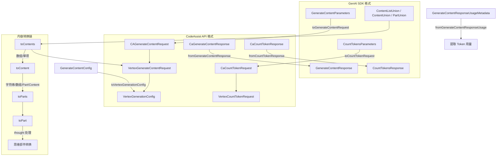

# converter.ts

## 概述

`converter.ts` 是 CodeAssist 模块的数据格式转换器，负责在 Google GenAI SDK 标准格式（`@google/genai`）和 CodeAssist 自定义 API 格式（Vertex AI 风格）之间进行双向转换。该文件是 CodeAssist 服务器与 Gemini API 通信的数据适配层，处理了请求的序列化和响应的反序列化，包括内容（Content）、部件（Part）、生成配置（GenerationConfig）以及 Token 计数等数据结构的转换。

**文件路径**: `packages/core/src/code_assist/converter.ts`

## 架构图（Mermaid）

## 核心组件

### 接口定义

#### 1. `CAGenerateContentRequest` -- 导出接口

CodeAssist 内容生成请求的顶层结构。

| 字段 | 类型 | 说明 |
|------|------|------|
| `model` | `string` | 模型名称 |
| `project` | `string?` | 项目 ID |
| `user_prompt_id` | `string?` | 用户提示 ID（用于追踪） |
| `request` | `VertexGenerateContentRequest` | Vertex AI 格式的实际请求体 |
| `enabled_credit_types` | `string[]?` | 启用的积分类型 |

#### 2. `VertexGenerateContentRequest` -- 内部接口

Vertex AI 风格的内容生成请求。

| 字段 | 类型 | 说明 |
|------|------|------|
| `contents` | `Content[]` | 对话内容列表 |
| `systemInstruction` | `Content?` | 系统指令 |
| `cachedContent` | `string?` | 缓存内容引用 |
| `tools` | `ToolListUnion?` | 工具列表 |
| `toolConfig` | `ToolConfig?` | 工具配置 |
| `labels` | `Record<string, string>?` | 标签 |
| `safetySettings` | `SafetySetting[]?` | 安全设置 |
| `generationConfig` | `VertexGenerationConfig?` | 生成配置 |
| `session_id` | `string?` | 会话 ID |

#### 3. `VertexGenerationConfig` -- 内部接口

Vertex AI 风格的生成配置，包含所有模型参数。

| 字段 | 类型 | 说明 |
|------|------|------|
| `temperature` | `number?` | 采样温度 |
| `topP` | `number?` | Top-P 核采样 |
| `topK` | `number?` | Top-K 采样 |
| `candidateCount` | `number?` | 候选数量 |
| `maxOutputTokens` | `number?` | 最大输出 Token 数 |
| `stopSequences` | `string[]?` | 停止序列 |
| `responseLogprobs` | `boolean?` | 是否返回对数概率 |
| `logprobs` | `number?` | 对数概率数量 |
| `presencePenalty` | `number?` | 存在惩罚 |
| `frequencyPenalty` | `number?` | 频率惩罚 |
| `seed` | `number?` | 随机种子 |
| `responseMimeType` | `string?` | 响应 MIME 类型 |
| `responseJsonSchema` | `unknown?` | 响应 JSON Schema |
| `responseSchema` | `unknown?` | 响应 Schema |
| `routingConfig` | `GenerationConfigRoutingConfig?` | 路由配置 |
| `modelSelectionConfig` | `ModelSelectionConfig?` | 模型选择配置 |
| `responseModalities` | `string[]?` | 响应模态列表 |
| `mediaResolution` | `MediaResolution?` | 媒体分辨率 |
| `speechConfig` | `SpeechConfigUnion?` | 语音配置 |
| `audioTimestamp` | `boolean?` | 音频时间戳 |
| `thinkingConfig` | `ThinkingConfig?` | 思维链配置 |

#### 4. `CaGenerateContentResponse` -- 导出接口

CodeAssist 内容生成响应。

| 字段 | 类型 | 说明 |
|------|------|------|
| `response` | `VertexGenerateContentResponse?` | Vertex AI 格式的响应体 |
| `traceId` | `string?` | 追踪 ID |
| `consumedCredits` | `Credits[]?` | 消耗的积分 |
| `remainingCredits` | `Credits[]?` | 剩余的积分 |

#### 5. `CaCountTokenRequest` / `CaCountTokenResponse` -- 导出接口

Token 计数的请求和响应结构。

### 转换函数

#### 6. `toCountTokenRequest(req)` -- 导出函数

**功能**: 将 GenAI SDK 的 `CountTokensParameters` 转换为 CodeAssist 的 `CaCountTokenRequest`。

**注意**: 模型名称会加上 `models/` 前缀。

#### 7. `fromCountTokenResponse(res)` -- 导出函数

**功能**: 将 CodeAssist 的 `CaCountTokenResponse` 转换为 GenAI SDK 的 `CountTokensResponse`。

**特殊处理**: 如果 `totalTokens` 未返回，记录警告日志并默认为 0。

#### 8. `toGenerateContentRequest(req, userPromptId, project?, sessionId?, enabledCreditTypes?)` -- 导出函数

**功能**: 将 GenAI SDK 的 `GenerateContentParameters` 转换为 CodeAssist 的 `CAGenerateContentRequest`。

**参数**:
| 参数 | 类型 | 说明 |
|------|------|------|
| `req` | `GenerateContentParameters` | GenAI SDK 请求参数 |
| `userPromptId` | `string` | 用户提示 ID |
| `project` | `string?` | 项目 ID |
| `sessionId` | `string?` | 会话 ID |
| `enabledCreditTypes` | `string[]?` | 启用的积分类型 |

#### 9. `fromGenerateContentResponse(res)` -- 导出函数

**功能**: 将 CodeAssist 的 `CaGenerateContentResponse` 转换为 GenAI SDK 的 `GenerateContentResponse`。

**处理逻辑**:
1. 创建新的 `GenerateContentResponse` 实例。
2. 将 `traceId` 映射到 `responseId`。
3. 如果 `response` 为空，设 `candidates` 为空数组。
4. 映射 `candidates`、`automaticFunctionCallingHistory`、`promptFeedback`、`usageMetadata`、`modelVersion`。

#### 10. `toContents(contents)` -- 导出函数

**功能**: 将 `ContentListUnion`（灵活的内容输入格式）标准化为 `Content[]` 数组。

**处理**: 如果输入是数组，逐个转换；否则包装为单元素数组。

#### 11. `toContent(content)` -- 内部函数

**功能**: 将 `ContentUnion`（字符串、数组、Part、Content 等多种格式）转换为标准 `Content` 对象。

**类型分支处理**:
| 输入类型 | 处理方式 |
|----------|----------|
| `string` | 包装为 `{ role: 'user', parts: [{ text: content }] }` |
| `PartsUnion[]` (数组) | 包装为 `{ role: 'user', parts: toParts(content) }` |
| `Content` (含 parts/role) | 保留原始结构，对 parts 做转换，过滤 `null` 部件 |
| `PartUnion` (单个部件) | 包装为 `{ role: 'user', parts: [toPart(content)] }` |

#### 12. `toParts(parts)` -- 导出函数

**功能**: 批量转换 `PartUnion[]` 为 `Part[]`。

#### 13. `toPart(part)` -- 内部函数

**功能**: 将单个 `PartUnion` 转换为 `Part`，包含思维部件（thought）的特殊处理。

**思维部件处理逻辑** (关键):
1. 如果部件包含 `thought` 属性且为 `true`，进入特殊处理分支。
2. 克隆部件并删除 `thought` 属性。
3. 检查是否包含 API 可识别的内容（`functionCall`、`functionResponse`、`inlineData`、`fileData`）：
   - **有 API 内容**: 直接去除 thought 标记返回（保留 functionCall 等）。
   - **无 API 内容（纯文本思维）**: 将思维内容转为 `[Thought: ...]` 格式文本，与现有文本合并。

**设计原因**: CountToken API 要求 parts 必须有特定的 "oneof" 字段初始化，但 thought 部件不符合此 schema，直接发送会导致 API 错误。

#### 14. `toVertexGenerationConfig(config?)` -- 内部函数

**功能**: 将 GenAI SDK 的 `GenerateContentConfig` 转换为 `VertexGenerationConfig`。逐字段映射所有生成参数。

#### 15. `fromGenerateContentResponseUsage(metadata?)` -- 导出函数

**功能**: 提取并标准化使用量元数据，仅保留 `promptTokenCount`、`candidatesTokenCount`、`totalTokenCount` 三个字段。

## 依赖关系

### 内部依赖

| 模块路径 | 导入内容 | 用途 |
|----------|----------|------|
| `../utils/debugLogger.js` | `debugLogger` | 调试日志记录器，用于在 Token 计数响应缺失时记录警告 |
| `./types.js` | `Credits` (类型) | 积分数据类型，用于响应中的积分信息 |

### 外部依赖

| 包名 | 导入内容 | 用途 |
|------|----------|------|
| `@google/genai` | `GenerateContentResponse`, `Content`, `ContentListUnion`, `ContentUnion`, `GenerateContentConfig`, `GenerateContentParameters`, `CountTokensParameters`, `CountTokensResponse`, `GenerationConfigRoutingConfig`, `MediaResolution`, `Candidate`, `ModelSelectionConfig`, `GenerateContentResponsePromptFeedback`, `GenerateContentResponseUsageMetadata`, `Part`, `SafetySetting`, `PartUnion`, `SpeechConfigUnion`, `ThinkingConfig`, `ToolListUnion`, `ToolConfig` | Google GenAI SDK 的类型和类定义，是转换的源/目标格式 |

## 关键实现细节

1. **适配器模式**: 整个文件是经典的适配器（Adapter）模式实现，在 GenAI SDK 公共接口和 CodeAssist 私有 API 之间做格式桥接。`to*` 函数将 SDK 格式转为 API 格式（请求方向），`from*` 函数将 API 格式转为 SDK 格式（响应方向）。

2. **思维部件的兼容处理**: `toPart` 函数中对 `thought` 部件的处理是最复杂的逻辑。Gemini 模型可能返回带有 `thought: true` 标记的部件（思维链推理），但 CountToken API 不支持这种格式。转换器将 thought 标记去除，并将思维内容转为 `[Thought: ...]` 格式的文本嵌入到 text 字段中，或在有其他 API 内容时直接丢弃 thought 标记。

3. **联合类型的多态处理**: `toContent` 函数需要处理 `ContentUnion` 的多种可能类型（字符串、数组、Part 对象、Content 对象），使用类型守卫（`isPart`）和类型检查链（`Array.isArray`、`typeof`）逐步分辨具体类型。

4. **类型守卫 `isPart`**: 通过排除法判断对象是否为 `PartUnion`：是对象、非 null、非数组、不含 `parts` 字段、不含 `role` 字段。这种负向判断是因为 `PartUnion` 没有唯一的标识字段。

5. **null 过滤**: 在 `toContent` 处理 `Content` 类型时，对 `parts` 数组执行 `filter((p) => p != null)` 过滤空值，防止 null/undefined 部件传递到 API。

6. **模型名称前缀**: `toCountTokenRequest` 中自动为模型名称添加 `models/` 前缀，适配 Vertex AI 的模型路径格式。

7. **积分追踪**: `CaGenerateContentResponse` 包含 `consumedCredits` 和 `remainingCredits` 字段，用于追踪 API 调用的积分消耗和剩余，但这些字段在 `fromGenerateContentResponse` 中不会映射到 SDK 响应（属于 CodeAssist 专有功能）。

8. **traceId 映射**: CodeAssist API 返回的 `traceId` 被映射到 GenAI SDK 的 `responseId`，保持请求可追溯性。
