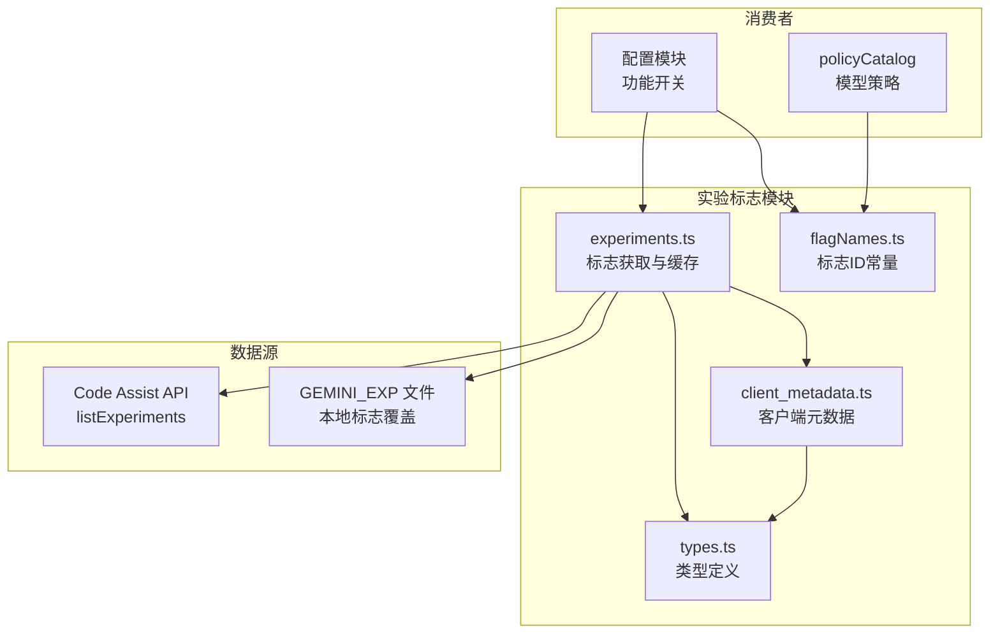

# code_assist/experiments

## 概述

`experiments` 子目录实现了 Gemini CLI 的实验标志 (Feature Flag) 系统。它负责从 Code Assist API 获取服务端下发的实验标志、收集客户端元数据，并提供实验标志的查询接口。该模块支持灰度发布和 A/B 测试，使服务端能够动态控制客户端行为。

## 目录结构

```
experiments/
├── client_metadata.ts          # 客户端元数据收集（平台、版本、渠道等）
├── client_metadata.test.ts     # client_metadata 的单元测试
├── experiments.ts              # 实验标志获取与缓存
├── experiments.test.ts         # experiments 的单元测试
├── experiments_local.test.ts   # 本地实验标志文件测试
├── flagNames.ts                # 实验标志 ID 常量定义
└── types.ts                    # 类型定义（请求/响应/标志结构）
```

## 架构图



## 核心组件

### `getExperiments` (experiments.ts)
- **职责**: 获取并缓存实验标志
- **数据源优先级**:
  1. `GEMINI_EXP` 环境变量指向的本地 JSON 文件（用于开发/测试）
  2. Code Assist API 的 `listExperiments` 端点
- **缓存**: 整个会话仅获取一次，通过 Promise 单例缓存
- **返回**: `Experiments` 对象，包含 `flags` (按 flagId 索引的 Record) 和 `experimentIds` (数组)

### `getClientMetadata` (client_metadata.ts)
- **职责**: 收集客户端环境元数据，用于实验标志的分组分配
- **收集内容**:
  - `ideName` - IDE 名称（默认 `'IDE_UNSPECIFIED'`）
  - `pluginType` - 插件类型（固定为 `'GEMINI'`）
  - `ideVersion` - CLI 版本号
  - `platform` - 操作系统/架构（如 `'DARWIN_ARM64'`, `'LINUX_AMD64'`）
  - `updateChannel` - 发布渠道
- **缓存**: 元数据计算一次后缓存

### `ExperimentFlags` (flagNames.ts)
- **职责**: 定义所有实验标志的数值 ID 常量
- **当前标志**:

| 标志名 | ID | 用途 |
|--------|----|------|
| `CONTEXT_COMPRESSION_THRESHOLD` | 45740197 | 上下文压缩阈值 |
| `USER_CACHING` | 45740198 | 用户缓存 |
| `BANNER_TEXT_NO_CAPACITY_ISSUES` | 45740199 | 无容量问题时的横幅文本 |
| `BANNER_TEXT_CAPACITY_ISSUES` | 45740200 | 有容量问题时的横幅文本 |
| `ENABLE_PREVIEW` | 45740196 | 启用预览模型 |
| `ENABLE_NUMERICAL_ROUTING` | 45750526 | 启用数值路由 |
| `CLASSIFIER_THRESHOLD` | 45750527 | 分类器阈值 |
| `ENABLE_ADMIN_CONTROLS` | 45752213 | 启用管理员控制 |
| `MASKING_PROTECTION_THRESHOLD` | 45758817 | 掩码保护阈值 |
| `MASKING_PRUNABLE_THRESHOLD` | 45758818 | 可修剪掩码阈值 |
| `MASKING_PROTECT_LATEST_TURN` | 45758819 | 掩码保护最新轮次 |
| `GEMINI_3_1_PRO_LAUNCHED` | 45760185 | Gemini 3.1 Pro 已上线 |
| `PRO_MODEL_NO_ACCESS` | 45768879 | Pro 模型无访问权限 |
| `GEMINI_3_1_FLASH_LITE_LAUNCHED` | 45771641 | Gemini 3.1 Flash Lite 已上线 |

### 类型定义 (types.ts)

#### `ListExperimentsRequest/Response`
- `ListExperimentsRequest` - 包含项目ID和客户端元数据
- `ListExperimentsResponse` - 包含实验ID列表、标志列表和调试字符串

#### `Flag`
实验标志的值结构，支持多种值类型：
- `boolValue` - 布尔值
- `floatValue` - 浮点值
- `intValue` - 整数值 (int64 字符串)
- `stringValue` - 字符串值
- `int32ListValue` - 整数列表
- `stringListValue` - 字符串列表

## 依赖关系

### 内部依赖
- `../server.js` - `CodeAssistServer` (调用 `listExperiments` API)
- `../types.js` - `ClientMetadata` 类型
- `../../utils/channel.js` - 获取发布渠道
- `../../utils/version.js` - 获取 CLI 版本
- `../../utils/debugLogger.js` - 调试日志

### 外部依赖
- `node:fs` - 读取本地实验标志文件
- `node:url` / `node:path` - 路径处理

## 数据流

### 实验标志获取流程
1. 系统初始化时首次调用 `getExperiments(server)`
2. 检查 `GEMINI_EXP` 环境变量，若设置则从本地文件读取
3. 否则调用 `getClientMetadata()` 收集客户端信息
4. 通过 `CodeAssistServer.listExperiments(metadata)` 请求服务端标志
5. `parseExperiments()` 将标志数组转换为按 flagId 索引的 Record
6. 结果缓存在 Promise 单例中，后续调用直接返回
7. 消费方通过 `flags[ExperimentFlags.FLAG_NAME]` 查询具体标志值
