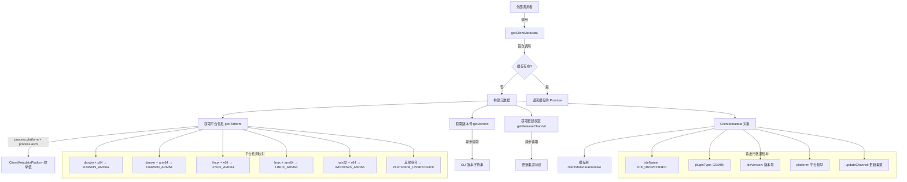

# client_metadata.ts

## 概述

`client_metadata.ts` 是客户端元数据收集模块，负责收集和缓存当前 CLI 客户端的运行环境信息，包括平台架构、IDE 类型、插件类型、版本号和更新渠道。这些元数据主要用于服务端的实验（Experiments）功能，帮助后端根据客户端特征进行功能标记（Feature Flags）的灰度发布和 A/B 测试。

**文件路径**: `packages/core/src/code_assist/experiments/client_metadata.ts`

## 架构图（Mermaid）

## 核心组件

### 1. 模块级变量

| 变量名 | 类型 | 说明 |
|--------|------|------|
| `__filename` | `string` | 当前模块的文件路径，通过 `fileURLToPath(import.meta.url)` 从 ESM URL 转换而来 |
| `__dirname` | `string` | 当前模块的目录路径，用于传递给 `getReleaseChannel` |
| `clientMetadataPromise` | `Promise<ClientMetadata> \| undefined` | 客户端元数据的缓存 Promise，确保只计算一次 |

### 2. `getPlatform()` -- 内部函数

**功能**: 检测当前运行平台和 CPU 架构，返回标准化的平台枚举值。

**返回值**: `ClientMetadataPlatform` 枚举

**平台映射表**:

| `process.platform` | `process.arch` | 返回值 |
|---------------------|----------------|--------|
| `darwin` | `x64` | `DARWIN_AMD64` |
| `darwin` | `arm64` | `DARWIN_ARM64` |
| `linux` | `x64` | `LINUX_AMD64` |
| `linux` | `arm64` | `LINUX_ARM64` |
| `win32` | `x64` | `WINDOWS_AMD64` |
| 其他任意组合 | 其他任意组合 | `PLATFORM_UNSPECIFIED` |

**注意**: 未覆盖的平台/架构组合（如 Windows ARM、FreeBSD 等）统一返回 `PLATFORM_UNSPECIFIED`。

### 3. `getClientMetadata()` -- 导出异步函数

**功能**: 获取客户端元数据，结果在首次调用后缓存，后续调用直接返回缓存的 Promise。

**返回值**: `Promise<ClientMetadata>` -- 包含以下字段：

| 字段 | 值/来源 | 说明 |
|------|---------|------|
| `ideName` | `'IDE_UNSPECIFIED'` | IDE 名称，CLI 环境下固定为未指定 |
| `pluginType` | `'GEMINI'` | 插件类型，固定为 GEMINI |
| `ideVersion` | `await getVersion()` | CLI 版本号，从版本工具异步获取 |
| `platform` | `getPlatform()` | 平台架构枚举，同步获取 |
| `updateChannel` | `await getReleaseChannel(__dirname)` | 更新渠道（如 stable、beta 等），异步获取 |

**缓存机制**: 使用 Promise 级别缓存（而非值级别缓存）。首次调用时创建 Promise 并赋值给 `clientMetadataPromise`，后续调用直接返回同一个 Promise。这种模式的优势是：
- 即使多个调用者同时请求，也只会执行一次异步计算
- 天然避免竞态条件
- 无需额外的锁或信号量

## 依赖关系

### 内部依赖

| 模块路径 | 导入内容 | 用途 |
|----------|----------|------|
| `../../utils/channel.js` | `getReleaseChannel` | 获取当前 CLI 的发布/更新渠道（如 stable、canary 等） |
| `../types.js` | `ClientMetadata` (类型), `ClientMetadataPlatform` (类型) | 客户端元数据和平台枚举的类型定义 |
| `../../utils/version.js` | `getVersion` | 获取当前 CLI 的版本号字符串 |

### 外部依赖

| 包名 | 导入内容 | 用途 |
|------|----------|------|
| `node:url` | `fileURLToPath` | 将 ESM 模块的 `import.meta.url`（file:// 协议 URL）转换为文件系统路径 |
| `node:path` | `path` (默认导入) | 路径操作工具，用于 `path.dirname` 提取目录路径 |

## 关键实现细节

1. **ESM 兼容的 `__dirname` 模拟**: 由于项目使用 ESM 模块系统，不再自动提供 CommonJS 的 `__filename` 和 `__dirname`。文件通过 `fileURLToPath(import.meta.url)` + `path.dirname()` 手动实现了等效的 `__dirname`，并将其传递给 `getReleaseChannel` 用于定位配置文件。

2. **Promise 级别缓存**: `clientMetadataPromise` 缓存的是 Promise 对象本身而非解析后的值。这是一种常见的异步单例模式，确保：
   - 首次调用时立即创建 Promise（IIFE 立即执行异步函数）
   - 多个并发调用者共享同一个 Promise，不会重复执行异步操作
   - 后续调用直接返回已解析的 Promise（微任务级别完成）

3. **固定值字段**: `ideName` 固定为 `'IDE_UNSPECIFIED'`，`pluginType` 固定为 `'GEMINI'`。这表明此文件专为 Gemini CLI 独立运行设计，不同于 IDE 插件场景（如 VS Code 插件可能会设置具体的 IDE 名称）。

4. **平台检测的有限覆盖**: 仅覆盖了 5 种常见的平台+架构组合（macOS x64/arm64、Linux x64/arm64、Windows x64），其余全部归类为 `PLATFORM_UNSPECIFIED`。未覆盖的组合包括 Windows ARM64、Linux x86 等较少见的环境。

5. **无清除机制**: `clientMetadataPromise` 一旦设置后没有清除或刷新的途径，元数据在整个进程生命周期内保持不变。这是合理的，因为平台、版本、渠道等信息在运行期间不会改变。

6. **实验功能支撑**: 此模块位于 `experiments` 目录下，其收集的元数据主要供服务端实验框架使用。服务端可以根据客户端的平台、版本和更新渠道等维度进行功能灰度或 A/B 测试分组。
