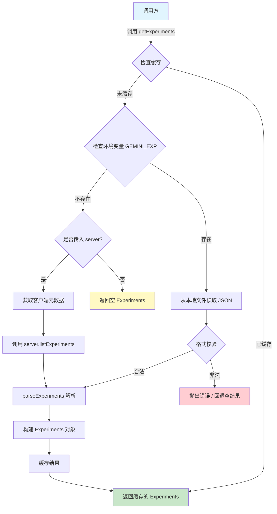

# experiments.ts

## 概述

`experiments.ts` 是 Gemini CLI 实验（Experiments）功能的核心模块，负责从服务端获取实验配置（Feature Flags 和实验 ID），并提供本地缓存机制以避免重复请求。该模块同时支持通过环境变量 `GEMINI_EXP` 从本地 JSON 文件加载实验配置，方便开发和调试。

实验系统是 Gemini CLI 的 A/B 测试和灰度发布基础设施的一部分，允许服务端动态控制客户端的功能开关。

## 架构图（Mermaid）



## 核心组件

### 1. `Experiments` 接口

```typescript
export interface Experiments {
  flags: Record<string, Flag>;
  experimentIds: number[];
}
```

| 字段 | 类型 | 说明 |
|------|------|------|
| `flags` | `Record<string, Flag>` | 以 `flagId` 为键、`Flag` 对象为值的字典，方便按名称快速查找 |
| `experimentIds` | `number[]` | 当前生效的实验 ID 列表 |

### 2. `getExperiments(server?)` 函数

**签名：** `async function getExperiments(server?: CodeAssistServer): Promise<Experiments>`

这是该模块的主入口函数，职责如下：

1. **缓存检查**：使用模块级变量 `experimentsPromise` 实现单例缓存。一旦首次调用成功，后续调用直接返回缓存的 Promise，保证整个进程生命周期内只请求一次。
2. **本地文件加载**：当环境变量 `GEMINI_EXP` 存在时，优先从该路径读取 JSON 文件作为实验配置。这是一个开发/调试友好的机制。
3. **格式校验**：读取本地文件后，会验证 `flags` 和 `experimentIds` 是否为数组，不合法时抛出异常。
4. **服务端获取**：当没有本地配置且传入了 `server` 参数时，通过 `getClientMetadata()` 获取客户端元信息，再调用 `server.listExperiments(metadata)` 从服务端拉取实验数据。
5. **降级处理**：如果既没有本地配置也没有 server，返回空的 Experiments 对象。

### 3. `parseExperiments(response)` 函数

**签名：** `function parseExperiments(response: ListExperimentsResponse): Experiments`

这是一个私有辅助函数，负责将服务端响应（或本地 JSON）转换为 `Experiments` 接口格式：

- 将 `flags` 数组转换为以 `flagId` 为键的字典（`Record<string, Flag>`），便于 O(1) 查找。
- 对 `flags` 和 `experimentIds` 做空值保护（`?? []`）。
- 过滤掉没有 `flagId` 的无效 flag 条目。

### 4. 模块级缓存变量

```typescript
let experimentsPromise: Promise<Experiments> | undefined;
```

使用 Promise 作为缓存值（而非解析后的结果），这意味着即使多个调用方在首次请求完成前并发调用 `getExperiments`，它们也会共享同一个 Promise，不会触发重复请求。这是一种常见的"Promise 缓存"模式。

## 依赖关系

### 内部依赖

| 模块 | 导入内容 | 说明 |
|------|----------|------|
| `../server.js` | `CodeAssistServer`（类型） | Code Assist 服务端通信接口，提供 `listExperiments` 方法 |
| `./client_metadata.js` | `getClientMetadata()` | 获取客户端元数据（如版本号、平台等），作为实验请求的参数 |
| `./types.js` | `ListExperimentsResponse`, `Flag`（类型） | 实验系统的类型定义 |
| `../../utils/debugLogger.js` | `debugLogger` | 调试日志工具，用于记录实验配置的加载过程 |

### 外部依赖

| 模块 | 说明 |
|------|------|
| `node:fs` | Node.js 文件系统模块，用于读取本地实验配置文件 |

## 关键实现细节

1. **Promise 缓存模式**：`experimentsPromise` 缓存的是 Promise 本身而非结果值。这保证了并发场景下只发起一次请求，多个调用方共享同一个异步结果。但需要注意，如果首次请求失败，缓存的 Promise 会永远 reject（虽然当前实现中本地文件读取失败会 catch 并尝试回退）。

2. **环境变量覆盖优先**：`GEMINI_EXP` 环境变量的优先级高于服务端请求。当该变量被设置时，即使传入了 server 参数，也会优先使用本地文件。这对于本地开发和测试非常有用。

3. **静默失败机制**：从本地文件加载失败时（`catch` 块），仅记录调试日志，不会中断流程。程序会继续尝试从服务端获取，或返回空实验配置。

4. **IIFE 模式**：`experimentsPromise` 的赋值使用了立即执行异步函数（`(async () => { ... })()`），这样可以在赋值的同时立即开始执行异步逻辑，确保缓存的 Promise 从创建时就开始"工作"。

5. **无效 flag 过滤**：`parseExperiments` 中通过 `if (flag.flagId)` 过滤掉缺少 `flagId` 的条目，增强了鲁棒性。

6. **缓存不可失效**：当前实现中没有提供清除缓存的机制（如 `resetExperiments()`），这意味着实验配置在整个进程生命周期内是不可变的。这对 CLI 工具来说是合理的，因为 CLI 通常是短生命周期的进程。
