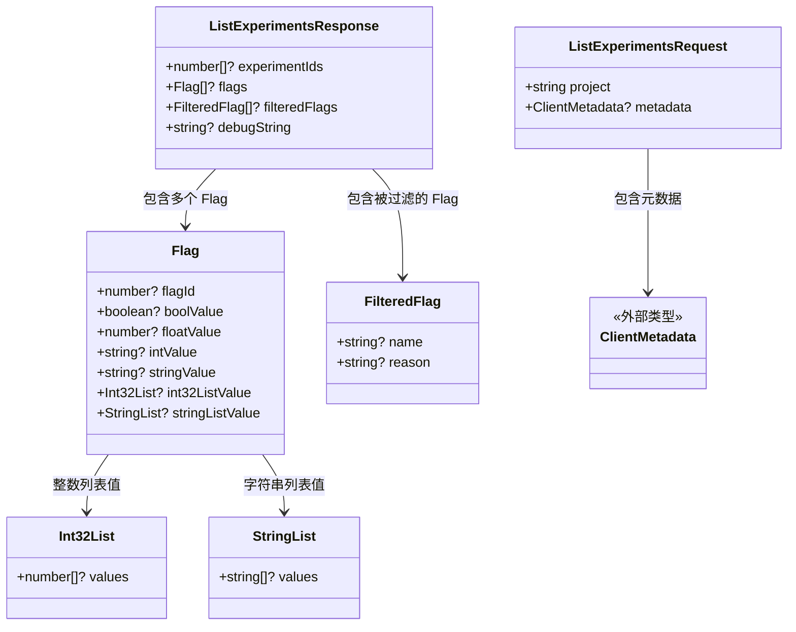
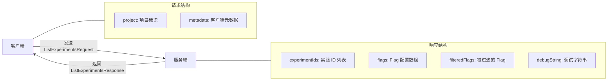

# types.ts

## 概述

`types.ts` 是实验系统的类型定义文件，定义了实验功能所涉及的所有 TypeScript 接口，包括请求/响应结构、Flag 数据模型以及辅助类型。这些类型被实验系统的其他模块引用，构成了客户端与服务端之间实验数据交换的契约（Contract）。

该文件遵循了 Google API 的常见设计模式，使用可选属性和多种值类型来支持灵活的 Flag 配置。

## 架构图（Mermaid）





## 核心组件

### 1. `ListExperimentsRequest` 接口

```typescript
export interface ListExperimentsRequest {
  project: string;
  metadata?: ClientMetadata;
}
```

实验列表请求结构，用于向服务端请求当前生效的实验配置。

| 字段 | 类型 | 必填 | 说明 |
|------|------|------|------|
| `project` | `string` | 是 | 项目标识符，指定要查询哪个项目的实验配置 |
| `metadata` | `ClientMetadata` | 否 | 客户端元数据，包含版本号、平台信息等，服务端可据此做定向实验分配 |

### 2. `ListExperimentsResponse` 接口

```typescript
export interface ListExperimentsResponse {
  experimentIds?: number[];
  flags?: Flag[];
  filteredFlags?: FilteredFlag[];
  debugString?: string;
}
```

实验列表响应结构，服务端返回的完整实验配置数据。

| 字段 | 类型 | 说明 |
|------|------|------|
| `experimentIds` | `number[]` | 当前客户端被分配到的实验 ID 列表，用于实验追踪和日志记录 |
| `flags` | `Flag[]` | 当前生效的 Flag 配置数组，包含具体的值 |
| `filteredFlags` | `FilteredFlag[]` | 被过滤掉的 Flag 列表，说明哪些 Flag 未生效及其原因 |
| `debugString` | `string` | 调试字符串，服务端可以附带额外的调试信息 |

### 3. `Flag` 接口

```typescript
export interface Flag {
  flagId?: number;
  boolValue?: boolean;
  floatValue?: number;
  intValue?: string; // int64
  stringValue?: string;
  int32ListValue?: Int32List;
  stringListValue?: StringList;
}
```

单个实验 Flag 的数据结构，使用"联合字段"（Union Field）模式，一个 Flag 实例中通常只有一个值字段被赋值。

| 字段 | 类型 | 说明 |
|------|------|------|
| `flagId` | `number` | Flag 的唯一数字标识符，对应 `flagNames.ts` 中定义的常量 |
| `boolValue` | `boolean` | 布尔值，适用于功能开关类型的 Flag |
| `floatValue` | `number` | 浮点数值，适用于阈值、比例等连续型参数 |
| `intValue` | `string` | 64 位整数值（以字符串表示，因为 JSON 无法精确表示 int64） |
| `stringValue` | `string` | 字符串值，适用于文本配置（如横幅文本） |
| `int32ListValue` | `Int32List` | 32 位整数列表，适用于需要多个整数值的配置 |
| `stringListValue` | `StringList` | 字符串列表，适用于需要多个字符串值的配置 |

### 4. `Int32List` 接口

```typescript
export interface Int32List {
  values?: number[];
}
```

32 位整数列表的包装类型。

| 字段 | 类型 | 说明 |
|------|------|------|
| `values` | `number[]` | 整数值数组 |

### 5. `StringList` 接口

```typescript
export interface StringList {
  values?: string[];
}
```

字符串列表的包装类型。

| 字段 | 类型 | 说明 |
|------|------|------|
| `values` | `string[]` | 字符串值数组 |

### 6. `FilteredFlag` 接口

```typescript
export interface FilteredFlag {
  name?: string;
  reason?: string;
}
```

被过滤掉（未生效）的 Flag 信息，用于调试和诊断。

| 字段 | 类型 | 说明 |
|------|------|------|
| `name` | `string` | 被过滤的 Flag 名称 |
| `reason` | `string` | 过滤原因（如客户端不在实验分组中、Flag 已过期等） |

## 依赖关系

### 内部依赖

| 模块 | 导入内容 | 说明 |
|------|----------|------|
| `../types.js` | `ClientMetadata`（类型） | Code Assist 通用类型定义中的客户端元数据类型 |

### 外部依赖

无。该文件是纯类型定义文件，不依赖任何外部包。

## 关键实现细节

1. **全可选字段设计**：所有接口的字段几乎都标记为可选（`?`），这是与 Protocol Buffers（protobuf）风格 API 对齐的常见做法。protobuf 中所有字段默认都是可选的，转换为 TypeScript 时保持了这一特性。

2. **int64 使用字符串表示**：`Flag.intValue` 的类型是 `string` 而非 `number`，并附有注释 `// int64`。这是因为 JavaScript 的 `number` 类型（IEEE 754 双精度浮点数）最大安全整数为 `2^53 - 1`，无法精确表示 64 位整数。因此 JSON 序列化时使用字符串来传输 int64 值，这是 Google API 的标准做法。

3. **联合字段模式（Oneof Pattern）**：`Flag` 接口中的多个值字段（`boolValue`、`floatValue`、`intValue` 等）采用了 protobuf 的 `oneof` 模式。虽然 TypeScript 接口本身不强制"只有一个字段有值"，但约定上每个 Flag 实例只会有一个值字段被设置，具体取决于该 Flag 的数据类型。

4. **列表值的包装类型**：`Int32List` 和 `StringList` 将数组包装在一个对象中（`{ values: [...] }`），而不是直接使用裸数组。这也是 protobuf 风格——protobuf 中的 `repeated` 字段在嵌套 `oneof` 中需要包装为消息类型。

5. **FilteredFlag 的调试用途**：`FilteredFlag` 接口的存在表明服务端不仅返回生效的 Flag，还会告知哪些 Flag 被过滤以及原因。这对于排查"为什么某个实验功能没有对我生效"非常有价值。

6. **请求中的 project 字段**：`ListExperimentsRequest.project` 是唯一的必填字段，说明实验配置是按项目隔离的，不同项目可以有不同的实验配置。
