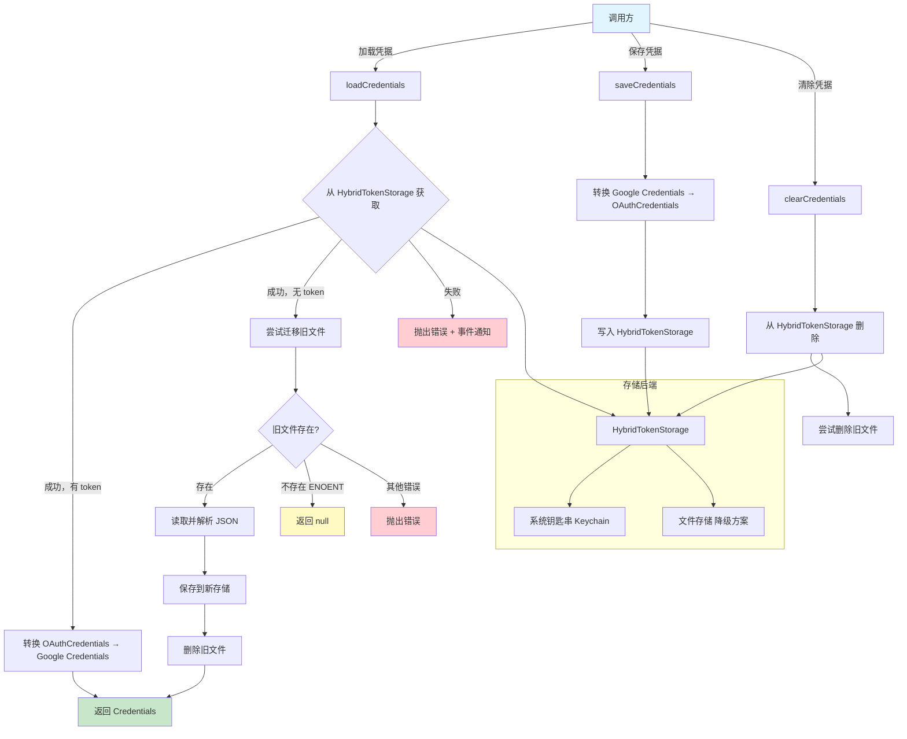

# oauth-credential-storage.ts

## 概述

`oauth-credential-storage.ts` 实现了 Gemini CLI 的 OAuth 凭据持久化存储层 `OAuthCredentialStorage`。该类封装了 OAuth 凭据（access token、refresh token 等）的加载、保存和清除操作，底层使用 `HybridTokenStorage`（混合存储策略：优先使用系统钥匙串 Keychain，降级到文件存储）。

该模块还包含一个从旧版文件存储迁移到新版钥匙串存储的迁移逻辑（`migrateFromFileStorage`），确保版本升级时用户无需重新登录。

所有方法均为静态方法，`OAuthCredentialStorage` 作为一个无状态的工具类使用。

## 架构图（Mermaid）

## 核心组件

### 1. `OAuthCredentialStorage` 类

全静态类，提供 OAuth 凭据的 CRUD 操作。内部维护一个静态的 `HybridTokenStorage` 实例。

#### 静态属性

| 属性 | 类型 | 说明 |
|------|------|------|
| `storage` | `HybridTokenStorage` | 混合令牌存储实例，使用服务名称 `gemini-cli-oauth` 初始化 |

#### 常量

| 常量 | 值 | 说明 |
|------|---|------|
| `KEYCHAIN_SERVICE_NAME` | `'gemini-cli-oauth'` | 系统钥匙串中的服务名称标识 |
| `MAIN_ACCOUNT_KEY` | `'main-account'` | 主账户的存储键名，用于在多账户场景中标识主账户 |

### 2. `loadCredentials()` 方法

**签名：** `static async loadCredentials(): Promise<Credentials | null>`

加载已缓存的 OAuth 凭据，执行流程：

1. 调用 `HybridTokenStorage.getCredentials(MAIN_ACCOUNT_KEY)` 从新存储（Keychain 或文件）中获取凭据。
2. 如果获取到有效的 token，将 `OAuthCredentials` 格式转换为 `google-auth-library` 的 `Credentials` 格式并返回。
3. 如果没有获取到 token，尝试执行迁移（`migrateFromFileStorage`）。
4. 任何错误都会通过 `coreEvents.emitFeedback` 发送错误事件，并抛出包含原因链的 `Error`。

**字段映射（OAuthCredentials -> Google Credentials）：**

| OAuthCredentials 字段 | Google Credentials 字段 |
|----------------------|------------------------|
| `accessToken` | `access_token` |
| `refreshToken` | `refresh_token` |
| `tokenType` | `token_type` |
| `scope` | `scope` |
| `expiresAt` | `expiry_date` |

### 3. `saveCredentials(credentials)` 方法

**签名：** `static async saveCredentials(credentials: Credentials): Promise<void>`

保存 OAuth 凭据，执行流程：

1. 校验 `access_token` 是否存在，不存在则抛出错误。
2. 将 `google-auth-library` 的 `Credentials` 格式转换为 `OAuthCredentials` 格式。
3. 设置 `updatedAt` 为当前时间戳（`Date.now()`）。
4. 默认 `tokenType` 为 `'Bearer'`。
5. 调用 `HybridTokenStorage.setCredentials` 写入存储。

### 4. `clearCredentials()` 方法

**签名：** `static async clearCredentials(): Promise<void>`

清除已缓存的 OAuth 凭据，执行流程：

1. 从 `HybridTokenStorage` 中删除主账户凭据。
2. 同时尝试删除旧版文件存储的凭据文件（`~/.gemini/oauth_credentials`），使用 `{ force: true }` 忽略文件不存在的情况。
3. 旧文件删除失败时静默忽略（`.catch(() => {})`）。

### 5. `migrateFromFileStorage()` 私有方法

**签名：** `private static async migrateFromFileStorage(): Promise<Credentials | null>`

从旧版文件存储迁移到新版钥匙串存储：

1. 构造旧文件路径：`~/.gemini/<OAUTH_FILE>`。
2. 尝试读取旧文件，如果文件不存在（`ENOENT`）返回 `null`，其他错误向上传播。
3. 解析 JSON 为 `Credentials` 对象。
4. 调用 `saveCredentials` 将凭据保存到新存储。
5. 删除旧文件。
6. 返回迁移成功的凭据。

## 依赖关系

### 内部依赖

| 模块 | 导入内容 | 说明 |
|------|----------|------|
| `../mcp/token-storage/hybrid-token-storage.js` | `HybridTokenStorage` | 混合令牌存储，优先使用系统钥匙串，降级到文件 |
| `../config/storage.js` | `OAUTH_FILE` | OAuth 凭据的文件名常量 |
| `../mcp/token-storage/types.js` | `OAuthCredentials`（类型） | MCP token 存储使用的凭据类型 |
| `../utils/paths.js` | `GEMINI_DIR`, `homedir` | Gemini CLI 的配置目录名和用户主目录路径 |
| `../utils/events.js` | `coreEvents` | 核心事件总线，用于发送错误反馈 |

### 外部依赖

| 模块 | 导入内容 | 说明 |
|------|----------|------|
| `google-auth-library` | `Credentials`（类型） | Google 官方认证库的凭据类型定义 |
| `node:path` | `path` | Node.js 路径操作模块 |
| `node:fs` | `promises as fs` | Node.js 文件系统异步 API |

## 关键实现细节

1. **双格式转换**：该模块充当了两种凭据格式之间的适配器：
   - **Google Credentials**（`google-auth-library`）：使用 `snake_case` 命名（`access_token`、`refresh_token`）。
   - **OAuthCredentials**（内部 MCP 存储）：使用 `camelCase` 命名（`accessToken`、`refreshToken`）。
   加载时从内部格式转为 Google 格式，保存时从 Google 格式转为内部格式。

2. **透明迁移策略**：`loadCredentials` 方法内置了从旧版文件存储到新版存储的迁移逻辑。迁移过程对调用方完全透明——首次加载时自动检测旧文件、迁移数据、删除旧文件。这保证了版本升级时的无缝体验。

3. **错误处理策略的分层**：
   - `loadCredentials` 和 `clearCredentials`：捕获错误，通过 `coreEvents` 发送错误事件后重新抛出（附带原因链 `{ cause: error }`）。
   - `saveCredentials`：不捕获内部错误，直接向上传播，但对输入做前置校验。
   - `migrateFromFileStorage`：仅捕获 `ENOENT`（文件不存在），其他错误直接传播。
   - 旧文件删除：使用 `.catch(() => {})` 静默忽略失败。

4. **全静态设计**：`OAuthCredentialStorage` 的所有方法和属性都是静态的，这意味着：
   - 全局只有一个 `HybridTokenStorage` 实例。
   - 不需要实例化即可使用。
   - 适合作为全局单例服务使用。

5. **安全考虑**：
   - `saveCredentials` 在保存前校验 `access_token` 是否存在，防止存储无效凭据。
   - 使用系统钥匙串（Keychain）而非明文文件存储敏感信息，提高安全性。
   - 旧文件迁移成功后立即删除旧文件，减少明文凭据的暴露风险。

6. **`MAIN_ACCOUNT_KEY` 的设计**：使用 `'main-account'` 作为存储键名暗示系统设计时考虑了多账户场景，但当前实现仅支持单账户。未来可通过不同的 key 支持多账户管理。
