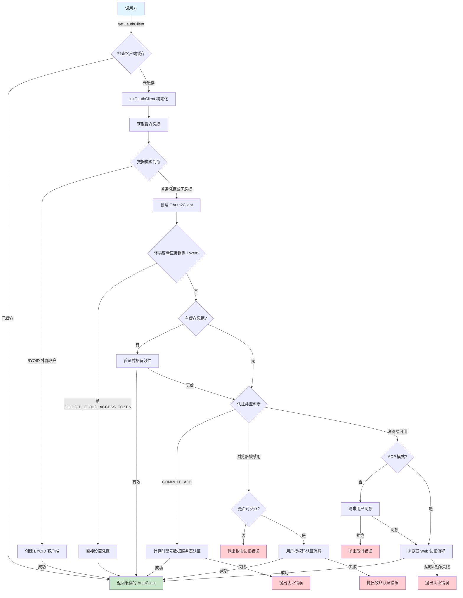
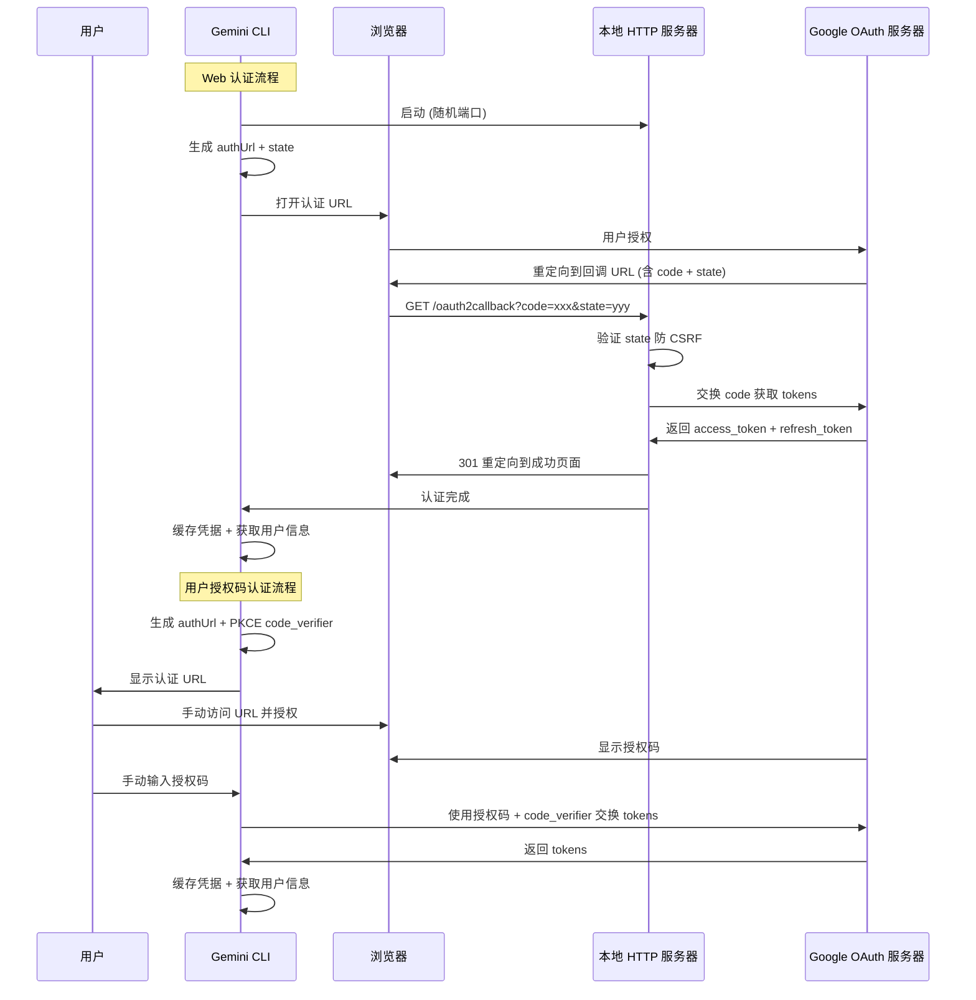

# oauth2.ts

## 概述

`oauth2.ts` 是 Gemini CLI 的 OAuth 2.0 认证核心模块，实现了完整的用户认证流程，包括：

- **浏览器 Web 登录**：启动本地 HTTP 服务器接收 OAuth 回调
- **用户授权码登录**：在无浏览器环境下（如远程终端、Docker），通过手动输入授权码完成认证
- **计算引擎 ADC 认证**：在 Google Cloud 环境中使用应用默认凭据（Application Default Credentials）
- **BYOID 认证**：支持外部账户授权用户（`external_account_authorized_user`）身份验证
- **凭据缓存与迁移**：支持加密存储和文件存储两种凭据持久化方案
- **用户信息获取**：认证成功后获取并缓存用户 Google 账户信息

该模块是 Gemini CLI 与 Google OAuth 2.0 体系集成的核心层，所有需要认证的 API 调用最终都依赖于此模块提供的 `AuthClient`。

## 架构图（Mermaid）





## 核心组件

### 1. 导出的接口和类型

#### `OauthWebLogin` 接口

```typescript
export interface OauthWebLogin {
  authUrl: string;
  loginCompletePromise: Promise<void>;
}
```

| 字段 | 类型 | 说明 |
|------|------|------|
| `authUrl` | `string` | OAuth 认证页面的 URL，用户需访问此链接进行授权 |
| `loginCompletePromise` | `Promise<void>` | 当认证完成（成功或失败）时 resolve/reject 的 Promise |

#### `authEvents` 事件发射器

```typescript
export const authEvents = new EventEmitter();
```

认证事件总线，当前支持 `'post_auth'` 事件，在认证成功后触发。回调接收 `JWTInput` 对象，可用于下游 Google Cloud 客户端库的初始化。

### 2. 模块级常量

| 常量 | 值 | 说明 |
|------|---|------|
| `OAUTH_CLIENT_ID` | `'681255809395-...'` | Google OAuth 客户端 ID（桌面应用类型，公开安全） |
| `OAUTH_CLIENT_SECRET` | `'GOCSPX-...'` | OAuth 客户端密钥（桌面应用类型，非敏感信息） |
| `OAUTH_SCOPE` | `['cloud-platform', 'userinfo.email', 'userinfo.profile']` | 请求的 OAuth 权限范围 |
| `HTTP_REDIRECT` | `301` | HTTP 重定向状态码 |
| `SIGN_IN_SUCCESS_URL` | `'https://developers.google.com/...'` | 登录成功后重定向的页面 |
| `SIGN_IN_FAILURE_URL` | `'https://developers.google.com/...'` | 登录失败后重定向的页面 |

### 3. `getOauthClient(authType, config)` 函数（导出）

**签名：** `async function getOauthClient(authType: AuthType, config: Config): Promise<AuthClient>`

这是该模块的主入口。使用 `oauthClientPromises` Map 按 `AuthType` 缓存已初始化的客户端 Promise，确保同一认证类型只初始化一次。

### 4. `initOauthClient(authType, config)` 函数

**签名：** `async function initOauthClient(authType: AuthType, config: Config): Promise<AuthClient>`

OAuth 客户端的完整初始化逻辑，是整个模块最核心、最复杂的函数。按优先级依次尝试以下认证策略：

1. **BYOID 认证**：如果缓存凭据类型为 `external_account_authorized_user`，使用 `GoogleAuth.fromJSON` 创建 BYOID 客户端。
2. **环境变量 Token**：如果同时设置了 `GOOGLE_GENAI_USE_GCA` 和 `GOOGLE_CLOUD_ACCESS_TOKEN`，直接使用环境变量提供的 Token。
3. **缓存凭据验证**：如果存在缓存凭据，验证其有效性（本地检查 + 服务端 Token Info 验证）。
4. **Compute ADC**：在 `AuthType.COMPUTE_ADC` 模式下，通过 Google 计算引擎的元数据服务器获取 ADC 凭据。
5. **用户授权码认证**：在浏览器被禁用（`NO_BROWSER=true`）且支持交互时，通过终端输入授权码完成认证。
6. **浏览器 Web 认证**：默认模式，打开浏览器让用户授权，本地 HTTP 服务器接收回调。

### 5. `authWithWeb(client)` 函数

**签名：** `async function authWithWeb(client: OAuth2Client): Promise<OauthWebLogin>`

浏览器 Web 认证的实现：

1. 获取可用端口。
2. 生成随机 `state` 参数防止 CSRF 攻击。
3. 生成包含 `redirect_uri`、`scope`、`state` 等参数的认证 URL。
4. 创建本地 HTTP 服务器监听 `/oauth2callback` 回调。
5. 回调处理：验证 state、交换授权码、获取 tokens、重定向到成功/失败页面。
6. 返回 `OauthWebLogin` 对象（包含 authUrl 和 loginCompletePromise）。

### 6. `authWithUserCode(client)` 函数

**签名：** `async function authWithUserCode(client: OAuth2Client): Promise<boolean>`

用户授权码认证的实现（适用于无浏览器环境）：

1. 生成 PKCE code verifier 和 code challenge（S256 方法）。
2. 生成随机 state 和认证 URL。
3. 在终端显示认证 URL，提示用户访问。
4. 通过 readline 接口等待用户输入授权码（5 分钟超时）。
5. 使用授权码和 code verifier 交换 tokens。
6. 成功返回 `true`，失败返回 `false`（支持最多 2 次重试）。

### 7. `fetchCachedCredentials()` 函数

**签名：** `async function fetchCachedCredentials(): Promise<Credentials | JWTInput | null>`

获取缓存凭据的策略：

- **加密存储模式**：使用 `OAuthCredentialStorage.loadCredentials()`。
- **文件存储模式**：依次尝试 `Storage.getOAuthCredsPath()` 和 `GOOGLE_APPLICATION_CREDENTIALS` 环境变量指向的文件。

### 8. `cacheCredentials(credentials)` 函数

**签名：** `async function cacheCredentials(credentials: Credentials)`

将凭据以 JSON 格式写入文件，文件权限设为 `0o600`（仅所有者可读写）。

### 9. `fetchAndCacheUserInfo(client)` 函数

**签名：** `async function fetchAndCacheUserInfo(client: OAuth2Client): Promise<void>`

通过 Google userinfo API 获取用户邮箱，并使用 `UserAccountManager` 缓存。

### 10. 其他导出函数

| 函数 | 说明 |
|------|------|
| `clearOauthClientCache()` | 清除内存中缓存的 OAuth 客户端 Promise Map |
| `clearCachedCredentialFile()` | 清除文件/加密存储中的凭据文件，并清除 Google 账户缓存和客户端缓存 |
| `getAvailablePort()` | 获取可用端口，支持 `OAUTH_CALLBACK_PORT` 环境变量指定固定端口 |
| `resetOauthClientForTesting()` | 测试辅助函数，清除客户端缓存以实现测试隔离 |
| `triggerPostAuthCallbacks(tokens)` | 认证成功后构建 `JWTInput` 并通过 `authEvents` 触发 `'post_auth'` 事件 |

## 依赖关系

### 内部依赖

| 模块 | 导入内容 | 说明 |
|------|----------|------|
| `../config/config.js` | `Config`（类型） | 应用配置，提供代理、浏览器启动、ACP 模式等配置 |
| `../utils/errors.js` | `getErrorMessage`, `FatalAuthenticationError`, `FatalCancellationError` | 错误处理工具和自定义错误类 |
| `../utils/userAccountManager.js` | `UserAccountManager` | 用户 Google 账户 ID 的缓存管理 |
| `../core/contentGenerator.js` | `AuthType` | 认证类型枚举 |
| `../config/storage.js` | `Storage` | 配置存储，提供 OAuth 凭据文件路径 |
| `./oauth-credential-storage.js` | `OAuthCredentialStorage` | 加密 OAuth 凭据存储 |
| `../mcp/token-storage/index.js` | `FORCE_ENCRYPTED_FILE_ENV_VAR` | 强制使用加密文件存储的环境变量名 |
| `../utils/debugLogger.js` | `debugLogger` | 调试日志 |
| `../utils/stdio.js` | `writeToStdout`, `createWorkingStdio`, `writeToStderr` | 标准输入输出工具 |
| `../utils/terminal.js` | `enableLineWrapping`, `disableMouseEvents`, `disableKittyKeyboardProtocol`, `enterAlternateScreen`, `exitAlternateScreen` | 终端控制工具 |
| `../utils/events.js` | `coreEvents`, `CoreEvent` | 核心事件系统 |
| `../utils/authConsent.js` | `getConsentForOauth` | 获取用户 OAuth 授权同意 |

### 外部依赖

| 模块 | 导入内容 | 说明 |
|------|----------|------|
| `google-auth-library` | `OAuth2Client`, `Compute`, `CodeChallengeMethod`, `GoogleAuth`, `Credentials`, `AuthClient`, `JWTInput` | Google 官方认证库 |
| `node:http` | `http` | Node.js HTTP 模块，用于创建本地回调服务器 |
| `node:url` | `url` | URL 解析 |
| `node:crypto` | `crypto` | 加密模块，用于生成随机 state 参数 |
| `node:net` | `net` | 网络模块，用于获取可用端口 |
| `node:events` | `EventEmitter` | 事件发射器 |
| `node:readline` | `readline` | 终端交互式输入 |
| `node:path` | `path` | 路径操作 |
| `node:fs` | `promises as fs` | 文件系统 |
| `open` | `open` | 跨平台打开浏览器工具 |

## 关键实现细节

1. **多策略认证体系**：模块支持 5 种认证方式（BYOID、环境变量 Token、缓存凭据、Compute ADC、交互式登录），按优先级依次尝试，构成了一个完善的认证降级链。

2. **PKCE 安全增强**：`authWithUserCode` 使用 PKCE（Proof Key for Code Exchange）with S256 方法，生成 `code_verifier` 和 `code_challenge`，防止授权码拦截攻击。而 `authWithWeb` 因为使用本地回调服务器，安全性已由 loopback 地址保证，因此不使用 PKCE。

3. **CSRF 防护**：两种交互式认证方式都生成随机 `state` 参数（`crypto.randomBytes(32).toString('hex')`，256 位随机值），Web 认证在回调中严格验证 `state` 是否匹配。

4. **OAuth 客户端密钥安全性说明**：代码中直接硬编码了 `OAUTH_CLIENT_ID` 和 `OAUTH_CLIENT_SECRET`，并附有注释说明这对于"installed application"类型的 OAuth 客户端是合规的——根据 Google 的 OAuth 2.0 文档，桌面/CLI 应用的客户端密钥不作为保密信息。

5. **终端状态管理**：`authWithUserCode` 在无浏览器模式下使用了备用屏幕缓冲区（`enterAlternateScreen`/`exitAlternateScreen`），并且在 `finally` 块中发出 `ExternalEditorClosed` 事件，让 TUI 重新初始化终端状态。这与 VIM 等外部编辑器退出后的处理机制一致。

6. **超时和取消机制**：Web 认证使用 `Promise.race` 同时监听三个 Promise：
   - `loginCompletePromise`：正常认证完成
   - `timeoutPromise`：5 分钟超时
   - `cancellationPromise`：用户按 Ctrl+C（同时监听 `SIGINT` 信号和 stdin 中的 `0x03` 字节，因为 raw mode 下 SIGINT 可能不触发）

7. **端口获取策略**：`getAvailablePort` 支持通过 `OAUTH_CALLBACK_PORT` 环境变量指定固定端口（适用于 Docker 端口映射场景），否则使用 `net.createServer().listen(0)` 让系统自动分配空闲端口。

8. **回调主机配置**：`OAUTH_CALLBACK_HOST` 环境变量允许覆盖 HTTP 服务器监听地址（如 Docker 中可设为 `'0.0.0.0'`），但 `redirectUri` 始终使用 `127.0.0.1` 以符合 Google OAuth 的 loopback 安全策略。

9. **凭据自动刷新**：通过 `client.on('tokens', ...)` 监听 token 刷新事件，当 `OAuth2Client` 自动刷新 token 时自动持久化新凭据。

10. **双存储方案**：通过 `FORCE_ENCRYPTED_FILE_ENV_VAR` 环境变量控制存储策略：
    - **加密存储**：使用 `OAuthCredentialStorage`（底层为 HybridTokenStorage/Keychain）
    - **文件存储**：直接写入 JSON 文件，权限 `0o600`

11. **post_auth 回调机制**：`triggerPostAuthCallbacks` 在每次认证成功后将凭据转换为 `JWTInput` 格式并通过 `authEvents` 事件总线广播。这允许其他模块（如 MCP 服务器）监听认证事件并获取凭据。

12. **重试机制**：`authWithUserCode` 支持最多 2 次重试（`maxRetries = 2`），每次失败后显示提示信息。

13. **浏览器打开的错误处理**：使用 `open` 库打开浏览器时，同时处理了同步 `catch` 和异步 `childProcess.on('error', ...)` 两种错误场景，防止在缺少 `xdg-open` 的最小化 Docker 容器中导致进程崩溃。
