# server.ts

## 概述

`server.ts` 是 Gemini CLI 代码辅助模块的核心服务端通信层，定义了 `CodeAssistServer` 类。该类实现了 `ContentGenerator` 接口，作为客户端与 Google Cloud Code Assist API（`cloudcode-pa.googleapis.com`）之间的桥梁。它封装了所有与后端 API 的 HTTP 通信逻辑，包括内容生成（流式和非流式）、用户注册、配额查询、实验列表获取、管理员控制、遥测指标记录等功能。同时集成了 AI Credits（计费积分）管理系统，能够在流式响应中实时跟踪和更新积分消耗。

## 架构图（Mermaid）

```mermaid
graph TB
    subgraph 客户端层
        CLI[Gemini CLI]
    end

    subgraph 核心服务层
        CAS[CodeAssistServer]
        CG[ContentGenerator 接口]
        CAS -->|实现| CG
    end

    subgraph HTTP 通信层
        POST[requestPost - POST 请求]
        GET[requestGet / makeGetRequest - GET 请求]
        STREAM[requestStreamingPost - SSE 流式请求]
        GETOP[requestGetOperation - 获取操作状态]
    end

    subgraph API 方法层
        GCS[generateContentStream - 流式生成内容]
        GC[generateContent - 非流式生成内容]
        OB[onboardUser - 用户注册]
        LCA[loadCodeAssist - 加载代码辅助]
        RUQ[retrieveUserQuota - 查询用户配额]
        FAC[fetchAdminControls - 获取管理员控制]
        CT[countTokens - 计算 Token]
        LE[listExperiments - 获取实验列表]
        GCGUS[getCodeAssistGlobalUserSetting - 获取全局用户设置]
        SCGUS[setCodeAssistGlobalUserSetting - 设置全局用户设置]
        RCM[recordCodeAssistMetrics - 记录遥测指标]
        RCO[recordConversationOffered - 记录会话提供]
        RCI[recordConversationInteraction - 记录会话交互]
        RAC[refreshAvailableCredits - 刷新可用积分]
    end

    subgraph 计费系统
        BILLING[billing.ts - 积分管理]
        UC[updateCredits - 更新积分]
        CUE[CreditsUsedEvent - 积分使用事件]
    end

    subgraph 数据转换层
        CONV[converter.ts - 请求/响应转换器]
        TELE[telemetry.ts - 遥测工具]
    end

    subgraph 外部服务
        API[Google Cloud Code Assist API]
    end

    CLI --> CAS
    CAS --> GCS
    CAS --> GC
    CAS --> OB
    CAS --> LCA
    CAS --> RUQ
    CAS --> FAC
    CAS --> CT
    CAS --> LE
    CAS --> GCGUS
    CAS --> SCGUS
    CAS --> RCM
    CAS --> RCO
    CAS --> RCI
    CAS --> RAC

    GCS --> STREAM
    GC --> POST
    OB --> POST
    LCA --> POST
    RUQ --> POST
    FAC --> POST
    CT --> POST
    LE --> POST
    SCGUS --> POST
    RCM --> POST
    GCGUS --> GET

    GCS --> CONV
    GC --> CONV
    CT --> CONV
    GCS --> TELE
    GC --> TELE

    GCS --> UC
    GC --> UC
    UC --> BILLING
    GCS --> CUE

    POST --> API
    GET --> API
    STREAM --> API
    GETOP --> API

    LCA -.->|VPC SC 错误处理| VPCSC[VPC Service Controls 检测]
```



## 核心组件

### 1. `HttpOptions` 接口

```typescript
export interface HttpOptions {
  headers?: Record<string, string>;
}
```

定义 HTTP 请求的额外选项，主要用于传递自定义 HTTP 头部。

### 2. `CodeAssistServer` 类

核心服务类，实现 `ContentGenerator` 接口。

#### 构造函数参数

| 参数 | 类型 | 说明 |
|------|------|------|
| `client` | `AuthClient` | Google 认证客户端，用于发起经过认证的 HTTP 请求 |
| `projectId` | `string?` | Google Cloud 项目 ID |
| `httpOptions` | `HttpOptions` | 额外的 HTTP 选项（默认空对象） |
| `sessionId` | `string?` | 会话 ID，同时兼作 trajectoryId |
| `userTier` | `UserTierId?` | 用户等级 ID |
| `userTierName` | `string?` | 用户等级名称 |
| `paidTier` | `GeminiUserTier?` | 付费等级信息（包含可用积分） |
| `config` | `Config?` | 应用配置对象 |

#### 核心方法

##### `generateContentStream(req, userPromptId, role)` - 流式内容生成

- 判断是否启用 AI Credits（基于模型资格和用户配置的超额策略）
- 首次使用积分时发出通知
- 调用 `requestStreamingPost` 发起 SSE 流式请求
- 返回 `AsyncGenerator<GenerateContentResponse>`，逐块 yield 响应
- 在生成器内部追踪流式延迟（首条消息延迟、总延迟）
- 累计消耗的 G1 积分，在流结束后发出 `CreditsUsedEvent` 遥测事件
- 实时调用 `recordConversationOffered` 记录遥测数据
- 通过 `updateCredits` 更新本地积分状态

##### `generateContent(req, userPromptId, role)` - 非流式内容生成

- 调用 `requestPost` 发起同步 POST 请求
- 记录总延迟时间
- 调用 `recordConversationOffered` 记录遥测
- 更新剩余积分
- 返回翻译后的 `GenerateContentResponse`

##### `updateCredits(remainingCredits)` - 更新积分（私有方法）

- 保留非 G1 类型的积分不变
- 用响应中返回的 G1 积分替换本地的 G1 积分记录
- 更新 `paidTier.availableCredits`

##### `onboardUser(req)` - 用户注册

向 API 发送用户注册请求，返回长时间运行的操作响应。

##### `getOperation(name)` - 查询操作状态

通过操作名称查询长时间运行操作的状态。

##### `loadCodeAssist(req)` - 加载代码辅助

加载代码辅助服务。特殊之处在于捕获了 VPC Service Controls 错误——如果用户受 VPC SC 影响，返回标准等级而非抛出异常。

##### `refreshAvailableCredits()` - 刷新可用积分

通过 `loadCodeAssist` 以 `HEALTH_CHECK` 模式重新获取最新的积分余额。

##### `fetchAdminControls(req)` - 获取管理员控制

获取管理员级别的控制设置。

##### `getCodeAssistGlobalUserSetting()` / `setCodeAssistGlobalUserSetting(req)` - 全局用户设置

GET/POST 方式获取或设置全局用户设置。

##### `countTokens(req)` - 计算 Token 数量

将请求转换为内部格式，发送到 API，再将响应转换回标准格式。

##### `embedContent(req)` - 内容嵌入（未实现）

直接抛出错误，表明嵌入功能暂未支持。

##### `listExperiments(metadata)` - 获取实验列表

需要 `projectId`，向 API 请求当前可用的实验列表。

##### `retrieveUserQuota(req)` - 查询用户配额

查询用户的使用配额。

##### `recordConversationOffered(conversationOffered)` - 记录会话提供

将会话提供事件包装为指标请求发送到 API。

##### `recordConversationInteraction(interaction)` - 记录会话交互

将会话交互事件包装为指标请求发送到 API。

##### `recordCodeAssistMetrics(request)` - 记录代码辅助指标

通用的指标记录方法，被 `recordConversationOffered` 和 `recordConversationInteraction` 调用。

#### HTTP 通信方法

##### `requestPost<T>(method, req, signal?, retryDelay?)` - POST 请求

- 通用 POST 请求方法
- 内置重试配置：3次重试，支持 429/499/500-599 状态码重试
- 默认重试延迟 100ms，`generateContent` 使用 1000ms

##### `makeGetRequest<T>(url, signal?)` - GET 请求（私有）

底层 GET 请求实现。

##### `requestGet<T>(method, signal?)` - GET 请求

使用方法名构建 URL 的 GET 请求。

##### `requestGetOperation<T>(name, signal?)` - 获取操作状态

使用操作名构建 URL 的 GET 请求。

##### `requestStreamingPost<T>(method, req, signal?)` - SSE 流式请求

- 发送带 `alt=sse` 参数的 POST 请求
- 使用 `readline` 模块逐行解析 SSE 格式数据
- 缓冲 `data:` 行，在遇到空行时拼接并 JSON 解析
- 解析失败时记录 `InvalidChunkEvent` 遥测事件（不包含原始数据，保护隐私）
- 不启用自动重试（`retry: false`）

#### URL 构建方法

##### `getBaseUrl()` - 获取基础 URL

- 支持通过环境变量 `CODE_ASSIST_ENDPOINT` 和 `CODE_ASSIST_API_VERSION` 覆盖
- 默认值：`https://cloudcode-pa.googleapis.com/v1internal`

##### `getMethodUrl(method)` - 构建方法 URL

格式：`{baseUrl}:{method}`

##### `getOperationUrl(name)` - 构建操作 URL

格式：`{baseUrl}/{name}`

### 3. VPC Service Controls 错误处理

#### `VpcScErrorResponse` 接口

描述 VPC SC 错误响应的结构，嵌套结构为 `response.data.error.details`。

#### `isVpcScErrorResponse(error)` 函数

类型守卫函数，通过逐层检查嵌套属性判断错误是否符合 VPC SC 错误响应结构。

#### `isVpcScAffectedUser(error)` 函数

判断用户是否受 VPC Service Controls 影响，通过检查错误详情中是否包含 `reason: 'SECURITY_POLICY_VIOLATED'`。

### 4. 导出常量

| 常量 | 值 | 说明 |
|------|-----|------|
| `CODE_ASSIST_ENDPOINT` | `https://cloudcode-pa.googleapis.com` | API 端点地址 |
| `CODE_ASSIST_API_VERSION` | `v1internal` | API 版本 |
| `GENERATE_CONTENT_RETRY_DELAY_IN_MILLISECONDS` | `1000` | 内容生成重试延迟（内部常量） |

## 依赖关系

### 内部依赖

| 模块 | 导入内容 | 用途 |
|------|----------|------|
| `./types.js` | `UserTierId`, 多个请求/响应类型, `GeminiUserTier`, `Credits` 等 | Code Assist 相关类型定义 |
| `./converter.js` | `fromCountTokenResponse`, `fromGenerateContentResponse`, `toCountTokenRequest`, `toGenerateContentRequest` 等 | 请求/响应格式转换 |
| `./telemetry.js` | `formatProtoJsonDuration`, `recordConversationOffered` | 遥测数据格式化和记录 |
| `./experiments/types.js` | `ListExperimentsRequest`, `ListExperimentsResponse` | 实验相关类型 |
| `./experiments/client_metadata.js` | `getClientMetadata` | 获取客户端元数据 |
| `../core/contentGenerator.js` | `ContentGenerator` | 内容生成器接口（被本类实现） |
| `../config/config.js` | `Config` | 应用配置类型 |
| `../billing/billing.js` | `G1_CREDIT_TYPE`, `getG1CreditBalance`, `isOverageEligibleModel`, `shouldAutoUseCredits` | 计费逻辑 |
| `../telemetry/loggers.js` | `logBillingEvent`, `logInvalidChunk` | 遥测日志记录器 |
| `../telemetry/billingEvents.js` | `CreditsUsedEvent` | 计费遥测事件 |
| `../telemetry/types.js` | `InvalidChunkEvent`, `LlmRole` | 遥测类型定义 |
| `../utils/events.js` | `coreEvents` | 核心事件总线 |

### 外部依赖

| 包名 | 导入内容 | 用途 |
|------|----------|------|
| `google-auth-library` | `AuthClient` | Google OAuth2 认证客户端 |
| `@google/genai` | `CountTokensParameters`, `GenerateContentParameters`, `GenerateContentResponse` 等 | Google GenAI SDK 类型定义 |
| `node:readline` | `readline` | 逐行读取 SSE 流数据 |
| `node:stream` | `Readable` | Node.js 可读流，用于 SSE 流解析 |

## 关键实现细节

1. **SSE 流式解析**：`requestStreamingPost` 使用 `readline` 接口解析 Server-Sent Events 格式的流数据。它按行读取，缓冲以 `data: ` 开头的行，在遇到空行时将缓冲内容合并后进行 JSON 解析。支持多行 data 字段的拼接。

2. **AI Credits 积分管理**：流式生成过程中实时跟踪积分消耗。每个流式响应块可能携带 `consumedCredits` 和 `remainingCredits`，系统累计消耗量并在流结束后发出 `CreditsUsedEvent` 遥测事件。`updateCredits` 方法采用替换策略——保留非 G1 积分，用最新值替换 G1 积分。

3. **VPC Service Controls 容错**：`loadCodeAssist` 方法特别处理了 VPC SC 错误。当检测到 `SECURITY_POLICY_VIOLATED` 时，不会抛出异常，而是返回标准等级（`UserTierId.STANDARD`），确保受 VPC SC 限制的用户仍能使用基本功能。

4. **重试策略**：POST 请求默认配置 3 次重试，支持 HTTP 429（限流）、499（客户端关闭）、500-599（服务器错误）状态码的自动重试。流式请求禁用自动重试（`retry: false`），因为流式连接的重试语义更复杂。

5. **延迟追踪**：流式和非流式生成都记录延迟数据。流式生成额外追踪首条消息延迟（`firstMessageLatency`），用于性能监控。

6. **环境变量覆盖**：API 端点和版本号支持通过 `CODE_ASSIST_ENDPOINT` 和 `CODE_ASSIST_API_VERSION` 环境变量覆盖，便于开发和测试。

7. **隐私保护**：SSE 解析失败时记录的 `InvalidChunkEvent` 不包含原始数据内容，仅记录错误类型描述，避免泄露敏感信息。

8. **积分通知控制**：首次使用积分时通过 `coreEvents.emitFeedback` 发送通知，并通过 `config.setCreditsNotificationShown(true)` 标记已通知，避免重复提示。
