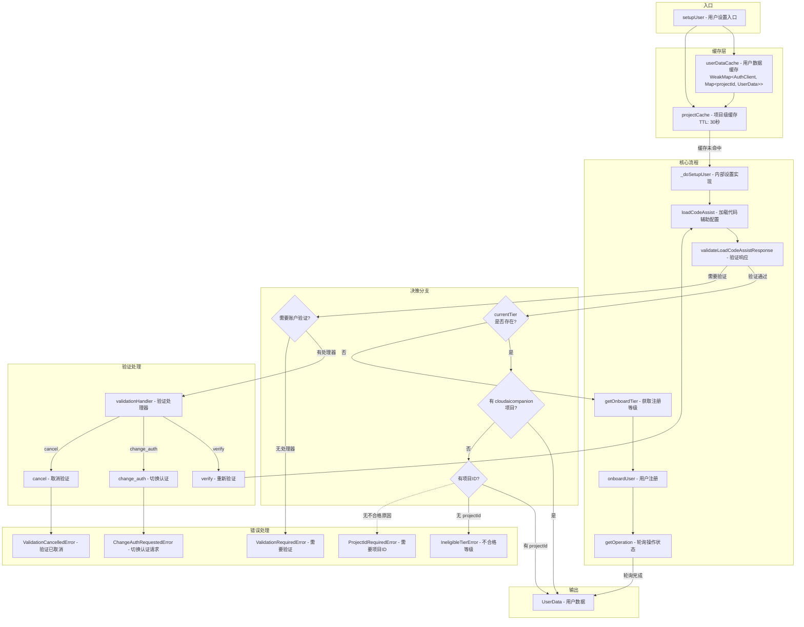

# setup.ts

## 概述

`setup.ts` 是 Gemini CLI 用户初始化和注册模块，负责在 CLI 启动时设置用户的 Code Assist 服务。其核心功能包括：加载用户的 Code Assist 配置、判断用户等级资格（免费/标准/付费）、在需要时自动执行用户注册（onboarding）流程、处理账户验证需求，以及管理用户数据的缓存以避免重复网络调用。该模块是用户首次使用 Gemini CLI 或切换认证方式时的关键入口点。

## 架构图（Mermaid）



## 核心组件

### 1. 错误类

#### `ProjectIdRequiredError`

当用户需要设置 Google Cloud 项目 ID 但未提供时抛出。错误消息引导用户设置 `GOOGLE_CLOUD_PROJECT` 或 `GOOGLE_CLOUD_PROJECT_ID` 环境变量，并提供文档链接。

```typescript
export class ProjectIdRequiredError extends Error {
  constructor() {
    super('This account requires setting the GOOGLE_CLOUD_PROJECT or GOOGLE_CLOUD_PROJECT_ID env var...');
    this.name = 'ProjectIdRequiredError';
  }
}
```

#### `ValidationCancelledError`

用户主动取消账户验证流程时抛出。这是一个不可恢复的错误，导致认证失败。

#### `IneligibleTierError`

当用户不符合任何可用等级时抛出。携带所有不合格等级的详细信息（`ineligibleTiers: IneligibleTier[]`），错误消息是所有不合格原因的逗号分隔列表。

### 2. `UserData` 接口

```typescript
export interface UserData {
  projectId: string;           // Google Cloud 项目 ID
  userTier: UserTierId;        // 用户等级 ID
  userTierName?: string;       // 用户等级名称
  paidTier?: GeminiUserTier;   // 付费等级详情（如有）
  hasOnboardedPreviously?: boolean;  // 是否此前已完成注册
}
```

用户设置完成后的返回数据结构，包含用于创建 `CodeAssistServer` 实例所需的全部信息。

### 3. 缓存系统

```typescript
let userDataCache = createCache<
  AuthClient,
  CacheService<string | undefined, Promise<UserData>>
>({ storage: 'weakmap' });
```

采用两层缓存结构：
- **外层**：`WeakMap<AuthClient, ...>` — 以认证客户端实例为键，使用 WeakMap 确保当 AuthClient 被垃圾回收时缓存自动清理
- **内层**：`Map<string | undefined, Promise<UserData>>` — 以项目 ID 为键，TTL 为 30 秒

缓存的值是 `Promise<UserData>` 而非 `UserData`，这意味着并发的 `setupUser` 调用会共享同一个 Promise，避免重复网络请求。

#### `resetUserDataCacheForTesting()`

测试专用函数，重置缓存状态以确保测试隔离。

### 4. `setupUser(client, config, httpOptions?)` — 主入口函数

用户设置的公开入口：

1. 从环境变量读取 `projectId`（`GOOGLE_CLOUD_PROJECT` 或 `GOOGLE_CLOUD_PROJECT_ID`）
2. 在缓存中查找或创建项目级缓存条目
3. 缓存命中则直接返回，未命中则调用 `_doSetupUser`

### 5. `_doSetupUser(client, projectId, config, httpOptions?)` — 内部实现

完整的用户设置流程：

**阶段一：加载配置**
1. 创建临时的 `CodeAssistServer` 实例
2. 调用 `loadCodeAssist` 获取用户配置
3. 调用 `validateLoadCodeAssistResponse` 验证响应

**阶段二：验证处理（循环）**
- 如果需要账户验证（`ValidationRequiredError`）且有验证处理器：
  - `verify`：重新执行 `loadCodeAssist`
  - `change_auth`：抛出 `ChangeAuthRequestedError`
  - 其他：抛出 `ValidationCancelledError`
- 无验证处理器时直接抛出错误

**阶段三：已有等级（`currentTier` 存在）**
- 有 `cloudaicompanionProject`：直接返回 `UserData`
- 无 `cloudaicompanionProject` 但有环境变量 `projectId`：使用环境变量返回
- 都没有：抛出 `IneligibleTierError` 或 `ProjectIdRequiredError`

**等级优先级**：`paidTier.id` > `currentTier.id` > `UserTierId.STANDARD`（默认值）

**阶段四：需要注册（无 `currentTier`）**
1. 通过 `getOnboardTier` 确定注册等级
2. 构建注册请求（免费等级不设置项目 ID，避免 `Precondition Failed` 错误）
3. 记录注册开始遥测事件
4. 调用 `onboardUser` 执行注册
5. 如果返回长时间运行操作，每 5 秒轮询一次直到完成
6. 记录注册成功遥测事件（含耗时）
7. 返回 `UserData`

### 6. 辅助函数

#### `throwIneligibleOrProjectIdError(res)` — 抛出不合格或缺少项目ID错误

优先抛出 `IneligibleTierError`（如果有不合格等级信息），否则抛出 `ProjectIdRequiredError`。返回类型为 `never`。

#### `getOnboardTier(res)` — 获取注册等级

从 `allowedTiers` 中查找默认等级（`isDefault === true`）。找不到时返回一个默认的 `LEGACY` 等级对象。

```typescript
{
  name: '',
  description: '',
  id: UserTierId.LEGACY,
  userDefinedCloudaicompanionProject: true,
}
```

#### `validateLoadCodeAssistResponse(res)` — 验证加载响应

1. 检查响应是否为空
2. 如果没有 `currentTier` 但有 `ineligibleTiers`，检查是否存在需要验证的等级
3. 找到需要验证的等级时，抛出 `ValidationRequiredError`（包含验证 URL 和描述）

## 依赖关系

### 内部依赖

| 模块 | 导入内容 | 用途 |
|------|----------|------|
| `./types.js` | `UserTierId`, `IneligibleTierReasonCode`, `ClientMetadata`, `GeminiUserTier`, `IneligibleTier`, `LoadCodeAssistResponse`, `OnboardUserRequest` | Code Assist 类型定义 |
| `./server.js` | `CodeAssistServer`, `HttpOptions` | 与 Code Assist API 通信的服务器类 |
| `../utils/errors.js` | `ChangeAuthRequestedError` | 切换认证方式的错误类 |
| `../utils/googleQuotaErrors.js` | `ValidationRequiredError` | 账户验证需求错误类 |
| `../utils/debugLogger.js` | `debugLogger` | 调试日志记录器 |
| `../utils/cache.js` | `createCache`, `CacheService` | 通用缓存工厂和类型 |
| `../config/config.js` | `Config` | 应用配置类型 |
| `../telemetry/index.js` | `logOnboardingStart`, `logOnboardingSuccess`, `OnboardingStartEvent`, `OnboardingSuccessEvent` | 注册遥测事件记录 |

### 外部依赖

| 包名 | 导入内容 | 用途 |
|------|----------|------|
| `google-auth-library` | `AuthClient` | Google OAuth2 认证客户端类型 |

## 关键实现细节

1. **两层缓存策略**：外层使用 WeakMap（以 AuthClient 为键）确保认证客户端被垃圾回收时缓存自动清理；内层使用带 30 秒 TTL 的 Map（以项目 ID 为键）避免短时间内重复调用。缓存值为 Promise，确保并发请求去重。

2. **免费等级的特殊处理**：免费等级使用 Google 托管项目，注册请求中不能设置 `cloudaicompanionProject`，否则会导致 `Precondition Failed` 错误。

3. **验证重试循环**：`_doSetupUser` 使用 `while(true)` 循环处理验证需求。当用户选择 `verify` 时会重新调用 `loadCodeAssist`，支持多次验证尝试。

4. **等级优先级链**：用户等级的确定遵循明确的优先级：`paidTier.id` > `currentTier.id` > `UserTierId.STANDARD`。这确保付费等级始终优先于普通等级。

5. **长时间运行操作（LRO）轮询**：注册操作可能是异步的。如果 `onboardUser` 返回未完成的操作，系统以 5 秒间隔轮询 `getOperation`，直到操作完成。

6. **优雅降级**：当 API 未返回等级 ID 时，系统记录警告并默认使用 `STANDARD` 等级，而非直接失败。

7. **遥测集成**：注册流程记录开始和成功事件，成功事件包含等级名称和注册耗时，用于监控注册性能。

8. **环境变量作为后备**：当 API 响应中没有 `cloudaicompanionProject` 时，系统会尝试使用环境变量中的项目 ID 作为后备方案。
