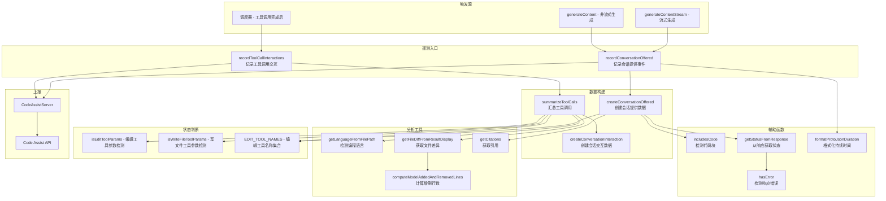

# telemetry.ts

## 概述

`telemetry.ts` 是 Gemini CLI 代码辅助模块的遥测（Telemetry）子系统，负责收集和上报用户与 AI 交互过程中的关键事件数据。该模块主要追踪两类核心事件：

1. **ConversationOffered（会话提供）**：当 AI 生成包含文件编辑工具调用的响应时，记录响应的状态、延迟、引用数量等信息。
2. **ConversationInteraction（会话交互）**：当用户对工具调用做出回应（接受/取消/出错）后，记录交互的结果、修改的行数、编程语言等信息。

这些遥测数据通过 `CodeAssistServer` 上报到 Google Cloud Code Assist API，用于监控服务质量、分析用户行为和改进产品体验。

## 架构图（Mermaid）



## 核心组件

### 1. `recordConversationOffered(server, traceId, response, streamingLatency, abortSignal, trajectoryId)` — 记录会话提供事件

**导出的异步函数**。在 `CodeAssistServer` 的 `generateContentStream` 和 `generateContent` 方法中被调用。

- 仅在存在 `traceId` 时记录
- 调用 `createConversationOffered` 构建事件数据
- 如果构建成功（响应包含编辑工具调用），通过 `server.recordConversationOffered` 上报
- 错误被捕获并通过 `debugLogger.warn` 记录，不会影响主流程

### 2. `recordToolCallInteractions(config, toolCalls)` — 记录工具调用交互

**导出的异步函数**。在工具调用完成后由调度器调用。

- 如果没有工具调用则直接返回
- 通过 `getCodeAssistServer(config)` 获取服务器实例
- 调用 `summarizeToolCalls` 将多个工具调用汇总为单个交互事件
- 通过 `server.recordConversationInteraction` 上报
- 错误被捕获并记录警告，不影响主流程

### 3. `createConversationOffered(response, traceId, signal, streamingLatency, trajectoryId)` — 创建会话提供数据

**导出函数**。构建 `ConversationOffered` 对象。

- **过滤条件**：仅对包含编辑工具调用（`EDIT_TOOL_NAMES`）的响应生成事件，非编辑工具调用不代表文件修改
- 返回的数据包含：
  - `citationCount`：引用数量（字符串）
  - `includedCode`：是否包含代码块
  - `status`：操作状态
  - `traceId`：追踪 ID
  - `streamingLatency`：流式延迟数据
  - `isAgentic`：始终为 `true`
  - `initiationMethod`：始终为 `COMMAND`
  - `trajectoryId`：轨迹 ID

### 4. `summarizeToolCalls(toolCalls)` — 汇总工具调用

**内部函数**。将多个 `CompletedToolCall` 汇总为单个 `ConversationInteraction`。

核心逻辑：
1. 遍历所有工具调用
2. **取消优先**：任何工具调用被取消，整个交互标记为 `CANCELLED`
3. **错误次优先**：任何工具调用出错，整个交互标记为 `ERROR_UNKNOWN`
4. 统计已接受的工具调用数量
5. 对编辑类工具调用：
   - 检测编程语言（取第一个有效的）
   - 从文件差异中计算添加行数和删除行数
   - `acceptedLines = addedLines + removedLines`
6. **输出条件**：需要同时满足三个条件才生成交互事件：
   - 存在 `traceId`
   - **100% 的工具调用都被接受**（`acceptedToolCalls / toolCalls.length >= 1`）
   - 至少一个工具调用是编辑操作

### 5. `createConversationInteraction(traceId, status, interaction, acceptedLines?, removedLines?, language?)` — 创建会话交互数据

**内部函数**。构建 `ConversationInteraction` 对象。

- `isAgentic` 始终为 `true`
- `initiationMethod` 始终为 `COMMAND`

### 6. 辅助函数

#### `includesCode(resp)` — 检测代码块

遍历响应的所有 candidate 的 content parts，检查是否有包含 ` ``` ` 的文本部分。

#### `getStatusFromResponse(response, signal)` — 从响应获取状态

按优先级判断状态：
1. `signal?.aborted` → `ACTION_STATUS_CANCELLED`
2. `hasError(response)` → `ACTION_STATUS_ERROR_UNKNOWN`
3. 无 candidates → `ACTION_STATUS_EMPTY`
4. 其他 → `ACTION_STATUS_NO_ERROR`

#### `hasError(response)` — 检测响应错误

两种错误情况：
1. SDK HTTP 响应不是 OK 状态（`!responseInternal?.ok`）
2. 任何 candidate 的 `finishReason` 不是 `STOP` 或 `MAX_TOKENS`（如 sanitization、SPII、recitation、forbidden terms）

#### `formatProtoJsonDuration(milliseconds)` — 格式化持续时间

**导出函数**。将毫秒数转换为 Proto JSON Duration 格式（如 `1.5s`）。

```typescript
export function formatProtoJsonDuration(milliseconds: number): string {
  return `${milliseconds / 1000}s`;
}
```

## 依赖关系

### 内部依赖

| 模块 | 导入内容 | 用途 |
|------|----------|------|
| `./types.js` | `ActionStatus`, `ConversationInteractionInteraction`, `InitiationMethod`, `ConversationInteraction`, `ConversationOffered`, `StreamingLatency` | 遥测数据类型和枚举 |
| `./codeAssist.js` | `getCodeAssistServer` | 获取 CodeAssistServer 实例 |
| `./server.js` | `CodeAssistServer`（类型） | 服务器类型引用 |
| `../scheduler/types.js` | `CompletedToolCall` | 已完成的工具调用类型 |
| `../config/config.js` | `Config` | 应用配置类型 |
| `../utils/debugLogger.js` | `debugLogger` | 调试日志记录器 |
| `../utils/generateContentResponseUtilities.js` | `getCitations` | 从响应中提取引用信息 |
| `../utils/errors.js` | `getErrorMessage` | 错误消息提取工具 |
| `../utils/language-detection.js` | `getLanguageFromFilePath` | 根据文件路径检测编程语言 |
| `../utils/fileDiffUtils.js` | `computeModelAddedAndRemovedLines`, `getFileDiffFromResultDisplay` | 文件差异分析工具 |
| `../tools/tool-names.js` | `EDIT_TOOL_NAMES` | 编辑类工具名称集合 |
| `../tools/edit.js` | `isEditToolParams` | 编辑工具参数类型守卫 |
| `../tools/write-file.js` | `isWriteFileToolParams` | 写文件工具参数类型守卫 |
| `../tools/tools.js` | `ToolConfirmationOutcome` | 工具确认结果枚举 |

### 外部依赖

| 包名 | 导入内容 | 用途 |
|------|----------|------|
| `@google/genai` | `FinishReason`, `GenerateContentResponse` | GenAI SDK 类型，用于分析响应结构 |

## 关键实现细节

1. **事件 1:1 对应**：设计上确保 `ConversationOffered` 和 `ConversationInteraction` 事件在遥测中是 1:1 关系。`summarizeToolCalls` 将多个工具调用汇总为单个交互事件，而非为每个工具调用生成独立事件。

2. **仅追踪编辑操作**：遥测只关注文件编辑相关的工具调用（通过 `EDIT_TOOL_NAMES` 集合判断），非编辑操作（如搜索、读取）不触发遥测事件。这是因为只有文件修改才被视为有意义的 "conversation offered" 事件。

3. **悲观状态策略**：`summarizeToolCalls` 对状态采用悲观策略——任何一个工具调用被取消或出错，整个交互都被标记为对应的错误状态，即使其他工具调用成功完成。

4. **严格的接受条件**：只有当 100% 的工具调用都被接受且至少包含一个编辑操作时，才会生成 `ConversationInteraction` 事件。部分接受的场景不会产生遥测数据。

5. **静默错误处理**：所有遥测记录函数都使用 try-catch 包裹，错误仅记录警告日志，确保遥测失败不会影响用户的正常使用体验。

6. **错误判定逻辑**：`hasError` 将 SDK HTTP 非 OK 状态和非正常终止原因（STOP/MAX_TOKENS 以外）都视为错误。这包括内容审核（sanitization）、敏感信息（SPII）、引用检测（recitation）和禁止术语（forbidden terms）等安全过滤。

7. **行数统计方式**：API 期望 `acceptedLines` 是 `addedLines + removedLines` 的总和，而非仅新增行数。`removedLines` 单独报告。这种方式能更准确地反映 AI 建议的影响范围。

8. **语言检测策略**：从工具调用参数的 `file_path` 中推断编程语言，只取第一个有效结果，后续编辑工具调用的语言检测被跳过（通过 `!language` 条件）。
