# types.ts

## 概述

`types.ts` 是 Gemini CLI 代码辅助模块的核心类型定义文件，集中定义了与 Google Cloud Code Assist API 交互所需的全部接口、枚举、类型别名和 Zod 验证 Schema。它涵盖了以下几大领域：

1. **客户端元数据**：IDE 类型、平台、插件类型等标识信息
2. **积分系统**：AI Credits 的类型定义
3. **用户等级**：用户层级、资格判断、不合格原因
4. **请求/响应结构**：加载配置、用户注册、配额查询、全局设置等 API 的数据结构
5. **遥测事件**：会话提供、会话交互、操作状态等遥测数据结构
6. **管理员控制**：MCP 服务器配置、扩展设置、严格模式等管理功能的 Zod Schema

该文件是整个 code_assist 模块最基础的依赖，被 `server.ts`、`setup.ts`、`telemetry.ts` 等多个模块引用。

## 架构图（Mermaid）

```mermaid
graph TB
    subgraph 客户端元数据
        CM[ClientMetadata - 客户端元数据]
        CMIT[ClientMetadataIdeType - IDE 类型]
        CMP[ClientMetadataPlatform - 平台类型]
        CMPT[ClientMetadataPluginType - 插件类型]
        CM --> CMIT
        CM --> CMP
        CM --> CMPT
    end

    subgraph 积分系统
        CT_TYPE[CreditType - 积分类型]
        CREDITS[Credits - 积分]
        AC[AvailableCredits - 可用积分]
        CC[ConsumedCredits - 已消耗积分]
        RC[RemainingCredits - 剩余积分]
        CREDITS --> CT_TYPE
        AC -.->|别名| CREDITS
        CC -.->|别名| CREDITS
        RC -.->|别名| CREDITS
    end

    subgraph 用户等级系统
        UTI[UserTierId - 用户等级 ID<br/>free / legacy / standard]
        GUT[GeminiUserTier - 用户等级详情]
        IT[IneligibleTier - 不合格等级]
        ITRC[IneligibleTierReasonCode - 不合格原因码]
        PN[PrivacyNotice - 隐私通知]
        GUT --> UTI
        GUT --> PN
        GUT --> AC
        IT --> ITRC
        IT --> UTI
    end

    subgraph 加载配置 API
        LCAR[LoadCodeAssistRequest - 加载请求]
        LCAResp[LoadCodeAssistResponse - 加载响应]
        LCAM[LoadCodeAssistMode - 加载模式]
        LCAR --> CM
        LCAR --> LCAM
        LCAResp --> GUT
        LCAResp --> IT
    end

    subgraph 注册 API
        OUR[OnboardUserRequest - 注册请求]
        LROR[LongRunningOperationResponse - LRO 响应]
        OUResp[OnboardUserResponse - 注册响应]
        OUSC[OnboardUserStatusCode - 注册状态码]
        OUS[OnboardUserStatus - 注册状态]
        HLURL[HelpLinkUrl - 帮助链接]
        OUR --> CM
        LROR --> OUResp
        OUS --> OUSC
        OUS --> HLURL
    end

    subgraph 配额与设置 API
        RUQR[RetrieveUserQuotaRequest - 配额查询请求]
        RUQResp[RetrieveUserQuotaResponse - 配额查询响应]
        BI[BucketInfo - 配额桶信息]
        SCGUSR[SetCodeAssistGlobalUserSettingRequest - 设置请求]
        CAGUSResp[CodeAssistGlobalUserSettingResponse - 设置响应]
        RUQResp --> BI
    end

    subgraph 遥测系统
        RCAMR[RecordCodeAssistMetricsRequest - 指标记录请求]
        CAM[CodeAssistMetric - 代码辅助指标]
        CO[ConversationOffered - 会话提供]
        CI[ConversationInteraction - 会话交互]
        AS[ActionStatus - 操作状态枚举]
        CII[ConversationInteractionInteraction - 交互类型枚举]
        IM[InitiationMethod - 启动方法枚举]
        SL[StreamingLatency - 流式延迟]
        RCAMR --> CAM
        RCAMR --> CM
        CAM --> CO
        CAM --> CI
        CO --> AS
        CO --> SL
        CO --> IM
        CI --> AS
        CI --> CII
        CI --> IM
    end

    subgraph 管理员控制
        FACR[FetchAdminControlsRequest - 获取管理控制请求]
        FACResp[FetchAdminControlsResponse - 获取管理控制响应]
        ACS[AdminControlsSettings - 管理控制设置]
        MCD[McpConfigDefinition - MCP 配置定义]
        RMSC[RequiredMcpServerConfig - 必需 MCP 服务器配置]
        FACResp --> ACS
        ACS --> MCD
        MCD --> RMSC
    end

    subgraph 错误处理
        GRPC[GoogleRpcResponse - RPC 响应]
        GRPCE[GoogleRpcErrorInfo - RPC 错误信息]
        GRPC --> GRPCE
    end
```



## 核心组件

### 1. 客户端元数据类型

#### `ClientMetadata` 接口

描述客户端（IDE/CLI）的身份信息，用于 API 请求中标识调用方。

| 字段 | 类型 | 说明 |
|------|------|------|
| `ideType` | `ClientMetadataIdeType` | IDE 类型（VSCode、IntelliJ、Cloud Shell、Gemini CLI 等） |
| `ideVersion` | `string` | IDE 版本号 |
| `pluginVersion` | `string` | 插件版本号 |
| `platform` | `ClientMetadataPlatform` | 运行平台（Darwin/Linux/Windows + AMD64/ARM64） |
| `updateChannel` | `string` | 更新渠道 |
| `duetProject` | `string` | Duet 项目 ID |
| `pluginType` | `ClientMetadataPluginType` | 插件类型（Cloud Code、Gemini 等） |
| `ideName` | `string` | IDE 名称 |

#### `ClientMetadataIdeType` 类型

字面量联合类型：`'IDE_UNSPECIFIED' | 'VSCODE' | 'INTELLIJ' | 'VSCODE_CLOUD_WORKSTATION' | 'INTELLIJ_CLOUD_WORKSTATION' | 'CLOUD_SHELL' | 'GEMINI_CLI'`

#### `ClientMetadataPlatform` 类型

字面量联合类型：`'PLATFORM_UNSPECIFIED' | 'DARWIN_AMD64' | 'DARWIN_ARM64' | 'LINUX_AMD64' | 'LINUX_ARM64' | 'WINDOWS_AMD64'`

#### `ClientMetadataPluginType` 类型

字面量联合类型：`'PLUGIN_UNSPECIFIED' | 'CLOUD_CODE' | 'GEMINI' | 'AIPLUGIN_INTELLIJ' | 'AIPLUGIN_STUDIO'`

### 2. 积分系统类型

#### `CreditType` 类型

```typescript
export type CreditType = 'CREDIT_TYPE_UNSPECIFIED' | 'GOOGLE_ONE_AI';
```

积分类型，目前支持 `GOOGLE_ONE_AI`（Google One AI 积分）。

#### `Credits` 接口

```typescript
export interface Credits {
  creditType: CreditType;
  creditAmount: string; // int64 以字符串表示
}
```

表示特定类型的积分金额。`creditAmount` 使用字符串而非数字，因为 JSON 中 int64 精度问题。

#### 类型别名

- `AvailableCredits = Credits` — 可用积分上下文
- `ConsumedCredits = Credits` — 已消耗积分上下文
- `RemainingCredits = Credits` — 剩余积分上下文

语义上相同，通过别名提高代码可读性。

### 3. 用户等级系统

#### `UserTierId` 常量与类型

```typescript
export const UserTierId = {
  FREE: 'free-tier',
  LEGACY: 'legacy-tier',
  STANDARD: 'standard-tier',
} as const;

export type UserTierId = (typeof UserTierId)[keyof typeof UserTierId] | string;
```

采用 `const as const` + 同名类型的模式，既提供运行时常量值，又允许接收服务端返回的其他字符串值。预定义的三个等级：
- `FREE`（`free-tier`）：免费等级
- `LEGACY`（`legacy-tier`）：旧版等级
- `STANDARD`（`standard-tier`）：标准等级

#### `GeminiUserTier` 接口

用户等级的完整信息。

| 字段 | 类型 | 说明 |
|------|------|------|
| `id` | `UserTierId` | 等级 ID |
| `name` | `string` | 等级名称 |
| `description` | `string` | 等级描述 |
| `userDefinedCloudaicompanionProject` | `boolean \| null` | 该等级是否要求用户在 IDE 设置中配置项目 |
| `isDefault` | `boolean` | 是否为默认等级 |
| `privacyNotice` | `PrivacyNotice` | 隐私通知 |
| `hasAcceptedTos` | `boolean` | 是否已接受服务条款 |
| `hasOnboardedPreviously` | `boolean` | 是否此前已注册 |
| `availableCredits` | `AvailableCredits[]` | 可用的 AI 积分列表 |

#### `IneligibleTier` 接口

不合格等级信息，包含原因和验证链接。

| 字段 | 类型 | 说明 |
|------|------|------|
| `reasonCode` | `IneligibleTierReasonCode` | 不合格原因码 |
| `reasonMessage` | `string` | 用户可见的原因消息 |
| `tierId` | `UserTierId` | 等级 ID |
| `tierName` | `string` | 等级名称 |
| `validationErrorMessage` | `string` | 验证错误消息 |
| `validationUrl` | `string` | 验证 URL |
| `validationUrlLinkText` | `string` | 验证链接文字 |
| `validationLearnMoreUrl` | `string` | 了解更多链接 |
| `validationLearnMoreLinkText` | `string` | 了解更多链接文字 |

#### `IneligibleTierReasonCode` 枚举

```typescript
export enum IneligibleTierReasonCode {
  DASHER_USER = 'DASHER_USER',           // Dasher 域用户
  INELIGIBLE_ACCOUNT = 'INELIGIBLE_ACCOUNT', // 不合格账户
  NON_USER_ACCOUNT = 'NON_USER_ACCOUNT', // 非用户账户
  RESTRICTED_AGE = 'RESTRICTED_AGE',     // 年龄限制
  RESTRICTED_NETWORK = 'RESTRICTED_NETWORK', // 网络限制
  UNKNOWN = 'UNKNOWN',                   // 未知原因
  UNKNOWN_LOCATION = 'UNKNOWN_LOCATION', // 未知位置
  UNSUPPORTED_LOCATION = 'UNSUPPORTED_LOCATION', // 不支持的位置
  VALIDATION_REQUIRED = 'VALIDATION_REQUIRED', // 需要账户验证
}
```

#### `PrivacyNotice` 接口

隐私通知信息，包含是否显示通知及通知文本。

### 4. 加载配置 API 类型

#### `LoadCodeAssistRequest` 接口

| 字段 | 类型 | 说明 |
|------|------|------|
| `cloudaicompanionProject` | `string?` | Cloud AI Companion 项目 ID |
| `metadata` | `ClientMetadata` | 客户端元数据 |
| `mode` | `LoadCodeAssistMode?` | 加载模式（未指定/完整检查/健康检查） |

#### `LoadCodeAssistMode` 类型

```typescript
'MODE_UNSPECIFIED' | 'FULL_ELIGIBILITY_CHECK' | 'HEALTH_CHECK'
```

#### `LoadCodeAssistResponse` 接口

API 响应的核心结构，决定用户的等级和注册流程。

| 字段 | 类型 | 说明 |
|------|------|------|
| `currentTier` | `GeminiUserTier \| null` | 当前等级（已注册用户） |
| `allowedTiers` | `GeminiUserTier[] \| null` | 允许注册的等级列表 |
| `ineligibleTiers` | `IneligibleTier[] \| null` | 不合格等级列表 |
| `cloudaicompanionProject` | `string \| null` | 服务端分配的项目 ID |
| `paidTier` | `GeminiUserTier \| null` | 付费等级信息 |

### 5. 注册 API 类型

#### `OnboardUserRequest` 接口

用户注册请求。

#### `LongRunningOperationResponse` 接口

长时间运行操作的响应，支持轮询查询操作是否完成。

| 字段 | 类型 | 说明 |
|------|------|------|
| `name` | `string?` | 操作名称（用于轮询） |
| `done` | `boolean?` | 是否完成 |
| `response` | `OnboardUserResponse?` | 完成后的注册响应 |

#### `OnboardUserResponse` 接口

注册完成后的响应，包含分配的 Cloud AI Companion 项目信息。

#### `OnboardUserStatusCode` 枚举

注册状态码：`Default`、`Notice`、`Warning`、`Error`。

#### `OnboardUserStatus` 接口

注册状态信息，包含状态码、显示消息和帮助链接。

### 6. 配额与设置 API 类型

#### `RetrieveUserQuotaRequest` / `RetrieveUserQuotaResponse`

用户配额查询，响应中包含 `BucketInfo[]` 配额桶信息。

#### `BucketInfo` 接口

| 字段 | 类型 | 说明 |
|------|------|------|
| `remainingAmount` | `string?` | 剩余额度 |
| `remainingFraction` | `number?` | 剩余比例 |
| `resetTime` | `string?` | 重置时间 |
| `tokenType` | `string?` | Token 类型 |
| `modelId` | `string?` | 模型 ID |

#### `SetCodeAssistGlobalUserSettingRequest` / `CodeAssistGlobalUserSettingResponse`

全局用户设置的请求和响应，包含项目 ID 和免费等级数据收集授权。

### 7. 遥测系统类型

#### `RecordCodeAssistMetricsRequest` 接口

指标记录请求，包含项目 ID、请求 ID、客户端元数据和指标列表。

#### `CodeAssistMetric` 接口

单个指标条目，携带时间戳和元数据，每个指标只能包含 `conversationOffered` 或 `conversationInteraction` 之一。

#### `ConversationInteractionInteraction` 枚举

交互类型，包含 10 种交互方式：

| 值 | 枚举 | 说明 |
|-----|------|------|
| 0 | `UNKNOWN` | 未知 |
| 1 | `THUMBSUP` | 点赞 |
| 2 | `THUMBSDOWN` | 点踩 |
| 3 | `COPY` | 复制 |
| 4 | `INSERT` | 插入 |
| 5 | `ACCEPT_CODE_BLOCK` | 接受代码块 |
| 6 | `ACCEPT_ALL` | 全部接受 |
| 7 | `ACCEPT_FILE` | 接受文件修改 |
| 8 | `DIFF` | 查看差异 |
| 9 | `ACCEPT_RANGE` | 接受范围 |

#### `ActionStatus` 枚举

操作状态，包含 5 种状态：

| 值 | 枚举 | 说明 |
|-----|------|------|
| 0 | `ACTION_STATUS_UNSPECIFIED` | 未指定 |
| 1 | `ACTION_STATUS_NO_ERROR` | 无错误 |
| 2 | `ACTION_STATUS_ERROR_UNKNOWN` | 未知错误 |
| 3 | `ACTION_STATUS_CANCELLED` | 已取消 |
| 4 | `ACTION_STATUS_EMPTY` | 空响应 |

#### `InitiationMethod` 枚举

启动方式：

| 值 | 枚举 | 说明 |
|-----|------|------|
| 0 | `INITIATION_METHOD_UNSPECIFIED` | 未指定 |
| 1 | `TAB` | Tab 键触发 |
| 2 | `COMMAND` | 命令触发 |
| 3 | `AGENT` | 代理触发 |

#### `ConversationOffered` 接口

会话提供事件数据结构。

| 字段 | 类型 | 说明 |
|------|------|------|
| `citationCount` | `string?` | 引用数量 |
| `includedCode` | `boolean?` | 是否包含代码 |
| `status` | `ActionStatus?` | 操作状态 |
| `traceId` | `string?` | 追踪 ID |
| `streamingLatency` | `StreamingLatency?` | 流式延迟 |
| `isAgentic` | `boolean?` | 是否为 Agent 模式 |
| `initiationMethod` | `InitiationMethod?` | 启动方式 |
| `trajectoryId` | `string?` | 轨迹 ID |

#### `StreamingLatency` 接口

```typescript
export interface StreamingLatency {
  firstMessageLatency?: string;  // 首条消息延迟（Proto JSON Duration 格式）
  totalLatency?: string;         // 总延迟
}
```

#### `ConversationInteraction` 接口

会话交互事件数据结构。

| 字段 | 类型 | 说明 |
|------|------|------|
| `traceId` | `string` | 追踪 ID（必填） |
| `status` | `ActionStatus?` | 操作状态 |
| `interaction` | `ConversationInteractionInteraction?` | 交互类型 |
| `acceptedLines` | `string?` | 接受的行数 |
| `removedLines` | `string?` | 删除的行数 |
| `language` | `string?` | 编程语言 |
| `isAgentic` | `boolean?` | 是否为 Agent 模式 |
| `initiationMethod` | `InitiationMethod?` | 启动方式 |

### 8. 管理员控制类型（Zod Schema）

#### `FetchAdminControlsRequest` 接口

仅包含 `project: string`。

#### `FetchAdminControlsResponse` / `FetchAdminControlsResponseSchema`

Zod 验证 Schema，用于运行时验证 API 响应。

| 字段 | 类型 | 说明 |
|------|------|------|
| `secureModeEnabled` | `boolean?` | 安全模式（待废弃） |
| `strictModeDisabled` | `boolean?` | 严格模式是否禁用 |
| `mcpSetting` | `McpSettingSchema?` | MCP 设置 |
| `cliFeatureSetting` | `CliFeatureSettingSchema?` | CLI 功能设置 |
| `adminControlsApplicable` | `boolean?` | 管理控制是否适用 |

#### `AdminControlsSettings` / `AdminControlsSettingsSchema`

内部应用使用的管理控制设置（已解析 MCP 配置）。

| 字段 | 类型 | 说明 |
|------|------|------|
| `strictModeDisabled` | `boolean?` | 严格模式是否禁用 |
| `mcpSetting.mcpEnabled` | `boolean?` | MCP 是否启用 |
| `mcpSetting.mcpConfig` | `McpConfigDefinition?` | MCP 配置（已解析） |
| `mcpSetting.requiredMcpConfig` | `Record<string, RequiredMcpServerConfig>?` | 必需 MCP 配置 |
| `cliFeatureSetting` | `CliFeatureSettingSchema?` | CLI 功能设置 |

#### `McpConfigDefinition` / `McpConfigDefinitionSchema`

MCP 配置定义，包含可选 MCP 服务器和必需 MCP 服务器。

#### `RequiredMcpServerConfig` / `RequiredMcpServerConfigSchema`

必需 MCP 服务器的完整配置。

| 字段 | 类型 | 说明 |
|------|------|------|
| `url` | `string` | 连接地址（必填） |
| `type` | `'sse' \| 'http'` | 连接类型（必填） |
| `authProviderType` | `AuthProviderType?` | 认证提供者类型 |
| `oauth` | `RequiredMcpServerOAuth?` | OAuth 配置 |
| `targetAudience` | `string?` | 目标受众 |
| `targetServiceAccount` | `string?` | 目标服务账号 |
| `headers` | `Record<string, string>?` | 自定义请求头 |
| `trust` | `boolean?` | 是否信任 |
| `timeout` | `number?` | 超时时间 |
| `description` | `string?` | 描述 |
| `includeTools` | `string[]?` | 包含的工具列表 |
| `excludeTools` | `string[]?` | 排除的工具列表 |

#### 内部 Zod Schema

- `ExtensionsSettingSchema`：扩展设置，包含 `extensionsEnabled`
- `CliFeatureSettingSchema`：CLI 功能设置，包含扩展设置和非托管能力开关
- `McpServerConfigSchema`：可选 MCP 服务器配置
- `RequiredMcpServerOAuthSchema`：必需 MCP 服务器的 OAuth 配置
- `McpSettingSchema`：MCP 设置，包含启用状态和 JSON 配置字符串

### 9. 错误处理类型

#### `GoogleRpcResponse` 接口

Google RPC 响应的相关字段，包含嵌套的 `error.details` 错误详情数组。

#### `GoogleRpcErrorInfo` 接口（内部）

RPC 错误详情中的单个条目，包含 `reason` 字段。

## 依赖关系

### 内部依赖

| 模块 | 导入内容 | 用途 |
|------|----------|------|
| `../config/config.js` | `AuthProviderType` | 认证提供者类型枚举，用于 MCP 服务器配置 |

### 外部依赖

| 包名 | 导入内容 | 用途 |
|------|----------|------|
| `zod` | `z` | 运行时类型验证，用于管理员控制和 MCP 配置的 Schema 定义 |

## 关键实现细节

1. **UserTierId 的双重定义模式**：使用 `const as const` 定义运行时常量对象，同时用同名类型 `(typeof UserTierId)[keyof typeof UserTierId] | string` 定义类型。`| string` 的联合确保类型系统能接受服务端返回的未预定义等级 ID，体现了防御性编程思想。

2. **Zod Schema 用于运行时验证**：管理员控制相关的类型同时定义了 Zod Schema（如 `FetchAdminControlsResponseSchema`）和 TypeScript 类型（通过 `z.infer<>`）。Schema 用于在运行时验证 API 响应的结构正确性，而 TypeScript 类型用于编译时类型检查。

3. **Credits 的字符串表示**：`creditAmount` 使用 `string` 而非 `number`，因为 Protocol Buffer 的 int64 在 JSON 序列化时使用字符串以避免 JavaScript Number 精度丢失问题。

4. **两层 MCP 配置设计**：
   - `FetchAdminControlsResponse` 中的 `mcpSetting.mcpConfigJson` 是原始 JSON 字符串
   - `AdminControlsSettings` 中的 `mcpSetting.mcpConfig` 是已解析的 `McpConfigDefinition` 对象
   - 这种分层设计将 API 原始响应与应用内部使用分离

5. **枚举值的数字编码**：`ConversationInteractionInteraction`、`ActionStatus`、`InitiationMethod` 使用数字枚举值（0, 1, 2...），与 Protocol Buffer 的枚举编码方式一致，便于与后端 API 交互。

6. **nullable 字段模式**：多个接口字段使用 `T | null` 而非简单的 `T?`（如 `LoadCodeAssistResponse` 中的字段）。这是因为 JSON 中 `null` 和 `undefined` 是不同的——`null` 表示字段存在但值为空，`undefined` 表示字段不存在。

7. **secureModeEnabled 的废弃标记**：`FetchAdminControlsResponseSchema` 中的 `secureModeEnabled` 字段带有 TODO 注释标记为待废弃，说明后端 API 正在迁移，该字段将被 `strictModeDisabled` 替代。
