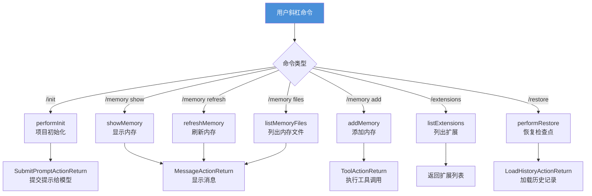
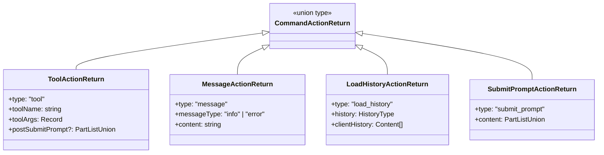
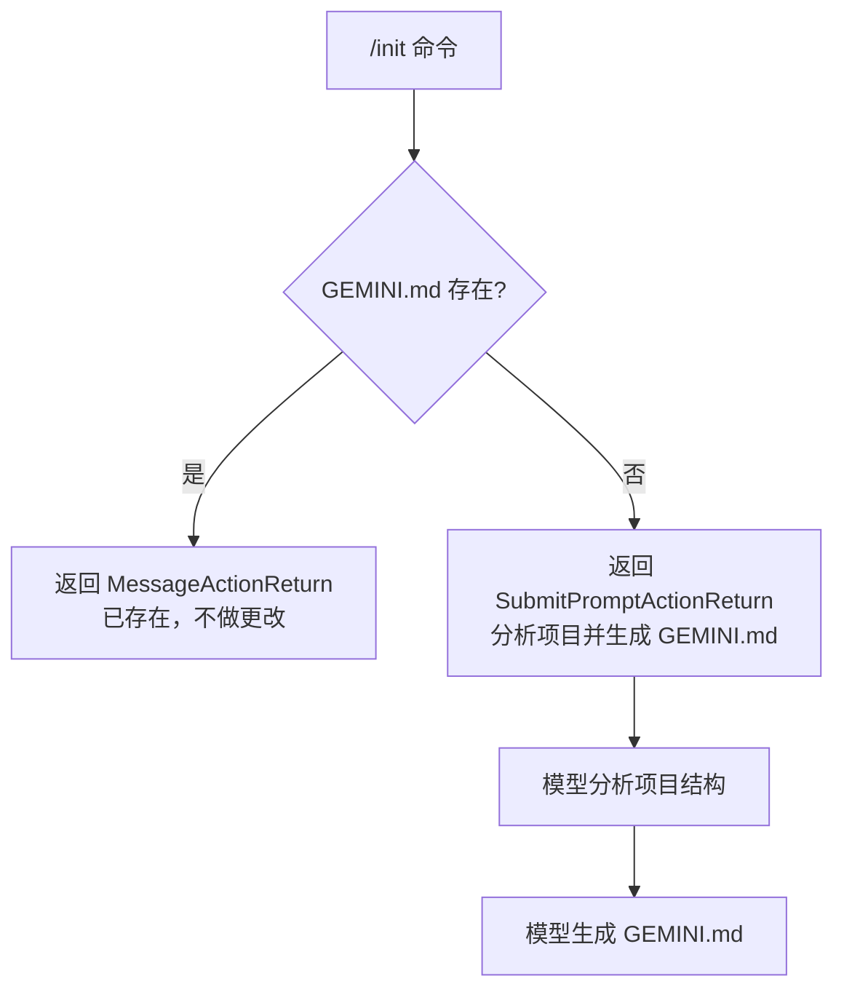
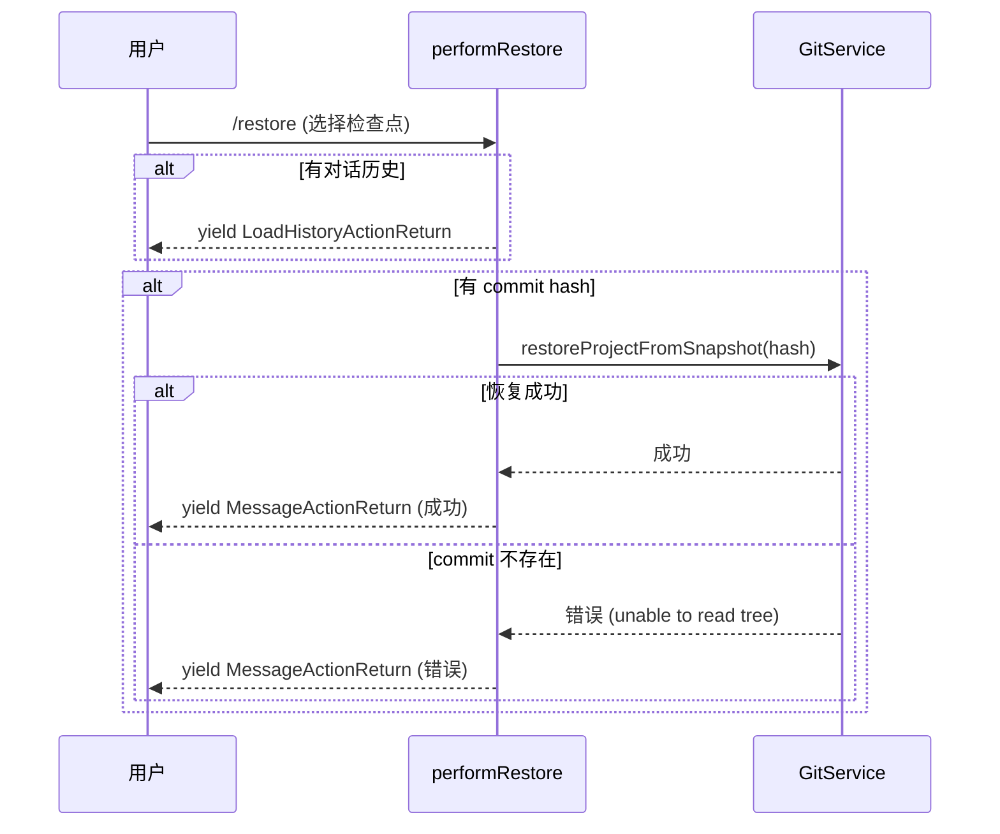

# commands

## 概述

`commands` 模块负责 Gemini CLI 的**内建命令处理**。它定义了用户可以在交互式会话中通过斜杠命令（如 `/init`、`/memory`、`/restore`）触发的操作。每个命令返回统一的 `CommandActionReturn` 类型，指示 CLI 应该执行工具调用、显示消息、加载历史记录还是提交提示给模型。

## 目录结构

```
commands/
├── types.ts           # 命令操作返回类型定义
├── extensions.ts      # 扩展列表命令
├── extensions.test.ts
├── init.ts            # 项目初始化命令（生成 GEMINI.md）
├── init.test.ts
├── memory.ts          # 内存管理命令（查看/添加/刷新/列表）
├── memory.test.ts
├── restore.ts         # 检查点恢复命令
└── restore.test.ts
```

## 架构图





## 核心组件

### types.ts（命令操作返回类型）

定义四种命令操作返回类型：

| 类型 | `type` 值 | 说明 | 关键字段 |
|------|-----------|------|----------|
| `ToolActionReturn` | `"tool"` | 触发工具调用 | `toolName`、`toolArgs`、`postSubmitPrompt`（可选后续提示） |
| `MessageActionReturn` | `"message"` | 显示消息 | `messageType`（info/error）、`content` |
| `LoadHistoryActionReturn` | `"load_history"` | 替换对话历史 | `history`（UI 历史）、`clientHistory`（GenAI 客户端历史） |
| `SubmitPromptActionReturn` | `"submit_prompt"` | 提交内容给模型 | `content`（PartListUnion） |

### init.ts（项目初始化命令）

**`performInit(doesGeminiMdExist)`** - 处理 `/init` 命令：
- 如果 `GEMINI.md` 已存在，返回信息消息（不做任何更改）
- 如果不存在，返回 `submit_prompt` 操作，将一段详细的分析提示提交给模型

**分析提示内容：**
1. 初始探索 - 列出文件和目录，读取 README
2. 迭代深入 - 选取最多 10 个关键文件进行阅读
3. 识别项目类型 - 代码项目 vs 非代码项目
4. 生成 GEMINI.md - 根据项目类型生成对应的文档内容

### memory.ts（内存管理命令）

提供四个内存管理函数：

**`showMemory(config)`** - 显示当前内存内容：
- 获取用户内存并扁平化
- 显示内存内容和关联的文件数量

**`addMemory(args)`** - 添加新的内存条目：
- 验证参数非空
- 返回 `tool` 操作，调用 `save_memory` 工具

**`refreshMemory(config)`** - 刷新内存：
- 支持两种刷新模式：JIT 上下文模式和服务端分层内存模式
- 刷新后更新系统指令

**`listMemoryFiles(config)`** - 列出所有 GEMINI.md 文件路径。

### restore.ts（检查点恢复命令）

**`performRestore(toolCallData, gitService)`** - 处理 `/restore` 命令（异步生成器）：
- 如果检查点包含历史数据，生成 `load_history` 操作恢复对话
- 如果包含 Git commit hash，调用 `gitService.restoreProjectFromSnapshot()` 恢复文件状态
- 处理 commit 不存在的情况（如仓库已重置或垃圾回收）

### extensions.ts（扩展列表命令）

**`listExtensions(config)`** - 简单地从配置中获取并返回扩展列表。

## 依赖关系

### 内部依赖

| 模块 | 用途 |
|------|------|
| `config/config` | 获取配置（扩展、内存、上下文管理器等） |
| `config/memory` | `flattenMemory()` 内存内容扁平化 |
| `services/gitService` | Git 服务（快照恢复） |
| `utils/checkpointUtils` | `ToolCallData` 检查点数据类型 |
| `utils/memoryDiscovery` | `refreshServerHierarchicalMemory()` 服务端内存刷新 |

### 外部依赖

| 包 | 用途 |
|---|------|
| `@google/genai` | Google GenAI SDK（`Content`、`PartListUnion` 类型） |

## 数据流

### /init 命令流程



### /restore 命令流程


