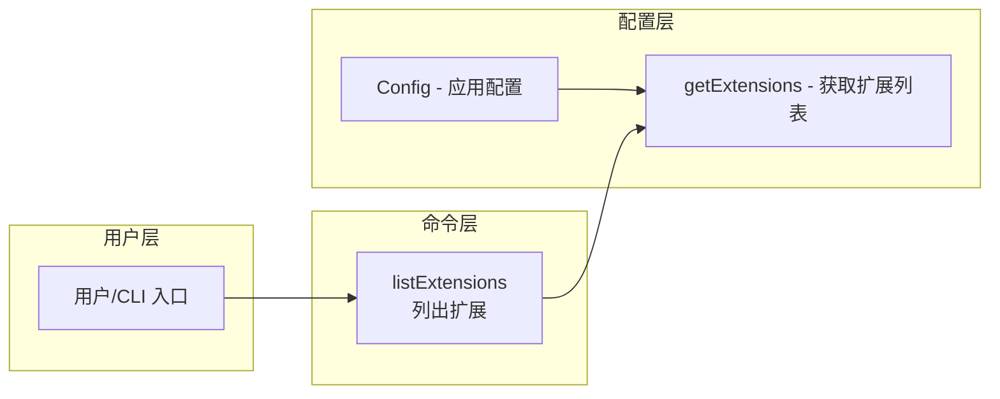

# extensions.ts

## 概述

`extensions.ts` 是 Gemini CLI 命令模块中的扩展管理命令文件，提供了一个简洁的扩展列表查询功能。该文件目前仅包含一个 `listExtensions` 函数，作为配置层 `Config.getExtensions()` 方法的命令层封装。它遵循命令模式（Command Pattern），将用户界面操作与底层配置读取逻辑解耦。

## 架构图（Mermaid）



## 核心组件

### `listExtensions(config: Config)` — 列出扩展

**导出函数**。接收 `Config` 配置对象，调用其 `getExtensions()` 方法并返回结果。

```typescript
export function listExtensions(config: Config) {
  return config.getExtensions();
}
```

**参数**：
- `config: Config` — 应用配置对象，提供扩展列表的数据来源

**返回值**：
- 返回 `Config.getExtensions()` 的结果（具体类型由 `Config` 接口定义）

**设计意图**：
- 作为命令层的薄封装，遵循关注点分离原则
- 将来可以在此层添加命令级别的逻辑（如格式化输出、过滤、权限检查等），而无需修改配置层
- 保持命令接口的一致性，所有命令函数都接收 `Config` 参数

## 依赖关系

### 内部依赖

| 模块 | 导入内容 | 用途 |
|------|----------|------|
| `../config/config.js` | `Config`（类型） | 应用配置接口，提供 `getExtensions()` 方法 |

### 外部依赖

无。该文件不依赖任何外部包。

## 关键实现细节

1. **极简设计**：整个文件仅 11 行代码（含许可证头），体现了单一职责原则。函数本身是一个简单的委托调用，不包含任何业务逻辑。

2. **命令层封装模式**：作为 `commands/` 目录下的文件，它遵循项目的命令组织约定——每个命令文件导出一个或多个函数，接收 `Config` 作为参数，委托给配置层或服务层执行实际逻辑。这种分层使得命令的测试和扩展更加灵活。

3. **类型导入**：使用 `import type` 导入 `Config`，确保在编译后的 JavaScript 中不会产生实际的模块引用，减小打包体积。

4. **扩展性预留**：尽管当前实现非常简单，但该文件为未来添加更多扩展管理功能（如安装、卸载、启用/禁用扩展等命令）预留了位置。
