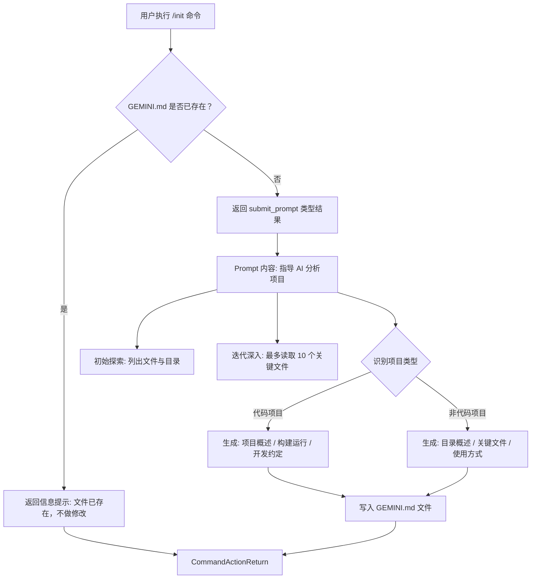

# init.ts

## 概述

`init.ts` 是 Gemini CLI 的初始化命令模块，负责实现 `/init` 命令的核心逻辑。该命令用于在当前工作目录中生成 `GEMINI.md` 项目配置文件。`GEMINI.md` 是一个为后续 AI 交互提供项目上下文的指导性文件，包含项目概述、构建运行方式、开发约定等信息。

该模块仅导出一个函数 `performInit`，根据当前目录是否已存在 `GEMINI.md` 文件来决定返回信息提示还是触发一个自动分析项目并生成文件的 prompt。

## 架构图（Mermaid）



## 核心组件

### `performInit(doesGeminiMdExist: boolean): CommandActionReturn`

这是模块唯一导出的函数，接收一个布尔参数并返回 `CommandActionReturn` 类型的结果。

#### 参数

| 参数名 | 类型 | 说明 |
|--------|------|------|
| `doesGeminiMdExist` | `boolean` | 标识当前工作目录中是否已存在 `GEMINI.md` 文件 |

#### 返回值

该函数有两种返回路径：

**路径一：文件已存在**

当 `doesGeminiMdExist` 为 `true` 时，返回一个 `message` 类型的结果：

```typescript
{
  type: 'message',
  messageType: 'info',
  content: 'A GEMINI.md file already exists in this directory. No changes were made.',
}
```

这表明不会覆盖已有的配置文件，是一种安全保护机制。

**路径二：文件不存在，生成 Prompt**

当 `doesGeminiMdExist` 为 `false` 时，返回一个 `submit_prompt` 类型的结果，其中 `content` 字段包含一段详细的 Prompt 指令，引导 AI 模型执行以下工作流程：

1. **初始探索**：列出当前目录结构，读取 README 文件获取高层概览
2. **迭代深入分析**：基于初始发现，逐步选择并阅读最多 10 个关键文件（如配置文件、主源码文件、文档等）
3. **项目类型识别**：
   - **代码项目**：通过检测 `package.json`、`requirements.txt`、`pom.xml`、`go.mod`、`Cargo.toml`、`build.gradle`、`src` 目录等文件来判断
   - **非代码项目**：如文档、研究论文、笔记等目录
4. **生成 GEMINI.md 内容**：
   - 代码项目：项目概述、构建运行命令、开发约定
   - 非代码项目：目录概述、关键文件列表、使用方式说明

### Prompt 工程细节

Prompt 设计体现了以下工程原则：

- **渐进式探索**：不要求一次性确定所有要读取的文件，而是通过发现引导后续探索
- **文件数量限制**：最多读取 10 个文件，平衡了分析深度与资源消耗
- **双轨分类**：区分代码项目和非代码项目，生成不同结构的文档
- **容错设计**：对于无法推断的构建命令，要求提供带 TODO 标记的占位符

## 依赖关系

### 内部依赖

| 依赖模块 | 导入内容 | 用途 |
|----------|----------|------|
| `./types.js` | `CommandActionReturn` (类型) | 定义函数返回值的类型约束 |

### 外部依赖

无外部依赖。该模块是一个纯函数模块，不依赖任何第三方库或 Node.js 内置模块。

## 关键实现细节

1. **纯函数设计**：`performInit` 是一个无副作用的纯函数，它不直接执行文件系统操作。文件存在性检查（`doesGeminiMdExist` 参数）由调用者在外部完成并传入，实际的文件生成则通过返回 `submit_prompt` 类型委托给上层调度系统处理。

2. **幂等安全**：当 `GEMINI.md` 已存在时，函数不会执行任何修改操作，返回友好的信息提示，避免意外覆盖用户已有的配置。

3. **命令-动作模式**：函数不直接执行操作，而是返回一个描述"应该做什么"的动作对象（`CommandActionReturn`）。这符合命令模式（Command Pattern）的设计思想，将动作的定义与执行解耦。调度系统根据返回的 `type` 字段（`'message'` 或 `'submit_prompt'`）决定后续流程。

4. **Prompt 作为配置**：生成 `GEMINI.md` 的逻辑并非硬编码在代码中，而是通过一段精心设计的 Prompt 委托给 AI 模型来完成。这意味着生成的文档内容可以根据不同项目自动适配，具有很高的灵活性。
