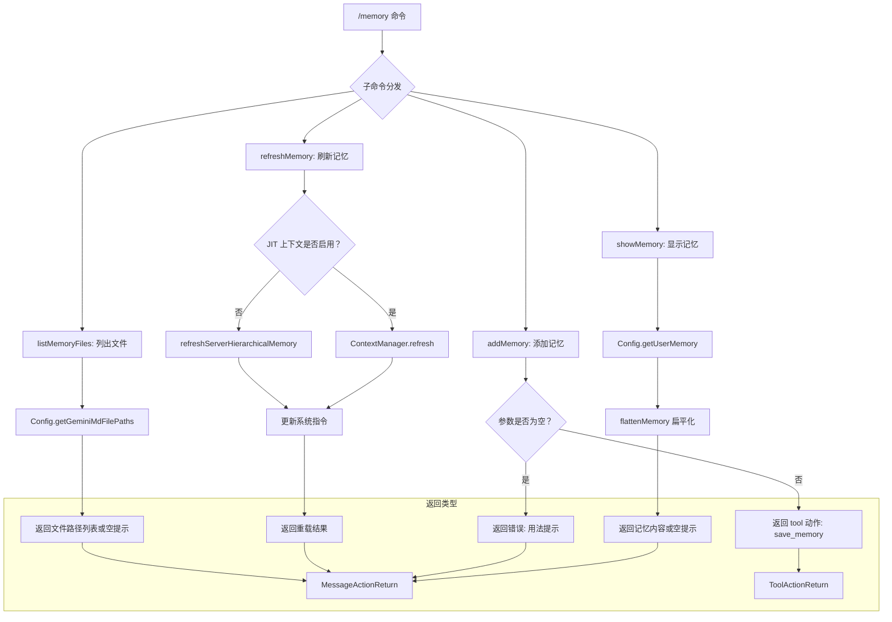

# memory.ts

## 概述

`memory.ts` 是 Gemini CLI 的记忆管理命令模块，实现了 `/memory` 命令的全部子功能。记忆系统（Memory System）是 Gemini CLI 的核心特性之一，它允许用户通过 `GEMINI.md` 文件以层级化的方式存储项目上下文信息，使 AI 在后续交互中能够持续了解项目背景。

该模块导出了四个函数，分别对应记忆的四种操作：
- `showMemory`：显示当前记忆内容
- `addMemory`：添加新的记忆条目
- `refreshMemory`：重新加载记忆内容
- `listMemoryFiles`：列出所有记忆文件路径

## 架构图（Mermaid）



## 核心组件

### `showMemory(config: Config): MessageActionReturn`

显示当前加载的记忆内容。

#### 逻辑流程

1. 调用 `config.getUserMemory()` 获取用户记忆的原始数据
2. 通过 `flattenMemory()` 将层级化的记忆结构扁平化为字符串
3. 调用 `config.getGeminiMdFileCount()` 获取记忆文件数量
4. 根据记忆内容是否为空，返回不同的信息提示：
   - 有内容：显示来源文件数量及完整记忆内容（用分割线包裹）
   - 无内容：提示 "Memory is currently empty."

#### 返回格式示例

```
Current memory content from 3 file(s):

---
<扁平化的记忆内容>
---
```

---

### `addMemory(args?: string): MessageActionReturn | ToolActionReturn`

添加新的记忆条目到持久化存储。

#### 参数

| 参数名 | 类型 | 说明 |
|--------|------|------|
| `args` | `string \| undefined` | 要记忆的文本内容 |

#### 逻辑流程

1. 验证 `args` 参数：如果为空或仅包含空白字符，返回错误提示（附带用法说明）
2. 参数有效时，返回一个 `ToolActionReturn` 类型的动作对象，委托 `save_memory` 工具来完成实际的存储操作

#### 返回值

- **参数无效时**：返回 `MessageActionReturn`（type: `'message'`，messageType: `'error'`）
- **参数有效时**：返回 `ToolActionReturn`：
  ```typescript
  {
    type: 'tool',
    toolName: 'save_memory',
    toolArgs: { fact: args.trim() },
  }
  ```

这是模块中唯一一个可能返回 `ToolActionReturn` 的函数，因为添加记忆需要调用实际的工具来执行文件写入操作。

---

### `refreshMemory(config: Config): Promise<MessageActionReturn>`

异步重新加载记忆内容，是模块中唯一的异步函数。

#### 逻辑流程

1. **判断 JIT 上下文模式**：
   - **JIT 启用**（`config.isJitContextEnabled()` 为 `true`）：
     - 调用 `config.getContextManager()?.refresh()` 刷新上下文管理器
     - 从 config 中重新获取用户记忆并扁平化
     - 获取文件计数
   - **JIT 未启用**：
     - 调用 `refreshServerHierarchicalMemory(config)` 从服务端重新加载层级化记忆
     - 从返回结果中提取记忆内容和文件计数
2. 调用 `config.updateSystemInstructionIfInitialized()` 更新系统指令，确保 AI 使用最新的记忆上下文
3. 根据记忆内容是否为空，返回包含字符数和文件数的成功提示

#### JIT 上下文 vs 服务端记忆

这个函数揭示了记忆系统的双重架构：
- **JIT（Just-In-Time）上下文**：通过 `ContextManager` 在客户端按需加载和管理上下文
- **服务端层级化记忆**：通过 `refreshServerHierarchicalMemory` 从文件系统递归发现并加载 `GEMINI.md` 文件

---

### `listMemoryFiles(config: Config): MessageActionReturn`

列出当前正在使用的所有 `GEMINI.md` 文件路径。

#### 逻辑流程

1. 调用 `config.getGeminiMdFilePaths()` 获取所有文件路径数组
2. 根据文件数量返回不同信息：
   - 有文件：显示文件数量和逐行列出的文件路径
   - 无文件：提示 "No GEMINI.md files in use."

#### 返回格式示例

```
There are 3 GEMINI.md file(s) in use:

/home/user/project/GEMINI.md
/home/user/GEMINI.md
/home/user/project/src/GEMINI.md
```

## 依赖关系

### 内部依赖

| 依赖模块 | 导入内容 | 用途 |
|----------|----------|------|
| `../config/config.js` | `Config` (类型) | 应用配置对象，提供记忆数据访问接口 |
| `../config/memory.js` | `flattenMemory` | 将层级化记忆数据结构扁平化为字符串 |
| `../utils/memoryDiscovery.js` | `refreshServerHierarchicalMemory` | 从文件系统重新发现和加载层级化的 GEMINI.md 文件 |
| `./types.js` | `MessageActionReturn`, `ToolActionReturn` (类型) | 命令返回值类型定义 |

### 外部依赖

无外部依赖。该模块仅依赖项目内部模块。

## 关键实现细节

1. **命令-动作模式一致性**：与 `init.ts` 类似，所有函数都不直接执行副作用操作，而是返回描述性的动作对象。`showMemory`、`refreshMemory`、`listMemoryFiles` 返回消息类动作，`addMemory` 则返回工具调用类动作。

2. **双模式记忆刷新**：`refreshMemory` 函数内部根据 `isJitContextEnabled()` 标志走不同的刷新路径。JIT 模式使用 `ContextManager`，非 JIT 模式使用 `refreshServerHierarchicalMemory`。这体现了策略模式（Strategy Pattern）的思想，同一操作根据配置走不同实现。

3. **系统指令同步**：`refreshMemory` 在重新加载记忆后，会调用 `config.updateSystemInstructionIfInitialized()` 确保系统指令（System Instruction）与最新的记忆内容保持同步。这意味着记忆变更会实时影响 AI 的行为。

4. **可选链安全访问**：`config.getContextManager()?.refresh()` 使用了可选链操作符，表明 `ContextManager` 可能为 `null` 或 `undefined`，代码对此做了防御性处理。

5. **工具委托模式**：`addMemory` 并不自行实现记忆存储逻辑，而是通过返回 `{ type: 'tool', toolName: 'save_memory', toolArgs: { fact: ... } }` 将实际的存储操作委托给名为 `save_memory` 的工具。这种设计使得记忆的读取（纯查询）和写入（工具调用）在架构上清晰分离。

6. **`flattenMemory` 的统一使用**：`showMemory` 和 `refreshMemory` 都使用 `flattenMemory` 函数来处理记忆数据，确保记忆内容的输出格式一致。
