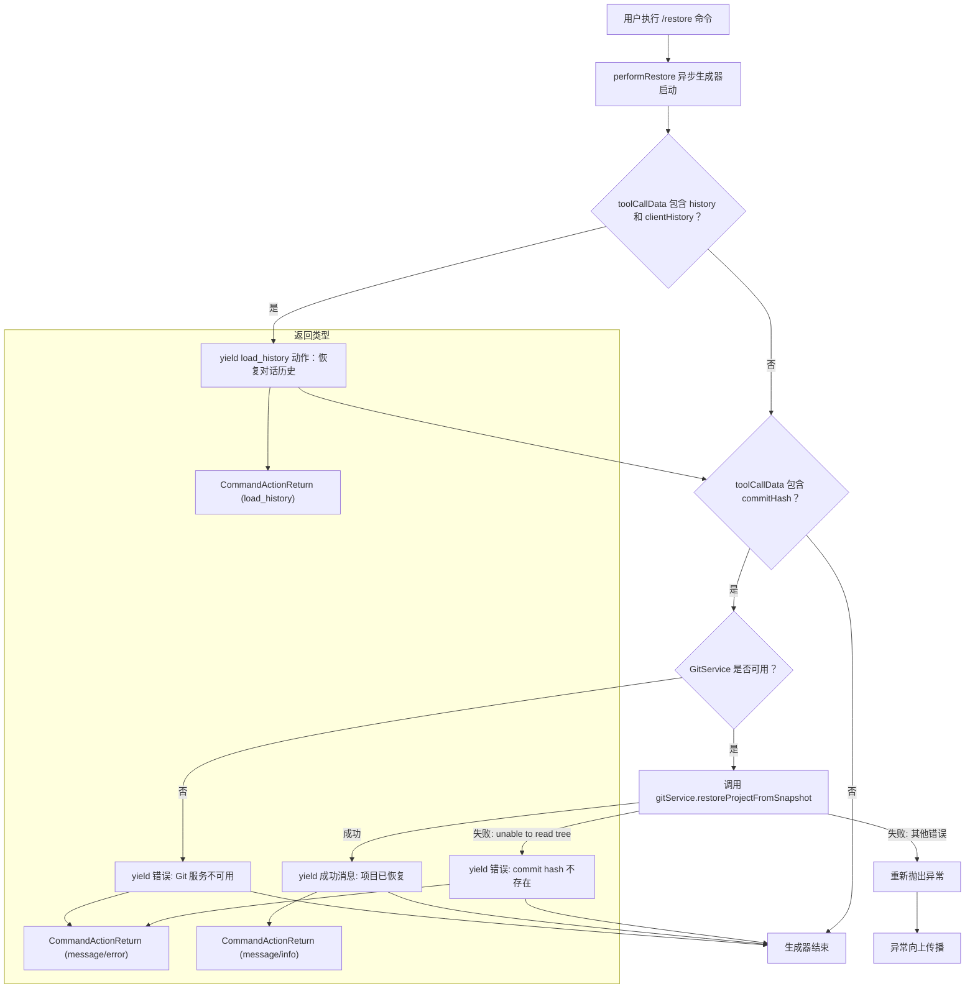

# restore.ts

## 概述

`restore.ts` 是 Gemini CLI 的检查点恢复命令模块，实现了 `/restore` 命令的核心逻辑。该命令允许用户将项目状态回滚到某个工具调用之前的快照点（Checkpoint），包括恢复对话历史和 Git 仓库的文件状态。

该模块的核心是一个异步生成器函数 `performRestore`，它通过 `yield` 逐步产出多个动作结果，支持同时恢复对话历史和项目文件状态两个维度的回滚操作。

## 架构图（Mermaid）



## 核心组件

### `performRestore<HistoryType, ArgsType>(toolCallData, gitService): AsyncGenerator<CommandActionReturn<HistoryType>>`

这是一个泛型异步生成器函数，是该模块唯一的导出。

#### 泛型参数

| 泛型参数 | 默认值 | 说明 |
|----------|--------|------|
| `HistoryType` | `unknown` | 对话历史记录的类型参数，由调用者指定具体类型 |
| `ArgsType` | `unknown` | 工具调用参数的类型参数 |

#### 函数参数

| 参数名 | 类型 | 说明 |
|--------|------|------|
| `toolCallData` | `ToolCallData<HistoryType, ArgsType>` | 检查点数据对象，包含对话历史和/或 Git commit hash |
| `gitService` | `GitService \| undefined` | Git 服务实例，可能为 `undefined`（非 Git 仓库环境） |

#### 执行阶段

该函数的执行分为两个独立阶段，按顺序产出动作：

**阶段一：恢复对话历史**

```typescript
if (toolCallData.history && toolCallData.clientHistory) {
  yield {
    type: 'load_history',
    history: toolCallData.history,
    clientHistory: toolCallData.clientHistory,
  };
}
```

当 `toolCallData` 中同时包含 `history`（服务端历史）和 `clientHistory`（客户端历史）时，产出一个 `load_history` 类型的动作。调度系统收到此动作后，会将对话状态回滚到检查点时刻。

**阶段二：恢复项目文件状态**

当 `toolCallData` 中包含 `commitHash` 时，尝试通过 Git 恢复项目文件状态：

1. **Git 服务可用性检查**：如果 `gitService` 为 `undefined`，yield 一个错误消息并提前返回
2. **执行恢复**：调用 `gitService.restoreProjectFromSnapshot(commitHash)` 恢复文件
3. **错误处理**：
   - `unable to read tree` 错误：commit hash 在仓库中不存在（可能是仓库被重新克隆、重置或旧提交被垃圾回收），yield 详细的错误说明
   - 其他错误：重新抛出异常（`throw e`），交由上层处理

## 依赖关系

### 内部依赖

| 依赖模块 | 导入内容 | 用途 |
|----------|----------|------|
| `../services/gitService.js` | `GitService` (类型) | Git 操作服务接口，提供项目快照恢复功能 |
| `./types.js` | `CommandActionReturn` (类型) | 命令返回值类型定义 |
| `../utils/checkpointUtils.js` | `ToolCallData` (类型) | 检查点数据结构定义，包含 history、clientHistory、commitHash 等字段 |

### 外部依赖

无外部依赖。

## 关键实现细节

1. **异步生成器（AsyncGenerator）模式**：与 `init.ts` 和 `memory.ts` 返回单个动作不同，`performRestore` 使用异步生成器函数（`async function*`），能够在一次调用中通过 `yield` 产出多个动作结果。这使得恢复操作可以分步执行：先恢复对话历史，再恢复文件状态，每一步都能独立向调度系统报告结果。

2. **双维度回滚**：检查点恢复涉及两个独立维度：
   - **对话历史**（`load_history`）：回滚 AI 对话上下文到检查点时刻
   - **文件状态**（Git 恢复）：回滚项目文件到检查点时刻的快照
   两个维度各自独立，可以只恢复其中之一或同时恢复。

3. **防御性 Git 服务检查**：由于 Gemini CLI 可能运行在非 Git 仓库目录中，`gitService` 参数允许为 `undefined`。代码在使用前进行显式的可用性检查，避免运行时错误。

4. **细粒度错误处理**：Git 恢复操作的异常处理区分了两种情况：
   - `unable to read tree`：已知的、可恢复的错误场景（commit 不存在），给出详细的解释性错误消息
   - 其他异常：未知错误，重新抛出交由上层处理
   这种分层错误处理避免了"吞掉"未预期的异常。

5. **泛型类型安全**：使用 `HistoryType` 和 `ArgsType` 两个泛型参数，使得函数能够适配不同的对话历史格式和工具参数格式，同时保持类型安全。默认值为 `unknown`，提供了最大的灵活性。

6. **早期返回（Early Return）模式**：在 Git 服务不可用或 commit hash 找不到时，函数通过 `return` 提前终止生成器，避免执行后续不必要的逻辑。
