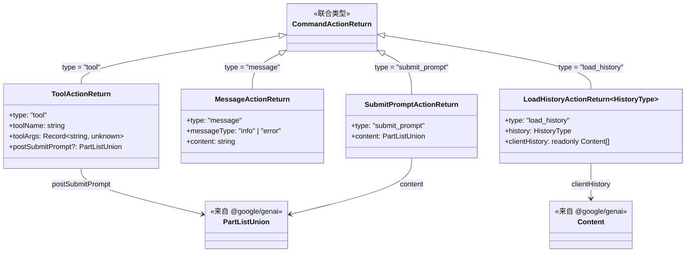
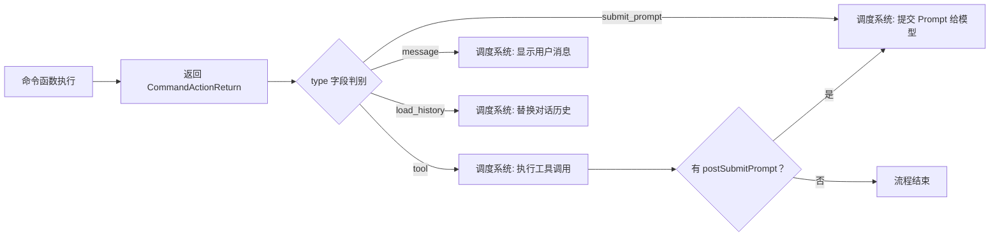

# types.ts

## 概述

`types.ts` 是 Gemini CLI 命令系统的类型定义模块，定义了所有命令动作的返回值类型。它是命令系统的类型基础设施，为整个命令-动作（Command-Action）架构提供类型约束。

该模块定义了四种命令动作返回类型，并通过联合类型 `CommandActionReturn` 将它们统一为一个可判别联合（Discriminated Union）。所有命令函数（如 `performInit`、`showMemory`、`performRestore` 等）的返回值都必须符合这些类型之一。

## 架构图（Mermaid）





## 核心组件

### `ToolActionReturn`

工具调用动作返回类型，表示命令需要调度系统执行一个工具调用。

```typescript
export interface ToolActionReturn {
  type: 'tool';
  toolName: string;
  toolArgs: Record<string, unknown>;
  postSubmitPrompt?: PartListUnion;
}
```

| 字段 | 类型 | 必填 | 说明 |
|------|------|------|------|
| `type` | `'tool'` | 是 | 判别字段，固定值 `'tool'` |
| `toolName` | `string` | 是 | 要调用的工具名称（如 `'save_memory'`） |
| `toolArgs` | `Record<string, unknown>` | 是 | 工具调用的参数，键值对形式 |
| `postSubmitPrompt` | `PartListUnion` | 否 | 工具调用完成后，可选地提交给 Gemini 模型的后续 Prompt |

**使用场景**：`addMemory` 函数使用此类型来触发 `save_memory` 工具。

**`postSubmitPrompt` 字段**：这是一个精巧的设计，允许在工具调用完成后自动链式触发一个 Prompt 提交。例如，执行某个工具后可以自动让模型对工具结果进行总结。

---

### `MessageActionReturn`

消息展示动作返回类型，表示命令需要向用户显示一条信息。

```typescript
export interface MessageActionReturn {
  type: 'message';
  messageType: 'info' | 'error';
  content: string;
}
```

| 字段 | 类型 | 必填 | 说明 |
|------|------|------|------|
| `type` | `'message'` | 是 | 判别字段，固定值 `'message'` |
| `messageType` | `'info' \| 'error'` | 是 | 消息级别：信息提示或错误提示 |
| `content` | `string` | 是 | 消息文本内容 |

**使用场景**：这是最常用的返回类型。`showMemory`、`refreshMemory`、`listMemoryFiles`、`performInit`（文件已存在时）、`performRestore`（错误场景）等函数都返回此类型。

**消息级别**：仅支持 `'info'` 和 `'error'` 两种级别，简洁但足以覆盖命令系统的消息需求。

---

### `LoadHistoryActionReturn<HistoryType>`

历史记录加载动作返回类型，表示命令需要替换整个对话历史。

```typescript
export interface LoadHistoryActionReturn<HistoryType = unknown> {
  type: 'load_history';
  history: HistoryType;
  clientHistory: readonly Content[];
}
```

| 字段 | 类型 | 必填 | 说明 |
|------|------|------|------|
| `type` | `'load_history'` | 是 | 判别字段，固定值 `'load_history'` |
| `history` | `HistoryType` | 是 | 应用层对话历史，类型由泛型参数决定 |
| `clientHistory` | `readonly Content[]` | 是 | Generative AI 客户端的对话历史，使用 `@google/genai` 的 `Content` 类型 |

**使用场景**：`performRestore` 函数在恢复检查点时使用此类型来回滚对话历史。

**双层历史设计**：
- `history`（泛型）：应用层维护的对话历史，其具体结构由调用者决定
- `clientHistory`（`Content[]`）：传递给 Google Generative AI API 客户端的对话历史，使用固定的 `Content` 类型

`clientHistory` 使用 `readonly` 修饰符，表明加载后的历史不应被修改。

---

### `SubmitPromptActionReturn`

Prompt 提交动作返回类型，表示命令需要立即向 Gemini 模型提交内容。

```typescript
export interface SubmitPromptActionReturn {
  type: 'submit_prompt';
  content: PartListUnion;
}
```

| 字段 | 类型 | 必填 | 说明 |
|------|------|------|------|
| `type` | `'submit_prompt'` | 是 | 判别字段，固定值 `'submit_prompt'` |
| `content` | `PartListUnion` | 是 | 要提交给模型的内容，使用 `@google/genai` 的 `PartListUnion` 类型 |

**使用场景**：`performInit` 函数（文件不存在时）使用此类型来触发 AI 分析项目并生成 `GEMINI.md`。

---

### `CommandActionReturn<HistoryType>`

所有命令动作返回类型的联合类型（Discriminated Union）。

```typescript
export type CommandActionReturn<HistoryType = unknown> =
  | ToolActionReturn
  | MessageActionReturn
  | LoadHistoryActionReturn<HistoryType>
  | SubmitPromptActionReturn;
```

这是四种具体动作类型的联合，通过 `type` 字段作为判别属性（Discriminant），调度系统可以使用 TypeScript 的类型窄化（Type Narrowing）来安全地处理不同类型的动作：

```typescript
// 示例：调度系统的处理逻辑
switch (action.type) {
  case 'tool':      // TypeScript 自动窄化为 ToolActionReturn
  case 'message':   // TypeScript 自动窄化为 MessageActionReturn
  case 'load_history': // TypeScript 自动窄化为 LoadHistoryActionReturn
  case 'submit_prompt': // TypeScript 自动窄化为 SubmitPromptActionReturn
}
```

## 依赖关系

### 内部依赖

无内部依赖。该模块是纯类型定义文件，不依赖项目内其他模块。

### 外部依赖

| 依赖包 | 导入内容 | 用途 |
|--------|----------|------|
| `@google/genai` | `Content` (类型) | Google Generative AI SDK 的对话内容类型，用于 `LoadHistoryActionReturn.clientHistory` |
| `@google/genai` | `PartListUnion` (类型) | Google Generative AI SDK 的内容部件联合类型，用于 `ToolActionReturn.postSubmitPrompt` 和 `SubmitPromptActionReturn.content` |

## 关键实现细节

1. **可判别联合（Discriminated Union）模式**：所有接口都包含一个字面量类型的 `type` 字段作为判别属性。这是 TypeScript 中的核心模式，使得编译器能够在 `switch` 或 `if` 语句中自动进行类型窄化，确保类型安全地访问各接口的特有字段。

2. **命令-动作架构的类型基础**：这些类型定义了命令系统的"通信协议"。命令函数不直接执行副作用，而是返回描述"意图"的动作对象，由上层调度系统根据 `type` 字段分发执行。这种架构类似于 Redux 的 Action 模式或事件驱动架构中的事件对象。

3. **泛型设计的有限使用**：只有 `LoadHistoryActionReturn` 和 `CommandActionReturn` 使用了泛型参数 `HistoryType`，且默认值为 `unknown`。这是因为对话历史的结构在不同上下文中可能不同（如 `restore.ts` 中的 `HistoryType` 泛型），而其他动作类型的数据结构是固定的。

4. **`readonly` 不可变性约束**：`clientHistory` 字段使用 `readonly Content[]`，强制调用者不能在加载后修改历史数组。这是防御性编程的体现，确保历史数据的完整性。

5. **`PartListUnion` 类型的灵活性**：`PartListUnion` 来自 `@google/genai`，支持多种内容格式（文本、图片等），使得 `SubmitPromptActionReturn` 和 `ToolActionReturn.postSubmitPrompt` 能够携带富内容而非仅限于纯文本字符串。

6. **类型即文档**：每个接口都附带 JSDoc 注释，清晰描述其用途。类型定义本身就是命令系统行为的规范化文档。
