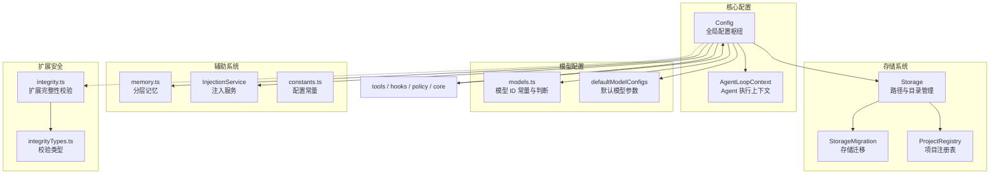
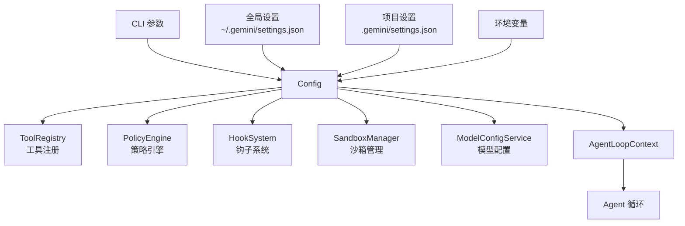

# config

## 概述

`config` 目录是 Gemini CLI 的**配置管理中心**，负责加载、合并和管理所有运行时配置。核心 `Config` 类（约 3000+ 行）是整个应用的配置枢纽，管理着模型选择、工具注册、策略引擎、钩子系统、存储路径、沙箱安全等方方面面。该目录还包含存储管理、模型定义、项目注册、内存系统等配置相关的子系统。

## 目录结构

```
config/
├── config.ts                 # 核心配置类 Config（应用配置枢纽，约 3000+ 行）
├── agent-loop-context.ts     # AgentLoopContext 接口（Agent 循环的执行上下文）
├── constants.ts              # 配置常量（文件过滤选项、ignore 文件名等）
├── models.ts                 # 模型相关定义（模型 ID 常量、模型判断函数等）
├── defaultModelConfigs.ts    # 默认模型配置集合（温度、thinking 等参数）
├── storage.ts                # Storage 存储管理类（路径计算、目录管理）
├── storageMigration.ts       # 存储迁移工具（hash 目录迁移到 slug 目录）
├── projectRegistry.ts        # ProjectRegistry 项目注册表（路径 <-> 标识符映射）
├── memory.ts                 # HierarchicalMemory 分层记忆系统
├── injectionService.ts       # InjectionService 注入服务（用户引导、后台完成）
└── extensions/               # 扩展相关子目录
    ├── integrity.ts          # 扩展完整性校验（HMAC 签名）
    └── integrityTypes.ts     # 完整性校验类型定义
```

## 架构图



## 核心组件

### `config.ts` - 全局配置枢纽

`Config` 类是整个 Gemini CLI 的核心配置对象，主要职责包括：

- **设置加载与合并**: 从用户全局设置、项目设置、CLI 参数等多级来源加载配置
- **模型管理**: 模型选择（`getActiveModel()`）、模型切换、fallback 策略
- **工具管理**: 工具注册表初始化、工具排除列表、MCP 工具发现
- **策略引擎**: 审批模式管理、策略规则配置
- **钩子系统**: 初始化和管理 HookSystem
- **沙箱安全**: SandboxManager 集成
- **存储管理**: 通过 Storage 实例管理所有文件路径
- **会话管理**: Session ID、工作目录、交互模式
- **遥测配置**: 遥测目标、日志级别
- **扩展管理**: 加载和管理扩展配置

关键导入显示了它与几乎所有子系统的连接：`ToolRegistry`、`PromptRegistry`、`ResourceRegistry`、`PolicyEngine`、`HookSystem`、`GeminiClient`、`SandboxManager` 等。

### `agent-loop-context.ts` - Agent 执行上下文

定义 `AgentLoopContext` 接口，代表单次 Agent 循环的作用域视图：
- `config: Config` - 全局运行时配置
- `promptId: string` - 当前用户回合的唯一 ID
- `toolRegistry: ToolRegistry` - 本上下文可用的工具注册表
- `promptRegistry: PromptRegistry` - 提示词注册表
- `resourceRegistry: ResourceRegistry` - 资源注册表
- `messageBus: MessageBus` - 消息总线
- `geminiClient: GeminiClient` - LLM 客户端
- `sandboxManager: SandboxManager` - 沙箱管理器

### `storage.ts` - 存储管理

`Storage` 类管理所有文件路径和目录：
- 全局路径: `getGlobalGeminiDir()`、`getGlobalSettingsPath()`、`getMcpOAuthTokensPath()`
- 项目路径: 项目临时目录、会话目录、计划目录
- OAuth 与认证: `OAUTH_FILE`、Google 账户文件路径
- 代理目录: `getGlobalAgentsDir()`
- 自动保存策略: `AUTO_SAVED_POLICY_FILENAME`

### `models.ts` - 模型定义与判断

- **模型 ID 常量**: `DEFAULT_GEMINI_MODEL = 'gemini-2.5-pro'`、`PREVIEW_GEMINI_MODEL = 'gemini-3-pro-preview'` 等
- **自动模型**: `DEFAULT_GEMINI_MODEL_AUTO = 'auto-gemini-2.5'`、`PREVIEW_GEMINI_MODEL_AUTO = 'auto-gemini-3'`
- **模型别名**: `auto`、`pro` 等便捷别名
- **判断函数**: `isGemini3Model()`、`isGemini2Model()`、`isPreviewModel()`、`isAutoModel()` 等
- **`IModelConfigService`**: 模型配置服务接口

### `defaultModelConfigs.ts` - 默认模型参数

定义 `DEFAULT_MODEL_CONFIGS`，包含模型配置层次结构：
- `base`: 基础配置（温度 0，topP 1）
- `chat-base`: 聊天基础（温度 1，topP 0.95，开启 thinking）
- `chat-base-2.5`: Gemini 2.5 聊天配置（thinkingBudget 模式）
- `chat-base-3`: Gemini 3 聊天配置（ThinkingLevel.HIGH）
- 各模型的具体配置通过 `extends` 继承

### `memory.ts` - 分层记忆

- **`HierarchicalMemory`**: 三层记忆结构
  - `global`: 全局用户记忆（跨所有项目）
  - `extension`: 扩展提供的记忆
  - `project`: 项目级记忆
- **`flattenMemory()`**: 将分层记忆扁平化为单个字符串

### `injectionService.ts` - 注入服务

管理向模型对话注入内容的服务：
- **注入源类型**: `user_steering`（用户引导）和 `background_completion`（后台执行完成）
- `addInjection()`: 添加注入（用户引导受 isEnabled 控制）
- `onInjection()` / `offInjection()`: 注册/注销注入监听器
- `getInjections()` / `getInjectionsAfter()`: 获取注入内容

### `constants.ts` - 配置常量

- `FileFilteringOptions`: 文件过滤选项接口
- `DEFAULT_FILE_FILTERING_OPTIONS`: 默认过滤选项（尊重 gitignore 和 geminiignore）
- `DEFAULT_MEMORY_FILE_FILTERING_OPTIONS`: 记忆文件专用过滤选项
- `GEMINI_IGNORE_FILE_NAME = '.geminiignore'`
- 扩展完整性相关常量

### `projectRegistry.ts` - 项目注册表

管理绝对项目路径到短标识符的映射：
- 为每个项目生成短的、人类可读的标识符
- 使用文件锁保证并发安全
- 减少上下文膨胀

### `storageMigration.ts` - 存储迁移

将旧的 hash 目录名迁移到新的 slug 目录名。

### `extensions/integrity.ts` - 扩展完整性

使用 HMAC 签名验证扩展配置完整性：
- 尝试使用 OS 钥匙串存储密钥
- 回退到受限本地文件存储

## 依赖关系

### 内部依赖
- `tools/` - ToolRegistry、各工具类
- `core/` - GeminiClient、ContentGenerator
- `hooks/` - HookSystem
- `policy/` - PolicyEngine、ApprovalMode
- `services/` - SandboxManager、FileSystemService、ModelConfigService
- `prompts/` - PromptRegistry
- `resources/` - ResourceRegistry
- `confirmation-bus/` - MessageBus
- `telemetry/` - 遥测系统
- `agents/` - AgentRegistry

### 外部依赖
- `@google/genai` - ThinkingLevel 等类型
- `zod` - Schema 验证
- `proper-lockfile` - 文件锁（ProjectRegistry）

## 数据流

### 配置加载流程


