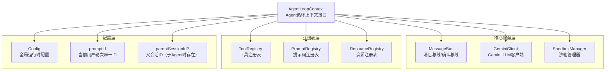

# agent-loop-context.ts

## 概述

`agent-loop-context.ts` 定义了 `AgentLoopContext` 接口，它是 **Agent 循环（Agent Loop）的执行上下文**。该接口为单次 Agent 轮次（turn）或子 Agent 循环提供了一个作用域化的世界视图，将运行时所需的所有核心服务和注册表聚合到一个统一的上下文对象中。

这是一个纯类型定义文件（仅包含 `interface`），不含任何运行时逻辑。它作为依赖注入的契约，确保 Agent 循环中的每个组件都能通过统一接口访问所需的服务。

## 架构图（Mermaid）

## 核心组件

### `AgentLoopContext` 接口

该接口包含以下只读属性（所有属性均标记为 `readonly`）：

| 属性名 | 类型 | 是否可选 | 说明 |
|---|---|---|---|
| `config` | `Config` | 必选 | 全局运行时配置对象，包含模型、API密钥等所有配置信息 |
| `promptId` | `string` | 必选 | 当前用户轮次或 Agent 思维循环的唯一标识符，用于追踪和关联请求 |
| `parentSessionId` | `string` | **可选** | 父会话 ID，仅当当前循环是子 Agent（subagent）时才存在，用于建立 Agent 层级关系 |
| `toolRegistry` | `ToolRegistry` | 必选 | 当前上下文中可供 Agent 使用的工具注册表，管理所有已注册工具 |
| `promptRegistry` | `PromptRegistry` | 必选 | 当前上下文中可供 Agent 使用的提示词注册表，管理系统提示词和模板 |
| `resourceRegistry` | `ResourceRegistry` | 必选 | 当前上下文中可供 Agent 使用的资源注册表，管理外部资源 |
| `messageBus` | `MessageBus` | 必选 | 用户确认和消息传递总线，处理 Agent 与用户之间的交互确认 |
| `geminiClient` | `GeminiClient` | 必选 | 与 LLM（Gemini 模型）通信的客户端实例 |
| `sandboxManager` | `SandboxManager` | 必选 | 沙箱管理服务，负责将命令准备为沙箱化执行模式，确保安全性 |

## 依赖关系

### 内部依赖

| 导入类型 | 来源模块 | 说明 |
|---|---|---|
| `GeminiClient` | `../core/client.js` | Gemini API 客户端类型，负责与 Google Gemini LLM 进行通信 |
| `MessageBus` | `../confirmation-bus/message-bus.js` | 消息总线类型，用于处理用户确认流程和消息传递 |
| `ToolRegistry` | `../tools/tool-registry.js` | 工具注册表类型，管理 Agent 可调用的工具集合 |
| `PromptRegistry` | `../prompts/prompt-registry.js` | 提示词注册表类型，管理系统提示词和模板 |
| `ResourceRegistry` | `../resources/resource-registry.js` | 资源注册表类型，管理外部资源的访问 |
| `SandboxManager` | `../services/sandboxManager.js` | 沙箱管理器类型，提供安全的命令执行环境 |
| `Config` | `./config.js` | 配置类型，包含全局运行时配置 |

### 外部依赖

无外部（第三方）依赖。该文件仅使用 TypeScript 原生类型系统。

## 关键实现细节

1. **纯接口定义**：该文件是一个纯类型文件，仅通过 `type` 导入（`import type`）引入依赖，不会产生任何运行时代码。这意味着在编译后的 JavaScript 中，所有导入语句都会被移除。

2. **不可变性设计**：所有属性都标记为 `readonly`，确保上下文一旦创建就不可修改。这种不可变性保证了在 Agent 循环执行期间上下文的稳定性和可预测性。

3. **子 Agent 支持**：通过可选的 `parentSessionId` 属性，该接口原生支持子 Agent 模式。当一个 Agent 需要委派任务给子 Agent 时，子 Agent 的上下文会携带父会话 ID，从而建立完整的调用链追踪。

4. **关注点分离**：该接口将运行时所需的服务清晰地分为三层：
   - **配置层**：`config`、`promptId`、`parentSessionId` — 提供运行时配置和身份标识
   - **注册表层**：`toolRegistry`、`promptRegistry`、`resourceRegistry` — 提供能力发现和管理
   - **核心服务层**：`geminiClient`、`messageBus`、`sandboxManager` — 提供核心运行时服务

5. **依赖注入模式**：该接口本质上是一个依赖注入容器的契约定义，使得 Agent 循环的实现可以与具体的服务实现解耦。调用者负责构建并注入具体实例，循环内部只需依赖接口编程。
