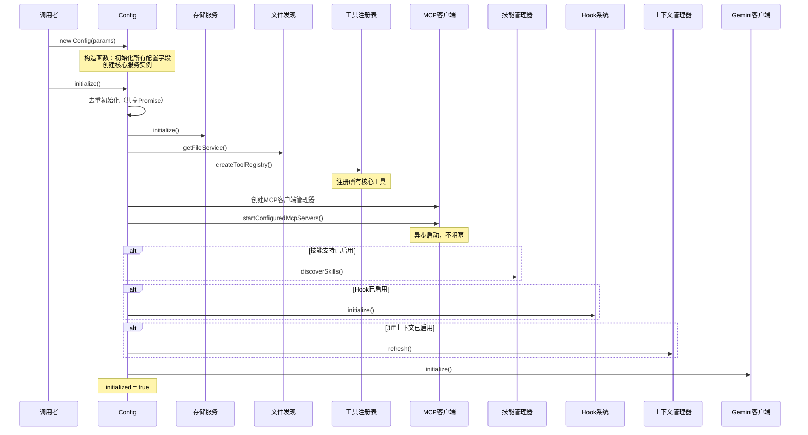

# config.ts

## 概述

`config.ts` 是 Gemini CLI 核心包中**最重要、最庞大的文件之一**（约 3580 行），它定义了 `Config` 类以及大量相关的接口和类型。`Config` 类是整个应用程序的**中央配置和服务编排中心**，同时实现了 `McpContext` 和 `AgentLoopContext` 两个接口，承担了以下核心职责：

1. **配置管理**：聚合所有运行时配置参数（模型、沙箱、遥测、文件过滤、MCP 服务器等）
2. **服务编排**：作为依赖注入容器，初始化并管理所有核心服务（工具注册表、MCP 客户端、沙箱管理器等）
3. **生命周期管理**：控制初始化流程、MCP 服务启动、技能发现、Hook 系统初始化等
4. **状态管理**：维护运行时状态（配额、模型可用性、审批模式、实验标志等）
5. **认证刷新**：管理 Gemini API 客户端的认证状态和内容生成器配置

## 架构图（Mermaid）

```mermaid
graph TB
    subgraph 入口
        CP["ConfigParameters<br/>配置参数接口"]
    end

    CP --> Config["Config 类<br/>中央配置与服务编排中心"]

    Config -->|实现| McpCtx["McpContext 接口"]
    Config -->|实现| ALC["AgentLoopContext 接口"]

    subgraph 核心服务
        GC["GeminiClient<br/>Gemini API 客户端"]
        BLC["BaseLlmClient<br/>基础LLM客户端"]
        CG["ContentGenerator<br/>内容生成器"]
        SM["SandboxManager<br/>沙箱管理器"]
        PE["PolicyEngine<br/>策略引擎"]
        MB["MessageBus<br/>消息总线"]
    end

    subgraph 注册表与管理器
        TR["ToolRegistry<br/>工具注册表"]
        PR["PromptRegistry<br/>提示词注册表"]
        RR["ResourceRegistry<br/>资源注册表"]
        AR["AgentRegistry<br/>Agent注册表"]
        SKM["SkillManager<br/>技能管理器"]
        MCM["McpClientManager<br/>MCP客户端管理器"]
        A2A["A2AClientManager<br/>A2A客户端管理器"]
    end

    subgraph 基础设施服务
        FDS["FileDiscoveryService<br/>文件发现服务"]
        GS["GitService<br/>Git服务"]
        HS["HookSystem<br/>Hook系统"]
        CM["ContextManager<br/>上下文管理器"]
        MCS["ModelConfigService<br/>模型配置服务"]
        MRS["ModelRouterService<br/>模型路由服务"]
        MAS["ModelAvailabilityService<br/>模型可用性服务"]
        TS["TrackerService<br/>任务追踪服务"]
    end

    subgraph 存储与安全
        ST["Storage<br/>存储服务"]
        FE["FileExclusions<br/>文件排除"]
        SPM["SandboxPolicyManager<br/>沙箱策略管理器"]
        IS["InjectionService<br/>注入服务"]
        CR["CheckerRunner<br/>检查器运行器"]
    end

    Config --> GC
    Config --> BLC
    Config --> SM
    Config --> PE
    Config --> MB
    Config --> TR
    Config --> PR
    Config --> RR
    Config --> AR
    Config --> SKM
    Config --> MCM
    Config --> A2A
    Config --> FDS
    Config --> GS
    Config --> HS
    Config --> CM
    Config --> MCS
    Config --> MRS
    Config --> MAS
    Config --> ST
    Config --> FE
    Config --> SPM
    Config --> IS
    Config --> CR
    Config --> TS
```

### 初始化流程

## 核心组件

### 导出的接口和类型

| 接口/类型 | 说明 |
|---|---|
| `AccessibilitySettings` | 无障碍设置（屏幕阅读器、加载提示等） |
| `BugCommandSettings` | Bug 报告命令配置（URL 模板） |
| `SummarizeToolOutputSettings` | 工具输出摘要设置（Token 预算） |
| `PlanSettings` | 计划模式设置（目录、模型路由） |
| `TelemetrySettings` | 遥测设置（启用状态、目标、OTLP 端点等） |
| `OutputSettings` | 输出格式设置 |
| `ToolOutputMaskingConfig` | 工具输出遮盖配置（保护阈值等） |
| `GemmaModelRouterSettings` | Gemma 模型路由器设置 |
| `ExtensionSetting` | 扩展设置定义（名称、描述、环境变量） |
| `ResolvedExtensionSetting` | 已解析的扩展设置（包含实际值和来源） |
| `TrajectoryProvider` | 轨迹提供者接口（会话列表、加载） |
| `AgentRunConfig` | Agent 运行配置（最大时间、最大轮次） |
| `AgentOverride` | Agent 覆盖配置（模型、运行、工具、MCP） |
| `AgentSettings` | Agent 设置集合 |
| `CustomTheme` | 自定义主题定义 |
| `BrowserAgentCustomConfig` | 浏览器 Agent 自定义配置 |
| `GeminiCLIExtension` | CLI 扩展完整信息 |
| `ExtensionInstallMetadata` | 扩展安装元数据 |
| `MCPServerConfig` | MCP 服务器配置类（支持 stdio/SSE/HTTP/WebSocket 传输） |
| `AuthProviderType` | 认证提供者类型枚举 |
| `SandboxConfig` | 沙箱配置 |
| `ConfigSchema` | 配置 Zod 验证 Schema |
| `McpEnablementCallbacks` | MCP 服务器启用状态回调 |
| `PolicyUpdateConfirmationRequest` | 策略更新确认请求 |
| `WorktreeSettings` | Git Worktree 设置 |
| `ConfigParameters` | Config 构造函数参数接口（~140+ 字段） |

### `Config` 类核心方法分类

#### 初始化与生命周期

| 方法 | 说明 |
|---|---|
| `constructor(params)` | 从 `ConfigParameters` 初始化所有字段和核心服务 |
| `initialize()` | 异步初始化（去重），启动存储、工具注册、MCP、技能、Hook 等 |
| `dispose()` | 释放资源：移除监听器、停止 MCP 客户端、销毁 Agent 注册表 |
| `refreshAuth(authMethod, ...)` | 刷新认证，重建内容生成器和 LLM 客户端 |

#### 模型管理

| 方法 | 说明 |
|---|---|
| `getModel()` / `setModel()` | 获取/设置当前模型 |
| `getActiveModel()` / `setActiveModel()` | 获取/设置活跃模型 |
| `activateFallbackMode(model)` | 激活模型降级模式 |
| `getGemini31LaunchedSync()` | 同步检查 Gemini 3.1 是否已上线 |
| `getUseCustomToolModel()` | 检查是否使用自定义工具模型 |

#### 配额管理

| 方法 | 说明 |
|---|---|
| `setQuota(remaining, limit, modelId)` | 设置模型配额 |
| `getQuotaRemaining()` / `getQuotaLimit()` | 获取剩余/总配额 |
| `refreshUserQuota()` | 从服务端刷新用户配额 |
| `refreshUserQuotaIfStale(staleMs)` | 仅在陈旧时刷新配额 |

#### 审批模式

| 方法 | 说明 |
|---|---|
| `getApprovalMode()` | 获取当前审批模式 |
| `setApprovalMode(mode)` | 设置审批模式（触发策略引擎和沙箱更新） |
| `isPlanMode()` | 是否处于计划模式 |
| `isYoloModeDisabled()` | YOLO 模式是否被禁用 |

#### 工具注册

| 方法 | 说明 |
|---|---|
| `createToolRegistry()` | 创建并注册所有核心工具 |
| `registerSubAgentTools(registry)` | 注册子 Agent 工具 |

#### 内存与上下文

| 方法 | 说明 |
|---|---|
| `getUserMemory()` | 获取用户内存（支持层级内存） |
| `getSystemInstructionMemory()` | 获取系统指令用内存 |
| `getSessionMemory()` | 获取会话内存（Tier 2） |
| `refreshMcpContext()` | 刷新 MCP 上下文（内存、工具、系统指令） |

#### 路径安全

| 方法 | 说明 |
|---|---|
| `isPathAllowed(absolutePath)` | 检查路径是否在允许范围内 |
| `validatePathAccess(absolutePath, checkType)` | 验证路径访问权限并返回错误信息 |

### `MCPServerConfig` 类

支持多种传输协议的 MCP 服务器配置：

| 传输类型 | 相关字段 |
|---|---|
| stdio | `command`, `args`, `env`, `cwd` |
| SSE | `url` (type='sse') |
| Streamable HTTP | `httpUrl` 或 `url` (type='http') |
| WebSocket | `tcp` |
| 通用 | `timeout`, `trust`, `headers`, `oauth`, `authProviderType` |

### `ConfigSchema`（Zod 验证）

使用 Zod 定义了沙箱配置的验证规则：
- `sandbox.enabled` 为 true 时必须提供 `command`
- 支持的沙箱命令：`docker`, `podman`, `sandbox-exec`, `runsc`, `lxc`, `windows-native`

## 依赖关系

### 内部依赖

该文件是项目中依赖最广泛的文件，导入了几乎所有核心模块：

| 分类 | 模块 |
|---|---|
| **核心** | `GeminiClient`, `BaseLlmClient`, `LocalLiteRtLmClient`, `ContentGenerator`, `tokenLimits` |
| **工具** | `LSTool`, `ReadFileTool`, `GrepTool`, `RipGrepTool`, `GlobTool`, `EditTool`, `ShellTool`, `WriteFileTool`, `WebFetchTool`, `MemoryTool`, `WebSearchTool`, `AskUserTool`, `ExitPlanModeTool`, `EnterPlanModeTool`, `WriteTodosTool`, `ActivateSkillTool`, `TrackerTools`(6个) |
| **注册表** | `ToolRegistry`, `PromptRegistry`, `ResourceRegistry`, `AgentRegistry` |
| **服务** | `FileDiscoveryService`, `GitService`, `SandboxManager`, `ModelConfigService`, `ModelRouterService`, `ModelAvailabilityService`, `ContextManager`, `TrackerService`, `ExecutionLifecycleService` |
| **策略/安全** | `PolicyEngine`, `SandboxPolicyManager`, `CheckerRunner`, `ContextBuilder`, `CheckerRegistry`, `ConsecaSafetyChecker` |
| **MCP/Agent** | `McpClientManager`, `A2AClientManager`, `SubagentTool`, `AcknowledgedAgentsService` |
| **配置** | `constants`, `models`, `defaultModelConfigs`, `Storage`, `InjectionService`, `memory` |
| **遥测** | `initializeTelemetry`, `uiTelemetryService`, `loggers`, `startupProfiler` |
| **工具/实用** | `coreEvents`, `browser`, `paths`, `errors`, `fetch`, `ignorePatterns`, `extensionLoader`, `workspaceContext`, `debugLogger` |
| **钩子** | `HookSystem`, `HookDefinition` |
| **技能** | `SkillManager` |
| **Code Assist** | `getCodeAssistServer`, `getExperiments`, `fetchAdminControls`, `ExperimentFlags` |
| **确认总线** | `MessageBus` |
| **IDE** | `ideContextStore` |

### 外部依赖

| 包 | 用途 |
|---|---|
| `node:fs` | 文件系统操作（目录检查） |
| `node:path` | 路径解析 |
| `node:util` | `inspect` 用于调试输出 |
| `node:process` | 进程信息和环境变量 |
| `node:events` | EventEmitter 类型 |
| `zod` | 配置 Schema 验证 |
| `@google/genai` | `GenerateContentParameters` 类型 |

## 关键实现细节

1. **单例化初始化保护**：`initialize()` 方法通过共享的 `initPromise` 确保即使被多次调用也只执行一次实际初始化逻辑，避免重复初始化带来的副作用。

2. **MCP 异步初始化策略**：MCP 服务器的启动采用非阻塞策略——在交互模式下不等待 MCP 初始化完成即可开始使用 CLI；在非交互模式（ACP 模式）下则必须等待 MCP 初始化完成。这确保了交互式使用的快速启动。

3. **模型配置合并策略**：在构造函数中，用户提供的 `modelConfigServiceConfig` 会与 `DEFAULT_MODEL_CONFIGS` 进行智能合并，确保用户自定义配置不会覆盖掉默认的模型定义、别名和解析规则。代码注释明确标注了这是一个临时 HACK，等待 settings 加载逻辑的完善。

4. **沙箱管理器双重创建**：构造函数中 `SandboxManager` 被创建了两次——第一次仅使用基础沙箱配置，第二次在 `SandboxPolicyManager` 和审批模式确定后重新创建。这确保了沙箱策略的完整应用。

5. **工具注册的条件化**：`createToolRegistry()` 使用 `maybeRegister` 辅助函数，根据 `coreTools` 白名单条件性地注册工具，支持通过配置控制可用工具集。某些工具（如 `RipGrepTool`）还会在运行时检测可用性后决定是否注册或降级。

6. **层级内存模型（JIT Context）**：当 `experimentalJitContext` 启用时，内存被分为三层：
   - **Tier 1（全局内存）**：放入系统指令
   - **Tier 2（扩展 + 项目内存）**：注入到第一条用户消息中
   - 通过 `ContextManager` 统一管理

7. **审批模式切换的连锁效应**：`setApprovalMode()` 不仅更新策略引擎的审批模式，还会：刷新沙箱管理器、记录模式切换遥测、清除当前序列模型、更新可用工具集、更新系统指令。

8. **配额池化计算**：对于 `auto` 模型，配额会将 Pro 和 Flash 模型的配额合并计算（`getPooledQuota()`），重置时间取两者中更晚的那个，提供更保守的估计。

9. **路径安全验证**：`isPathAllowed()` 和 `validatePathAccess()` 确保文件操作只能在工作区目录或项目临时目录内进行，防止越权访问。路径会先通过 `resolveToRealPath` 解析符号链接后再进行检查。

10. **AgentLoopContext 自引用**：`Config` 同时实现了 `AgentLoopContext` 接口，其 `config` getter 返回 `this` 自身。某些属性（如 `toolRegistry`、`messageBus` 等）标记了 `@deprecated`，建议通过注入的 `AgentLoopContext` 访问而非直接从 `Config` 获取。

11. **工作区策略热加载**：`loadWorkspacePolicies()` 支持在不重启应用的情况下从 TOML 文件加载新的工作区策略，先清除旧策略再加载新策略，防止重复和过时规则。

12. **Conseca 安全检查器**：当 `enableConseca` 配置为 true 时，会在构造函数中注册 Conseca 安全检查器，为工具执行提供额外的安全层。
