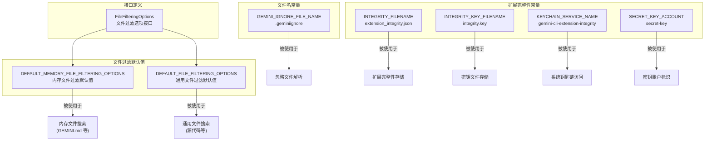

# constants.ts

## 概述

`constants.ts` 是配置模块中的**常量和默认值定义文件**，包含文件过滤选项的接口定义、默认配置值，以及扩展完整性验证所需的常量字符串。该文件短小精悍（约 41 行），为整个项目提供了文件发现和扩展安全相关的基础常量。

## 架构图（Mermaid）

## 核心组件

### `FileFilteringOptions` 接口

定义了文件过滤/搜索时的配置选项：

| 属性 | 类型 | 是否可选 | 说明 |
|---|---|---|---|
| `respectGitIgnore` | `boolean` | 必选 | 是否遵守 `.gitignore` 规则，排除被 Git 忽略的文件 |
| `respectGeminiIgnore` | `boolean` | 必选 | 是否遵守 `.geminiignore` 规则，排除 Gemini 专用忽略文件 |
| `maxFileCount` | `number` | 可选 | 最大文件数量限制，防止在大型仓库中搜索过多文件 |
| `searchTimeout` | `number` | 可选 | 搜索超时时间（毫秒），防止文件搜索耗时过长 |
| `customIgnoreFilePaths` | `string[]` | 必选 | 自定义忽略文件路径列表，用于指定额外的忽略规则文件 |

### 默认过滤配置

#### `DEFAULT_MEMORY_FILE_FILTERING_OPTIONS`

专用于**内存文件**（如 `GEMINI.md`）的搜索配置：

| 属性 | 默认值 | 说明 |
|---|---|---|
| `respectGitIgnore` | `false` | **不**遵守 `.gitignore`，因为内存文件可能位于被 Git 忽略的目录中 |
| `respectGeminiIgnore` | `true` | 遵守 `.geminiignore` |
| `maxFileCount` | `20000` | 最大搜索 20000 个文件 |
| `searchTimeout` | `5000` | 搜索超时 5 秒 |
| `customIgnoreFilePaths` | `[]` | 无自定义忽略文件 |

#### `DEFAULT_FILE_FILTERING_OPTIONS`

用于**通用文件搜索**（源代码等）的配置：

| 属性 | 默认值 | 说明 |
|---|---|---|
| `respectGitIgnore` | `true` | 遵守 `.gitignore`，避免搜索构建产物、依赖等 |
| `respectGeminiIgnore` | `true` | 遵守 `.geminiignore` |
| `maxFileCount` | `20000` | 最大搜索 20000 个文件 |
| `searchTimeout` | `5000` | 搜索超时 5 秒 |
| `customIgnoreFilePaths` | `[]` | 无自定义忽略文件 |

### 忽略文件常量

| 常量 | 值 | 说明 |
|---|---|---|
| `GEMINI_IGNORE_FILE_NAME` | `'.geminiignore'` | Gemini CLI 专用的忽略文件名，类似 `.gitignore` 的机制 |

### 扩展完整性常量

这组常量用于扩展的安全完整性验证机制：

| 常量 | 值 | 说明 |
|---|---|---|
| `INTEGRITY_FILENAME` | `'extension_integrity.json'` | 存储扩展完整性哈希值的 JSON 文件名 |
| `INTEGRITY_KEY_FILENAME` | `'integrity.key'` | 存储完整性验证密钥的文件名（在无钥匙链的平台上使用） |
| `KEYCHAIN_SERVICE_NAME` | `'gemini-cli-extension-integrity'` | 操作系统钥匙链（Keychain）中的服务名称 |
| `SECRET_KEY_ACCOUNT` | `'secret-key'` | 钥匙链中密钥的账户名 |

## 依赖关系

### 内部依赖

无。该文件是纯常量和接口定义，不依赖任何其他内部模块。

### 外部依赖

无。该文件不使用任何外部包。

## 关键实现细节

1. **内存文件与通用文件过滤的差异化**：两套默认配置最关键的区别在于 `respectGitIgnore` 字段。内存文件（如 `GEMINI.md`）的搜索**不遵守 `.gitignore`**，因为这些配置文件可能刻意放置在被 Git 忽略的目录中（如用户的全局配置目录）。而通用文件搜索则遵守 `.gitignore`，避免索引 `node_modules`、构建输出等无关文件。

2. **20000 文件上限**：两种过滤配置都设置了 `maxFileCount: 20000`，这是一个性能安全阀，防止在超大型单体仓库中进行文件发现时耗尽内存或 CPU。

3. **5 秒搜索超时**：`searchTimeout: 5000` 毫秒确保文件搜索不会无限期阻塞用户交互。如果文件系统访问缓慢（如网络挂载），超时后将使用已找到的结果。

4. **扩展完整性双重存储**：扩展完整性密钥采用分层存储策略——优先使用操作系统钥匙链（通过 `KEYCHAIN_SERVICE_NAME` 和 `SECRET_KEY_ACCOUNT` 定位），在钥匙链不可用时退回到文件存储（`INTEGRITY_KEY_FILENAME`）。这兼顾了安全性和跨平台兼容性。

5. **`.geminiignore` 独立于 `.gitignore`**：Gemini CLI 定义了自己的忽略文件机制（`.geminiignore`），允许用户在不影响 Git 行为的情况下控制 Gemini CLI 的文件可见性。两者可以共存且互不干扰。
