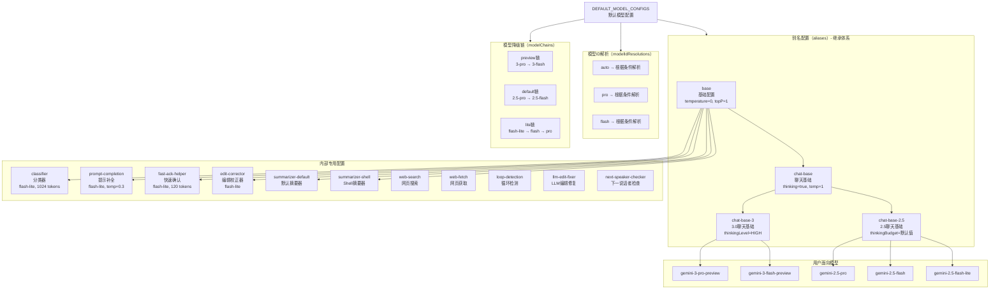
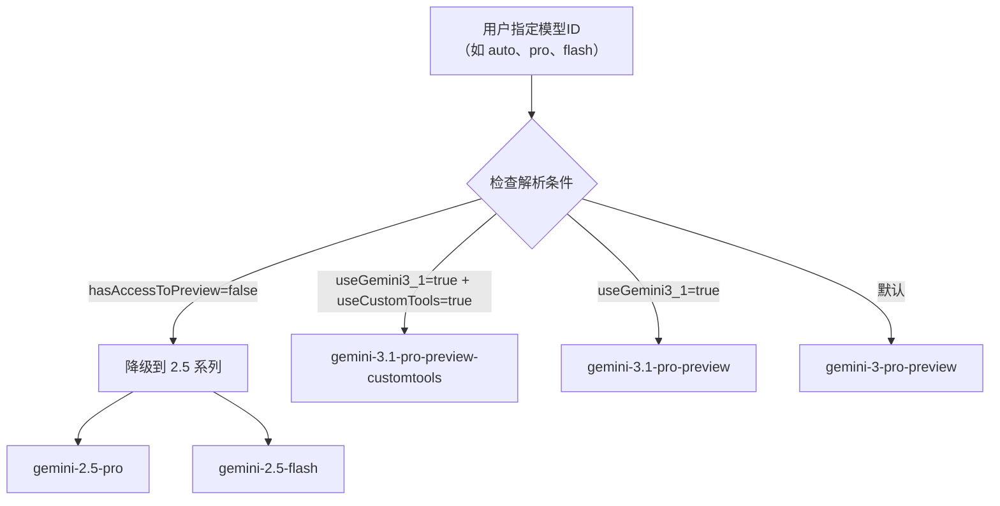

# defaultModelConfigs.ts

## 概述

`defaultModelConfigs.ts` 定义了 Gemini CLI 的**默认模型配置数据**。该文件导出一个名为 `DEFAULT_MODEL_CONFIGS` 的常量对象，类型为 `ModelConfigServiceConfig`，包含了所有模型的别名配置、模型定义、模型 ID 解析规则、分类器 ID 解析规则以及模型降级链。它是 `ModelConfigService` 的默认数据源，决定了各种场景下使用哪个模型以及如何配置生成参数。

该文件覆盖的模型系列包括：
- **Gemini 3.x 系列**：`gemini-3-pro-preview`、`gemini-3-flash-preview`、`gemini-3.1-pro-preview`、`gemini-3.1-flash-lite-preview`
- **Gemini 2.5 系列**：`gemini-2.5-pro`、`gemini-2.5-flash`、`gemini-2.5-flash-lite`

## 架构图（Mermaid）

### 模型 ID 解析流程

## 核心组件

### 别名配置（`aliases`）

别名通过 `extends` 字段形成继承层级，子配置会继承并可覆盖父配置的参数。

#### 基础配置层

| 别名 | 继承自 | 关键参数 | 说明 |
|---|---|---|---|
| `base` | - | `temperature=0`, `topP=1` | 所有配置的根，确定性输出 |
| `chat-base` | `base` | `includeThoughts=true`, `temperature=1`, `topP=0.95`, `topK=64` | 聊天场景基础，启用思考，较高随机性 |
| `chat-base-2.5` | `chat-base` | `thinkingBudget=DEFAULT_THINKING_MODE` | Gemini 2.5 系列聊天配置 |
| `chat-base-3` | `chat-base` | `thinkingLevel=HIGH` | Gemini 3 系列聊天配置，高级思考 |

#### 用户面向模型配置

| 别名 | 继承自 | 模型 | 说明 |
|---|---|---|---|
| `gemini-3-pro-preview` | `chat-base-3` | `gemini-3-pro-preview` | Gemini 3 Pro 预览版 |
| `gemini-3-flash-preview` | `chat-base-3` | `gemini-3-flash-preview` | Gemini 3 Flash 预览版 |
| `gemini-2.5-pro` | `chat-base-2.5` | `gemini-2.5-pro` | Gemini 2.5 Pro |
| `gemini-2.5-flash` | `chat-base-2.5` | `gemini-2.5-flash` | Gemini 2.5 Flash |
| `gemini-2.5-flash-lite` | `chat-base-2.5` | `gemini-2.5-flash-lite` | Gemini 2.5 Flash Lite |

#### 内部专用配置

| 别名 | 模型 | 用途 | 特点 |
|---|---|---|---|
| `classifier` | `gemini-2.5-flash-lite` | 请求路由分类 | `maxOutputTokens=1024`, `thinkingBudget=512` |
| `prompt-completion` | `gemini-2.5-flash-lite` | 提示补全 | `temperature=0.3`, `maxOutputTokens=16000`, 无思考 |
| `fast-ack-helper` | `gemini-2.5-flash-lite` | 快速确认辅助 | `temperature=0.2`, `maxOutputTokens=120`, 无思考 |
| `edit-corrector` | `gemini-2.5-flash-lite` | 编辑校正 | 无思考 |
| `summarizer-default` | `gemini-2.5-flash-lite` | 默认摘要 | `maxOutputTokens=2000` |
| `summarizer-shell` | `gemini-2.5-flash-lite` | Shell 输出摘要 | `maxOutputTokens=2000` |
| `web-search` | `gemini-3-flash-base` | 网页搜索 | 启用 `googleSearch` 工具 |
| `web-fetch` | `gemini-3-flash-base` | 网页获取 | 启用 `urlContext` 工具 |
| `web-fetch-fallback` | `gemini-3-flash-base` | 网页获取降级 | 无特殊工具 |
| `loop-detection` | `gemini-3-flash-base` | 循环检测 | 检测 Agent 是否陷入循环 |
| `loop-detection-double-check` | `base` | 循环检测二次确认 | 使用 `gemini-3-pro-preview` |
| `llm-edit-fixer` | `gemini-3-flash-base` | LLM 编辑修复 | 修复编辑工具的输出 |
| `next-speaker-checker` | `gemini-3-flash-base` | 下一说话者检查 | 多 Agent 场景决定谁发言 |
| `chat-compression-*` | - | 上下文压缩 | 各模型对应的压缩配置 |

### 模型定义（`modelDefinitions`）

定义了每个模型的元数据：

| 模型 | 层级(tier) | 系列(family) | 预览版 | 可见 | 思考 | 多模态工具 |
|---|---|---|---|---|---|---|
| `gemini-3.1-pro-preview` | pro | gemini-3 | 是 | 是 | 是 | 是 |
| `gemini-3.1-pro-preview-customtools` | pro | gemini-3 | 是 | **否** | 是 | 是 |
| `gemini-3.1-flash-lite-preview` | flash-lite | gemini-3 | 是 | 是 | 否 | 是 |
| `gemini-3-pro-preview` | pro | gemini-3 | 是 | 是 | 是 | 是 |
| `gemini-3-flash-preview` | flash | gemini-3 | 是 | 是 | 否 | 是 |
| `gemini-2.5-pro` | pro | gemini-2.5 | 否 | 是 | 否 | 否 |
| `gemini-2.5-flash` | flash | gemini-2.5 | 否 | 是 | 否 | 否 |
| `gemini-2.5-flash-lite` | flash-lite | gemini-2.5 | 否 | 是 | 否 | 否 |
| `auto` | auto | - | 是 | 否 | 是 | 否 |
| `auto-gemini-3` | auto | - | 是 | 是 | 是 | 否 |
| `auto-gemini-2.5` | auto | - | 否 | 是 | 否 | 否 |
| `pro` / `flash` / `flash-lite` | 各自 | - | 否 | 否 | 各异 | 否 |

### 模型 ID 解析规则（`modelIdResolutions`）

根据运行时条件将逻辑模型 ID 映射到具体模型：

| 逻辑ID | 默认目标 | 条件解析 |
|---|---|---|
| `auto` | `gemini-3-pro-preview` | 无预览权限 → `2.5-pro`; 3.1+自定义工具 → `3.1-pro-customtools`; 3.1 → `3.1-pro` |
| `pro` | `gemini-3-pro-preview` | 同上 |
| `flash` | `gemini-3-flash-preview` | 无预览权限 → `2.5-flash` |
| `flash-lite` | `gemini-2.5-flash-lite` | 3.1 Flash Lite 可用 → `3.1-flash-lite-preview` |
| `auto-gemini-3` | `gemini-3-pro-preview` | 同 `auto` |
| `auto-gemini-2.5` | `gemini-2.5-pro` | 无条件解析 |

### 分类器 ID 解析（`classifierIdResolutions`）

用于模型路由时的分类器选择：

| 分类器角色 | 默认 | 条件 |
|---|---|---|
| `flash` | `gemini-3-flash-preview` | 请求模型为 2.5 系列 → `gemini-2.5-flash`；请求模型为 3 系列 → `gemini-3-flash-preview` |
| `pro` | `gemini-3-pro-preview` | 请求模型为 2.5 系列 → `gemini-2.5-pro`；3.1+自定义工具 → `3.1-pro-customtools`；3.1 → `3.1-pro` |

### 模型降级链（`modelChains`）

定义了模型不可用时的降级路径：

| 链名 | 降级路径 | 动作模式 | 说明 |
|---|---|---|---|
| `preview` | `3-pro` → `3-flash`(最后手段) | `prompt` | 预览模型降级链，提示用户 |
| `default` | `2.5-pro` → `2.5-flash`(最后手段) | `prompt` | 默认降级链，提示用户 |
| `lite` | `2.5-flash-lite` → `2.5-flash` → `2.5-pro`(最后手段) | `silent` | 轻量级降级链，静默切换 |

### 覆盖规则（`overrides`）

| 匹配条件 | 覆盖内容 | 说明 |
|---|---|---|
| `model='chat-base'` + `isRetry=true` | `temperature=1` | 重试时提高随机性，增加生成结果多样性 |

## 依赖关系

### 内部依赖

| 导入 | 来源 | 说明 |
|---|---|---|
| `ModelConfigServiceConfig` | `../services/modelConfigService.js` | 配置数据的类型定义 |
| `DEFAULT_THINKING_MODE` | `./models.js` | 默认思考模式常量（用于 2.5 系列的 thinkingBudget） |

### 外部依赖

| 包 | 用途 |
|---|---|
| `@google/genai` | `ThinkingLevel` 枚举（`ThinkingLevel.HIGH`） |

## 关键实现细节

1. **配置继承机制**：别名通过 `extends` 字段形成树状继承结构，子配置会深度合并父配置的所有参数。这避免了大量重复配置，例如所有聊天模型都继承自 `chat-base`，无需重复指定 `includeThoughts`、`temperature` 等通用参数。

2. **Gemini 3 与 2.5 的配置差异**：
   - Gemini 3 系列使用 `ThinkingLevel.HIGH`（高级思考级别）
   - Gemini 2.5 系列使用 `thinkingBudget`（数值化思考预算）
   - 这反映了两代模型在思考能力配置 API 上的差异

3. **内部模型的精细调参**：各个内部专用配置都有精心调校的参数：
   - `classifier` 限制输出为 1024 tokens 并设置极小的思考预算（512），确保分类快速完成
   - `fast-ack-helper` 仅允许 120 tokens 输出且完全禁用思考，追求极速响应
   - `prompt-completion` 允许较大的 16000 tokens 输出但禁用思考，平衡质量与速度

4. **条件化模型解析**：`modelIdResolutions` 实现了基于运行时条件的动态模型选择。例如 `auto` 模型会根据用户是否有预览模型访问权限、是否启用了 Gemini 3.1、是否使用自定义工具等条件，解析为不同的具体模型。这使得用户可以简单地指定 `auto` 或 `pro`，系统自动选择最优模型。

5. **降级链的动作策略差异**：
   - `preview` 和 `default` 链使用 `prompt` 动作——在降级时提示用户
   - `lite` 链使用 `silent` 动作——静默降级不打扰用户
   - 这是因为轻量级模型的降级通常发生在后台辅助任务中，不需要通知用户

6. **`customtools` 变体**：`gemini-3.1-pro-preview-customtools` 是一个不可见的内部变体（`isVisible: false`），当检测到用户使用自定义工具时会自动路由到此模型，提供更好的自定义工具支持能力。

7. **重试时的温度提升**：`overrides` 中定义了重试时将温度设为 1 的规则，这是一种常见的 LLM 工程实践——在第一次生成失败后增加随机性以获得不同的输出结果。

8. **Web 工具的特殊配置**：`web-search` 和 `web-fetch` 别名通过 `generateContentConfig.tools` 注入了 Google 专有工具（`googleSearch` 和 `urlContext`），这是 Gemini API 的内置能力，而非通过 MCP 等外部机制实现。
