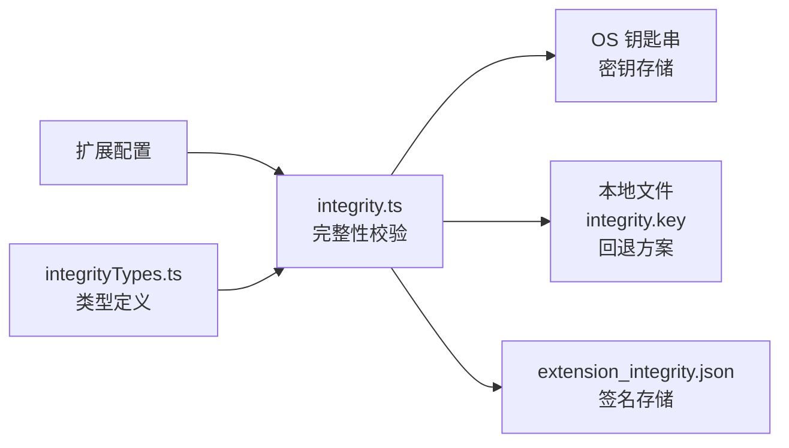
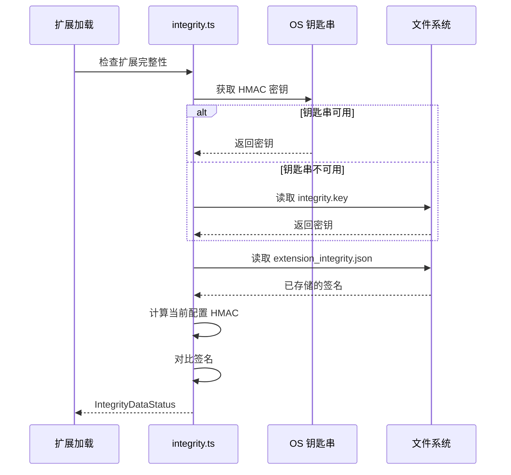

# extensions

## 概述

`extensions` 子目录负责 Gemini CLI **扩展的完整性校验**，确保扩展配置在安装后未被篡改。它使用 HMAC 签名机制，密钥优先存储在操作系统钥匙串中，回退到受权限限制的本地文件。

## 目录结构

```
extensions/
├── integrity.ts         # 扩展完整性校验核心实现
└── integrityTypes.ts    # 完整性校验相关类型定义
```

## 架构图



## 核心组件

### `integrity.ts` - 完整性校验实现

实现 `IExtensionIntegrity` 接口，提供：
- **密钥管理**: 生成随机密钥，优先存储到 OS 钥匙串（`KeychainService`），回退到 `~/.gemini/integrity.key`（权限 0o600）
- **HMAC 签名**: 使用 `json-stable-stringify` 确保 JSON 序列化的确定性，对扩展安装元数据计算 HMAC
- **校验流程**: 加载已存储的签名，对比当前配置的签名，判断完整性状态
- **数据持久化**: 将签名存储在 `extension_integrity.json` 中

### `integrityTypes.ts` - 类型定义

- **`IntegrityDataStatus`**: 校验状态枚举
  - `Verified`: 签名匹配，完整性通过
  - `Modified`: 签名不匹配，配置被修改
  - `Missing`: 无签名记录
  - `Error`: 校验过程出错

- **`ExtensionIntegrityMap`**: 扩展名到签名的映射 `Record<string, string>`

- **`IntegrityStore`**: 签名存储格式（由 Zod schema 校验）

- **`IExtensionIntegrity`**: 完整性服务接口

## 依赖关系

### 内部依赖
- `../constants.ts` - `INTEGRITY_FILENAME`、`KEYCHAIN_SERVICE_NAME` 等常量
- `../config.ts` - `ExtensionInstallMetadata` 类型
- `../../services/keychainService.ts` - OS 钥匙串操作
- `../../utils/paths.ts` - `homedir()`、`GEMINI_DIR`

### 外部依赖
- `json-stable-stringify` - 确定性 JSON 序列化
- `node:crypto` - HMAC 计算

## 数据流


