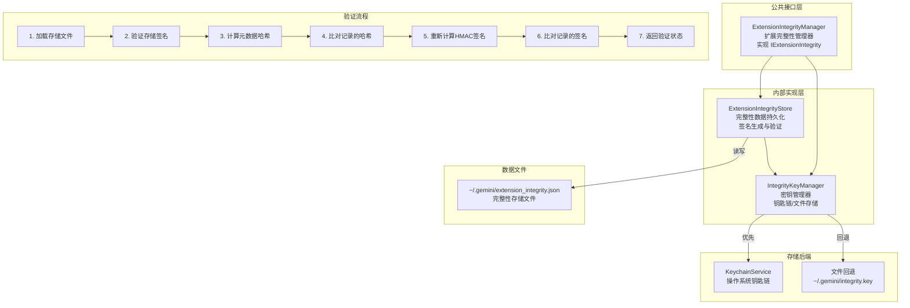
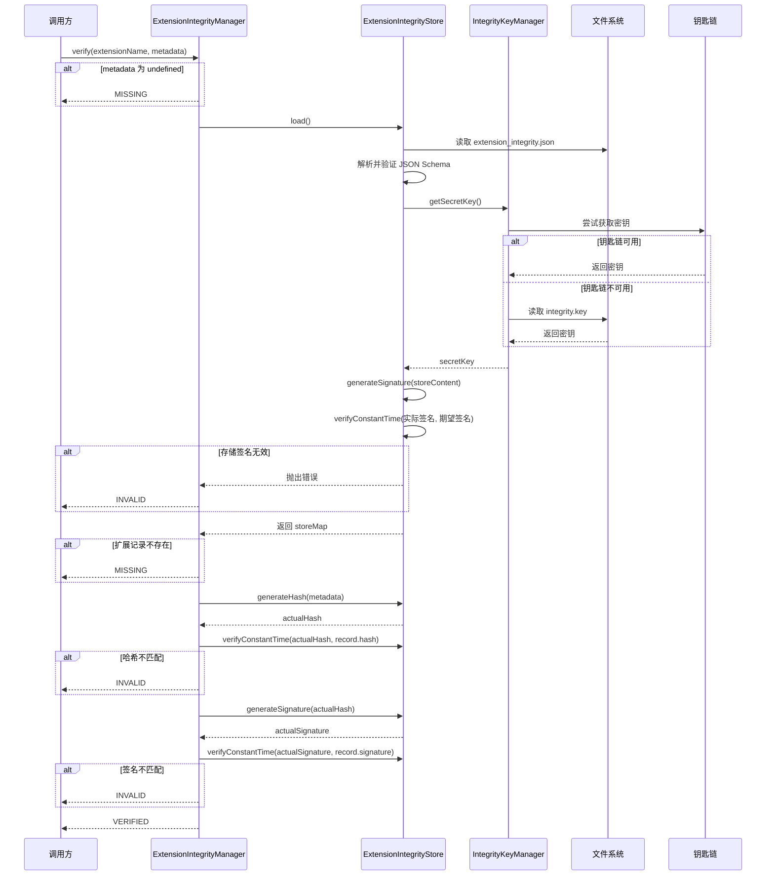

# integrity.ts

## 概述

`integrity.ts` 实现了 Gemini CLI 的**扩展完整性验证系统**，用于确保已安装的扩展（Extensions）未被篡改。该系统采用了密码学签名机制（HMAC-SHA256），结合操作系统钥匙链或本地文件存储来管理签名密钥，提供了一套完整的扩展安装元数据的哈希校验和签名验证流程。

该文件包含三个核心类：
- **`IntegrityKeyManager`**：负责密钥的生成和安全存储
- **`ExtensionIntegrityStore`**：负责完整性数据的持久化和签名验证
- **`ExtensionIntegrityManager`**：面向外部的公共接口，编排验证和存储流程

## 架构图（Mermaid）



### 完整验证流程



## 核心组件

### `IntegrityKeyManager`（内部类）

负责管理用于 HMAC 签名的主密钥（master secret key），采用分层存储策略。

| 方法 | 说明 |
|---|---|
| `getSecretKey()` | 获取主密钥。优先使用缓存，其次尝试钥匙链，最后回退到文件存储 |
| `getSecretKeyFromKeychain()` | 从操作系统钥匙链获取或生成密钥（256-bit 随机密钥） |
| `getSecretKeyFromFile()` | 从本地文件获取或生成密钥，文件权限设为 `0o600`（仅所有者可读写） |

**密钥存储位置**：
- **钥匙链**：服务名 `gemini-cli-extension-integrity`，账户 `secret-key`
- **文件回退**：`~/.gemini/integrity.key`（权限 `0o600`）

### `ExtensionIntegrityStore`（内部类）

管理完整性数据的磁盘持久化，包括整体存储签名的生成和验证。

| 方法 | 说明 |
|---|---|
| `load()` | 从磁盘加载完整性映射表，解析 JSON 并通过 Zod Schema 验证，然后校验整体存储签名 |
| `save(store)` | 将完整性映射表序列化并签名后写入磁盘，使用原子写入模式（write-then-rename） |
| `generateHash(metadata)` | 对 `ExtensionInstallMetadata` 生成确定性 SHA-256 哈希 |
| `generateSignature(data)` | 使用主密钥对数据生成 HMAC-SHA256 签名 |
| `verifyConstantTime(actual, expected)` | 常数时间比较两个签名，防止时序攻击 |

**存储文件路径**：`~/.gemini/extension_integrity.json`

**存储文件结构**：
```json
{
  "store": {
    "extensionName1": { "hash": "sha256hex...", "signature": "hmacsha256hex..." },
    "extensionName2": { "hash": "sha256hex...", "signature": "hmacsha256hex..." }
  },
  "signature": "整体存储的hmac签名..."
}
```

### `ExtensionIntegrityManager`（公共类）

实现 `IExtensionIntegrity` 接口，对外提供扩展完整性验证和记录功能。

| 方法 | 返回值 | 说明 |
|---|---|---|
| `verify(extensionName, metadata)` | `IntegrityDataStatus` | 验证扩展的安装元数据是否与记录的完整性数据匹配 |
| `store(extensionName, metadata)` | `void` | 记录扩展的完整性数据（哈希 + 签名） |
| `getSecretKey()` | `string` | 获取主密钥（仅用于测试） |

**验证返回状态**（`IntegrityDataStatus`）：

| 状态 | 说明 |
|---|---|
| `VERIFIED` | 完整性验证通过，元数据与记录完全匹配 |
| `MISSING` | 无完整性记录（首次安装或记录丢失） |
| `INVALID` | 完整性验证失败（元数据被篡改或签名不匹配） |

## 依赖关系

### 内部依赖

| 导入 | 来源 | 说明 |
|---|---|---|
| `INTEGRITY_FILENAME` | `../constants.js` | 完整性存储文件名常量 |
| `INTEGRITY_KEY_FILENAME` | `../constants.js` | 密钥文件名常量 |
| `KEYCHAIN_SERVICE_NAME` | `../constants.js` | 钥匙链服务名常量 |
| `SECRET_KEY_ACCOUNT` | `../constants.js` | 钥匙链账户名常量 |
| `ExtensionInstallMetadata` | `../config.js` | 扩展安装元数据类型 |
| `KeychainService` | `../../services/keychainService.js` | 操作系统钥匙链访问服务 |
| `isNodeError`, `getErrorMessage` | `../../utils/errors.js` | 错误处理工具 |
| `debugLogger` | `../../utils/debugLogger.js` | 调试日志 |
| `homedir`, `GEMINI_DIR` | `../../utils/paths.js` | 路径工具（用户主目录、`.gemini` 目录） |
| `IExtensionIntegrity`, `IntegrityDataStatus`, `ExtensionIntegrityMap`, `IntegrityStore`, `IntegrityStoreSchema` | `./integrityTypes.js` | 完整性相关类型和 Zod Schema |

### 外部依赖

| 包 | 用途 |
|---|---|
| `node:fs` | 文件读写（完整性存储文件、密钥文件） |
| `node:path` | 路径拼接 |
| `node:crypto` | `createHash`（SHA-256）、`createHmac`（HMAC-SHA256）、`randomBytes`（密钥生成）、`timingSafeEqual`（常数时间比较） |
| `json-stable-stringify` | 确定性 JSON 序列化（确保相同对象始终产生相同字符串） |

## 关键实现细节

1. **双层签名机制**：
   - **哈希层**：每个扩展的 `ExtensionInstallMetadata` 被 SHA-256 哈希后存储，用于检测元数据内容变更
   - **签名层**：哈希值再通过 HMAC-SHA256 签名，确保完整性记录本身的真实性
   - **存储签名**：整个 `store` 对象也被 HMAC 签名，防止手动篡改 JSON 文件

2. **时序攻击防护**：所有签名比较都通过 `timingSafeEqual` 进行常数时间比较，防止攻击者通过测量比较时间来逐字节猜测签名值。

3. **确定性序列化**：使用 `json-stable-stringify` 代替 `JSON.stringify`，确保对象属性的序列化顺序一致。这是密码学签名的关键要求——相同的对象必须始终产生相同的字符串，否则哈希值会因属性顺序不同而变化。

4. **原子文件写入**：`save()` 方法使用"先写临时文件再重命名"的模式（write-then-rename），确保在写入过程中发生崩溃时不会损坏现有的完整性数据文件。`rename` 在大多数文件系统上是原子操作。

5. **密钥分层存储策略**：
   - **首选**：操作系统钥匙链（macOS Keychain、Windows Credential Store、Linux Secret Service）——密钥由 OS 加密保护
   - **回退**：本地文件 `~/.gemini/integrity.key`，权限设置为 `0o600`（仅所有者可读写）——在无钥匙链的环境（如 CI/CD 或容器）中使用
   - 密钥一旦获取就会被缓存（`cachedSecretKey`），避免重复访问钥匙链或文件系统

6. **写入并发控制**：`store()` 方法通过 Promise 链（`writeLock`）实现写入操作的串行化。多个并发的 `store()` 调用会排队执行，避免竞态条件导致数据丢失。具体机制是每次写操作都 await 前一次的 `writeLock`，然后将当前操作设为新的 `writeLock`。

7. **验证的优雅降级**：`verify()` 方法中的任何异常都会导致返回 `INVALID` 而非抛出错误，确保验证失败不会中断整个应用程序流程。调用方可以根据返回的状态决定是否允许加载扩展。

8. **256-bit 随机密钥**：密钥通过 `randomBytes(32)` 生成（32 字节 = 256 位），以 hex 编码存储。这提供了足够的密码学安全强度，符合 HMAC-SHA256 的推荐密钥长度。

9. **Zod Schema 验证**：从磁盘加载的 JSON 数据必须通过 `IntegrityStoreSchema` 的 Zod 验证，确保文件结构的正确性。如果验证失败，会抛出包含重置指令的错误消息，引导用户删除损坏的文件。

10. **re-export 模式**：文件末尾通过 `export * from './integrityTypes.js'` 将所有类型重新导出，使得消费者只需从 `integrity.js` 一个入口导入所有相关类型。
