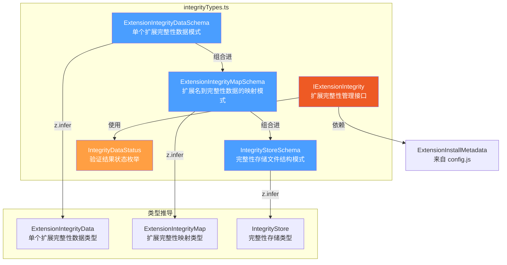

# integrityTypes.ts

## 概述

`integrityTypes.ts` 是扩展完整性验证系统的**类型定义文件**。它使用 Zod 模式验证库定义了扩展完整性数据的数据结构（Schema）、TypeScript 类型、验证状态枚举以及完整性管理接口。该文件是扩展安全体系的基石，确保扩展在安装和运行过程中未被篡改。

## 架构图（Mermaid）



## 核心组件

### 1. Zod 模式定义

#### `ExtensionIntegrityDataSchema`

单个扩展的完整性数据模式，包含两个字段：

| 字段 | 类型 | 描述 |
|------|------|------|
| `hash` | `string` | 扩展内容的哈希值，用于检测内容是否被篡改 |
| `signature` | `string` | 扩展的数字签名，用于验证来源可信性 |

```typescript
export const ExtensionIntegrityDataSchema = z.object({
  hash: z.string(),
  signature: z.string(),
});
```

#### `ExtensionIntegrityMapSchema`

扩展名称到其完整性数据的映射模式。使用 `z.record` 定义一个键为字符串（扩展名）、值为 `ExtensionIntegrityDataSchema` 的字典结构。

```typescript
export const ExtensionIntegrityMapSchema = z.record(
  z.string(),
  ExtensionIntegrityDataSchema,
);
```

#### `IntegrityStoreSchema`

完整性存储文件的完整结构模式，持久化到磁盘：

| 字段 | 类型 | 描述 |
|------|------|------|
| `store` | `ExtensionIntegrityMapSchema` | 所有扩展的完整性数据映射 |
| `signature` | `string` | 整个存储的签名，防止存储文件本身被篡改 |

```typescript
export const IntegrityStoreSchema = z.object({
  store: ExtensionIntegrityMapSchema,
  signature: z.string(),
});
```

### 2. TypeScript 类型

这些类型通过 `z.infer` 从 Zod 模式自动推导，确保运行时验证与编译时类型检查的一致性：

- **`ExtensionIntegrityData`**: `{ hash: string; signature: string }`
- **`ExtensionIntegrityMap`**: `Record<string, ExtensionIntegrityData>`
- **`IntegrityStore`**: `{ store: ExtensionIntegrityMap; signature: string }`

### 3. `IntegrityDataStatus` 枚举

验证扩展完整性后的结果状态：

| 枚举值 | 字符串值 | 描述 |
|--------|----------|------|
| `VERIFIED` | `'verified'` | 扩展完整性验证通过，内容未被篡改 |
| `MISSING` | `'missing'` | 扩展的完整性数据缺失，可能是新安装或数据丢失 |
| `INVALID` | `'invalid'` | 完整性验证失败，扩展可能已被篡改 |

### 4. `IExtensionIntegrity` 接口

定义扩展完整性管理的标准接口，包含两个方法：

#### `verify(extensionName, metadata): Promise<IntegrityDataStatus>`

- **功能**: 验证指定扩展的安装元数据完整性
- **参数**:
  - `extensionName: string` - 扩展名称
  - `metadata: ExtensionInstallMetadata | undefined` - 扩展安装元数据，可能为 undefined
- **返回**: `Promise<IntegrityDataStatus>` - 验证结果状态

#### `store(extensionName, metadata): Promise<void>`

- **功能**: 签名并存储扩展的安装元数据完整性信息
- **参数**:
  - `extensionName: string` - 扩展名称
  - `metadata: ExtensionInstallMetadata` - 扩展安装元数据
- **返回**: `Promise<void>`

## 依赖关系

### 内部依赖

| 依赖 | 路径 | 用途 |
|------|------|------|
| `ExtensionInstallMetadata` | `../config.js` | 扩展安装元数据类型，作为 `IExtensionIntegrity` 接口方法的参数类型 |

### 外部依赖

| 依赖 | 版本 | 用途 |
|------|------|------|
| `zod` | - | 运行时类型验证库，用于定义数据模式（Schema）并从中推导 TypeScript 类型 |

## 关键实现细节

1. **Zod 模式驱动设计**: 采用"Schema First"模式，先定义 Zod 模式，再通过 `z.infer` 推导 TypeScript 类型。这样做的好处是同一份定义既可用于编译时类型检查，也可用于运行时数据验证（如从磁盘读取完整性存储文件时）。

2. **双层签名机制**: 设计了两层签名保护：
   - **扩展级签名**: 每个扩展各自拥有 `hash` 和 `signature`，用于验证单个扩展的完整性。
   - **存储级签名**: `IntegrityStore` 整体有一个 `signature`，保护整个存储映射不被篡改（例如删除某个扩展的记录）。

3. **接口抽象**: `IExtensionIntegrity` 作为接口而非具体实现，遵循依赖倒置原则（DIP），允许不同的完整性验证策略（如不同的哈希算法、签名方案）通过实现此接口来替换。

4. **metadata 可选性**: `verify` 方法的 `metadata` 参数允许 `undefined`，这意味着验证逻辑需要处理扩展元数据不存在的场景（如扩展已卸载但完整性记录仍存在）。
