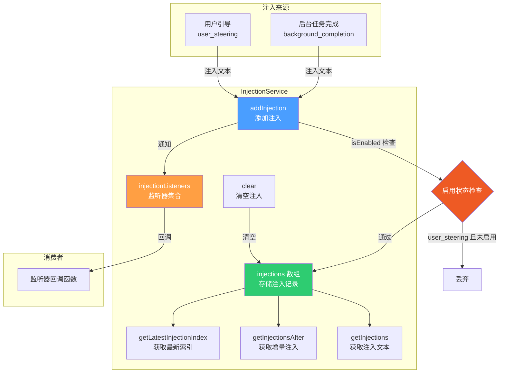

# injectionService.ts

## 概述

`injectionService.ts` 实现了一个**注入服务（InjectionService）**，用于管理向模型对话中注入额外文本内容的机制。多种来源（用户引导、后台任务完成等）可以通过此服务向对话中注入信息，消费者通过注册监听器来实时接收注入事件。该服务采用观察者模式，支持来源过滤、基于索引的增量查询等功能。

## 架构图（Mermaid）



## 核心组件

### 1. 类型定义

#### `InjectionSource`

注入来源的联合类型：

| 值 | 描述 |
|---|------|
| `'user_steering'` | 用户交互式引导，受模型引导（model steering）开关控制 |
| `'background_completion'` | 后台执行任务完成后的输出，始终被接受 |

#### `InjectionListener`

注入监听器的函数签名类型：

```typescript
type InjectionListener = (text: string, source: InjectionSource) => void;
```

接收注入文本和来源信息两个参数。

### 2. `InjectionService` 类

#### 私有属性

| 属性 | 类型 | 描述 |
|------|------|------|
| `injections` | `Array<{ text: string; source: InjectionSource; timestamp: number }>` | 按时间顺序存储的注入记录数组 |
| `injectionListeners` | `Set<InjectionListener>` | 注册的监听器集合 |

#### 构造函数

```typescript
constructor(private readonly isEnabled: () => boolean)
```

接收一个函数参数 `isEnabled`，返回布尔值表示模型引导是否启用。这是一个延迟求值设计，每次添加注入时动态检查状态。

#### 方法

##### `addInjection(text: string, source: InjectionSource): void`

添加注入到服务中。核心逻辑：

1. **来源门控**: 如果来源是 `user_steering` 且 `isEnabled()` 返回 `false`，则直接丢弃（静默忽略）。其他来源（如 `background_completion`）不受此限制，始终被接受。
2. **空文本过滤**: 对文本进行 `trim()` 处理后，如果为空则丢弃。
3. **存储**: 将 `{ text, source, timestamp }` 对象压入 `injections` 数组。
4. **通知监听器**: 遍历所有已注册的监听器并调用，对单个监听器的异常进行 try-catch 保护，确保一个监听器的失败不影响其他监听器。

##### `onInjection(listener: InjectionListener): void`

注册一个注入监听器。使用 `Set` 存储，天然去重。

##### `offInjection(listener: InjectionListener): void`

注销一个注入监听器。

##### `getInjections(source?: InjectionSource): string[]`

获取所有注入文本，可选按来源过滤：

- 不传 `source`: 返回所有注入的文本数组
- 传入 `source`: 仅返回指定来源的注入文本

##### `getInjectionsAfter(index: number, source?: InjectionSource): string[]`

获取指定索引之后的注入文本（增量查询）：

- `index < 0`: 返回所有注入（等同于 `getInjections`）
- `index >= 0`: 返回 `index + 1` 位置之后的注入
- 支持可选的 `source` 过滤

此方法配合 `getLatestInjectionIndex()` 使用，实现"自上次查询以来的新增注入"语义。

##### `getLatestInjectionIndex(): number`

返回最新注入的索引值（`injections.length - 1`）。当没有注入时返回 `-1`。

##### `clear(): void`

清空所有已收集的注入记录。通过设置 `injections.length = 0` 实现原地清空。

## 依赖关系

### 内部依赖

| 依赖 | 路径 | 用途 |
|------|------|------|
| `debugLogger` | `../utils/debugLogger.js` | 调试日志工具，在监听器回调失败时输出警告信息 |

### 外部依赖

无外部依赖。

## 关键实现细节

1. **观察者模式**: 使用经典的发布-订阅模式。`addInjection` 是发布操作，`onInjection`/`offInjection` 是订阅/取消订阅操作。监听器使用 `Set` 而非数组，避免同一监听器被重复注册。

2. **差异化门控策略**: `user_steering` 类型的注入受 `isEnabled()` 控制，而 `background_completion` 始终被接受。这体现了不同注入来源的优先级和信任级别差异 -- 后台任务完成是系统内部行为，不应被用户配置阻断。

3. **错误隔离**: 在通知监听器时，每个监听器调用都包裹在 try-catch 中。这意味着即使某个消费者的监听器抛出异常，也不会阻止其他监听器收到通知，也不会影响注入本身的存储。

4. **增量查询设计**: `getInjectionsAfter` + `getLatestInjectionIndex` 组合实现了高效的增量查询模式。消费者可以记住上次查询的索引，下次只获取新增的注入，避免重复处理。

5. **延迟求值的 isEnabled**: 构造函数接收的是一个函数而非布尔值，这样 `isEnabled` 的状态可以在运行时动态变化（例如用户在会话中途切换设置），无需重新创建 InjectionService 实例。

6. **时间戳记录**: 每条注入都记录了 `timestamp`（`Date.now()`），但当前对外的查询方法只返回文本内容。时间戳信息为将来的扩展（如超时清理、时间排序）提供了基础。
