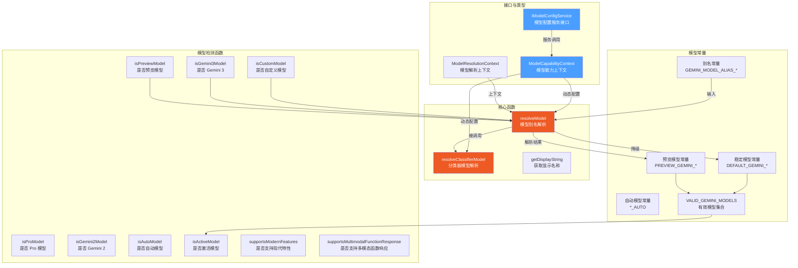

# models.ts

## 概述

`models.ts` 是 Gemini CLI 的**模型配置与解析核心模块**。它定义了所有支持的 Gemini 模型常量、模型别名、模型解析逻辑以及一系列模型能力检测函数。该文件负责将用户请求的模型别名（如 `auto`、`pro`、`flash`）解析为具体的模型 ID，并根据用户的访问权限（是否有预览模型访问权）进行降级处理。同时它还提供了动态模型配置的扩展机制，通过 `IModelConfigService` 接口支持运行时的模型定义和解析。

## 架构图（Mermaid）

## 核心组件

### 1. 接口定义

#### `ModelResolutionContext`

模型解析时的上下文信息：

| 字段 | 类型 | 描述 |
|------|------|------|
| `useGemini3_1` | `boolean?` | 是否使用 Gemini 3.1 Pro Preview |
| `useGemini3_1FlashLite` | `boolean?` | 是否使用 Gemini 3.1 Flash Lite Preview |
| `useCustomTools` | `boolean?` | 是否使用自定义工具模型 |
| `hasAccessToPreview` | `boolean?` | 是否有预览模型访问权限 |
| `requestedModel` | `string?` | 用户请求的模型名称 |

#### `IModelConfigService`

模型配置服务接口，用于打破循环依赖：

| 方法 | 返回值 | 描述 |
|------|--------|------|
| `getModelDefinition(modelId)` | `{ tier?, family?, isPreview?, displayName?, features? } \| undefined` | 获取模型定义信息 |
| `resolveModelId(requestedModel, context?)` | `string` | 解析模型 ID |
| `resolveClassifierModelId(tier, requestedModel, context?)` | `string` | 解析分类器模型 ID |

#### `ModelCapabilityContext`

模型能力检测所需的最小配置接口：

| 成员 | 类型 | 描述 |
|------|------|------|
| `modelConfigService` | `IModelConfigService` | 模型配置服务实例（只读） |
| `getExperimentalDynamicModelConfiguration()` | `() => boolean` | 是否启用实验性动态模型配置 |

### 2. 模型常量

#### 预览模型

| 常量 | 值 | 描述 |
|------|---|------|
| `PREVIEW_GEMINI_MODEL` | `'gemini-3-pro-preview'` | Gemini 3 Pro 预览版 |
| `PREVIEW_GEMINI_3_1_MODEL` | `'gemini-3.1-pro-preview'` | Gemini 3.1 Pro 预览版 |
| `PREVIEW_GEMINI_3_1_CUSTOM_TOOLS_MODEL` | `'gemini-3.1-pro-preview-customtools'` | Gemini 3.1 Pro 自定义工具预览版 |
| `PREVIEW_GEMINI_FLASH_MODEL` | `'gemini-3-flash-preview'` | Gemini 3 Flash 预览版 |
| `PREVIEW_GEMINI_3_1_FLASH_LITE_MODEL` | `'gemini-3.1-flash-lite-preview'` | Gemini 3.1 Flash Lite 预览版 |

#### 稳定模型

| 常量 | 值 | 描述 |
|------|---|------|
| `DEFAULT_GEMINI_MODEL` | `'gemini-2.5-pro'` | Gemini 2.5 Pro 稳定版 |
| `DEFAULT_GEMINI_FLASH_MODEL` | `'gemini-2.5-flash'` | Gemini 2.5 Flash 稳定版 |
| `DEFAULT_GEMINI_FLASH_LITE_MODEL` | `'gemini-2.5-flash-lite'` | Gemini 2.5 Flash Lite 稳定版 |

#### 自动模型

| 常量 | 值 | 描述 |
|------|---|------|
| `PREVIEW_GEMINI_MODEL_AUTO` | `'auto-gemini-3'` | Gemini 3 自动选择 |
| `DEFAULT_GEMINI_MODEL_AUTO` | `'auto-gemini-2.5'` | Gemini 2.5 自动选择 |

#### 用户友好别名

| 常量 | 值 | 描述 |
|------|---|------|
| `GEMINI_MODEL_ALIAS_AUTO` | `'auto'` | 自动选择别名 |
| `GEMINI_MODEL_ALIAS_PRO` | `'pro'` | Pro 模型别名 |
| `GEMINI_MODEL_ALIAS_FLASH` | `'flash'` | Flash 模型别名 |
| `GEMINI_MODEL_ALIAS_FLASH_LITE` | `'flash-lite'` | Flash Lite 模型别名 |

#### 其他常量

| 常量 | 值 | 描述 |
|------|---|------|
| `VALID_GEMINI_MODELS` | `Set<string>` | 所有有效 Gemini 模型的集合 |
| `DEFAULT_GEMINI_EMBEDDING_MODEL` | `'gemini-embedding-001'` | 默认嵌入模型 |
| `DEFAULT_THINKING_MODE` | `8192` | 默认思维模式 token 上限，防止思维循环失控 |

### 3. 核心函数

#### `resolveModel(requestedModel, useGemini3_1?, useGemini3_1FlashLite?, useCustomToolModel?, hasAccessToPreview?, config?): string`

**核心模型解析函数**，将用户请求的模型别名解析为具体的模型名称。

解析逻辑分两条路径：

**路径 A - 动态配置模式**（当 `config?.getExperimentalDynamicModelConfiguration()` 为 `true`）：
1. 委托给 `config.modelConfigService.resolveModelId()` 解析
2. 如果用户无预览访问权限且解析结果是预览模型，则降级到对应的稳定模型

**路径 B - 静态 switch 模式**（默认路径）：
1. 通过 `switch` 语句匹配别名：
   - `auto` / `pro` / `gemini-3-pro-preview` / `auto-gemini-3` -> 根据 `useGemini3_1` 和 `useCustomToolModel` 选择具体 Pro 模型
   - `auto-gemini-2.5` -> `gemini-2.5-pro`
   - `flash` -> `gemini-3-flash-preview`
   - `flash-lite` -> 根据 `useGemini3_1FlashLite` 选择
   - 默认透传原始值
2. 预览权限降级：无预览权限时，所有预览模型降级到对应稳定版

#### `resolveClassifierModel(requestedModel, modelAlias, ...): string`

**分类器模型解析函数**，根据分类器的决策选择合适的模型。

- 动态配置模式下委托给 `config.modelConfigService.resolveClassifierModelId()`
- 静态模式下：
  - 当 `modelAlias` 为 `flash` 时，根据请求模型的版本（2.5 或 3）选择对应的 Flash 模型
  - 其他情况调用 `resolveModel` 进行常规解析

#### `getDisplayString(model, config?): string`

获取模型的用户友好显示名称：
- 动态配置模式下从 `modelConfigService` 获取 `displayName`
- 静态模式下通过 switch 映射，如 `auto-gemini-3` -> `'Auto (Gemini 3)'`

### 4. 模型检测函数

| 函数 | 描述 | 动态配置行为 | 静态行为 |
|------|------|-------------|---------|
| `isPreviewModel` | 检查是否为预览模型 | 查询 `isPreview` 属性 | 与预览模型常量列表比较 |
| `isProModel` | 检查是否为 Pro 模型 | 查询 `tier === 'pro'` | 模型名包含 `'pro'`（不区分大小写） |
| `isGemini3Model` | 检查是否为 Gemini 3 系列 | 查询 `family === 'gemini-3'` | 正则匹配 `/^gemini-3(\.|-|$)/` |
| `isGemini2Model` | 检查是否为 Gemini 2.x 系列 | 无动态配置支持（遗留函数） | 正则匹配 `/^gemini-2(\.|$)/` |
| `isCustomModel` | 检查是否为自定义（非 Gemini）模型 | 查询 `tier === 'custom'` 或不以 `gemini-` 开头 | 不以 `gemini-` 开头 |
| `isAutoModel` | 检查是否为自动选择模型 | 查询 `tier === 'auto'` | 与自动模型常量比较 |
| `supportsModernFeatures` | 是否支持现代特性（如 thoughts） | 无动态配置 | Gemini 3 或自定义模型 |
| `supportsMultimodalFunctionResponse` | 是否支持多模态函数响应 | 查询 `features.multimodalToolUse` | 以 `gemini-3-` 开头 |
| `isActiveModel` | 在当前配置下是否为激活模型 | 无动态配置 | 必须在 `VALID_GEMINI_MODELS` 中且符合启用条件 |

## 依赖关系

### 内部依赖

无直接内部模块导入。但通过接口参数间接依赖 `IModelConfigService` 的实现。

### 外部依赖

无外部依赖。

## 关键实现细节

1. **双轨解析架构**: 几乎所有函数都支持两种解析路径——静态（硬编码 switch/常量比较）和动态（通过 `IModelConfigService` 接口委托）。通过 `config?.getExperimentalDynamicModelConfiguration?.()` 作为分叉开关。这是一种渐进式重构策略，最终动态配置将取代静态逻辑。

2. **预览模型降级机制**: 当用户没有预览模型访问权限时（`hasAccessToPreview === false`），系统自动将预览模型降级到对应的稳定版本：
   - `gemini-3-pro-preview` -> `gemini-2.5-pro`
   - `gemini-3-flash-preview` -> `gemini-2.5-flash`
   - `gemini-3.1-flash-lite-preview` -> `gemini-2.5-flash-lite`
   这确保了所有用户都能获得服务，只是模型版本不同。

3. **模型别名系统**: 提供了 `auto`、`pro`、`flash`、`flash-lite` 四个用户友好别名，降低用户使用门槛。别名解析时还会考虑 `useGemini3_1`、`useCustomToolModel` 等标志位的组合。

4. **分类器集成**: `resolveClassifierModel` 函数为自动模型选择（auto model）提供了分类器决策后的具体模型映射。分类器决定使用 `flash` 还是 `pro` 级别，然后此函数将决策映射到具体的模型 ID。

5. **思维模式限制**: `DEFAULT_THINKING_MODE = 8192` 将思维 token 上限设定为 8192，明确注释说明这是为了防止模型进入无限思维循环（run-away thinking loops）。

6. **循环依赖打破**: `IModelConfigService` 和 `ModelCapabilityContext` 接口的设计目的明确注释为"打破循环依赖"。通过定义接口而非直接导入实现类，避免了 `Config` 和 `models.ts` 之间的循环引用。

7. **遗留代码标记**: `isGemini2Model` 函数被标记为遗留代码，注释说明当 Gemini 2 模型不再需要时将被移除，显示出模型代际迁移的进行中状态。
