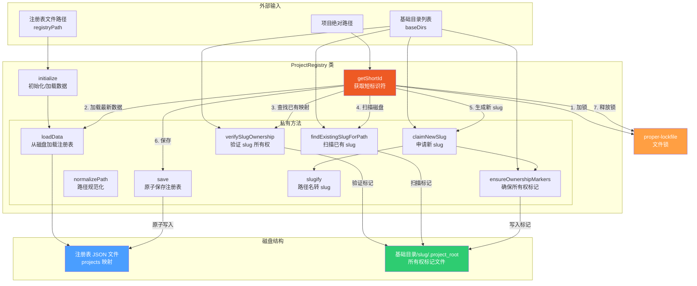

# projectRegistry.ts

## 概述

`projectRegistry.ts` 实现了一个**项目注册表（ProjectRegistry）**，用于管理项目绝对路径与短标识符（slug）之间的双向映射关系。该模块的核心目标是将冗长的绝对路径（尤其是临时目录路径）转换为简短、可读的标识符，以减少上下文膨胀。注册表支持多基础目录（baseDirs）、文件锁并发控制、磁盘所有权标记验证、slug 冲突自动解决等高级特性，是一个生产级别的路径注册与管理系统。

## 架构图（Mermaid）



## 核心组件

### 1. `RegistryData` 接口

注册表的数据结构：

```typescript
interface RegistryData {
  projects: Record<string, string>;  // 绝对路径 -> 短标识符
}
```

### 2. 常量

| 常量 | 值 | 描述 |
|------|---|------|
| `PROJECT_ROOT_FILE` | `'.project_root'` | 所有权标记文件名，存放在基础目录的 slug 子目录中 |
| `LOCK_TIMEOUT_MS` | `10000` | 文件锁超时时间（10 秒） |
| `LOCK_RETRY_DELAY_MS` | `100` | 文件锁重试间隔（100 毫秒） |

### 3. `ProjectRegistry` 类

#### 构造函数

```typescript
constructor(registryPath: string, baseDirs: string[] = [])
```

| 参数 | 描述 |
|------|------|
| `registryPath` | 注册表 JSON 文件的磁盘路径 |
| `baseDirs` | 基础目录列表，用于在其下创建 slug 子目录和所有权标记文件 |

#### 私有属性

| 属性 | 类型 | 描述 |
|------|------|------|
| `registryPath` | `string` | 注册表文件路径 |
| `baseDirs` | `string[]` | 基础目录列表 |
| `data` | `RegistryData \| undefined` | 内存中的注册表数据 |
| `initPromise` | `Promise<void> \| undefined` | 初始化 Promise，确保只初始化一次 |

#### 公开方法

##### `initialize(): Promise<void>`

初始化注册表，从磁盘加载数据。使用 `initPromise` 单例模式确保多次调用只执行一次加载。如果 `data` 已存在也会跳过。

##### `getShortId(projectPath: string): Promise<string>`

**核心方法**。获取项目路径对应的短标识符，如果不存在则生成并保存。完整流程：

1. **前置检查**: 确认注册表已初始化
2. **路径规范化**: 调用 `normalizePath` 处理路径
3. **确保文件存在**: 创建注册表目录和文件（供锁文件使用）
4. **获取文件锁**: 使用 `proper-lockfile` 锁定注册表文件，防止并发写入
5. **重新加载数据**: 在锁内重新读取最新数据（防止脏读）
6. **查找已有映射**: 如果注册表中有该路径的映射：
   - 调用 `verifySlugOwnership` 验证磁盘标记的一致性
   - 验证通过则调用 `ensureOwnershipMarkers` 修复可能缺失的标记
   - 验证失败则删除旧映射，进入新建流程
7. **扫描磁盘**: 调用 `findExistingSlugForPath` 扫描所有基础目录，查找已有的所有权标记
8. **生成新 slug**: 如果完全找不到，调用 `claimNewSlug` 生成并申请新的 slug
9. **保存并释放锁**: 将映射写入注册表并释放文件锁

#### 私有方法

##### `loadData(): Promise<RegistryData>`

从磁盘加载注册表 JSON 文件。如果文件不存在返回空注册表 `{ projects: {} }`。如果文件损坏（JSON 解析失败），也返回空注册表避免阻塞 CLI。

##### `normalizePath(projectPath: string): string`

路径规范化处理：
- 使用 `path.resolve` 转为绝对路径
- 在 Windows 平台上转为小写（不区分大小写的文件系统）

##### `save(data: RegistryData): Promise<void>`

原子保存注册表数据到磁盘：
1. 确保目录存在
2. 先写入临时文件 `${registryPath}.tmp`
3. 通过 `fs.promises.rename` 原子替换目标文件

这种"写临时文件 + 原子重命名"模式确保了即使写入过程中崩溃，也不会损坏已有的注册表文件。

##### `verifySlugOwnership(slug: string, projectPath: string): Promise<boolean>`

验证 slug 的所有权：
- 如果没有 `baseDirs`，直接返回 `true`（无需验证）
- 遍历所有基础目录，检查 `baseDir/slug/.project_root` 文件
- 读取标记文件内容，比对是否指向同一项目路径
- 任何标记指向不同路径则返回 `false`

##### `findExistingSlugForPath(projectPath: string): Promise<string | undefined>`

扫描所有基础目录中的所有子目录，查找是否有现有的 `.project_root` 标记指向目标路径。如果找到，确保所有基础目录都有标记，然后返回该 slug。

##### `claimNewSlug(projectPath: string, existingMappings: Record<string, string>): Promise<string>`

生成并申请新的 slug：
1. 从路径的 `basename` 生成初始 slug（通过 `slugify`）
2. 递增计数器尝试候选名（`slug`、`slug-1`、`slug-2`...）
3. 检查候选名是否在注册表中已被使用
4. 检查候选名是否在磁盘上已被占用（其他项目的标记）
5. 尝试通过 `ensureOwnershipMarkers` 申请所有权
6. 如果申请失败（竞争条件），继续尝试下一个候选名

##### `ensureOwnershipMarkers(slug: string, projectPath: string): Promise<void>`

确保所有基础目录中都有正确的所有权标记：
- 创建 `baseDir/slug/` 目录（如不存在）
- 检查 `.project_root` 文件：
  - 如果已存在且指向同一项目，跳过
  - 如果已存在但指向不同项目，抛出冲突错误
  - 如果不存在，使用 `flag: 'wx'`（排他创建）原子写入

##### `slugify(text: string): string`

将文本转为 URL 友好的 slug：
1. 转小写
2. 非字母数字字符替换为 `-`
3. 合并连续的 `-`
4. 去除首尾的 `-`
5. 如果结果为空，返回 `'project'`

## 依赖关系

### 内部依赖

| 依赖 | 路径 | 用途 |
|------|------|------|
| `debugLogger` | `../utils/debugLogger.js` | 调试日志，用于记录加载失败、扫描失败等非致命错误 |

### 外部依赖

| 依赖 | 模块 | 用途 |
|------|------|------|
| `fs` | `node:fs` | 文件系统操作（读写注册表、创建目录、所有权标记文件） |
| `path` | `node:path` | 路径解析、拼接、获取 basename |
| `os` | `node:os` | 检测平台（Windows 路径需要小写规范化） |
| `lock` | `proper-lockfile` | 文件锁，防止多进程并发修改注册表 |

## 关键实现细节

1. **文件锁并发控制**: 使用 `proper-lockfile` 对注册表文件加锁。锁配置了重试机制（`10000ms / 100ms = 100` 次重试），确保多个 CLI 实例同时运行时不会产生数据竞争。加锁后立即重新加载数据（"read-under-lock" 模式），保证读到最新状态。

2. **双重验证机制**: 注册表中的映射（JSON 文件）和磁盘上的所有权标记（`.project_root` 文件）构成双重验证。即使注册表数据不一致（如手动修改、多实例竞争），系统也能通过扫描磁盘标记自我修复。

3. **原子文件操作**:
   - 注册表保存使用"写临时文件 + rename"模式，保证原子性
   - 所有权标记创建使用 `flag: 'wx'`（O_CREAT | O_EXCL），保证只有第一个写入者成功

4. **自愈（Self-healing）能力**: `getShortId` 中的逻辑包含多层修复机制：
   - 如果注册表有映射但磁盘标记不一致 -> 删除旧映射并重新分配
   - 如果注册表没有映射但磁盘上有匹配标记 -> 恢复映射
   - 如果新增了基础目录但缺少标记 -> `ensureOwnershipMarkers` 补充创建

5. **跨平台路径处理**: 在 Windows 上将路径转为小写后比较，正确处理 Windows 不区分大小写的文件系统特性。

6. **slug 冲突解决**: 使用递增计数器策略（`my-project`、`my-project-1`、`my-project-2`...），同时检查注册表和磁盘两个维度的冲突，确保生成的 slug 全局唯一。

7. **错误容忍设计**: 注册表损坏时不抛异常而是重建空注册表，读取标记文件失败时优雅降级。这确保了注册表的问题不会阻塞 CLI 的正常使用。

8. **初始化单例模式**: `initialize()` 使用 `initPromise` 缓存 Promise，无论被调用多少次都只执行一次实际加载操作，避免重复 I/O。
