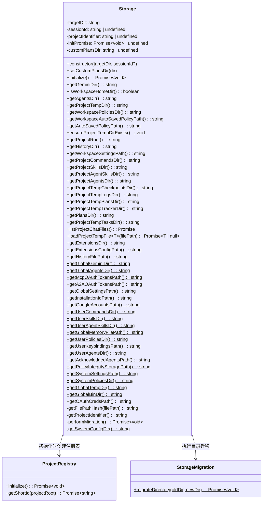
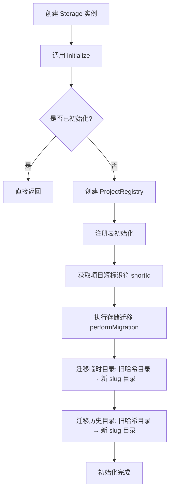
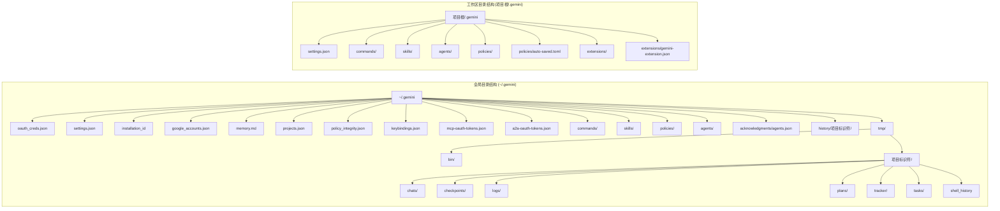

# storage.ts

## 概述

`storage.ts` 是 Gemini CLI 的核心存储管理模块，位于 `packages/core/src/config/storage.ts`。该文件定义了 `Storage` 类，负责管理 Gemini CLI 运行时所需的所有文件系统路径——包括全局配置目录、项目级工作区目录、临时文件目录、历史记录目录、策略目录、扩展目录等。

`Storage` 类同时承担了存储初始化和数据迁移的职责：在初始化阶段，它通过 `ProjectRegistry` 注册当前项目并获取短标识符（short ID），然后调用 `StorageMigration` 将旧版基于 SHA-256 哈希的目录结构迁移到新的基于 slug 的格式。

该模块是整个 Gemini CLI 文件系统交互的基石，几乎所有涉及文件读写、配置加载、会话管理的组件都依赖于 `Storage` 类提供的路径解析能力。

## 架构图（Mermaid）







## 核心组件

### 1. `Storage` 类

整个模块的主体。分为**静态方法**（全局路径）和**实例方法**（项目级路径）两大类。

#### 构造函数

```typescript
constructor(targetDir: string, sessionId?: string)
```

- `targetDir`：项目根目录路径，所有项目级路径都以此为基础。
- `sessionId`：可选的会话标识符，用于在临时目录中隔离不同会话的数据（plans、tracker、tasks 等）。

#### 静态方法——全局路径解析

| 方法 | 返回路径 | 说明 |
|---|---|---|
| `getGlobalGeminiDir()` | `~/.gemini` | 全局 Gemini 配置根目录，若无 home 目录则回退到 OS 临时目录 |
| `getGlobalAgentsDir()` | `~/.agents` | 全局 agents 目录 |
| `getMcpOAuthTokensPath()` | `~/.gemini/mcp-oauth-tokens.json` | MCP OAuth 令牌文件 |
| `getA2AOAuthTokensPath()` | `~/.gemini/a2a-oauth-tokens.json` | A2A OAuth 令牌文件 |
| `getGlobalSettingsPath()` | `~/.gemini/settings.json` | 全局设置文件 |
| `getInstallationIdPath()` | `~/.gemini/installation_id` | 安装唯一标识符文件 |
| `getGoogleAccountsPath()` | `~/.gemini/google_accounts.json` | Google 账号信息文件 |
| `getUserCommandsDir()` | `~/.gemini/commands/` | 用户自定义命令目录 |
| `getUserSkillsDir()` | `~/.gemini/skills/` | 用户技能目录 |
| `getUserAgentSkillsDir()` | `~/.agents/skills/` | 用户 Agent 技能目录 |
| `getGlobalMemoryFilePath()` | `~/.gemini/memory.md` | 全局记忆文件 |
| `getUserPoliciesDir()` | `~/.gemini/policies/` | 用户策略目录 |
| `getUserKeybindingsPath()` | `~/.gemini/keybindings.json` | 用户快捷键配置 |
| `getUserAgentsDir()` | `~/.gemini/agents/` | 用户 agents 目录 |
| `getAcknowledgedAgentsPath()` | `~/.gemini/acknowledgments/agents.json` | 已确认的 agents 列表 |
| `getPolicyIntegrityStoragePath()` | `~/.gemini/policy_integrity.json` | 策略完整性存储 |
| `getSystemSettingsPath()` | 系统级设置路径 | 支持 `GEMINI_CLI_SYSTEM_SETTINGS_PATH` 环境变量覆盖 |
| `getSystemPoliciesDir()` | 系统级策略目录 | macOS: `/Library/Application Support/GeminiCli/policies` |
| `getGlobalTempDir()` | `~/.gemini/tmp/` | 全局临时目录 |
| `getGlobalBinDir()` | `~/.gemini/tmp/bin/` | 全局二进制目录 |
| `getOAuthCredsPath()` | `~/.gemini/oauth_creds.json` | OAuth 凭据文件 |

#### 实例方法——项目级路径解析

| 方法 | 返回路径 | 说明 |
|---|---|---|
| `getGeminiDir()` | `<项目根>/.gemini` | 项目级 Gemini 配置目录 |
| `isWorkspaceHomeDir()` | boolean | 判断工作区是否就是用户 home 目录 |
| `getAgentsDir()` | `<项目根>/.agents` | 项目级 agents 目录 |
| `getProjectTempDir()` | `~/.gemini/tmp/<项目标识符>` | 项目临时目录 |
| `getWorkspacePoliciesDir()` | `<项目根>/.gemini/policies` | 工作区策略目录 |
| `getWorkspaceAutoSavedPolicyPath()` | `<项目根>/.gemini/policies/auto-saved.toml` | 工作区自动保存策略 |
| `getAutoSavedPolicyPath()` | `~/.gemini/policies/auto-saved.toml` | 全局自动保存策略 |
| `getHistoryDir()` | `~/.gemini/history/<项目标识符>` | 项目历史记录目录 |
| `getWorkspaceSettingsPath()` | `<项目根>/.gemini/settings.json` | 工作区设置文件 |
| `getProjectCommandsDir()` | `<项目根>/.gemini/commands` | 项目命令目录 |
| `getProjectSkillsDir()` | `<项目根>/.gemini/skills` | 项目技能目录 |
| `getProjectAgentSkillsDir()` | `<项目根>/.agents/skills` | 项目 Agent 技能目录 |
| `getProjectAgentsDir()` | `<项目根>/.gemini/agents` | 项目 agents 目录 |
| `getProjectTempCheckpointsDir()` | `~/.gemini/tmp/<标识符>/checkpoints` | 检查点目录 |
| `getProjectTempLogsDir()` | `~/.gemini/tmp/<标识符>/logs` | 日志目录 |
| `getProjectTempPlansDir()` | 带/不带 sessionId 的 plans 目录 | 计划文件目录 |
| `getProjectTempTrackerDir()` | 带/不带 sessionId 的 tracker 目录 | 追踪器目录 |
| `getPlansDir()` | 自定义或默认 plans 目录 | 支持自定义路径，并做安全校验确保不超出项目根目录 |
| `getProjectTempTasksDir()` | 带/不带 sessionId 的 tasks 目录 | 任务目录 |
| `getExtensionsDir()` | `<项目根>/.gemini/extensions` | 扩展目录 |
| `getExtensionsConfigPath()` | `<项目根>/.gemini/extensions/gemini-extension.json` | 扩展配置文件 |
| `getHistoryFilePath()` | `~/.gemini/tmp/<标识符>/shell_history` | Shell 历史文件 |

#### 数据操作方法

- **`listProjectChatFiles()`**：列出项目临时目录下 `chats/` 中所有 JSON 文件，按修改时间降序排列。当目录不存在时优雅地返回空数组。
- **`loadProjectTempFile<T>(filePath)`**：从项目临时目录加载并解析 JSON 文件，类型安全地返回泛型 `T`。文件不存在时返回 `null`。
- **`ensureProjectTempDirExists()`**：确保项目临时目录存在，使用 `recursive: true` 递归创建。

#### 初始化流程

- **`initialize()`**：异步初始化方法，使用 `initPromise` 实现幂等性（多次调用只执行一次）。内部创建 `ProjectRegistry`、获取项目短标识符、执行存储迁移。
- **`performMigration()`**：私有方法，将旧的基于 SHA-256 哈希的目录迁移为新的基于 slug 的目录。迁移覆盖临时目录和历史目录。

### 2. 导出常量

| 常量 | 值 | 说明 |
|---|---|---|
| `OAUTH_FILE` | `'oauth_creds.json'` | OAuth 凭据文件名 |
| `AUTO_SAVED_POLICY_FILENAME` | `'auto-saved.toml'` | 自动保存策略文件名 |

### 3. 系统配置目录（跨平台）

`getSystemConfigDir()` 静态私有方法根据操作系统返回不同的系统级配置目录：

| 平台 | 路径 |
|---|---|
| macOS (darwin) | `/Library/Application Support/GeminiCli` |
| Windows (win32) | `C:\ProgramData\gemini-cli` |
| Linux 及其他 | `/etc/gemini-cli` |

## 依赖关系

### 内部依赖

| 依赖模块 | 导入内容 | 用途 |
|---|---|---|
| `../utils/paths.js` | `GEMINI_DIR`, `homedir`, `GOOGLE_ACCOUNTS_FILENAME`, `isSubpath`, `resolveToRealPath`, `normalizePath` | 路径工具函数：获取 `.gemini` 目录名常量、用户 home 目录、Google 账号文件名、子路径判断、真实路径解析、路径规范化 |
| `./projectRegistry.js` | `ProjectRegistry` | 项目注册表，负责为每个项目分配和管理短标识符（short ID） |
| `./storageMigration.js` | `StorageMigration` | 存储迁移工具，负责将旧版哈希目录迁移到新 slug 目录 |

### 外部依赖

| 依赖模块 | 用途 |
|---|---|
| `node:path` | 路径拼接和解析 |
| `node:os` | 获取临时目录 (`os.tmpdir()`)、操作系统平台 (`os.platform()`) |
| `node:crypto` | SHA-256 哈希计算（用于旧版项目标识符生成） |
| `node:fs` | 文件系统操作：目录创建 (`mkdirSync`)、文件读取 (`promises.readFile`)、目录读取 (`promises.readdir`)、文件状态 (`promises.stat`) |

## 关键实现细节

### 1. 幂等初始化模式

`initialize()` 方法通过 `initPromise` 字段实现单次执行保证。首次调用时创建 Promise 并缓存，后续调用直接返回同一个 Promise，避免重复初始化和竞态条件：

```typescript
async initialize(): Promise<void> {
    if (this.initPromise) {
        return this.initPromise;
    }
    this.initPromise = (async () => {
        // ... 实际初始化逻辑
    })();
    return this.initPromise;
}
```

### 2. 项目标识符的演进

该模块体现了项目标识符从 **SHA-256 哈希** 到 **slug 短标识符** 的架构演进：
- **旧方案**：`getFilePathHash()` 使用 `crypto.createHash('sha256')` 对项目根路径计算哈希，生成 64 位十六进制字符串作为目录名。
- **新方案**：通过 `ProjectRegistry.getShortId()` 获取人类可读的短标识符。
- **迁移桥接**：`performMigration()` 方法在初始化时自动将旧哈希目录重命名为新 slug 目录。

### 3. 会话隔离

当 `sessionId` 存在时，`plans`、`tracker`、`tasks` 等目录会在路径中加入 session 层级以实现会话隔离：
- 有 sessionId：`~/.gemini/tmp/<项目标识符>/<sessionId>/plans`
- 无 sessionId：`~/.gemini/tmp/<项目标识符>/plans`

### 4. 自定义 Plans 目录的安全校验

`getPlansDir()` 在使用自定义路径时会进行路径遍历攻击防护：
1. 使用 `path.resolve()` 将相对路径解析为绝对路径。
2. 使用 `resolveToRealPath()` 解析符号链接获取真实路径。
3. 使用 `isSubpath()` 确保解析后的路径仍在项目根目录内。
4. 若路径逃逸出项目根目录，抛出错误阻止操作。

### 5. 全局目录的回退策略

`getGlobalGeminiDir()` 在无法获取用户 home 目录时会回退到操作系统临时目录 (`os.tmpdir()`)，保证即使在特殊环境下（如某些 CI/CD 容器中）也能正常运行。

### 6. 系统级设置的环境变量覆盖

`getSystemSettingsPath()` 支持通过 `GEMINI_CLI_SYSTEM_SETTINGS_PATH` 环境变量覆盖默认的系统级设置文件路径，这为企业部署和测试提供了灵活性。

### 7. 优雅的错误处理

`listProjectChatFiles()` 和 `loadProjectTempFile()` 都对 `ENOENT`（文件/目录不存在）错误做了特殊处理，分别返回空数组和 `null`，而非抛出异常。其他错误则正常上抛，保证了健壮性与可调试性的平衡。
