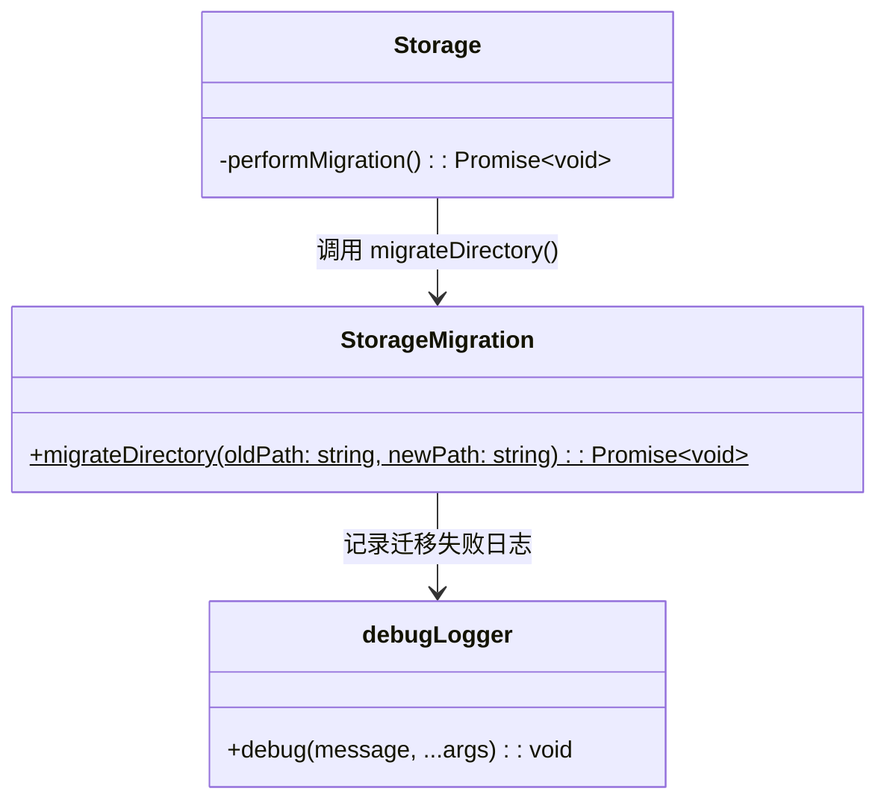
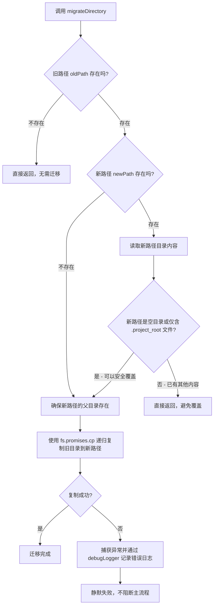
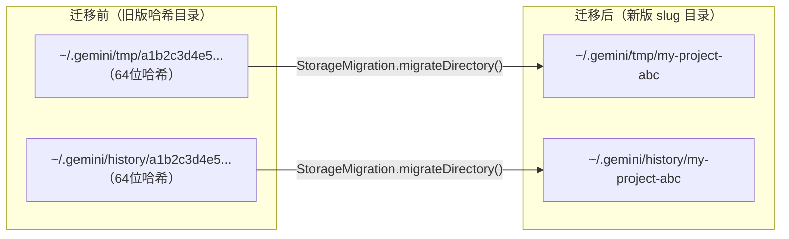

# storageMigration.ts

## 概述

`storageMigration.ts` 是 Gemini CLI 的存储迁移工具模块，位于 `packages/core/src/config/storageMigration.ts`。该文件定义了 `StorageMigration` 类，提供一个静态方法 `migrateDirectory()`，用于将旧版基于 SHA-256 哈希的目录数据安全地迁移到新版基于 slug 的目录结构。

此模块是 Gemini CLI 项目标识符架构升级的关键组成部分。在旧版设计中，每个项目的临时文件和历史记录目录使用项目路径的 SHA-256 哈希值命名（64 位十六进制字符串），不利于人类辨识。新版改用可读性更好的 slug 短标识符。`StorageMigration` 负责在这两种方案之间进行平滑过渡，确保用户升级后不会丢失已有数据。

该模块由 `Storage` 类在初始化过程中的 `performMigration()` 方法调用。

## 架构图（Mermaid）







## 核心组件

### `StorageMigration` 类

一个纯工具类，仅包含一个静态方法，不需要实例化。

#### `static async migrateDirectory(oldPath: string, newPath: string): Promise<void>`

执行目录迁移的核心方法。

**参数：**

| 参数 | 类型 | 说明 |
|---|---|---|
| `oldPath` | `string` | 旧版目录路径（基于 SHA-256 哈希命名） |
| `newPath` | `string` | 新版目录路径（基于 slug 短标识符命名） |

**执行逻辑：**

1. **检查旧路径是否存在**：若旧路径不存在，说明无需迁移（可能是全新安装），直接返回。
2. **检查新路径状态**：
   - 若新路径不存在，可以安全迁移。
   - 若新路径已存在，检查其内容：
     - 如果目录为空或仅包含一个 `.project_root` 文件（这是 `ProjectRegistry` 创建的初始标记文件），则认为是"新鲜目录"，可以安全覆盖。
     - 如果目录已有其他文件（说明新路径已被使用），则跳过迁移以避免数据覆盖。
3. **确保父目录存在**：使用 `fs.promises.mkdir` 递归创建新路径的父目录。
4. **执行复制**：使用 `fs.promises.cp` 递归复制旧目录到新路径。注意这里使用**复制**而非**移动/重命名**，这是因为 `fs.rename` 不支持跨文件系统（跨设备）操作，而复制则没有这个限制。
5. **错误处理**：所有异常被捕获并通过 `debugLogger.debug()` 记录，不会向上抛出。这保证了迁移失败不会阻断应用正常启动。

## 依赖关系

### 内部依赖

| 依赖模块 | 导入内容 | 用途 |
|---|---|---|
| `../utils/debugLogger.js` | `debugLogger` | 调试日志工具，用于记录迁移过程中的错误信息 |

### 外部依赖

| 依赖模块 | 用途 |
|---|---|
| `node:fs` | 文件系统操作：`existsSync`（同步检查路径存在）、`promises.readdir`（异步读取目录）、`promises.mkdir`（异步创建目录）、`promises.cp`（异步递归复制目录） |
| `node:path` | 路径操作：`path.dirname`（获取父目录路径） |

## 关键实现细节

### 1. 安全的"仅在需要时迁移"策略

迁移方法采用了保守的策略，只在满足以下两个条件时才执行迁移：
- 旧路径确实存在（有数据需要迁移）。
- 新路径不存在，或者仅包含 `ProjectRegistry` 创建的初始标记文件 `.project_root`。

这种设计避免了以下风险场景：
- 反复迁移：如果新目录已有数据，说明迁移已经完成或新目录已被正常使用。
- 数据覆盖：不会用旧数据覆盖新目录中已有的有效数据。

### 2. 使用复制而非重命名

代码中特别注释说明了选择 `fs.promises.cp` 而非 `fs.rename` 的原因：

```typescript
// Copy (safer and handles cross-device moves)
await fs.promises.cp(oldPath, newPath, { recursive: true });
```

`fs.rename` 在 POSIX 系统上是原子操作，但存在一个严重限制——不支持跨文件系统（设备）移动。当旧路径和新路径位于不同的挂载点或文件系统时，`rename` 会抛出 `EXDEV` 错误。`cp` 虽然不是原子操作，但能可靠地处理跨设备场景。

值得注意的是，迁移后旧目录**不会被删除**。这是一个额外的安全措施——即使复制过程中断或出现问题，旧数据依然保留。

### 3. 静默失败设计

整个迁移过程被包裹在 `try-catch` 中，任何异常都仅记录日志而不抛出。这是一个重要的设计决策：

- 存储迁移是一个**非关键性**操作。即使迁移失败，Gemini CLI 仍然可以通过新的 slug 标识符正常创建和使用新目录。
- 迁移失败的常见原因可能是权限不足、磁盘空间不足等环境问题，这些问题不应阻止用户正常使用工具。
- 错误通过 `debugLogger.debug()` 记录，可在调试模式下排查问题。

### 4. `.project_root` 标记文件的识别

在判断新路径是否为"空目录"时，代码特别识别了 `.project_root` 文件。这个文件是由 `ProjectRegistry` 在注册项目时创建的标记文件，其存在不应被视为"目录已有数据"。这种精细的判断逻辑体现了该模块与 `ProjectRegistry` 模块之间紧密的协作关系。

具体判断逻辑如下：
```typescript
if (
  files.length > 1 ||
  (files.length === 1 && files[0] !== '.project_root')
) {
  return; // 目录已有有效内容，不执行迁移
}
```

即：
- 目录中超过 1 个文件 → 有数据，跳过
- 目录中恰好 1 个文件但不是 `.project_root` → 有数据，跳过
- 目录为空，或仅含 `.project_root` → 可以安全覆盖
