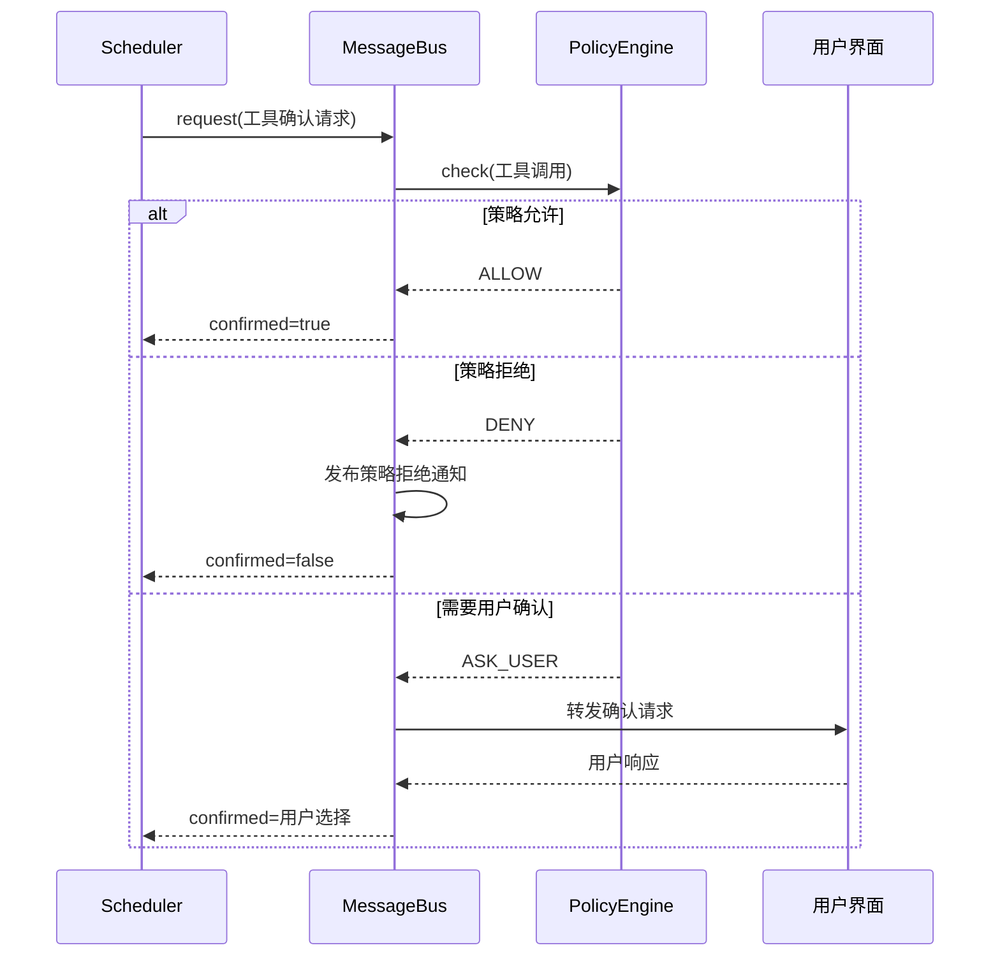

# confirmation-bus

## 概述

`confirmation-bus` 目录实现了 Gemini CLI 的工具调用确认消息总线。它基于发布-订阅模式，在工具执行前通过策略引擎进行权限检查，并协调工具调用确认请求与响应之间的异步通信。该模块是安全执行架构的核心枢纽，确保敏感操作（如文件编辑、命令执行）在获得用户确认或策略许可后才被执行。

## 目录结构

```
confirmation-bus/
├── index.ts              # 导出入口（re-export message-bus 和 types）
├── message-bus.ts        # 消息总线核心实现（发布/订阅、请求-响应模式）
├── message-bus.test.ts   # message-bus 的单元测试
└── types.ts              # 消息类型定义（确认请求/响应、策略拒绝、执行结果等）
```

## 架构图

```mermaid
graph TB
    subgraph 消息总线模块
        MB[MessageBus<br/>消息总线]
        T[types.ts<br/>消息类型]
    end

    subgraph 策略层
        PE[PolicyEngine<br/>策略引擎]
        PD{策略决策}
    end

    subgraph 消费者
        UI[TUI界面层<br/>用户确认UI]
        SCHED[Scheduler<br/>工具调度器]
        SA[SubAgent<br/>子代理]
    end

    SCHED --> |发布确认请求| MB
    SA --> |派生子总线| MB
    MB --> |检查策略| PE
    PE --> PD

    PD --> |ALLOW| MB
    PD --> |DENY| MB
    PD --> |ASK_USER| UI
    UI --> |用户响应| MB
    MB --> |确认结果| SCHED
```





## 核心组件

### `MessageBus` (message-bus.ts)
- **职责**: 基于 `EventEmitter` 的消息总线，协调工具确认流程
- **继承**: `EventEmitter`
- **关键方法**:
  - `publish(message)` - 发布消息；对工具确认请求自动执行策略检查
  - `subscribe(type, listener)` - 订阅指定类型的消息
  - `unsubscribe(type, listener)` - 取消订阅
  - `request(request, responseType, timeout)` - 请求-响应模式，发布请求并等待相关响应
  - `derive(subagentName)` - 派生子代理作用域的消息总线
- **策略集成**: `publish()` 在处理 `TOOL_CONFIRMATION_REQUEST` 时自动调用 `PolicyEngine.check()` 并根据结果分发消息
- **关联 ID**: 使用 `correlationId` (UUID) 匹配请求与响应

### 消息类型 (types.ts)

| 消息类型 | 枚举值 | 用途 |
|----------|--------|------|
| `ToolConfirmationRequest` | `TOOL_CONFIRMATION_REQUEST` | 工具执行前的确认请求 |
| `ToolConfirmationResponse` | `TOOL_CONFIRMATION_RESPONSE` | 确认结果响应 |
| `ToolPolicyRejection` | `TOOL_POLICY_REJECTION` | 策略拒绝通知 |
| `ToolExecutionSuccess` | `TOOL_EXECUTION_SUCCESS` | 工具执行成功 |
| `ToolExecutionFailure` | `TOOL_EXECUTION_FAILURE` | 工具执行失败 |
| `UpdatePolicy` | `UPDATE_POLICY` | 策略更新请求 |
| `ToolCallsUpdateMessage` | `TOOL_CALLS_UPDATE` | 工具调用列表更新 |
| `AskUserRequest` | `ASK_USER_REQUEST` | 向用户提问请求 |
| `AskUserResponse` | `ASK_USER_RESPONSE` | 用户回答响应 |

### `SerializableConfirmationDetails`
确认请求的详细信息，支持多种类型：
- `sandbox_expansion` - 沙箱权限扩展
- `info` - 信息展示
- `edit` - 文件编辑 (含 diff 内容)
- `exec` - 命令执行
- `mcp` - MCP 工具调用
- `ask_user` - 用户提问
- `exit_plan_mode` - 退出计划模式

### `Question` / `QuestionType`
用于向用户提问的数据结构：
- `CHOICE` - 单选/多选
- `TEXT` - 自由文本输入
- `YESNO` - 是/否二选一

## 依赖关系

### 内部依赖
- `../policy/policy-engine.js` - 策略引擎 (权限检查)
- `../policy/types.js` - 策略决策类型 (`PolicyDecision`)
- `../tools/tools.js` - 工具确认相关类型 (`ToolConfirmationOutcome`, `DiffStat`)
- `../scheduler/types.js` - 工具调用类型 (`ToolCall`)
- `../services/sandboxManager.js` - 沙箱权限类型
- `../utils/safeJsonStringify.js` - 安全 JSON 序列化
- `../utils/debugLogger.js` - 调试日志

### 外部依赖
- `@google/genai` - `FunctionCall` 类型
- `node:crypto` - UUID 生成 (`randomUUID`)
- `node:events` - `EventEmitter` 基类

## 数据流

### 工具确认流程
1. 调度器调用 `messageBus.request()` 发布 `ToolConfirmationRequest`
2. `MessageBus.publish()` 自动调用 `PolicyEngine.check()` 进行策略检查
3. 根据策略决策：
   - `ALLOW` -> 直接发布确认响应 (`confirmed: true`)
   - `DENY` -> 发布策略拒绝通知和否定响应
   - `ASK_USER` -> 转发给 UI 层，等待用户确认
4. 响应通过 `correlationId` 匹配到原始请求的 Promise，完成请求-响应循环

### 子代理消息路由
1. `derive(subagentName)` 创建子总线，重写 `publish` 方法
2. 子总线发布确认请求时，自动添加 `subagent` 前缀（支持嵌套命名空间）
3. 订阅方法委托给父总线，确保全局事件可见性
